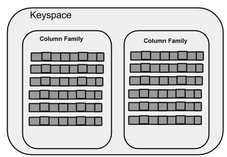
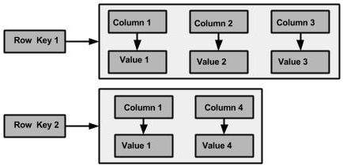

# 安装

## Docker 安装 Cassandra
1. 拉取 Cassandra 镜像
    ```bash
    docker pull cassandra:latest
    ```
2. 运行 Cassandra 容器
    ```bash
    docker run --name my-cassandra -d cassandra:latest
    ```
3. 进入 Cassandra 容器
    ```bash
    docker exec -it my-cassandra bash
    ```
4. 连接到 Cassandra shell
    ```bash
    cqlsh
    ```

# 理论
## 什么是 Cassandra

Apache Cassandra 是一个开源的分布式 NoSQL 数据库系统，最初由 Facebook 开发。它以高可用性、可扩展性和容错性著称，适用于处理大规模结构化数据。Cassandra 采用无中心化的对等架构，支持多数据中心复制，能够实现无单点故障的数据存储。其数据模型基于宽列存储，适合写密集型和高吞吐量的应用场景，如物联网、日志收集和实时分析等。

**主要特点：**
- 分布式与去中心化架构
- 高可用性与容错性
- 可横向扩展
- 支持多数据中心复制
- 灵活的 Schema 设计

## 核心概念

- **节点（Node）**：Cassandra 集群中的单个服务器。
- **集群（Cluster）**：由多个节点组成的集合，协同存储和管理数据。
- **数据中心（Data Center）**：节点的逻辑分组，通常对应物理位置或用途。
- **键空间（Keyspace）**：类似于关系型数据库的数据库，定义数据的复制策略。
- **表（Table）**：存储数据的结构，类似于关系型数据库的表。
- **分区键（Partition Key）**：决定数据分布到哪个节点的键。
- **列族（Column Family）**：Cassandra 的表结构，支持宽列存储。
- **一致性级别（Consistency Level）**：控制读写操作的数据一致性要求。

在 Cassandra 中，“节点（Node）”通常指的是集群中的一台服务器（物理机或虚拟机）。每个节点都运行 Cassandra 实例，负责存储和管理部分数据。你可以把“一台电脑 = 一个节点”理解为最常见的部署方式。每个节点之间是对等的，没有主从之分。多个节点组成集群，共同实现数据的分布式存储和高可用性


## Cassandra 架构

TODO:分布式架构，等用到了再看。

## Cassandra 数据模型

Cassandra 使用Column-Family(列族) 数据模型，类似于关系型数据库的表格结构，但更灵活。主要概念包括： Keyspace（键空间）、Column-Family（表）、Row（行）、Column（列）等。

* Keyspace（键空间）：类似于关系型数据库的数据库，定义数据的复制策略。
* Column-Family（表）：存储数据的结构，类似于关系型数据库的表。
* Row（行）：表中的一条记录，由一个唯一的分区键标识。
* Column（列）：行中的数据字段，也是最小数据存储单元，包含（列名、值、时间戳）。

### 整体结构



最外层是 Keyspace，类似于关系型数据库的数据库。每个 Keyspace 包含多个 Column-Family（表）。

其中Keyspace可以定义数据的复制因子和副本放置策略：
* 复制因子： 指定数据在集群中复制的节点数。例如，复制因子为3表示每条数据会存储在3个不同的节点上，以提高容错性和可用性。
* 副本放置策略： 定义数据副本在集群中的分布方式。

每个Keyspace下包含多个 Column-Family（表），其中每个Column Family可以类别RDBMS中的表,其结构如下：



Column-Family（表）包含多行（Row），每行由一个唯一的分区键（Partition Key）标识。每行包含多个列（Column），每列由列名、值和时间戳组成:

* 分区键（Partition Key）： 决定数据分布到哪个节点的键。Cassandra 根据分区键的哈希值将数据分布到集群中的不同节点。它是由一个或多个列组成的复合键。
* 列（Column）： 行中的数据字段，也是最小数据存储单元。每列包含以下三个部分：
    * 列名（Column Name）： 列的标识符，可以是字符串或其他数据类型。
    * 值（Value）： 列存储的实际数据，可以是各种数据类型，如字符串、整数、布尔值等。
    * 时间戳（Timestamp）： 每列都有一个时间戳，用于记录该列最后一次更新的时间。Cassandra 使用时间戳来解决数据冲突，确保最新的数据被保留。
* 超级列（Super Column）： 是一种特殊的列，包含多个子列(column)。超级列用于实现更复杂的数据结构，但在现代 Cassandra 版本中不常用。

### 为什么Cassandra创建表时需要指出列名？

作为NoSQL和Column-Family数据库，Cassandra的底层存储模型确实非常灵活——在内部它本质是一个**排序映射（Sorted Map）**，存储结构是 `(RowKey, ColumnName, Value, Timestamp)` 的四元组，这意味着每行理论上可以有不同的列集合。

但 CQL（Cassandra Query Language）要求创建表时指定列名，也就是给出类似MySQL的表结构定义，这背后有几个关键原因：

#### 1. CQL 是关系型抽象层，而非底层 Thrift API

Cassandra 其实可以看做两部分：上层的 CQL 查询语言和下层的 Thrift 存储模型。

- Cassandra 最早通过 **Thrift API** 访问，那才是真正的"无模式"——你可以动态地为任何行添加任意列，列名本身就是数据的一部分。相当于直接操作底层的物理结构。

- **CQL 是后来引入的**，它刻意模仿 SQL 语法，提供了**结构化、类型安全**的访问方式。这是设计上的权衡：牺牲部分灵活性，换来更好的可用性、工具生态和查询优化能力。

#### 2. 必须知道主键（分区键 + 排序列）

Cassandra 的性能和分布策略严重依赖于主键的定义：

- **分区键（Partition Key）**：决定数据分布到哪个节点，CQL 必须知道哪些列是分区键才能正确计算哈希值、做数据分布。
- **排序列（Clustering Columns）**：决定了同一分区内数据的物理排序顺序，这是 Cassandra 高效范围查询和排序能力的基石。

```sql
CREATE TABLE sensor_data (
    device_id UUID,        -- 分区键
    timestamp TIMESTAMP,   -- 排序列
    temperature FLOAT,
    humidity FLOAT,
    PRIMARY KEY (device_id, timestamp)  -- 复合主键
);
```

没有列名定义，Cassandra 不知道如何分布和排序数据。

#### 3. 类型系统与序列化

CQL 需要知道每列的数据类型（TEXT、INT、UUID、TIMESTAMP 等），以便：

- 正确地**序列化/反序列化**数据到底层存储格式
- 提供**数据验证**，避免插入非法数据
- 支持**二级索引**功能
- 进行**查询过滤和类型转换**

#### 4. 但你仍然有灵活性

CQL 虽要求定义列名，但 Cassandra 仍然提供了多种灵活机制：

| 机制 | 说明 |
|------|------|
| **动态添加列** | 随时可通过 `ALTER TABLE ... ADD` 增加新列，无需迁移数据 |
| **MAP 集合类型** | `MAP<TEXT, TEXT>` 可实现真正的动态键值对存储 |
| **宽行（Wide Row）** | 通过聚类列，一行可以存储数百万个列（如时间序列数据） |
| **静态列（STATIC）** | 同一分区内共享的列，减少数据冗余 |

```sql
-- 使用 MAP 实现动态列
CREATE TABLE dynamic_data (
    id UUID PRIMARY KEY,
    attributes MAP<TEXT, TEXT>  -- 动态键值对
);

-- 可以插入任意属性
INSERT INTO dynamic_data (id, attributes)
VALUES (uuid(), {
    'color': 'red',
    'weight': '10kg',
    'material': 'plastic'
});
```

#### 5. 一句话总结

> **Cassandra 的底层存储模型是无模式的（列名本身就是数据），但 CQL 作为上层查询语言，为了提供类型安全、查询优化和易用性，选择了一个折中方案——要求定义静态列的 Schema，同时保留 ALTER TABLE 和集合类型来维持灵活性。**

# 使用
## 基本操作

Cassandra 使用 CQL（Cassandra Query Language）进行数据操作，语法类似 SQL。

**创建键空间：**
```sql
CREATE KEYSPACE my_keyspace WITH REPLICATION = {
    'class': 'SimpleStrategy',
    'replication_factor': 3
};
```

**创建表：**
```sql
CREATE TABLE my_keyspace.users (
    user_id UUID PRIMARY KEY,
    name TEXT,
    age INT
);
```

**插入数据：**
```sql
INSERT INTO my_keyspace.users (user_id, name, age)
VALUES (uuid(), 'Alice', 30);
```

**查询数据：**
```sql
SELECT * FROM my_keyspace.users WHERE user_id = ...;
```

**更新数据：**
```sql
UPDATE my_keyspace.users SET age = 31 WHERE user_id = ...;
```

**删除数据：**
```sql
DELETE FROM my_keyspace.users WHERE user_id = ...;
```

**查看表结构：**
```sql
DESCRIBE TABLE my_keyspace.users;
```
该命令会显示表的列、主键、索引等详细结构信息。

## 列的更改

Cassandra 支持对表的列进行更改。你可以使用 `ALTER TABLE` 语句添加新列或删除已有列，但不能直接修改已有列的数据类型（需要先删除再添加）。常见操作如下：

**添加列：**
```sql
ALTER TABLE my_keyspace.users ADD email TEXT;
```

**删除列：**
```sql
ALTER TABLE my_keyspace.users DROP age;
```

注意：删除列后，已有数据中的该列内容会被标记为删除（Tombstone），实际物理删除会在后台进行。