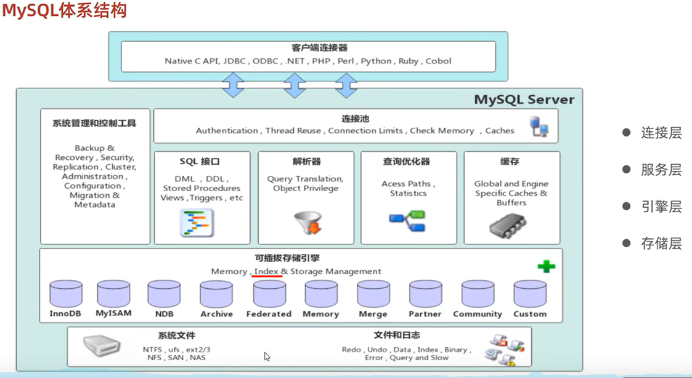
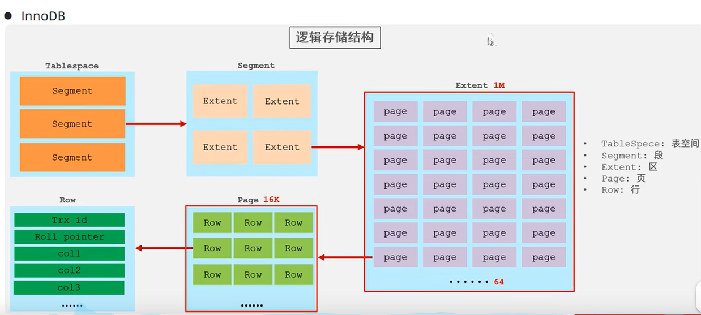
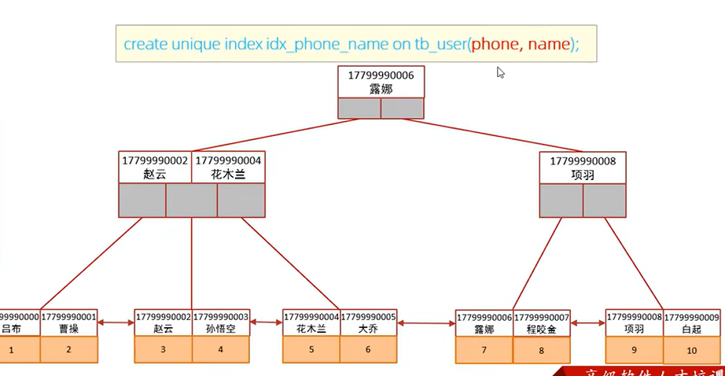
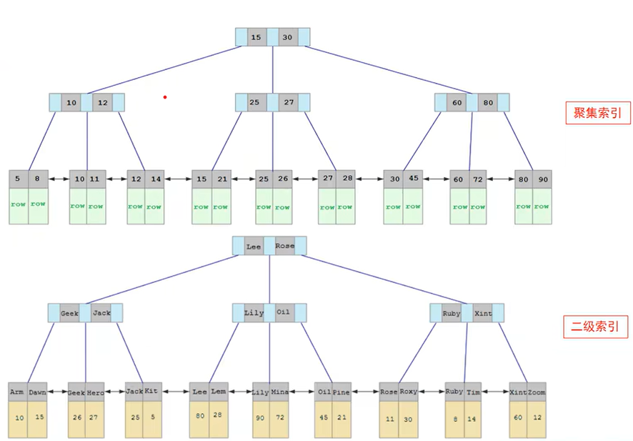
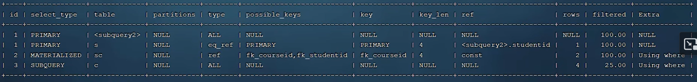
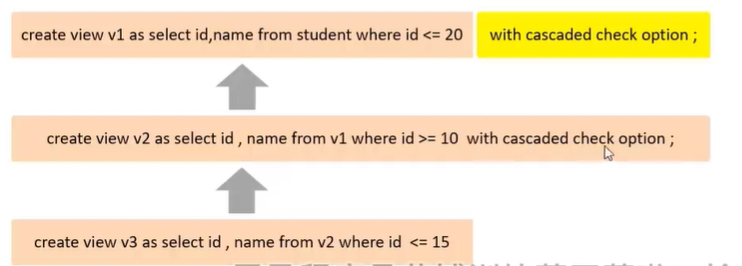
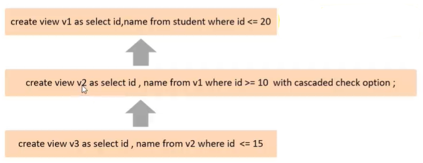

## 以管理员方式打开命令行
1. 可以直接搜索命令行，然后右击：以命令行方式打开
2. win+R后按ctrl+shift+enter来打开
3. 普通命令行内输入：
    `runas /user:Administrator cmd`
    后根据提示输入密码。（但是密码我忘了）

## 启动mySQL服务
1. 可以在win+R后输入services.msc查看已启动的服务
2. 通过下列命令可以启动和禁止
   ````
   // mysql80 是我电脑上mysql服务的名字，可通过services.msc查看
    net start mysql80
    net stop mysql80
   ````

## 登录mySQL
1. 安全方式登录：
   ````
   mysql -uUSERNAME -p
   ````
    之后根据提示输入密码

2. 密码是明文
   ````
   mysql -uUSERNAME -pPASSWORD
   ````
注意： 大写的`USERNAME`和`PASSWARD`需要替换成真实的密码。（我的root账号密码是123456）

3. 指定IP地址和端口号
   ````
   mysql -u用户名 -p密码 -hIP地址 -P端口号
   ````
   IP地址默认`localhost`，端口号默认`3306`

## 退出mySQL
输入`exit`即可。

## 导入SQL文件

```
mysql> create database abc;      # 创建数据库
mysql> use abc;                  # 使用已创建的数据库 
mysql> source /home/abc/abc.sql  # 导入备份数据库
```

## Database level command
（懒得切换中英文，所有下边一般就用英文了，全大写的名称一般都是要替换为对应的变量名） 

*Note： there is no difference between UPPER CASE and lower case in mySQL* 
### Show Database
    //show all database
    show databases;
    //show specific database
    show databases like 'DBNAME';

### Create Database
    create database DBNAME;

### Delete Database
    drop database DBNAME;

### Check current databse
    select database();

### Change current databse
    use DBNAME;


## Table Level
### Create Table

    CREATE TABLE table_name
    (
    column_name1 data_type(size),
    column_name2 data_type(size),
    column_name3 data_type(size),
    ....
    )

也可以添加约束

    CREATE TABLE IF NOT EXISTS `runoob_tbl`(
    `runoob_id` INT UNSIGNED AUTO_INCREMENT,
    `runoob_title` VARCHAR(100) NOT NULL,
    `runoob_author` VARCHAR(40) NOT NULL,
    `submission_date` DATE,
    PRIMARY KEY ( `runoob_id` )
    )ENGINE=InnoDB DEFAULT CHARSET=utf8;


### Show tables of the database
    show tables;

    describe [tableName] //查看表详细信息

### Constrain
primary key

    ALTER TABLE Persons
    ADD PRIMARY KEY (P_Id)

auto increment： 这可以更改自增长的初始值，但是好像无法将已有的列声明为自增长。

    ALTER TABLE Persons AUTO_INCREMENT=1

## Record Level
### Insert

    INSERT INTO table_name
    VALUES (value1,value2,value3,...);

    INSERT INTO table_name (column1,column2,column3,...)
    VALUES (value1,value2,value3,...);

### Delete

    DELETE FROM table_name
    WHERE condition;

### Modify

    UPDATE table_name
    SET column1 = value1, column2 = value2, ...
    WHERE condition;

### Select
    // 有的时候我们可能希望使用*和特定列来完成查询
    Select A.*, B.name FROM A,B WHERE A.id=B.id; 

### Limit
Limit 可以对查询到的结果进一步筛选，startPostion是开始位置，length是从开始位置读取多少条记录，通常用来分页查询。

    Select *
    From table
    Where condition
    Limit startPosition, length

### Join

Join可以分为多种类型：
* Join：没指定类型就等同于Cross Join
* Cross Join：效果为卡笛尔积
* Natural Join: 就是Natural Join(效果等同于inner join)
* Left Join: Natural Join的结果+左表的其它列，缺失值写NULL
* Right Join：Natural Join的结果+右表的其它列，缺失值写NULL
* Full Join: Left Join的结果 Union Right Join的结果。（注意：mysql中虽然有full join但其效果等同于join，所以要实现真正的full join效果需要自己union。）

*注意：虽然有inner和full join关键字，但其实没效果的*

Join配合的关键字：
* on：需要指明连接条件，有重复的列（在Full join时必须用这种，因为需要重复的列！）

    ```
    select * from employee join dept_emp on employee.uid=dept_emp.uid
    ```
* using:指明需要连接的列，没有重复的列

    ```
    select * from employee left join dept_emp using (uid)
    ```

### Aggregate

聚合通常涉及三个操作：group by；avg；having

having和where的区别在于：having是在分组后起效，where是分组前

```
select branch-name, avg (balance)
from account
group by branch-name
having avg (balance) > 1200
```

## Global Variable

检查端口号
```
show global variables like 'port';
```

隔离级别
```
// 全局隔离级别
select @@global.transaction_isolation;

// 当前会话隔离级别
select @@transaction_isolation;

// 修改会话隔离级别
 set session transaction isolation level serializable;
```
## 常见问题

### 数据库中的中文记录在命令行中显示乱码

解决方法：登录时设置默认字符集即可

```
mysql -u root -p --default-character-set=utf8
```

# MySQL高级篇

## 整体架构



MySQL服务器如图分为四层：
* 连接层：处理客户端的链接，用户的登录校验等
* 服务层：处理真正的服务请求，例如对表的增删改查
* 引擎层：控制数据存储和查询的方式
* 存储层：负责数据的物理存储

下边主要研究存储引擎。

## 存储引擎

存储引擎负责数据存储，索引创建，以及查询/更新指令的实际执行。由于存储引擎是作用于`表`的，而不是整个数据库的，所以也被成为`表类型`。

默认的存储引擎为InnoDB，也可以在创建表时指定，语句为：
```
 CREATE TABLE `runoob_tbl` (
  `runoob_id` int unsigned NOT NULL AUTO_INCREMENT,
  `runoob_title` varchar(100) NOT NULL,
  `runoob_author` varchar(40) NOT NULL,
  `submission_date` date DEFAULT NULL,
  PRIMARY KEY (`runoob_id`)
) ENGINE=InnoDB;
```

也可以查看当前MySQL软件支持的存储引擎，语句为：
```
show engines;
```


### Innodb 存储引擎
InnoDB 是 MySQL 中默认的存储引擎,它拥有以下一些重要的特点:

1. 事务支持：InnoDB 提供了完整的事务支持,支持 ACID 特性,可以确保数据的完整性和一致性。
2. 行级锁：InnoDB 使用行级锁定,而不是表级锁定,这大大提高了多用户并发操作的性能。
3. 外键约束：InnoDB 支持外键约束,可以方便地定义表与表之间的关系。

innoDB引擎的每张表都会对应这样一个表空间文件`xxx.ibd`：
* xxx代表的是表名
* 该文件存储xxx表的表结构(frm、sdi)、数据和索引
* 可以通过`show variables like 'innodb_file_per_table'`来查看innodb_file_per_table，如果是ON则表示每张表都有单独的idb文件
* 本机的idb文件存储在C:\ProgramData\MySQL\MySQL Server 8.0\Data

innoDB的逻辑存储结构如下：



* 其中区固定为1M，页固定为16K，所以一个区内有64页
* Row中存储的数据除了column外，还有额外的数据

这里先简单了解下，后续优化时会用到。

### MyISAM 和 Memory 存储引擎

MyISAM是早期的默认引擎，其特点为：
1. 不支持事务
2. 表级锁
3. 不支持外键

MyISAM类型的表强调的是性能，其执行速度比InnoDB类型更快，但是不提供事务支持。

MyISAM对应的表在磁盘上存储成三个文件：
* .frm文件存储表定义。
* 数据文件的扩展名为.MYD (MYData)。
* 索引文件的扩展名是.MYI (MYIndex)。

Memory将数据存储在内存中，作为临时存储表，可以使用hash索引

### 存储引擎选择

Innodb: 在需要事务或者需要保证数据一致性时使用。

MyISAM: 可用于对数据一致性要求不高的地方，例如频繁的插入和删除操作，少量的更改操作。（

Memory：可用于缓存。

而由于NoSQL的存在，让MongoDB替代了MyISAM，Redis替代了Meomory。

## 索引

MySQL中索引是由存储引擎负责的，而关于索引的基本知识这里就不重复了，常见的索引有B+树，红黑树，hash表。

默认选取B+树作为索引的原因：

1. 红黑树是二叉树，树的深度高，对应的IO次数也多
2. hash表不适合动态结构，需要时常更新hash函数；此外hash索引是无序的，无法进行范围查找或者排序

索引也有一些使用原则：

1. 对于经常进行查询的字段，为其构建索引
2. 对于group by, order by的字段，为其构建索引
3. 相较于单个索引，联合索引的性能更好，因为可以避免回表查询（二次查询索引）


### FullText 索引

对于文本类型的字段，可以构建全文索引，从而方便搜索等功能，其原理如下：

1. 分词处理：在建立 FullText 索引之前,MySQL 会先对文本内容进行分词处理。
分词器会将文本拆分成一个个独立的词语单元。
常见的分词器有 InnoDB 内置的 ngram 分词器和 MyISAM 的 FULLTEXT 分词器。
2. 建立倒排索引：分词之后,MySQL 会为每个词语建立一个倒排索引。
倒排索引会记录每个词语出现在哪些文档(行记录)中,以及出现的位置信息。
这样可以快速定位包含某个搜索词的行记录。
3. 存储索引数据： 构建好倒排索引后,MySQL 会将这些索引数据存储在磁盘上。
对于 InnoDB 表,索引数据会存储在表空间中。
对于 MyISAM 表,索引数据会单独存储在索引文件中。
4. 查询处理： 用户进行全文搜索查询时,MySQL 会先对查询语句进行分词。
然后根据分词结果,查找倒排索引中相关的文档(行记录)。
最后汇总各个搜索词的结果,返回最终的查询结果。
5. 评分排序： FullText 索引支持对查询结果进行相关性评分和排序。
评分规则可以根据各个搜索词在文档中的出现频率、位置等因素来确定。
这样可以将最相关的结果排在前面,提高搜索的准确性。

（内容来自GPT，不保证准确性）

### 前缀索引

为varchar, text等文本数据创建索引时，默认还是用b+树构建索引，key是整个文本。而由于文本内容通常较大，会导致整个索引表很大，所以提示前缀索引来解决key太大的问题。

前缀索引的思路很简单，还是使用b+树构建索引，只是key不是整个文本，而是文本的前缀。语法：

```
create index [index_name] on [table_name]([column_name](n))
```
其中column_name后边跟的n就是前缀的长度。前缀越长，索引的区分度越高；前缀越短，索引表越小。

### 联合索引

有时候我们可以拿多个字段来创建索引，这就是联合索引:




### 聚集（一级）索引和二级索引



一级索引的特点：
1. 实际数据按照一级索引的key进行排序，所有叶子节点的顺序与实际数据的顺序一致，方便进行范围查找
2. 为了保持顺序性，如果在中间插入数据3，需要挪动大于3的实际数据的位置
3. MySQL中有且只有一个聚集索引，通常选primary key来构建

二级索引的特点：
1. 索引的叶子节点和实际数据的顺序并不对应
2. 叶子节点存储的是一级索引的key（没有存储实际数据的指针是因为实际数据的位置可能变动）
3. 数据库中可以有多个二级索引
4. 每次查询二级索引得到一级索引的id后，还需要再去一级索引进行一次查询

### 索引指令

1. 查看索引
    ```
    show index from [table_name];
    ```

2. 创建索引
   ```
   create index [index_name] on [table_name]([column1],[column2]...)
   ```

3. 删除索引
   ```
   DROP INDEX index_name ON table_name;
   ```

### 性能分析

**查看sql执行次数**

```
show global status like 'Com_______';
```

通过查看该数据库全局信息来判断哪种类型的查询占主导地位，从而进行性能优化。

**查看慢查询日志**

```
show variables like 'slow_query_log';
```

通过上述语句可以查看`慢查询日志`是否开启，可以通过配置文件修改`慢查询`的阈值，对于超过该阈值的查询指令会被记录到日志中。（配置文件怎么改自行百度，不同环境的操作应该不同）


**profiling分析**
```
select @@have_profiling;    //是否支持profiling
select @@profiling;         //是否开启了profiling
set profiling=1;            //开启profiling
show profiles;              //显示profiles
show profile for query [query_id];      //查看某条语句的详细执行情况
```

profile会显示所有sql语句的执行耗时。

**explain分析**

上述profiles只是显示sql的耗时，而耗时高未必代表该sql语句差。为此，还有explain(describe)来分析sql语句的执行流程：

```
explain [sql语句]
```



1. id: 表示表查询的顺序，id越大越先执行，id相同按先后顺序执行；（单表查询只会有一个id）
2. select type: 表示该表查询的类别，例如simple-简单表查询；primary-主查寻，外层查询；subquery-子查询；
3. type: 连接类型，也是主要优化目标。
4. possible_key: 该表存在的索引
5. key: 该表用到的索引
6. rows: 预计要查询的行数
7. filtered: 实际用到的行数 / 查询的行数；值越大越好


### 索引失效

在一千万条数据中，如果没有对age字段创建索引，那么根据age查找就是全局扫描，耗时约20s；而再对age创建索引后，根据age查找只需要0.01s。然而在一些情况下，有索引也会走全文搜索：


**联合索引的失效问题**

在创建索引时，可以为att1,att2,att3三个字段创建一个联合索引。如果查询条件包含att1,att2,att3自然没有问题，直接根据索引进行查询，而如果查询条件中缺少了某个字段，则需要满足`最左前缀法则`。

例如我们创建联合索引时的顺序为att1,att2,att3，那么查询条件中提供的字段也需要从左向右匹配。以下是一些示例：

1. ```select * from table where att1='a', att2='a';```  此时提供了att1和att2，满足att1,att2,att3的顺序，那么att1和att2都根据索引查找

2. ```select * from table where att1='a', att3='a';``` 此时att1能满足，而att2时不满足了，那么只有att1能走索引，att3进行全文搜索。

3. ```select * from table where att2='a', att3='a';``` 此时从att1就不满足了，那么att2和att3都走全文搜索。

此外，某个字段进行范围查询时，也会导致后续索引失效，例如：

```
select * from table where att1='a', att2>10, att3='a';
```

此时att3的查找不走索引，而将>更改为>=即可解决问题

```
select * from table where att1='a', att2 >= 10, att3='a';
```

此时三个字段都走索引。


**运算操作**

如果给字段att1添加索引，那么根据att1查找会走索引。然而，如果根据operate(att1)进行查找则不走索引，例如：

```
select * from table where substring(att1,10,2) = '15';
```

**字符串没加引号**

对于字符串类型，加不加单引号都能返回正确结果，然而不加单引号是不走索引的， 例如:

```
select * from table where phone='123456';   //走索引
select * from table where phone=123456;   //不走索引
```

**模糊匹配**

如果只是尾部模糊则走索引，如果包含了头部模糊则全局搜索：

```
select * from table where phone like '12%';   //走索引
select * from table where phone like '%56';   //不走索引
select * from table where phone like '%34%';   //不走索引
```

**or和and连接**

如果attr1有索引,att2没有索引，那么根据 att1='a' or att2='a'搜索则都不走索引。

如果att1和att2都有索引，两者用and连接，此时也只会选择使用一个索引进行查找，另一个字段进行全文匹配。


**数据分布**

如果mysql判断走索引没有走全局扫描快，则不走索引，例如某个字段的条件只能过滤掉10%的数据，那么mysql不走该字段的索引，而是直接进行全局扫描。

### MySQL提示

有时一个字段可能既有单独的索引，又参与了联合索引，那么此时mysql需要自己决定使用哪个索引，而MySQL提示就是帮助MySQL选择索引。

语法：
```
select [condition] from [table_name] use [index_name] where [condition]
select [condition] from [table_name] ignore [index_name] where [condition]
select [condition] from [table_name] force [index_name] where [condition]
```

这里有三个关键词：use表示建议使用该索引，ignore表示不用该索引，force表示强制使用该索引。


### 缩小select范围

通常我们习惯使用select *，但实际上如果我们需要的数据量比较小，尽量就缩小select的范围。

例如： where condition中我们根据att1字段进行索引得到了att1的值和id值，如果此时我们只需要att1和id，那么只进行一次索引查询即可；如果我们使用select *，那么还需要根据第一次索引得到的id进行回表查询，增加开销。

此外，如果我们需要查询att1和att2两个属性，而where condition中只使用att1，此时我们可以构建联合索引（att1,att2），这样在索引中就可以得到att1和att2.


## 优化

### insert 优化

关于插入优化有这几点：

1. 批量插入：避免与数据库多次建立连接的开销
    ```
    INSERT INTO TABLE VALUES ([value1]),([value2])
    ```

2. 手动开启事务：mysql默认自动提交，在多次插入时手动开启事务可以减少事务开启和关闭的开销
    ```
    start transaction
    [insert sql1]
    [insert sql2]
    [insert sql3]
    commit;
    ```

3. 主键顺序插入

4. 大量数据插入使用load效率更高
   ```
   LOAD DATA LOCAL INFILE [local file path] INTO TABLE [table_name]
   FIELDS TERMINATED BY ','
   LINES TERMINATED BY '\n';
   ```

### 主键优化

上述插入时我们提及到主键插入最好是顺序插入，这是因为聚合索引的原因。其中数据会按照主键进行顺序存储，如果乱序插入的话，会导致已存储的数据反复移动。此外，由于数据是存储在`页`上的，当数据进行删除时，页中存储的数据变少，可能会进行与邻接的页进行合并。其中可以设置MERGE_THRESHOLD来设置页数据省多少时进行合并。

主键设计原则：

1. 主键长度尽量小：因为其他二级索引的叶子节点存储的都是主键
2. 顺序插入，尽量使用auto_increment关键字保证顺序
3. 避免修改主键，因为要修改所有的索引

### order by 优化

MySQL排序有两种类型：filesort和using index。其中filesort是通过索引或者全局扫描获取数据后，放入到缓冲区然后进行排序；而using index是通过读取索引可以直接获取到排序好的数据。所以我们可以设计索引和查询语句来保证using index类型的排序。

其中排序优化原则有：

1. 能用覆盖索引尽量用覆盖索引。覆盖索引是指查询的字段在索引表中都能拿到，无需回表查询去读取实际的行数据。只有覆盖索引才有可能是using index类型的排序。

2. 查询多个字段时或者多字段排序时使用联合索引，根据排序时要求字段的升序和降序来设计联合索引中字段的升序和降序（默认都为升序）

3. 当不可避免filesort时，如何需要排序的数据量大，可以拓展缓冲区的大小，从而避免磁盘读写。

### group by 优化

思路和order by一致，也是通过覆盖索引来避免查询实际数据，直接通过索引完成分组查询。其中分组也需要注意联合索引的最左匹配问题。

### limit 优化

```
select * from table limit 10000, 10
```

当我们要从10000的位置向后读取10条数据时，我们发现此时的开销已经较大，而且随着limit后边的10000继续增大时，开销也会继续增大。

这是因为mysql要读取前10010条实际数据，进行排序然后返回10条数据。其中读取10010条实际数据的开销是很大的。对应的优化方案则是：索引查询+子查询（联合查询）

```
select * from table where id in (select id from table limit 10000,10)
```

其中先获取limit数据对应的id，该步骤通过索引即可完成；然后再根据id获取对应的实际数据，从而避免了读取大量的实际数据。

## 视图

视图(View)是一种虚拟存在的表。视图中的数据并不在数据库中实际存在,行和列数据来自定义视图的查询中使用的表,并且是在使用视图时动态生成的。

通俗的讲,视图只保存了查询的SQL逻辑,不保存查询结果。所以我们在创建视图的时候,主要的工作就落在创建这条SQL查询语句上。

### 基本使用

```
## 创建视图
create view user_v1 as select id,username from user;

## 查询视图
select * from user_v1 where id=1;
select * from user_v1;

## 修改视图
update user_v1 set username='ccain' where id=1;
insert into user_v1 value (3,'xiaoming');

## 删除视图
drop view if exists user_v1;
```

需要注意：对视图的修改会同步到真正的user表上，对user表的修改视图也会同步更新。

### 检查选项

```
## 检查选项
create view user_v1 as select id,username from user where id<20 with cascaded check option;
insert into user_v1 value (30,'xiaoming');
```

此时的插入会失败，因为id30不满足创建view时where的限制条件。当使用WITH CHECK OPTION子句创建视图时,MySQL会通过视图检查正在更改的每个行,例如插入,更新,删除,以使其符合视图的定义。

此外，MySQL允许基于另一个视图创建视图,新建视图还会检查依赖视图中的规则以保持一致性。为了确定检查的范围,mysql提供了两个选项:CASCADED 和LOCAL,默认值为 CASCADED。

#### CASCADE

```
create or replace view user_v1 as select id,username from user where id<20;
create view user_v2 as select id,username from user_v1 where id>10 with cascaded check option;

## 失败：因为不满足v1要求
insert into user_v2 value (30,'xiaoming');
## 成功：因为下级不用考虑上级的约束
insert into user_v1 value (5,'xiaoming');
```

CASCADE表示级联检查，对当前视图更新时，需要保证满足所有下级表的要求（哪怕下级表没有加check option）。如果当前表没加with check option，但是有下级表，也是需要满足下级表的要求。



#### LOCAL



Local也需要进行递归检查，对当前视图更新时，需要检查下级表的要求：如果下级表没有加check option，则无需满足下级表的要求；如果有则必须满足其要求。如果当前表没加with check option，但是有下级表，也是需要按照上述规则对下级表的要求进行检查。

### 视图更新要求

要使视图可更新,视图中的行与基础表中的行之间必须存在一对一的关系。如果视图包含以下任何一项,则该视图不可更新:

1. 聚合函数或窗口函数(SUM()、MIN()、MAX()、COUNT()等)
2. DISTINCT
3. GROUP BY
4. HAVING
5. UNION 或者 UNION ALL

### 视图的作用


1. 简化操作：通过视图将一些数据抽象出来后，可以直接对视图进行操作

2. 安全：数据库可以授权,但不能授权到数据库特定行和特定的列上，只能进行到表上。通过创建视图，然后授权用户可以看到哪个视图，从而进行更细致的授权。（例如创建视图只显示学生的基本信息，而不显示账号密码）

3. 数据独立：视图可帮助屏蔽真实表结构变化带来的影响。（例如真实表的列名修改，我们只需要修改创建视图的语句即可，前端看到的视图不变化）