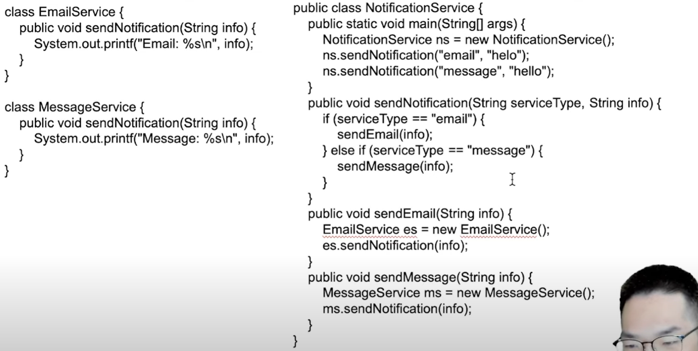
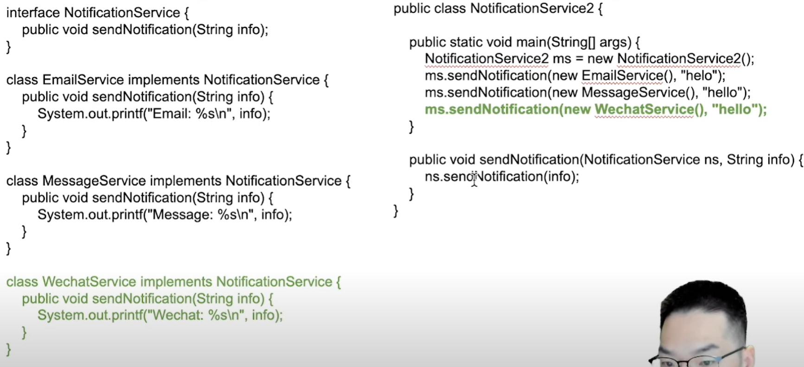
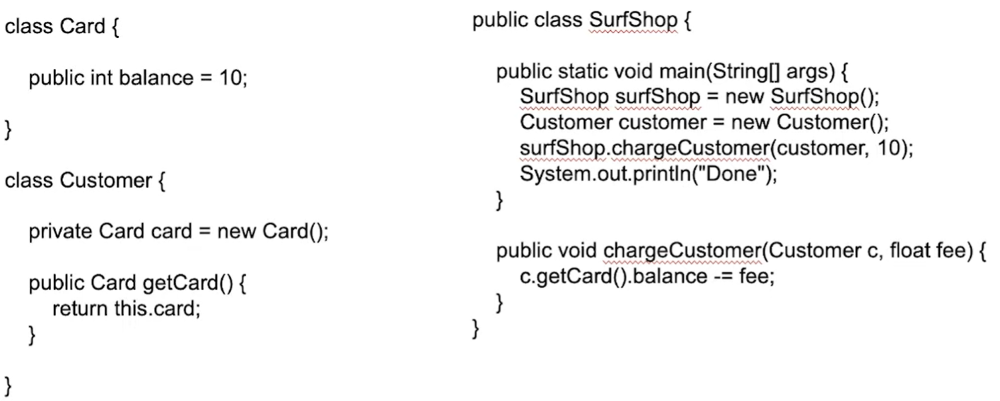
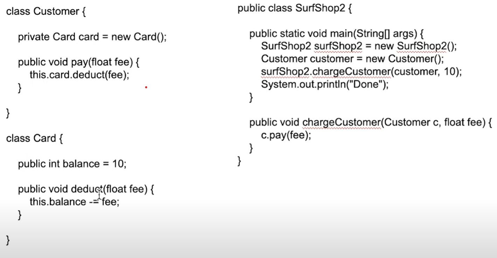
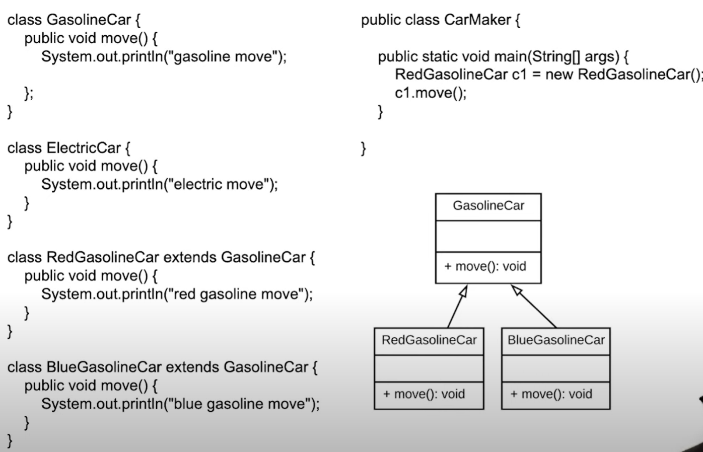
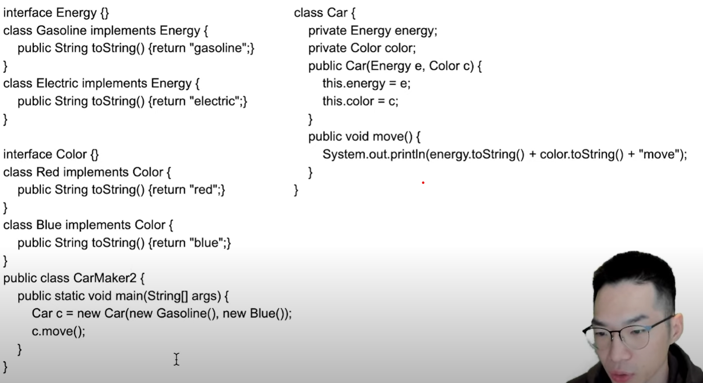
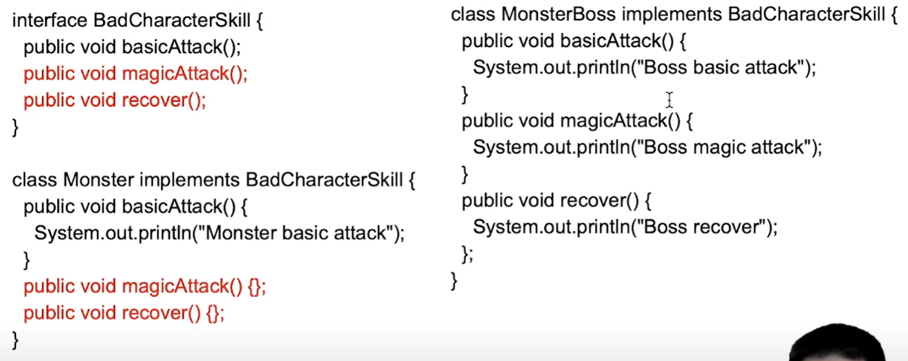
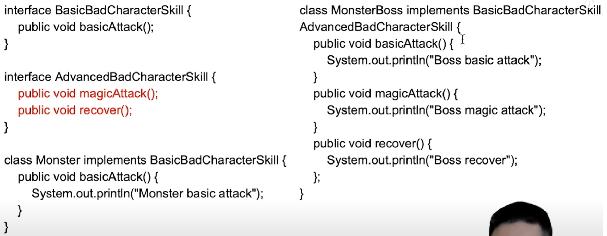

# 推荐资料

1. https://refactoringguru.cn/design-patterns/factory-method

## 什么是设计模式

针对常见问题的通用解决方案，旨在降低对象之间的耦合，增加代码的复用性

## 七大原则

### 1. 单一职责

一个类应该`有且仅有`一个引起它变化的原因。（一个类只负责一小块功能）

这样每个类涉及的功能少，后期修改的话需要改动的类也就少了。

### 2. 开闭原则

对拓展开放，对修改关闭

当需求发生变化时，尽量不修改原来代码，而是通过添加代码来实现。

该原则通过接口和抽象类实现，实例：

这个示例虽然已经考虑了拓展性，但是要添加一个新功能的话，还是需要修改现有代码的很多部分。

而通过接口，问题就会变得很简单，无需修改原有类的内容

**注意**：这种设计要求接口或者抽象类足够稳定

### 3. 迪米特法则（最少知识法则）

一个类只和直接朋友通信

直接朋友只包括：成员变量，方法参数和返回值中的类

**示例**

商城和卡不是直接朋友，两者不该有交互

修改后商场之和用户交互，用户和卡交互

### 4. 依赖倒置原则

高层模块不直接依赖于底层模块，而是添加中间层：接口或者抽象类

### 5. 合成复用

使用聚合/组合来替代继承

因为当类变得越来越复杂，继承会导致大量的子类，而聚合不会。（可以认为继承的复杂度是指数增长，而聚合在复杂度线性增长）

**示例**

继承关系

聚合关系

### 6.接口隔离

一个类只依赖最少的接口

其实跟单一职责原则没啥区别

**示例**

### 里氏替换

父类总能被子类替换

要求子类总是继承和拓展父类的功能，但是不要修改父类的功能

