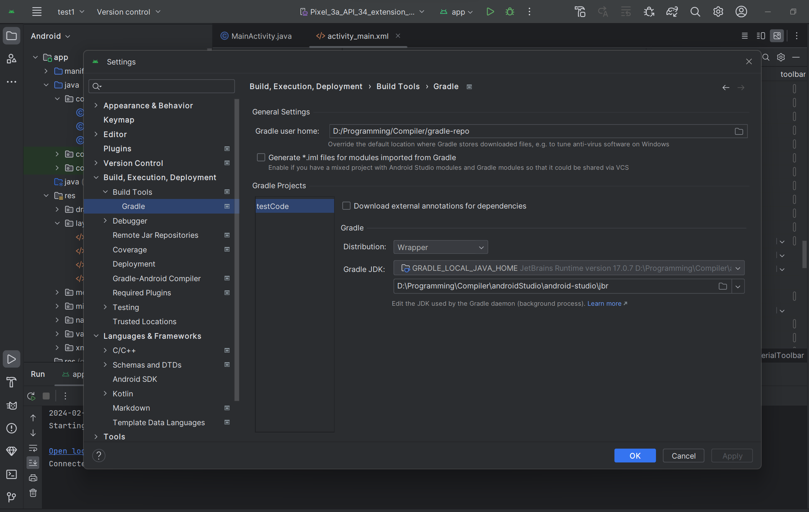

## 使用原因

android studio本身就是基于Idea的，所以用idea下载android和android design插件也是一样的效果。

！但是由于idea在用android design对UI进行编辑时，任何组件的attributes栏非常的卡，而android studio没有该问题。

## 下载

https://developer.android.com/studio?hl=zh-cn

官网直接下载就行，中间步骤选custom自己设置sdk的位置（不记得是不是sdk了，总之选自定义，然后可以设置下载位置）

## gradle 本地仓库设置

gradle类似maven，进行依赖管理的



在setting里设置修改Gradle user home即可（默认位置是c/用户/.gradle）

## 虚拟机下载位置修改

添加环境变量

```
ANDROID_SDK_HOME = D:\Programming\Compiler\SDK
```

然后将默认下载位置c/用户/.android拷贝到D:\Programming\Compiler\SDK下

最后重启android studio即可