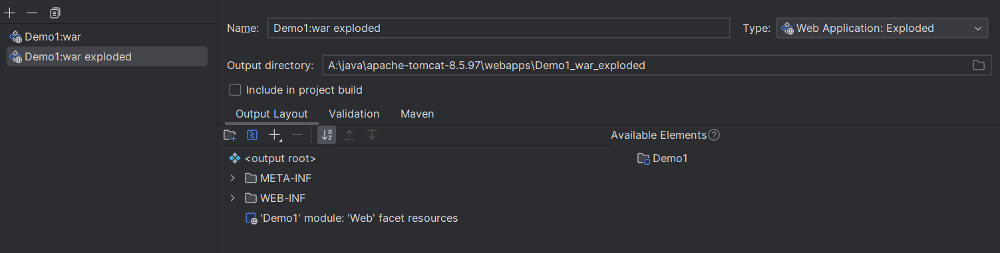

## 快捷键

### 选中 多行/多个目标

* 选择下一个相同目标：alt + J
* 选择所有相同目标：ctrl + shift + alt + J
* 多行光标：alt + shift + 鼠标左键
* 多行光标（矩阵）：ctrl + alt + shift + 鼠标左键

### 编辑文本
* 切换某行位置：shift + alt + 上下键
* 删除一行：ctrl + Y

## 配置Maven

在创建完spring项目后，如果无法启动项目，可能是maven依赖没有下载成功，可在`build`中查看。

解决方法：
打开`设置`，在Maven选项中手动设置maven所在位置


## 创建Web模块 

创建web模块方式很多，最方便的是创建javaEE项目，但是项目结构会变得复杂。所以给一个简单又简介的方法。

下边以创建Servlet为例子：

1. 在pom文件修改打包方式为war

```
<?xml version="1.0" encoding="UTF-8"?>
<project xmlns="http://maven.apache.org/POM/4.0.0"
         xmlns:xsi="http://www.w3.org/2001/XMLSchema-instance"
         xsi:schemaLocation="http://maven.apache.org/POM/4.0.0 http://maven.apache.org/xsd/maven-4.0.0.xsd">
    <modelVersion>4.0.0</modelVersion>

    <groupId>org.example</groupId>
    <artifactId>Demo1</artifactId>
    <version>1.0-SNAPSHOT</version>
    <packaging>war</packaging>

</project>
```

2. 这时项目结构会改变，多出一个web模块（没有的话也可以重启一下idea可能就刷新了/如果没有的话，自己添加一个也是一样的）：


3. 点击deployment Descriptiors下的+号，根据刚才标红的目录创建xml文件：


4. 此时web模块已经创建完成，对应的artifacts已经生成（用于idea配置tomcat）

**注意，一定要检查artifact输出的结构是否正确，是否包含lib！！！**


5. 此时项目结构为：


## idea配置tomcat

这里不是下载tomcat插件，需要本地已经安装了tomcat

1. 在setting里配置tomcat，选择本地tomcat的位置


2. 在右上角的run按钮下边有个edit configurations，点击+号添加tomcat


3. 根据下方报错可知我们还没有配置artifact，也就是没有声明要把什么部署到tomcat中去。点击Server旁边的Deployment，添加artifact


4. 如果显示没有artifact，说明web模块创建有问题，见上边的创建WEB模块。也可以用这个笨方法：https://blog.csdn.net/jakemanse/article/details/105874304

5. 修改Artifact的部署路径，确保它被部署到了tomcat/webaaps下(默认值是在当前项目的target下，但是有时候不会同步到tomcat下，所以需要手动修改)

