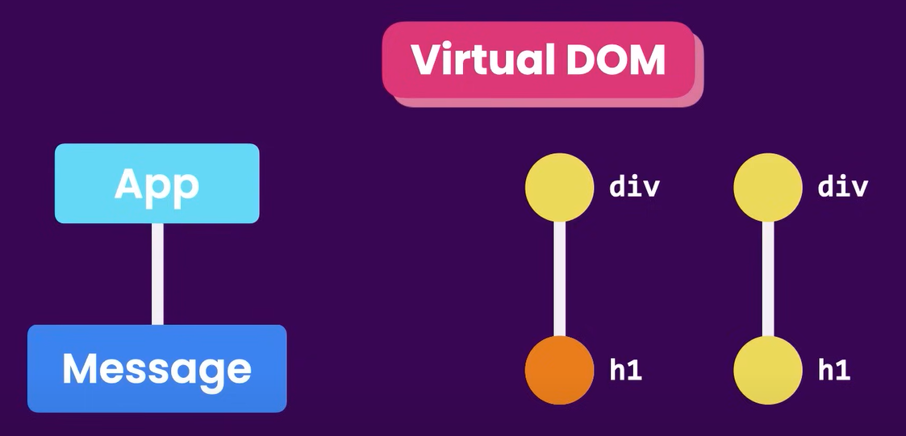

## React 项目启动

```
// 1. 创建vite项目
npm create vite@4.1.0

// 2. 选择框架和语言
create-vite@4.1.0
Ok to proceed? (y) y
√ Project name: ... vite-react
√ Select a framework: » React
√ Select a variant: » TypeScript

// 3. 进入当前目录下创建的项目
cd vite-react

// 4. 下载依赖的包
npm install

// 5. 启动项目
npm run dev

```

### 项目结构

1. node_modules: 存储依赖包
2. public: 存放静态资源，例如图片，字体等
3. src/assets：也是存放静态资源，此处存放的资源会被打包，而 public 中的不会
4. src/\*.jsx：javascript xml 文件，也是写组件的文件
5. src/\*.css：风格文件
6. index.html：入口文件
7. package.json：项目文件，类似于 pom 文件

## React 组件

React 通过一个个组件来构建成组件树，也就是 Virtual Dom。然后 React Dom 包来负责将组件数来转为浏览器理解的 DOM 文件。



### 什么是组件

react 中每个组件都是一个 tsx 文件，其中格式为：

```
function ListGroup() {
    return (<ul className="list-group">
        <li className="list-group-item">An item</li>
        <li className="list-group-item">A second item</li>
        <li className="list-group-item">A third item</li>
        <li className="list-group-item">A fourth item</li>
        <li className="list-group-item">And a fifth one</li>
    </ul>);
}

export default ListGroup;
```

需要注意，每个组件中只能返回一个 HTML ELEMENT。

# Hooks

Hooks 是 React 16.8 版本新增的特性，允许在函数组件中使用 state 以及其他的 React 特性。

## useEffect

useEffect 用于在函数组件中处理副作用操作，例如数据获取、订阅、手动修改 DOM 等。它接受一个函数和一个依赖数组作为参数。

```jsx
useEffect(() => {
  // 副作用逻辑，例如数据获取
  fetchData();

  // 可选的清理函数
  return () => {
    cleanup();
  };
}, [dependency1, dependency2]);
```

- 如果依赖数组为空 `[]`，则副作用函数只会在组件挂载时执行一次，类似于类组件中的 `componentDidMount`。
- 如果依赖数组中包含变量，则副作用函数会在这些变量发生变化时执行。

其中 return 的清理函数会在组件卸载时或者依赖变化前执行，充当 componentWillUnmount 的角色。

## useRef

useRef 用于在函数组件中创建一个可变的引用对象，作为在渲染之间保持不变的值。

```jsx
const myRef = useRef(initialValue);
```

- `myRef.current` 可以用来存储任何可变的值，其不会被重渲染重置。

相较于 useState，useRef 的更新不会触发组件重新渲染，适合存储不需要触发 UI 更新的值，例如定时器 ID、DOM 引用等。

## useMemo

useMemo 用于缓存计算结果，以避免在每次渲染时都进行昂贵的计算。它接受一个函数和一个依赖数组作为参数。

```jsx
const memoizedValue = useMemo(() => {
  // 计算逻辑
  return computeExpensiveValue(a, b);
}, [a, b]);
```

- 只有当依赖数组中的变量发生变化时，计算函数才会重新执行，否则会返回缓存的结果。

注意：useMemo 不会记录之前的值，只会在依赖变化时重新计算。

## useCallback

```jsx
const preloadData = useCallback(() => {
  loadACLInfo({
    callback: () => setInitialized(true),
  });
}, []);

useEffect(() => {
  preloadData();
}, [preloadData]);
```

在 React 里，组件每次重新渲染时，组件函数会重新执行一遍，所以函数中`const preloadData = () => { ... }` 这种写法会导致每次渲染时，preloadData 都是一个新的函数引用。

如果这个函数被传递给子组件作为 props，或者被放在 useEffect 的依赖数组中，就会导致子组件不必要的重新渲染，以及 useEffect 不必要的重新执行。

但用 useCallback(..., []) 后：

- preloadData 只在组件首次渲染时创建一次，之后每次渲染时都会复用同一个函数引用
- 依赖 preloadData 的 useEffect 只会在首次挂载时跑一次（符合“初始化加载”的语义）

### useCallback vs useMemo

useCallback 用于缓存函数，而 useMemo 用于缓存计算结果。

## 自定义 Hook

自定义 Hook 是一种复用组件逻辑的方式。它本质上是一个以 use 开头的函数，可以调用其他 Hook。

相较于普通方法，自定义 hook 支持在方法中使用其他 hook（useState、useEffect 等），从而实现状态和副作用的管理。

```jsx
import { useState, useEffect } from "react";
function useFetch(url) {
  const [data, setData] = useState(null);
  const [loading, setLoading] = useState(true);

  useEffect(() => {
    fetch(url)
      .then((response) => response.json())
      .then((data) => {
        setData(data);
        setLoading(false);
      });
  }, [url]);

  return { data, loading };
}
```

从上述例子可见，自定义 hook 只是封装了多个 hook 函数的逻辑，并返回需要的状态或方法。

# 布局

## Flexbox/Grid 布局

### 每行固定显示 N 个元素，不足 N 个时均分宽度

每行以{columnMinWith}决定能显示几个表单项；每行根据 flex:1 均分空间：

```jsx
<Box display="flex" gap={1} sx={{ width: "100%", flexWrap: "wrap" }}>
  {fields.map((f) => (
    <Box key={f.name} sx={{ flex: `1 1 ${columnsMinWidth}px` }}>
      {renderField(f)}
    </Box>
  ))}
</Box>
```

### 每行固定显示 N 个元素，不足 N 个时保证与上一行宽度一致

```jsx
<Box
  sx={{
    display: "grid",
    gridTemplateColumns: "repeat(auto-fill, minmax(320px, 1fr))",
  }}
>
  {items.map((item) => (
    <Box key={item.id ?? item.programName}>
      <StatusCard item={item} onClick={onItemClick} />
    </Box>
  ))}
</Box>
```

- auto-fill：如果一行能放下 4 个，但是只有 3 个 item，依旧显示 4 列; 但如果数量是 5 个，依旧是 4 列，剩下的 1 个放到下一行，其宽度和上一行的列宽一致。
- auto-fit: 如果一行能放下 4 个，但是只有 3 个 item，则只显示 3 列; 但如果数量是 5 个，依旧是 4 列，剩下的 1 个放到下一行，其宽度和上一行的列宽一致。
- minmax(320px, 1fr) 先尝试以 320px 计算出最多的列数，然后每列均分剩余空间

# 表单

## React-Hook-Form + Zod

React-Hook-Form 是一个用于管理 React 表单状态的库，而 Zod 是一个用于数据验证和解析的 TypeScript-first 模式的库。将两者结合使用，可以实现强类型的表单验证和管理。

### 基本用法

**表单组件**：

```jsx
import React, { useEffect } from "react";
import { FormProvider, useForm } from "react-hook-form";
import { zodResolver } from "@hookform/resolvers/zod";

/**
 * 统一封装：
 * - RHF useForm
 * - zodResolver
 * - 外部 initialValues 变化时 reset（编辑弹窗常用）
 */
export default function ZodRHFForm({
  id,
  schema,
  defaultValues,
  initialValues,
  onSubmit,
  children,
  mode = "onSubmit",
}) {
  // useForm是总控，其维护了表单状态
  const methods = useForm({
    resolver: schema ? zodResolver(schema) : undefined, // 将校验模式交给 zodResolver
    defaultValues, // 初始值
    mode, // 校验时机，默认 onSubmit
  });

  // 当 initialValues 变化时，重置表单值
  useEffect(() => {
    if (initialValues) {
      methods.reset({ ...defaultValues, ...initialValues });
    }
  }, [initialValues]);

  return (
    <FormProvider {...methods}>
      {/* onSubmit触发时，先调用RHF的handleSubmit来进行zodResolver校验。错误则修改fieldState，全部通过才会调用用户的onSubmit */}
      {/* 设置formId是为了： 在form外的button也可以通过 <button type="submit" form="sync-config-form"/> 来触发该form的提交 */}
      {/* noValidate是关闭form的原生校验，只有zod来负责校验 */}
      <form id={id} onSubmit={methods.handleSubmit(onSubmit)} noValidate>
        {children}
      </form>
    </FormProvider>
  );
}
```

**受控输入框**：

```jsx
import React from "react";
import { Controller, useFormContext } from "react-hook-form";
import TextField from "@mui/material/TextField";

export default function RHFTextField({ name, helperText, ...props }) {
  const { control } = useFormContext();

  return (
    <Controller
      name={name} // 这里的 name 要和 schema 以及 defaultValues 对应
      control={control} // 从 useFormContext 获取 control， 关联到父级表单的状态
      render={(
        { field, fieldState } // field是rhf表单控件的属性集合，fieldState包含校验状态
      ) => (
        <TextField
          {...props}
          {...field} // 将 RHF的 onChange等方法传递给 MUI TextField， 实现双向绑定(用户输入 -> onChange -> RHF 更新内部状态)
          value={field.value ?? ""} // (RHF 状态变化 -> field.value 变化 -> 组件回显)
          error={!!fieldState.error} // (RHF 状态变化 -> fieldState.error 变化 -> 组件回显)
          helperText={fieldState.error?.message ?? helperText}
          autoComplete="off"
        />
      )}
    />
  );
}
```

**调用者**：

```jsx
import React from "react";
import * as z from "zod";
import ZodRHFForm from "./ZodRHFForm";
import RHFTextField from "./RHFTextField";

const schema = z.object({
  username: z.string().min(3, "用户名至少3个字符"),
  age: z.number().min(0, "年龄不能为负数"),
});

export default function MyForm() {
  const handleSubmit = (data) => {
    console.log("表单数据：", data);
  };

  return (
    <ZodRHFForm
      schema={schema}
      defaultValues={{ username: "", age: 0 }}
      onSubmit={handleSubmit}
    >
      <RHFTextField name="username" label="用户名" />
      <RHFTextField name="age" label="年龄" type="number" />
      <button type="submit">提交</button>
    </ZodRHFForm>
  );
}
```

# Redux

## 基本概念

Redux 是一个用于管理应用状态的 JavaScript 库，通常与 React 一起使用。它基于 Flux 架构，强调单一数据源和不可变状态。

### 核心概念

1. Store：存储应用的整个状态树。应用中只能有一个 Store。
2. Action：描述发生了什么的普通 JavaScript 对象。每个 Action 都有一个 type 属性。
3. Reducer：一个纯函数，接收当前状态和 Action，返回新的状态。
4. Dispatch：发送 Action 的方法，用于触发状态更新。

### 使用 Redux 的步骤

1. 创建 Store：

```javascript
import { createStore } from "redux";
import rootReducer from "./reducers";
const store = createStore(rootReducer);
```

2. 定义 Action：

```javascript
const increment = () => ({ type: "INCREMENT" });
const decrement = () => ({ type: "DECREMENT" });
```

3. 创建 Reducer：

```javascript
const counter = (state = 0, action) => {
  switch (action.type) {
    case "INCREMENT":
      return state + 1;
    case "DECREMENT":
      return state - 1;
    default:
      return state;
  }
};
export default counter;
```

4. 连接 React 组件：

```javascript
import React from "react";
import { useSelector, useDispatch } from "react-redux";
const Counter = () => {
  const count = useSelector((state) => state);
  const dispatch = useDispatch();

  return (
    <div>
      <p>Count: {count}</p>
      <button onClick={() => dispatch(increment())}>+</button>
      <button onClick={() => dispatch(decrement())}>-</button>
    </div>
  );
};
export default Counter;
```

5. 提供 Store 给 React 应用：

```javascript
import React from "react";
import ReactDOM from "react-dom";
import { Provider } from "react-redux";
import store from "./store";
import App from "./App";
ReactDOM.render(
  <Provider store={store}>
    <App />
  </Provider>,
  document.getElementById("root")
);
```

### thunk 中间件

Redux Thunk 是一个中间件，允许你编写返回函数的 Action 创建者，而不是返回普通的 Action 对象。这个函数可以接收 `dispatch` 和 `getState` 作为参数，从而实现异步操作。

```javascript
const fetchData = () => {
  return (dispatch, getState) => {
    dispatch({ type: "FETCH_DATA_REQUEST" });
    fetch("/api/data")
      .then((response) => response.json())
      .then((data) => {
        dispatch({ type: "FETCH_DATA_SUCCESS", payload: data });
      })
      .catch((error) => {
        dispatch({ type: "FETCH_DATA_FAILURE", error });
      });
  };
};
```

# JSDoc

## 什么是 JSDoc

- 在 JavaScript 里用注释写类型与文档，让 IDE 获取智能提示、跳转、错误检查。
- 用途：为 js 项目添加提示/约束

## 示例

```javascript
/**
 * @typedef {Object} FetchParams
 * @property {number} page - 当前页码（从 1 开始）
 * @property {number} pageSize - 每页条数
 * @property {string} [search] - 可选的搜索关键词
 * @property {string} [statusFilter] - 可选的状态筛选条件 ("all" | "streaming" | "no_streaming" | "too_high")
 */

/**
 * @typedef {Object} SessionFlow
 * @property {string} id - 会话 ID
 * @property {string} name - 会话名称
 * @property {string} status - 会话状态("streaming" | "no_streaming" | "too_high")
 */

/**
 * 模拟从后端获取会话数据的 API 函数
 * @param {FetchParams} params - 查询参数，包括分页和筛选条件
 * @returns {Promise<{items: SessionFlow[], total: number}>}
 */
export const fetchSessions = async (params) => {
  const { page, pageSize, search = "", statusFilter = "all" } = params;

  // business logic to fetch data from backend

  return {
    items: paginatedData,
    total,
  };
};
```

## 常用标签

1. `@param {type} name - description`：描述函数参数。
2. `@returns {type} description`：描述函数返回值。
3. `@typedef {type} name`：定义自定义类型。
4. `@property {type} name - description`：描述对象属性。

## 基本语法

1. 被 `[]` 包裹的内容是可选的。

# CSS-in-JS

## 什么是 CSS-in-JS

CSS-in-JS 是一种将 CSS 样式直接写在 JavaScript 代码中的方法。它允许开发者在组件内部定义样式，从而实现样式的模块化和动态化。

## 元素搜索

### 示例

```jsx
const popperSx = {
  "& .MuiPickersDay-root.Mui-selected": {
    backgroundColor: "rgb(0, 177, 137)",
    color: "#fff",
  },
  "& .MuiPickersDay-root.Mui-selected:hover": {
    backgroundColor: "rgb(0, 177, 137)",
  },
  // "& .MuiPickerPopper-paper": {
  //   transform: "scale(0.8) !important",
  // },
  // // 出现在下方：原点在上
  // '&[data-popper-placement*="bottom"] .MuiPickerPopper-paper': {
  //   transformOrigin: "top left",
  //   bgcolor: "red",
  // },
  // // 出现在上方：原点在下
  // '&[data-popper-placement*="top"] .MuiPickerPopper-paper': {
  //   transformOrigin: "bottom left",
  // },
  "& .MuiPickerPopper-paper": {
    width: "347px",
    height: "310px",
  },
  "& .MuiPickerPopper-paper > *": {
    transform: "scale(0.8)",
    transformOrigin: "top left",
  },
};

<DateTimePicker
  ampm={false}
  slotProps={{
    popper: { sx: popperSx },
  }}
  {...props}
/>;
```

### 语法讲解

1. `&`：表示当前选择器本身。在上面的例子中，`&`代表 `.MuiPopper-root`,因为该sx作用在`popper: { sx: popperSx }`。

2. 空格：表示后代选择器。例如，`& .MuiPickersDay-root.Mui-selected` 选择的是 `.MuiPopper-root` 内部的所有具有 `.MuiPickersDay-root` 和 `.Mui-selected` 类的元素。

3. 属性选择器：例如，`&[data-popper-placement*="bottom"]` 选择的是具有 `data-popper-placement` 属性且其值包含 "bottom" 的 `.MuiPopper-root` 元素。

    * `*=`：表示属性值包含某个子字符串。
    * `^=`：表示属性值以某个字符串开头。
    * `$=`：表示属性值以某个字符串结尾。

4. 类选择器：例如，`.MuiPickersDay-root.Mui-selected` 选择同时具有这两个类的元素。

5. 伪类选择器：例如，`.Mui-selected:hover` 选择具有 `.Mui-selected` 类且处于悬停状态的元素。其它常见伪类还有 `:focus`、`:active` 等。

注意：
- 如果两个选择器之间没有空格，例如 `.class1.class2`，表示同时具有这两个类的元素；`&:hover` 表示当前元素在悬停状态时; `&.class` 表示当前元素同时具有该类。
- 如果选择器直接有空格，例如 `& .class`，表示当前元素内部的后代元素。

