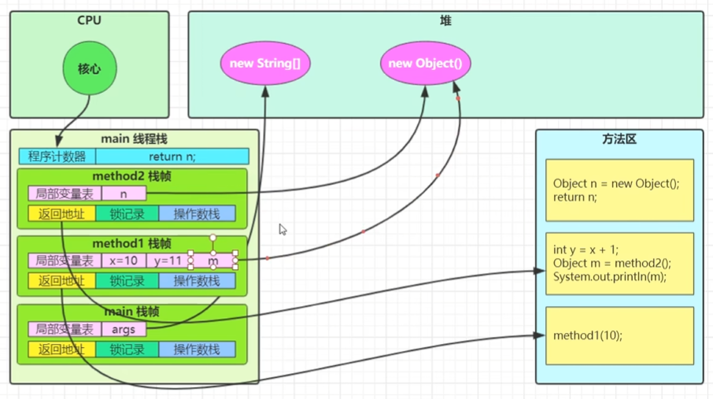
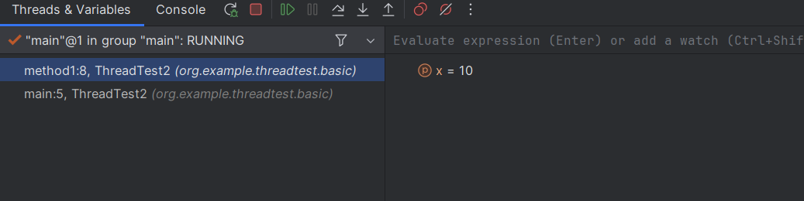
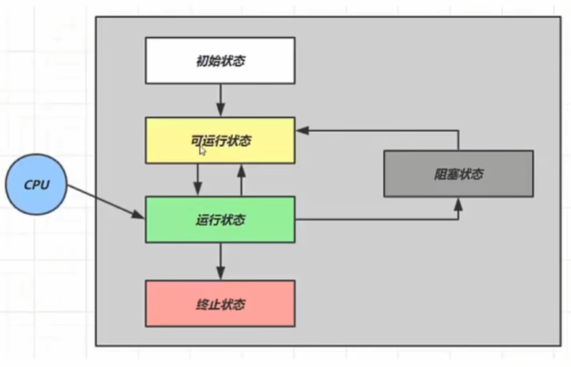
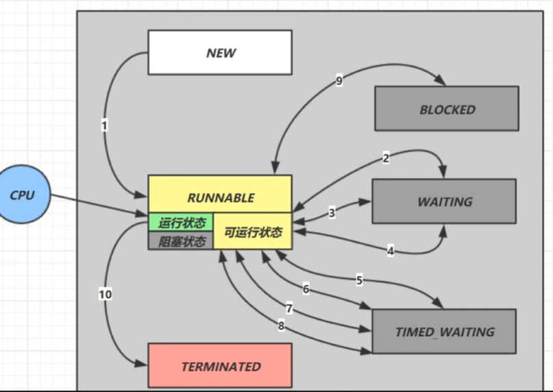

## 进程与线程

一个程序本身只是存储在磁盘上的指令和数据。

**进程**： 当程序被执行时，它会被读取到内存，分配空间和资源，从而成为进程。

**线程**： 一个进程可以包含一个或多个线程，每个线程可以看作是一个指令流，这些指令流是共享线程的数据的。

JAVA中进程是最小的资源分配单位，线程是最小的调度单位。

在java中，Thread指的是线程，一个JVM才是一个进程：
* 进程中有堆，栈，方法区等
* 线程有自己的栈，但是它们是共享堆和方法区的

### 并行并发

电脑看上去可以同时做多件事情：播放音乐，启动WORD，PPT等，这种效果可以通过并发或者并行实现。

**串行**：最基本的情况，CPU会一次执行一个线程，执行完该线程再去执行下一个。此时无法让计算机同时做多件事情。

**并行**：与串行对应，电脑有多个CPU或者多个核心，每个CPU都在执行线程，所以此时多个任务是真的在同时执行。

**并发**：让单个CPU在多个线程之间快速切换，微观上还是串行执行任务，但宏观上给人并行的感觉，这种实现则是并发。


### 同步异步

**同步**：需要等待一个调用执行结束在进行下一步操作。

**异步**：创建一个线程负责该调用，无需等待调用结束。

### 多线程、并行、异步的优势

1. 功能上的需要，比如UI需要实时反馈，肯定需要异步调用
2. 单个CPU利用率提高：对应IO读写操作，CPU交给磁盘来做，同步则会要求CPU进行等待，此时CPU的时间就被浪费了。
3. 多个PU利用率提高：将任务分成多线程后，才可能被多个CPU并行执行

### 守护线程

JAVA进程要等待所有线程结束才结束，而不需要等待守护线程。当所有非守护线程结束时，进程结束。

例如：垃圾回收线程就是一种守护线程。

## 线程创建

### 继承Thread类
为了创建线程，我们可以创建一个类来继承java.lang.Thread类，并重写run()方法来指定线程要执行的任务。

````
public class PrintThread extends Thread{
    @Override
    public void run(){
        for (int i = 0; i < 5; i++) {
            System.out.println("Print thread run:"+i);
        }
    }
}
````

之后在main方法中，只需要创建该类并执行start()方法即可。（注意不是run方法）
````
public static void main(String[] args) throws Exception {
    Thread t1 = new PrintThread();
    t1.start();

    for (int i = 0; i < 5; i++) {
        System.out.println("main run:"+i);
    }
}
````

缺点：继承了Thread类就无法继承其它类了。

### 实现Runnable接口
另一种方法是创建一个类实现java.lang.Runnable接口，从而成为一个任务类。在该类中重载Runnable接口的run方法，并在其中指定线程要做的事情。
````
public class Thread2 implements Runnable{
    @Override
    public void run(){
        for (int i = 0; i < 5; i++) {
            System.out.println("Thread2: "+i);
        }
    }
}
````

在main函数中，则可以创建任务类并且用其来构造Thread对象。
````
public static void main(String[] args) throws Exception {
    Thread2 task = new Thread2();
    Thread t2 = new Thread(task);
    t2.start();

    for (int i = 0; i < 5; i++) {
        System.out.println("main run:"+i);
    }
}
````

要注意的是：任务类并不是线程类，只是构造线程类的参数。

### 实现Callable接口
前两种方法都是无返回值的，如果需要线程的返回值，则可以使用这种方法。

首先，创造一个类实现java.util.concurrent.Callable接口，重载它的call方法并在其中指定线程要执行的任务和返回值。</br>注意，Callable的泛型等同于call函数返回值的类型。

````
public class Thread3 implements Callable<String>{
    private int n;
    public Thread3(int n){
        this.n = n;
    }
    @Override
    public String call(){
        int sum = 0;
        for (int i = 0; i < n; i++) {
            System.out.println("Thread3: "+i);
            sum += i;
        }
        return "Sum of 1 to "+n+" is "+sum;
    }
}
````

然后在main函数中，将实现callable的类封装成FutureWrok类。这个FutureWork类实现了Runnable接口，所有将它交给Thread类来构建线程。

返回值则是用FutureWork的get方法来获得。注意，该方法为了获取线程的返回值，它可能会阻塞main线程来等待Futurework的线程执行完。
````
public static void main(String[] args) throws Exception {
    Callable<String> call = new Thread3(5);
    FutureTask<String> f1 = new FutureTask<>(call);
    Thread t = new Thread(f1);
    t.start();

    String rs = f1.get();
    System.out.println(rs);
}
````

## Thread类常见方法
````
public static void main(String[] args) throws Exception {
    // 1. getName 获取线程的名字
    // 2. setName(String) 为线程设置名字
    Thread t1 = new Thread(()->{
        System.out.println("Thread is running");
    });
    t1.start();
    System.out.println(t1.getName());
    t1.setName("First thread");
    System.out.println(t1.getName());

    // 3. currentThread() 获取当前程序的线程
    Thread t2 = new Thread(()->{
        Thread cur = Thread.currentThread();
        cur.setName("Second Thread");
        String name = cur.getName();
        System.out.println(name+" is running");
    });
    t2.start();

    // 4. Thread(Stirng name) 在构造函数中传递线程名字
    Thread t3 = new Thread(()->{
        System.out.println("Thread is running");
    }, "Third Thread");
    System.out.println(t3.getName());

    // 5. sleep() 休眠
    Thread.sleep(5000);
    System.out.println("Wake up!");

    // 6. join() 等待该线程结束
    Thread t4 = new Thread(()->{
        for (int i = 0; i < 5; i++) {
            System.out.println("Thread is running: "+i);        
        }
    });
    t4.start();
    t4.join();
    for (int i = 0; i < 5; i++) {
        System.out.println("main:"+i);
    }
}
````

### run和start的区别
```
public static void main(String[] args) {
    Thread t1 = new Thread("t1") {
        @Override
        public void run() {
            System.out.println(Thread.currentThread().getName() + " is running");
        }
    };

//        t1.run();
    t1.start();
}
```

run()只是调用Thread的run方法，执行线程还是main线程；start才会真正的创建线程来执行方法。

需要注意：start()方法每个线程只能调用一次，无法通过多次调用start方法来创建多个线程。

### sleep和yield

sleep会将程序从RUNNABLE状态转变到TIME_WAITING，sleep结束则会变回RUNNABLE。而sleep时，该线程可以被调用interupt方法，通过抛出InterruptedException结束sleep，变为RUNNABLE。

yield是RUNNING线程主动释放CPU从而进入RUNNABLE状态，它随时可以再次运行。

**sleep应用**： 在 while(true){} 循环中添加一小段sleep，防止CPU占用率过高

### interupt

无论线程是在正常运行还是sleep，都可以通过interupt来通知该线程。线程正常运行时，可以通过isInteruptted获取打断状态从而判断接下来的逻辑；而sleep时则会抛出异常。

interupt经常用于终止线程，这种终止方式是被推荐的，因为线程可以在结束前自己做一些逻辑处理；而stop之类的方法会直接杀死进程，可能出现死锁。

## 进程查看

windows:
```
tasklist    //查看进程
taskkill    //杀死进程
```

linux
```
ps          //查看进程
kill        //杀死进程
```

java
```
jps         //查看java进程
```

## 线程原理


在JVM中，有堆区，栈区和方法区，每个线程就对应一个栈:

* 线程每个方法的调用就对应一个栈帧
* 每个线程任意时刻只有一个活跃的栈帧（只有一个方法正在执行）

流程如下：JVM首先会将类的字节码加载到方法区，然后创建默认的main栈和main方法的栈帧。当main方法调用method1方法时，则为method1创建一个栈帧，然后修改计数器去执行method1对应的字节码指令。当method1结束后，则根据返回地址将程序计数器修改会main方法的字节码指令，释放method1栈帧，然后继续执行main方法。其中方法的局部变量存储在栈帧中，而new object则存储在堆中。

栈帧可以通过IDEA的DEBUG进行观察：



### 多线程

所谓多线程不过就是多个栈而已，每个栈会有自己的局部变量，但是共享堆区。而CPU执行多线程也就是每次查看一个栈的PC(程序计数器)，执行指令，修改栈的一些局部变量或者其它数据。

### 上下文切换

上下文切换是指一个线程不再运行，转而运行另一个线程，原因有：
1. 线程的CPU时间用完了
2. 发送了垃圾回收，工作线程停止，回收线程启动
3. 线程自发阻塞，例如sleep, join等
4. 更高优先级的线程出现了

上下文切换会带来开销，比如CPU要将cpu cache中的计算结果保存到栈A，然后将栈B的PC，局部变量等加载到CPU CACHE。


### 线程状态



从操作系统来看有5种状态
* 初始状态：Thread对象创建但没有和操作系统的线程关联
* 终止状态：Thread结束，不会改变为其它状态




在java中有6中类型，在Thread.state枚举类中指出了：

* New: 同上初始态
* Terminated: 同上终止态
* Runnable: 包含操作系统中的runnable, running, 以及被IO阻塞时的状态
* Blocked: 通常是等待锁
* Waiting: 通常是等待线程结束，例如join
* Timed_Waiting:有时间的等待，例如sleep


## 线程安全问题

看一个经典的竞争问题

```
public class Test4 {
    public static int amount = 0;

    public static void main(String[] args) throws InterruptedException {
        Thread thread1 = new Thread(() -> {
            for (int i = 0; i < 5000; i++) {
                amount++;
            }
        });

        Thread thread2 = new Thread(() -> {
            for (int i = 0; i < 5000; i++) {
                amount--;
            }
        });

        thread1.start();
        thread2.start();
        thread1.join();
        thread2.join();

        System.out.println(amount);
    }
}
```

最终amount的数组不为零，为什么？这可以从字节码中看出端倪。

在字节码中，amount++, amount--并不是一个原子操作，而是：

```
getstatic   //读取amount到操作栈
iconst_1    //添加1到操作栈
isub        //对操作栈做减法
putstatic   //从操作栈写回amount
```

```
getstatic   //读取amount到操作栈
iconst_1    //添加1到操作栈
iadd        //对操作栈做加法
putstatic   //从操作栈写回amount
```

可见两个线程都是将数组读取到栈中操作，最后将结果写回。在读取和写回中间发送线程切换，则会导致上述问题。


### 临界区和竞态条件

**临界区**： 对共享资源进行读写的代码块

**竞态条件**：多个线程在临界区内执行，执行顺序不确定导致结果不确定

解决方法：

1. 阻塞：Synchronized


### Synchronized

Synchronized也被成为`对象锁`，通过阻塞其它线程来解决竞态问题。

语法1：
```
Synchronized(object){
    //临界区
}
```

Synchronized保证线程执行临界区之前，先获取object的锁。如果此时其它线程以及获取该锁了，则进入blocked阻塞态。当获取锁的线程执行完临界区了，则释放锁。**注意**：获取锁的线程也可能进行上下文切换，但是只要它没执行完临界区，它就不会释放锁。

Synchronized通过这种方法保证某线程执行临界区时，不会有其它线程执行临界区，从而保证临界区是原子性的。

### Synchronized 修饰方法
```
public synchronized void method(){
    //方法体
}
public synchronized static void method(){
    //方法体
}
```

这个等价与：

```
public void method(){
    synchronized(this){
        //方法体
    }
}

public static void method(){
    synchronized(XXX.class){
        //方法体
    }
}
```

需要注意的是，synchronized修饰成员方法，对象锁用的是该对象；而修饰静态方法时，对象锁用的是类对象。


### 变量线程安全

成员变量和静态变量：

* 如果没有共享，则线程安全
* 如果共享了，则需要看操作类型
  * 只有读操作，线程安全
  * 有写操作，线程不安全

局部变量：

* 基本类型是线程安全的，因为局部变量存储在栈中，所以每个线程会创建自己的局部变量
* 引用类型不一定安全，每个线程都会有自己的引用，但是它们可能指向同一个对象

### 线程安全类

JAVA中的一些常见类被成为线程安全的，比如String, HashTable等，这里的线程安全只是说单个方法是原子的，不能保证多个方法的组合是原子的。

例如：
```
public static void main(String[] args) {
    Hashtable<String, String> hashtable = new Hashtable<>();
    new Thread(()->{
        if(hashtable.get("key")==null){
            hashtable.put("key", "value1");
        }
    }).start();
    new Thread(()->{
        if(hashtable.get("key")==null){
            hashtable.put("key", "value2");
        }
    }).start();
}
```

此外，String的原子操作并不是靠synchronized保证的，而是因为它的值是不可变的，自然不会存在多个线程同时修改数据的情况，从而保证线程安全。