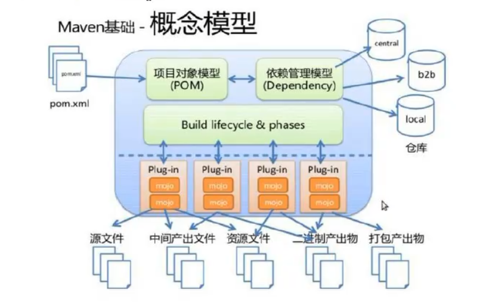

学习视频（尚硅谷新版Maven教程）：https://www.bilibili.com/video/BV1JN411G7gX?p=8&vd_source=308f84c899243030c32a07e4708e5865

## 为什么使用Maven
### 解决依赖管理问题
一个java项目中会需要上百个jar包来作为lib，手动下载和管理十分麻烦，而maven可以提供以下帮助：

#### 1. 解决jar包来源问题

maven有中心仓库和本地仓库，只需要在项目中指明坐标，maven会自动将jar包从中心仓库下载到本地仓库。也可以在配置文件中设置镜像地址，将阿里等国内仓库作为中心仓库。

#### 2. 解决jar包导入问题

利用maven构建项目不需要自己手动将jar包移动到指定位置，也不需要设置Lib path，maven自己完成。

此外，maven会直接根据`依赖坐标`使用本地仓库的jar包，而不是为每个项目拷贝一份jar包到该项目下，从而节省了磁盘空间。

#### 3. 解决jar包之间的依赖和冲突

jar包之间会有依赖关系和版本冲突，maven也会解决该问题

### 可以构建项目

一般情况IDEA会直接构建java项目，但是在Linux服务器上构建时，往往没有IDEA，这时可以用maven来构建项目。

## Maven 概念模型



## Maven 依赖管理

在项目中使用别人的jar包时，除了导入核心jar包外，还需要导入核心jar包所依赖的其它jar包。 而使用maven只需要在pom文件中给出要想使用的jar包坐标即可，maven会负责导入核心jar包和它的依赖。

Maven坐标仓库：https://mvnrepository.com/

```
<dependency>
    //  项目坐标
    <groupId>junit</groupId>
    <artifactId>junit</artifactId>
    <version>4.12-beta-3</version>
    // 项目范围
    <scope>test</scope>
</dependency>
```

### 依赖统一管理

Pom文件中有 `properties`标签，在这里可以自定义`变量`，从而用变量统一管理版本。

```
<properties>
    // 定义变量
    <lombok.version>4.12-beta-3</lombok.version>
</properties>

<dependencies>
    <dependency>
        <groupId>junit</groupId>
        <artifactId>junit</artifactId>
        // 使用变量
        <version>${lombok.version}</version>
        <scope>test</scope>
    </dependency>
</dependencies>
```

### 依赖范围

Pom文件中的scope标签会指定该包的使用范围，默认范围为`complie`。包的使用环境有三种：编译环境，测试环境，运行环境。

编译环境：项目中src/main目录下的代码是否能使用该包</br>
测试环境：项目中src/test目录下的代码是否能使用该包</br>
运行环境：当项目被打包时，该包是否放进`被打的包`中

Scope的依赖范围有：

1. **compile**: 能在编译环境，测试环境，运行环境中使用
2. **test**: 只在测试环境中使用
3. **provided**: 能在编译环境，测试环境中使用。
   
   （provided本身的意思就是服务器，比如tomcat，已经提供了这个包了，那项目产出的时候自然就不用把这个包放进去了。同时也要注意，pom中的版本只是让自己编写代码使用的，真正项目中使用的包版本是由服务器决定的）

4. **runtime**：能在测试环境，运行环境中使用
   
   （因为有些包是接口，例如jdbc，编译时不需要使用）

5. **system**:能在编译环境，测试环境中使用。
   
   （类似于provided，但此时不是由服务器提供，而是由本地system提供，需要systemPath指明路径，可移植性差）

6. **import**:与dependencyManagement元素配合，只用dependencyManagement中的denpendency才能用import范围。它会把指定的dependency复制过来，而不是继承或者依赖传递。

### 依赖类型

其实每个dependency都有type属性，只是默认值“jar包”一般不会修改，所有经常不用声明，但实际上type是有多种值的。

1. **pom**

    当所需要的服务提供了多个jar包来实现的时候，提供者可能会把这句jar包组合成pom包，这时的类型就为pom，例如：
    ```
    <dependency>
        <groupId>org.springframework.boot</groupId>
        <artifactId>spring-boot-dependencies</artifactId>
        <version>2.5.7</version>
        <scope>import</scope>
        <type>pom</type>
    </dependency>
    ```


### 依赖传递

Maven项目中是有依赖传递特性的，比如 A 依赖 B， B 依赖 C， 那么 A 也会自动导入 C 包。 但是以下情况会让依赖传递断开：

1. 依赖的scope不为compile

    只有compile的依赖范围才会进行依赖传递

2. 依赖设置optional为true

    ```
    <optional>true</optional>
    ```

3. 产生依赖冲突
    
    当A依赖于B和C，而B,C又同时依赖于相同包的不同版本，此时便产生了依赖冲突。

    >依赖冲突有`自动解决`方案：
    
    **短路优先**：A->B->xx.1.0  ||  A->xx.2.0 （此时选择xx.2.0）

    **声明优先**：若路径相同则使用先声明的

    >依赖冲突也能手动解决：

    在不想要的路径上添加exlusion标签

    ```
    <dependency>
        <groupId>org.example</groupId>
        <artifactId>maven_B</artifactId>
        <version>1.0-SNAPSHOT</version>

        <exclusions>
            <exclusion>
                <groupId>org.junit.jupiter</groupId>
                <artifactId>junit-jupiter-api</artifactId>
            </exclusion>
        </exclusions>
    </dependency>
    ```
    
### 依赖继承

Maven中有项目继承的概念，因为开发过程中会分模块开发，而这些模块属于同一个项目，希望它们有相同版本的依赖和相同的配置，所以提出了父项目和子项目的概念。

父项目只需要设置pom文件，其中不需要写任何java代码。而父工程中的依赖会自动导入到子工程中。*注意：父项目中的pom需要指明packaging 为 pom*。

```
<groupId>org.example</groupId>
<artifactId>maven_A</artifactId>
<version>1.0-SNAPSHOT</version>
<packaging>pom</packaging>
```

子项目需要在Pom中设置parent标签来指明父项目，其group和version默认和父项目保持一致，所以只需要写artifactID就行。

```
<parent>
    <groupId>org.example</groupId>
    <artifactId>maven_A</artifactId>
    <version>1.0-SNAPSHOT</version>
    <relativePath>../maven_A</relativePath>
</parent>

<modelVersion>4.0.0</modelVersion>
<artifactId>maven_B</artifactId>
```

#### 选择性继承

依赖继承和依赖传递不同，依赖继承无论scope为什么，都会让子项目包含该依赖。

当父项目将依赖直接写道dependency标签中时，不管子项目是否会用到该依赖，子项目都会包含该依赖。

而在父项目将依赖写到dependencyManagement标签中，子项目就可以选择是否继承该依赖了。

父项目：
```
<dependencyManagement>
    <dependencies>
        <dependency>
            <groupId>org.junit.jupiter</groupId>
            <artifactId>junit-jupiter-api</artifactId>
            <version>5.9.2</version>
            <scope>test</scope>
        </dependency>
    </dependencies>
</dependencyManagement>
```

子项目想要继承该依赖，需要在dependencies中声明，并且不要指明版本号：
```
<dependencies>
    <dependency>
        <groupId>org.junit.jupiter</groupId>
        <artifactId>junit-jupiter-api</artifactId>
    </dependency>
</dependencies>
```

## Maven 项目构建

Pom文件中有build标签，可以设置构建项目的相关信息。所有属性都有默认值，所以可以自定义设置，也可以直接不设置。

### 修改项目结构

1. 可以通过修改finalName修改输出包的名称（注意后缀和打包方式需要匹配）

```
<finalName>proj-test.war</finalName>
```

2. 添加resources标签来指明要打包的内容

例如默认情况下，src/main/java下只会将java文件打包，可以修改配置将xml文件也添加进去

```
<resources>
    <resource>
        <directory>src/main/java</directory>
        <includes>
            <include>**/*.xml</include>
        </includes>
    </resource>
</resources>
```

### 添加插件

感觉plugin和dependency没有什么区别，只是功能上不同：dependency是编写代码时需要引用别人的函数，而plugin则是构建项目时的一些辅助工具，不会影响代码。而它们都是一些jar包。

例如，可以不安装tomcat软件，只安装tomcat插件来测试代码在tomcat上的运行情况。

```
<plugins>
    <plugin>
        <groupId>org.apache.tomcat.maven</groupId>
        <artifactId>tomcat7-maven-plugin</artifactId>
        <version>2.2</version>
        <configuration>
            <url>http://127.0.0.1:8080/</url>
            <server>tomcat</server>
            <path>/</path><!--WEB应用上下文路径-->
        </configuration>
    </plugin>
</plugins>
```

### 项目聚合

一个项目可以分为多个模块，而这些模块需要一起构建来形成整个项目。Maven就提出了项目聚合的概念，允许一个父项目整体管理模块的构建过程。

父项目通过modules模块指明需要聚合的项目，其中填写子项目的`相对路径`。

```
<modules>
    <module>../maven_B</module>
</modules>
```

之后父项目的项目构建指令会让所有子项目也进行构建。


## Maven 问题

### 不允许重复下载包

一开始没有在settting里配置正确的maven目录和setting.xml文件，结果导致下载失败。后来配置成功后再次下载却显示。应该是maven的某种机制。

```
resolution will not be reattempted until the update interval of MyRepo has elapsed"
```

暂且没有解决问题，但是可以通过换个包或者换个版本避免这个问题