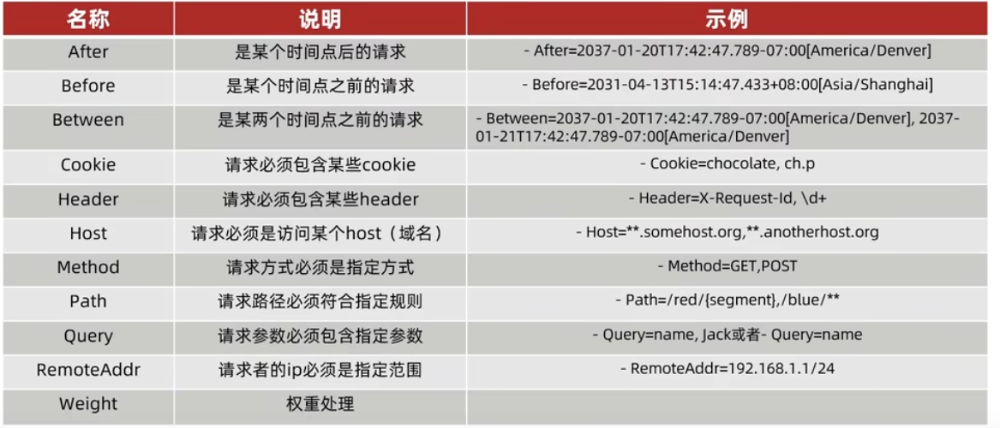

# 微服务

微服务指的是：将一个项目解耦，不同的功能独立存在（每个服务属于一个单独的项目，可以有自己的数据库和计算单元）。每个服务都向外提供接口，如果要使用该服务就发送网络请求，使用对方的接口。

1. 为每个功能创建单独的项目（模块）

2. 创建RestTemplate用来发送网络请求

```
@SpringBootApplication
public class DemoApplication {

    public static void main(String[] args) {
        SpringApplication.run(DemoApplication.class, args);
    }

    @Bean
    @LoadBalanced
    public RestTemplate restTemplate(){
        return new RestTemplate();
    }
}
```

```
@GetMapping("/emp/{id}")
public UserWithOrderResp getEmployeeByID(@PathVariable Integer id){

    Employee emp = helloService.getEmployeeByID(id);

    // get order by id
    String url = "http://localhost:8081/user/" +id;
    ParameterizedTypeReference<List<Order>> responseType = new ParameterizedTypeReference<List<Order>>() {};
    ResponseEntity<List<Order>> responseEntity = restTemplate.exchange(url, HttpMethod.GET, null, responseType);
    List<Order> orders = responseEntity.getBody();

    UserWithOrderResp resp = new UserWithOrderResp();
    resp.setEmployee(emp);
    resp.setOrders(orders);

    return resp;
}
```

注意：正常情况下restTemplate发送URL请求只需要调用getForObject即可，但由于上例的请求会返回一个json数组，无法通过类名直接反序列化，所以代码显得繁琐。

## 服务注册（Eureka）

服务注册的思想很简单：当一个大的项目被拆分为多个小的独立服务后，不同服务之间是要相互调用的，而调用是通过`网络请求`来实现的。发送网络请求需要`IP地址和端口号`，与其在代码中写死IP地址和端口号，利用一个`注册中心`来记录现有的服务会更加灵活。

### Eureka 注册中心

Eureka是一个注册中心的实例，下图是其工作流程


### 创建eureka server

1. 创建spring 项目并且添加 eureka server 依赖


2. 在启动类添加@EnableEurekaServer

```
@SpringBootApplication
@EnableEurekaServer
public class EurekaServerApplication {

	public static void main(String[] args) {
		SpringApplication.run(EurekaServerApplication.class, args);
	}

}
```

3. 设置application.properties

```
server.port = 9090

spring.application.name = eurekaServer
eureka.client.service-url.defaultZone = http://127.0.0.1:${server.port}/eureka/
```

4. 在浏览器输入http://127.0.0.1:9090可以看到注册中心的页面。（注意：URL中没有/eureka/后缀）


### 将服务注册到注册中心

1. 添加依赖

```
<dependency>
    <groupId>org.springframework.cloud</groupId>
    <artifactId>spring-cloud-starter-netflix-eureka-client</artifactId>
    <version>4.1.0</version>
</dependency>
```

注意： 版本可能需要根据spring boot 项目的版本进行修改

2. 修改application.properties

```
// 指明自己服务的名称
spring.application.name = employee-client
// 指明要将服务注册到哪个注册中心
eureka.client.service-url.defaultZone = http://127.0.0.1:9090/eureka/
```

### 注册发现

1. 启动服务，并且检查注册中心是否发现了服务

2. 修改URL，现在可以用注册的服务名来代替IP地址和端口号

```
@GetMapping("/emp/{id}")
public UserWithOrderResp getEmployeeByID(@PathVariable Integer id){

    Employee emp = helloService.getEmployeeByID(id);

    // get order by id
    String url = "http://order-client/user/" +id;
    ParameterizedTypeReference<List<Order>> responseType = new ParameterizedTypeReference<List<Order>>() {};
    ResponseEntity<List<Order>> responseEntity = restTemplate.exchange(url, HttpMethod.GET, null, responseType);
    List<Order> orders = responseEntity.getBody();

    UserWithOrderResp resp = new UserWithOrderResp();
    resp.setEmployee(emp);
    resp.setOrders(orders);

    return resp;
}
```

3. 添加@LoadBalaced注释

```
@Bean
@LoadBalanced
public RestTemplate restTemplate(){
    return new RestTemplate();
}
```

注意：即使该服务只有一个实例，也需要添加@LoadBalanced注释，否则服务名无法被解析为对应的IP地址和端口号。

## 负载均衡

在上述服务注册的过程中，提到了必须要用@LoadBalaced注释，原因就是‘服务名-->IP:PORT’的过程是由Ribbon负载均衡器来负责的。


## Nacos

Nacos是另一款注册中心，由阿里开发，需要从github上下载解压。

### 启动服务
1. 在nacos/bin目录下打开cmd命令行
2. 输入指令

```
startup -m standalone
```
3. 根据提示访问网址，输入默认账号:nacos, 密码：nacos。

### 服务注册

由于Nacos实现了spring cloud的接口，所以只需修改`application.properties`以及在pom文件中添加依赖即可，其它代码无需修改。

由于我使用sping boot 3.2.1 版本，而暂且好像没有对应的nacos可以使用，这部分就先搁置着吧。

## Open Feign

由于 restTemplate 使用起来较为繁琐，open Feign可以更方便地发送网络请求。

1. 添加依赖

```
<dependency>
    <groupId>org.springframework.cloud</groupId>
    <artifactId>spring-cloud-starter-openfeign</artifactId>
    <version>4.1.0</version>
</dependency>
```

注意： 是openfeign 不是 feign

2. 修改启动类

```
@SpringBootApplication
@EnableFeignClients
public class DemoApplication {

    public static void main(String[] args) {
        SpringApplication.run(DemoApplication.class, args);
    }
}
```

3. 创建接口

```
@FeignClient("order-client")
public interface OrderClient {
    @GetMapping("/user/{uid}")
    List<Order> findByID(@PathVariable("uid") int uid);
}
```

该接口用于发送网络请求

4. 使用接口

```
    @GetMapping("/emp/{id}")
    public UserWithOrderResp getEmployeeByID(@PathVariable Integer id){

        Employee emp = helloService.getEmployeeByID(id);

        List<Order> orders = orderClient.findByID(id);

        UserWithOrderResp resp = new UserWithOrderResp();
        resp.setEmployee(emp);
        resp.setOrders(orders);

        return resp;
    }
```

### Feign 性能调优

在应用层对Feign的性能调优就是进行一些设置：

例如配置连接池

1. 添加连接池依赖

```
<dependency>
    <groupId>io.github.openfeign</groupId>
    <artifactId>feign-httpclient</artifactId>
    <version>13.1</version>
</dependency>
```

2. 在application.properties里配置

```
spring.cloud.openfeign.httpclient.max-connections=200
```

### Feign 结构优化
由于多个客户端（消费者）都会访问同一个服务端（提供者），那么着多个客户端都需要定义`相同的`feign接口来向服务端发送http请求。

所以可以将访问服务端需要的feign抽取出来，构建一个单独的模块，每次客户端需要使用直接导入依赖即可。

## GateWay 网关

网关是在微服务前边的一层，可以进行身份认证等功能


### Quick Start

1. 创建spring项目，添加gateway和eureka-client依赖

```
<dependency>
    <groupId>org.springframework.cloud</groupId>
    <artifactId>spring-cloud-starter-gateway</artifactId>
</dependency>

<dependency>
    <groupId>org.springframework.cloud</groupId>
    <artifactId>spring-cloud-starter-netflix-eureka-client</artifactId>
    <version>4.1.0</version>
</dependency>
```

2. 配置gataway项目的application.prorperties文件

```
server.port=10000

spring.application.name = gateway
eureka.client.service-url.defaultZone = http://127.0.0.1:9090/eureka/

spring.cloud.gateway.routes[0].id=empService
spring.cloud.gateway.routes[0].uri=lb://employee-client
spring.cloud.gateway.routes[0].predicates[0]=Path=/emp/**
```

结果就是：访问gateway（也就是10000端口）时，会根据路由规则（predicates）进行重定位。

### 断言/过滤 工厂

断言工厂（Predicate Factory）用来对predicate声明的字符串进行真正的判断。（也可以当作是不同的断言规则）



类似的，也有过滤工厂，用来对请求进行过滤或者修改。

例如添加请头，直接修改application.properties文件就行
```
spring.cloud.gateway.routes[0].filters[0]=AddRequestHeader=TestHead, This is a test head
```

### Global Filter
除了使用过滤工厂，也可以自定义类来创建过滤操作，该类需要实现GlobalFilter接口

```
@Order(0)
@Component
public class Authentication implements GlobalFilter {
    @Override
    public Mono<Void> filter(ServerWebExchange exchange, GatewayFilterChain chain) {
        ServerHttpRequest request = exchange.getRequest();
        MultiValueMap<String,String > params = request.getQueryParams();
        String auth = params.getFirst("Authen");
        if("adimin".equals(auth)){
            return chain.filter(exchange);
        }
        exchange.getResponse().setStatusCode(HttpStatus.UNAUTHORIZED);
        return exchange.getResponse().setComplete();
    }
}
```

### Filter 执行顺序
上述讲了三种过滤器：路由过滤器；default filter和global filter。其中global filter 可以通过@Order指定顺序，而default filter 和 路由过滤器通过声明顺序，分别从1开始递增排序。

如果order值相同，路由过滤器(优先于)>default filter>global filter。


## Message Queue

微服务之间的通信自然要使用异步通信，但Feign本身是同步通讯的。为了实现异步通信，可以添加一个中间层Broker来接受并缓存支付服务的消息，然后Broker负责通知其它服务。


### RabbitMQ Quick Start
RabbitMQ是一个实现

1. 在docker拉取RabbitMQ

```
docker pull rabbitmq:3-management
```

2. 创建容器

```
docker run -e RABBITMQ_DEFAULT_USER=cyw -e RABBITMQ_DEFAULT_PASS=123456 --name RabbitMQ -h mq1 -p 15672:15672 -p 5672:5672 -d rabbitmq:3-management
```

3. 打开浏览器输入 `localhost:15672/` 来验证

