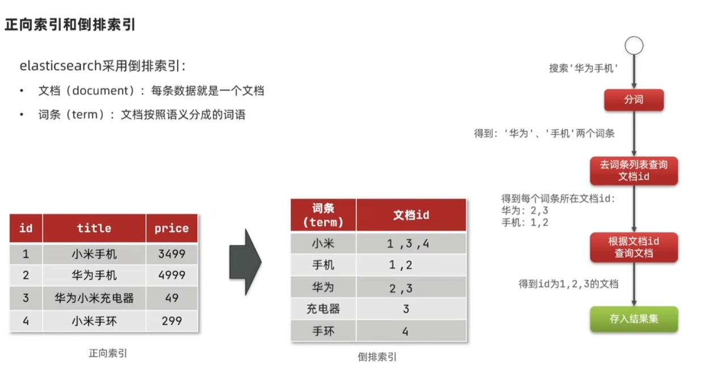

## 微服务

微服务指的是：将一个项目解耦，不同的功能独立存在。每个服务属于一个单独的项目，可以有自己的数据库并且部署到一个单独的服务器上。每个服务都向外提供接口，如果要使用该服务就发送网络请求，使用对方的接口。

相较于单体架构（整个项目打成一个jar包），微服务有以下优势：

* 方便团队协助，不同团队负责不同服务，减少冲突
* 性能提升，每个服务有自己的服务器

### 如何拆分为微服务

当我们要设计微服务项目或者将单体项目拆分为微服务项目，我们需要知道微服务拆分的目标：

1. 单一职责：每个模块只负责一个职责，日后需要修改只需要某个功能只需要修改一个小模块就行。
2. 高内聚，低耦合：模块也不能拆的太小，不然模块之间的耦合会很高，需要处理复杂的模块间通信。

此外还有拆分方式：

1. 横向拆分：按照不同的业务逻辑拆分，例如用户模块，商品模块
2. 纵向拆分：将多个流程中的公共部分提取出来为一个模块，例如登录功能。

## Quick Start

1. 为每个功能创建单独的项目（模块）

2. 创建RestTemplate用来发送网络请求

```
@SpringBootApplication
public class DemoApplication {

    public static void main(String[] args) {
        SpringApplication.run(DemoApplication.class, args);
    }

    @Bean
    @LoadBalanced
    public RestTemplate restTemplate(){
        return new RestTemplate();
    }
}
```

```
@GetMapping("/emp/{id}")
public UserWithOrderResp getEmployeeByID(@PathVariable Integer id){

    Employee emp = helloService.getEmployeeByID(id);

    // get order by id
    String url = "http://localhost:8081/user/" +id;
    ParameterizedTypeReference<List<Order>> responseType = new ParameterizedTypeReference<List<Order>>() {};
    ResponseEntity<List<Order>> responseEntity = restTemplate.exchange(url, HttpMethod.GET, null, responseType);
    List<Order> orders = responseEntity.getBody();

    UserWithOrderResp resp = new UserWithOrderResp();
    resp.setEmployee(emp);
    resp.setOrders(orders);

    return resp;
}
```

注意：正常情况下restTemplate发送URL请求只需要调用getForObject即可，但由于上例的请求会返回一个json数组，无法通过类名直接反序列化，所以代码显得繁琐。

## Spring Cloud

Spring Cloud是一套解决方案，旨在解决微服务项目中会遇到的问题。Spring Cloud包含了很多项目，而Spring Cloud本身可以看作是一套规范。例如服务注册，网关等等，每个项目都是由不同公司研发的，但是要遵循Spring Cloud提供的规范才行。

Spring Cloud也是基于Spring Boot的，单个微服务的开发当然要用Spring Boot，而Spring Cloud提供的项目也是基于Spring Boot的。

## 服务注册（Eureka）

服务注册的思想很简单：当一个大的项目被拆分为多个小的独立服务后，不同服务之间是要相互调用的，而调用是通过`网络请求`来实现的。发送网络请求需要`IP地址和端口号`，与其在代码中写死IP地址和端口号，利用一个`注册中心`来记录现有的服务会更加灵活。

### Eureka 注册中心

Eureka是一个注册中心的实例，下图是其工作流程


### 创建eureka server

1. 创建spring 项目并且添加 eureka server 依赖


2. 在启动类添加@EnableEurekaServer

```
@SpringBootApplication
@EnableEurekaServer
public class EurekaServerApplication {

	public static void main(String[] args) {
		SpringApplication.run(EurekaServerApplication.class, args);
	}

}
```

3. 设置application.properties

```
server.port = 9090

spring.application.name = eurekaServer
eureka.client.service-url.defaultZone = http://127.0.0.1:${server.port}/eureka/
```

4. 在浏览器输入http://127.0.0.1:9090可以看到注册中心的页面。（注意：URL中没有/eureka/后缀）


### 将服务注册到注册中心

1. 添加依赖

```
<dependency>
    <groupId>org.springframework.cloud</groupId>
    <artifactId>spring-cloud-starter-netflix-eureka-client</artifactId>
    <version>4.1.0</version>
</dependency>
```

注意： 版本可能需要根据spring boot 项目的版本进行修改

2. 修改application.properties

```
// 指明自己服务的名称
spring.application.name = employee-client
// 指明要将服务注册到哪个注册中心
eureka.client.service-url.defaultZone = http://127.0.0.1:9090/eureka/
```

### 注册发现

1. 启动服务，并且检查注册中心是否发现了服务

2. 修改URL，现在可以用注册的服务名来代替IP地址和端口号

```
@GetMapping("/emp/{id}")
public UserWithOrderResp getEmployeeByID(@PathVariable Integer id){

    Employee emp = helloService.getEmployeeByID(id);

    // get order by id
    String url = "http://order-client/user/" +id;
    ParameterizedTypeReference<List<Order>> responseType = new ParameterizedTypeReference<List<Order>>() {};
    ResponseEntity<List<Order>> responseEntity = restTemplate.exchange(url, HttpMethod.GET, null, responseType);
    List<Order> orders = responseEntity.getBody();

    UserWithOrderResp resp = new UserWithOrderResp();
    resp.setEmployee(emp);
    resp.setOrders(orders);

    return resp;
}
```

3. 添加@LoadBalaced注释

```
@Bean
@LoadBalanced
public RestTemplate restTemplate(){
    return new RestTemplate();
}
```

注意：即使该服务只有一个实例，也需要添加@LoadBalanced注释，否则服务名无法被解析为对应的IP地址和端口号。

## 负载均衡

在上述服务注册的过程中，提到了必须要用@LoadBalaced注释，原因就是‘服务名-->IP:PORT’的过程是由Ribbon负载均衡器来负责的。


## Nacos

Nacos是另一款注册中心，由阿里开发，需要从github上下载解压。

### 启动服务
1. 在nacos/bin目录下打开cmd命令行
2. 输入指令

```
startup -m standalone
```
3. 根据提示访问网址，输入默认账号:nacos, 密码：nacos。

### 服务注册

由于Nacos实现了spring cloud的接口，所以只需修改`application.properties`以及在pom文件中添加依赖即可，其它代码无需修改。

由于我使用sping boot 3.2.1 版本，而暂且好像没有对应的nacos可以使用，这部分就先搁置着吧。

## Open Feign

由于 restTemplate 使用起来较为繁琐，open Feign可以更方便地发送网络请求。

1. 添加依赖

```
<dependency>
    <groupId>org.springframework.cloud</groupId>
    <artifactId>spring-cloud-starter-openfeign</artifactId>
    <version>4.1.0</version>
</dependency>
```

注意： 是openfeign 不是 feign

2. 修改启动类

```
@SpringBootApplication
@EnableFeignClients
public class DemoApplication {

    public static void main(String[] args) {
        SpringApplication.run(DemoApplication.class, args);
    }
}
```

3. 创建接口

```
@FeignClient("order-client")
public interface OrderClient {
    @GetMapping("/user/{uid}")
    List<Order> findByID(@PathVariable("uid") int uid);
}
```

该接口用于发送网络请求

4. 使用接口

```
    @GetMapping("/emp/{id}")
    public UserWithOrderResp getEmployeeByID(@PathVariable Integer id){

        Employee emp = helloService.getEmployeeByID(id);

        List<Order> orders = orderClient.findByID(id);

        UserWithOrderResp resp = new UserWithOrderResp();
        resp.setEmployee(emp);
        resp.setOrders(orders);

        return resp;
    }
```

### Feign 性能调优

在应用层对Feign的性能调优就是进行一些设置：

例如配置连接池

1. 添加连接池依赖

```
<dependency>
    <groupId>io.github.openfeign</groupId>
    <artifactId>feign-httpclient</artifactId>
    <version>13.1</version>
</dependency>
```

2. 在application.properties里配置

```
spring.cloud.openfeign.httpclient.max-connections=200
```

### Feign 结构优化
由于多个客户端（消费者）都会访问同一个服务端（提供者），那么着多个客户端都需要定义`相同的`feign接口来向服务端发送http请求。

所以可以将访问服务端需要的feign抽取出来，构建一个单独的模块，每次客户端需要使用直接导入依赖即可。

## GateWay 网关

网关是在微服务前边的一层，可以进行身份认证等功能


### Quick Start

1. 创建spring项目，添加gateway和eureka-client依赖

```
<dependency>
    <groupId>org.springframework.cloud</groupId>
    <artifactId>spring-cloud-starter-gateway</artifactId>
</dependency>

<dependency>
    <groupId>org.springframework.cloud</groupId>
    <artifactId>spring-cloud-starter-netflix-eureka-client</artifactId>
    <version>4.1.0</version>
</dependency>
```

2. 配置gataway项目的application.prorperties文件

```
server.port=10000

spring.application.name = gateway
eureka.client.service-url.defaultZone = http://127.0.0.1:9090/eureka/

spring.cloud.gateway.routes[0].id=empService
spring.cloud.gateway.routes[0].uri=lb://employee-client
spring.cloud.gateway.routes[0].predicates[0]=Path=/emp/**
```

结果就是：访问gateway（也就是10000端口）时，会根据路由规则（predicates）进行重定位。

### 断言/过滤 工厂

断言工厂（Predicate Factory）用来对predicate声明的字符串进行真正的判断。（也可以当作是不同的断言规则）


类似的，也有过滤工厂，用来对请求进行过滤或者修改。

例如添加请头，直接修改application.properties文件就行
```
spring.cloud.gateway.routes[0].filters[0]=AddRequestHeader=TestHead, This is a test head
```

### Global Filter
除了使用过滤工厂，也可以自定义类来创建过滤操作，该类需要实现GlobalFilter接口

```
@Order(0)
@Component
public class Authentication implements GlobalFilter {
    @Override
    public Mono<Void> filter(ServerWebExchange exchange, GatewayFilterChain chain) {
        ServerHttpRequest request = exchange.getRequest();
        MultiValueMap<String,String > params = request.getQueryParams();
        String auth = params.getFirst("Authen");
        if("adimin".equals(auth)){
            return chain.filter(exchange);
        }
        exchange.getResponse().setStatusCode(HttpStatus.UNAUTHORIZED);
        return exchange.getResponse().setComplete();
    }
}
```

### Filter 执行顺序
上述讲了三种过滤器：路由过滤器；default filter和global filter。其中global filter 可以通过@Order指定顺序，而default filter 和 路由过滤器通过声明顺序，分别从1开始递增排序。

如果order值相同，路由过滤器(优先于)>default filter>global filter。


## Message Queue

微服务之间的通信自然要使用异步通信，但Feign本身是同步通讯的。为了实现异步通信，可以添加一个中间层Broker来接受并缓存支付服务的消息，然后Broker负责通知其它服务。


### RabbitMQ Quick Start
RabbitMQ是一个实现

1. 在docker拉取RabbitMQ

```
docker pull rabbitmq:3-management
```

2. 创建容器

```
docker run -e RABBITMQ_DEFAULT_USER=cyw -e RABBITMQ_DEFAULT_PASS=123456 --name RabbitMQ -h mq1 -p 15672:15672 -p 5672:5672 -d rabbitmq:3-management
```

3. 打开浏览器输入 `localhost:15672/` 来验证

### Spring AMQP

AMQP 是 Advanced Message Queue Protocol,是独立于平台和程序的一套消息队列协议。 而Spring AMQP则是在spring框架中基于该协议定义了一套API。Spring AMQP包含两部分：Spring-amqp是基础抽象，而spring-rabbit是基于rabbitMQ的实现。

#### 简单队列 Quick Start

1. 添加依赖

```
<dependency>
    <groupId>org.springframework.boot</groupId>
    <artifactId>spring-boot-starter-amqp</artifactId>
</dependency>
```

2. 修改配置文件
```
spring.rabbitmq.host=localhost
spring.rabbitmq.port=5672
spring.rabbitmq.username=cyw
spring.rabbitmq.password=123456
spring.rabbitmq.virtual-host=/
```

3. 生产者发送消息

```
@SpringBootTest
class DemoApplicationTests {
    @Autowired
    private RabbitTemplate rabbitTemplate;

    @Test
    void sendMessage2SimpleQueue(){
        String queue = "Simple.queue";
        String message = "hello world";
        rabbitTemplate.convertAndSend(queue,message);
    }
}
```

4. 消费者接受消息

```
@Component
public class MQListener {
    @RabbitListener(queues = "Simple.queue")
    public void simpleQueuePrint(String message){
        System.out.println("Simple queue receive message: "+message);
    }
}
```

消费者需要创建一个类，然后注册为bean交给spring管理。Spirng监听Simple.queue队列，如果有消息就调用对应方法。

#### 工作队列

工作队列是RabbitMQ中另一种模型，它和简单队列相比区别不大。只是简单队列假设只有一个消费者，而工作队列假设有多个消费者。

```
@Component
public class MQListener {
    @RabbitListener(queues = "Simple.queue")
    public void simpleQueuePrint(String message) throws InterruptedException {
        System.out.println("Consumer1: Simple queue receive message: "+message);
        Thread.sleep(20);
    }

    @RabbitListener(queues = "Simple.queue")
    public void simpleQueuePrint2(String message) throws InterruptedException {
        System.err.println("Consumer2: Simple queue receive message: "+message);
        Thread.sleep(100);
    }
}
```

这里两个消费者的性能不同，被分配了相同数量的消息，这是因为RabbitMQ的消息预取机制，可在设置文件里修改，从而根据消费者的实际处理性能来分配消息。

```
spring.rabbitmq.listener.simple.prefetch=1
```

#### 发布，订阅模型

上述的两种模型都是publisher直接将消息发送到队列中，而队列中的每条消息只能给一个消费者。如果要一条消息发送给多个消费者，则需要多个队列。为此，可以添加一个exchange来负责管理队列，publisher只需要将消息发送给exchange。（注意：exchange并不存储消息，消息只在队列存储）


#### Fanout exchange

1. 消费者创建exchange和queues，并将其绑定到exchange

```
@Configuration
public class ExchangeConfiguration {
    @Bean
    public FanoutExchange createFanoutExchange(){
        return new FanoutExchange("cc.fanout");
    }

    @Bean
    public Queue Queue1(){
        return new Queue("fanout.queue1");
    }

    @Bean
    public Queue Queue2(){
        return new Queue("fanout.queue2");
    }

    @Bean
    public Binding bindQueue1(Queue Queue1, FanoutExchange createFanoutExchange){
        return BindingBuilder.bind(Queue1).to(createFanoutExchange);
    }

    @Bean
    public Binding bindQueue2(Queue Queue2, FanoutExchange createFanoutExchange){
        return BindingBuilder.bind(Queue2).to(createFanoutExchange);
    }
}
```

2. 消费者监听队列

```
@RabbitListener(queues = "fanout.queue1")
public void fanoutQueuePrint1(String message) {
    System.err.println("Consumer1: fanout queue1 receive message: "+message);
}

@RabbitListener(queues = "fanout.queue2")
public void fanoutQueuePrint2(String message) {
    System.err.println("Consumer2: fanout queue2 receive message: "+message);
}
```

3. 生产者向exchange发送消息

```
@Test
void sendMessage2FanoutQueue() {
    String exchange = "cc.fanout";
    String message = "hello every";
    rabbitTemplate.convertAndSend(exchange,"",message);
}
```

#### Direct Exchange

与Fanout 不同的是， Direct exchange使用了binding key 和 routing key 来对绑定到exchange的queues进行分组。

1. 创建exchange,queue和binding，并且监听对应queue。（无需写配置类，直接在@RabbitListener注解中直接创建）

```
@RabbitListener(bindings = @QueueBinding(
        value = @Queue(name = "direct.queue1"),
        exchange = @Exchange(name = "cc.direct", type = ExchangeTypes.DIRECT),
        key = {"key1", "key2"}
))
public void directQueuePrint1(String message){
    System.out.println("Consumer1: direct queue1 receives: "+message);
}

@RabbitListener(bindings = @QueueBinding(
        value = @Queue(name = "direct.queue2"),
        exchange = @Exchange(name = "cc.direct", type = ExchangeTypes.DIRECT),
        key = {"key3", "key2"}
))
public void directQueuePrint2(String message){
    System.out.println("Consumer2: direct queue2 receives: "+message);
}
```

2. 生产者发送消息

```
@Test
void sendMessage2DirectExchange() {
    String exchange = "cc.direct";
    String m1 = "Key1 message";
    String m2 = "Key2 message";
    String m3 = "Key3 message";
    rabbitTemplate.convertAndSend(exchange,"key1",m1);
    rabbitTemplate.convertAndSend(exchange,"key2",m2);
    rabbitTemplate.convertAndSend(exchange,"key3",m3);
}
```

#### Topic exchange

Topic exchange和Direct exchange没有什么差别，只是Direct exchange 使用key列表来进行分组；而Topic exchange只使用一个key。这个可以要求格式为domain1.domain2...，例如China.news。而消费者可以使用通配符来选择接收哪些消息，例如#.news。

```
@RabbitListener(bindings = @QueueBinding(
        value = @Queue(name = "topic.queue1"),
        exchange = @Exchange(name = "cc.topic", type = ExchangeTypes.TOPIC),
        key = "#.news"
))
public void TopicQueuePrint1(String message){
    System.out.println("Consumer1: topic queue1 receives: "+message);
}
```

```
@Test
void sendMessage2TopicExchange() {
    String exchange = "cc.topic";
    String m1 = "Message about China's news";
    String m2 = "Message about America's news";
    rabbitTemplate.convertAndSend(exchange,"China.news",m1);
    rabbitTemplate.convertAndSend(exchange,"America.news",m2);
}
```

### 消息类型转换

在发消息的过程中，除了字符串类型还可以发任意Object类型，只需要保证发送者和接收者使用的类型相同即可，无需我们实现类型转换。

在spring底层默认使用JDK序列化和反序列化，但是也可以导入包来用json格式来传输数据。

## Elastic Search 搜索

### 倒排索引



倒排索引就是将`常见搜索内容`划分为`词条`(term)，然后对词条创建索引。这样用户进行搜索的时候也是将`搜索内容`划分为词条，然后快速搜索。

### 创建ES

1. docker pull image
2. 创建容器

```
docker run -d --name es -e "discovery.type=single-node" --privileged --network Mynet -p 9200:9200 -p 9300:9300 elasticsearch:7.12.1
```

3. 打开localhost:9200测试

### 创建Kibana

1. 下载和ES版本相同的image
2. 创建容器

```
docker run -d --name kibana -e ELASTICSEARCH_HOSTS=http://es:9200 --network=Mynet -p5601:5601 kibana:7.12.1
```

3. 打开 localhost:5601测试

### ES 创建索引库（也就是数据库）

创建索引库时，需要设置索引库的格式，就像mysql create table要声明变量和变量类型一样。

下列是一下常见关键字


示例

```
PUT /heima
{
  "mappings": {
    "properties": {
      "info":{
        "type": "text",
        "analyzer": "standard"
      },
      "email":{
        "type": "keyword"
      }
    }
  }
}
```

### 查看、修改、删除索引库

个人感觉ES属于NoSQL，而且ES是基于索引的，所以对原有索引库的修改是不允许的，但是允许添加新字段。

```
GET /[索引库名]

PUT /[索引库名]/_mapping
{
  "properties":{
    "age":{
      "type" : "integer"
    }
  }
}

DELETE /[索引库名]
```

### 增删改查文档

文档就是索引库中的数据

```
// 添加
// 修改整个文档
POST /[索引库名]/_doc/[文档ID]
{
  "info":"A teacher from Hong Kong University",
  "email":"xx@connect.hku.hk",
  "age":"55"
}

// 修改部分文档
POST /[索引库名]/_update/[文档ID]
{
    "doc":{
        key:value
    }
}

// 查看
GET /heima/_doc/1

// 删除
DELETE /heima/_doc/1
```

### 查询文档
```
# 查询全部
GET /person/_search
{
  "query": {
    "match_all": {}
  }
}

# 单字段查询
GET /person/_search
{
  "query": {
    "match": {
      "name": "Cao"
    }
  }
}

# 多字段查询
GET /person/_search
{
  "query": {
    "multi_match": {
      "query": "com yuwei",
      "fields": ["name","email"]
    }
  }
}

# 精确查询
GET /person/_search
{
  "query": {
    "term": {
      "age": {
        "value": "12"
      }
    }
  }
}

# 范围查询
GET /person/_search
{
  "query": {
    "range": {
      "age": {
        "gte": 10,
        "lte": 30
      }
    }
  }
}

```

### 修改算分函数


### 在JAVA中使用ES

#### Quick Start
1. 引入依赖

```
<dependency>
    <groupId>org.elasticsearch.client</groupId>
    <artifactId>elasticsearch-rest-high-level-client</artifactId>
    <version>7.12.1</version>
</dependency>

// 覆盖父工程版本
<elasticsearch-client.version>7.12.1</elasticsearch-client.version>
```

2. 创建常量类来存储请求语句
```
public class ESConstant {
    public static final String createPersonIndex ="{\n" +
            "  \"mappings\": {\n" +
            "    \"properties\": {\n" +
            "      \"name\":{\n" +
            "        \"type\": \"text\",\n" +
            "        \"analyzer\": \"standard\"\n" +
            "      },\n" +
            "      \"email\":{\n" +
            "        \"type\": \"keyword\"\n" +
            "      },\n" +
            "      \"age\":{\n" +
            "        \"type\": \"integer\"\n" +
            "      }\n" +
            "    }\n" +
            "  }\n" +
            "}";
}
```

3. 创建restClient对象，构建请求并发送

```
void ESTest() throws IOException {
    // 初始化restClient
    RestHighLevelClient restClient = new RestHighLevelClient(RestClient.builder(
            HttpHost.create("http://localhost:9200")
    ));

    // 1. 创建Request对象
    CreateIndexRequest request = new CreateIndexRequest("person");
    // 2. 声明Request语句
    request.source(ESConstant.createPersonIndex, XContentType.JSON);
    // 3. 发送Request请求
    restClient.indices().create(request, RequestOptions.DEFAULT);
}
```

#### 删除索引库、查看索引库是否存在

```
// 删除索引库
DeleteIndexRequest request = new DeleteIndexRequest("person");;
restClient.indices().delete(request, RequestOptions.DEFAULT);

// 查看索引库是否村子
GetIndexRequest request = new GetIndexRequest("person");;
boolean exist = restClient.indices().exists(request, RequestOptions.DEFAULT);
```

#### 插入文档

```
// 1. 创建Request对象
IndexRequest request = new IndexRequest("person").id("1");
// 2. 添加请求内容
request.source("{\"name\":\"cyw\",\"email\":\"cyw@qq.com\",\"age\":20}",XContentType.JSON);
// 3. 发送Request请求
restClient.index(request,RequestOptions.DEFAULT);
```

**注意**：这里request.source其实就是json类型的字符串而已。在实际应用中，可以用类来存储数据，并且用json插件直接将类转为json字符串即可。这样也方便程序使用。

#### 查看文档
```
// 查看文档
GetRequest request = new GetRequest("person").id("1");
GetResponse response = restClient.get(request,RequestOptions.DEFAULT);
System.out.println(response.getSourceAsString());

// 更新文档
UpdateRequest request = new UpdateRequest("person", "1");
request.doc("name","Caoyuwei");
restClient.update(request,RequestOptions.DEFAULT);

// 删除文档
DeleteRequest request = new DeleteRequest("person", "1");
restClient.delete(request,RequestOptions.DEFAULT);
```