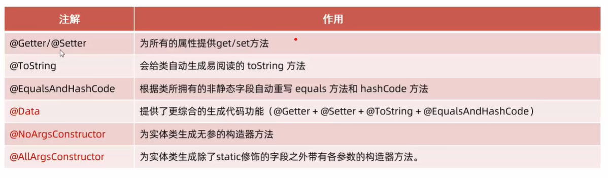

## 基本信息
Mybatis 是DAO层的框架，它可以被springboot框架整合，从而便捷操作数据库。

## 框架创建流程
1. `ctrl+shift+p`打开命令，输入initialize springboot,根据提示构建项目
2. 注意：要选择**对应jdk版本的**springboot版本；连接mysql需要添加**mybatis framework**和**mySQL driver**两个依赖。
3. 在src\main\resources\application.properties中填写数据库配置信息：

        spring.datasource.driver-class-name=com.mysql.cj.jdbc.Driver
        spring.datasource.url=jdbc:mysql://localhost:3306/db01
        spring.datasource.username=root
        spring.datasource.password=123456

4. 创建一个包，里边包含数据库表对应的类。之后从数据库读取一个表的信息后，将自动创建表对应的类，并且将数据存储到类中
5. 创建另一个包，里边是实体类的Mapper

        package com.example.demo.Mapper;

        import org.apache.ibatis.annotations.Mapper;
        import org.apache.ibatis.annotations.Select;
        import java.util.List;
        import com.example.demo.Table.User;

        @Mapper
        public interface UserMapper {
            @Select("select * from user")
            public List<User> list();
        }

## Mapper
从上述流程可知，使用框架除了简单的配置信息外，就是在Mapper中使用查询语句了。

@Mapper注解修饰接口，在程序运行时，框架会自动实现接口，并放到IOC容器中。

Mapper修饰的类中有各种被修饰的方法，来实现sql的增删改查操作。

### 增加
````
@Insert("insert into user( name, gender) values " +
        "( #{name}, #{gender})")
public int insert(User user);
````
如果sql语句错误，例如主键重复，程序也会报错。

#{name}和#{gender}是User的成员变量，可以直接写，不需要get方法。

如果有返回值，就是数据库被影响的条数。

### 增加-主键返回
有时在插入后，我们需要返回主键，则需要添加注释@potions
````
@Options(keyProperty = "id", useGeneratedKeys = true)
@Insert("insert into user( name, gender) values " +
        "( #{name}, #{gender})")
public int insert(User user);
````

````
@Test
public void insertTest(){
    User u = new User(1, "user", "g");
    int num = userMapper.insert(u);
    System.out.println("id is "+u.getId());
}
````
这样新增条目的主键会被赋值到User的id变量中。

### 删除
````
@Delete("delete from user where id=#{id}")
public void delete(int id);
````

### 修改
````
@Update("update user set name = #{newname} where name = 'newname'")
public void update(String newName);
````

### 查找
````
@Select("select * from user")
public List<User> list();
````
User的成员变量需要和查询到的数据列数和名称一一对应，User也需要设置get/set方法。这样查询到的数据会自动封装为User，并且封装到List中。

### XML 文件
除了直接用标注外，还可以使用XML配置sql语句。具体请看：https://www.bilibili.com/video/BV1m84y1w7Tb?p=130

### 动态sql
对于sql语句，除了用参数替换值外，还可以通过if，for，等标签来动态构造，具体怎么做等用到在查。


## 数据库预编译和拼接
### 预编译
预编译的语句是 #{变量}

    @Mapper
    public interface EmpMapper {
       @Delete("delete from employee where uid=#{id}")
       public int delete(Integer id);
    }

输出的日志为
````
==>  Preparing: delete from employee where uid=?
==> Parameters: 1(Integer)
<==    Updates: 0
````

其优势为：`性能高`，没有`sql注入问题`

### 拼接
直接进行变量和sql语句的字符串拼接：${变量}
````
@Mapper
public interface EmpMapper {
    @Delete("delete from employee where uid=${id}")
    public int delete(Integer id);
}
````
输出日志为
````
==> Preparing: delete from employee where uid=1
==> Parameters: 
<== Updates: 0
````
有`sql注入问题`，使用场景不多。

上述两个操作的返回值是：该sql操作影响的数据数目。

## 数据库连接池
执行sql语句前，程序需要先和数据库建立连接。在框架中这步骤被隐藏了，但是在jdbc中可以看到详细的过程。为了优化数据库连接的创建和释放，提出了数据库连接池的概念。

1. 数据库连接池是一个容器，负责分配和管理`连接(conncection)`。
2. 它允许程序重复使用现有的连接，而不是每次使用都要创建和释放。
3. 如果用户占有连接但没有使用，超过一定时间，连接池会自动将其收回。

连接池接口：DataSource

连接池产品：C2P0，DBCP等，springboot默认的是Hikari。

指定连接池：在pom中添加连接池的dependency，即自动切换为该连接池。例如：
````
<!-- 数据库连接池 -->
<dependency>
    <groupId>com.alibaba</groupId>
    <artifactId>druid-spring-boot-starter</artifactId>
    <version>1.2.20</version>
</dependency>
````
会将连接池切换为阿里的Druid。

## Lombok
Lombok是一个java类，能通过`注解`自动生成构造器，get/set，toString等方法。

### 添加依赖
````    
<!-- lombok-->
<dependency>
    <groupId>org.projectlombok</groupId>
    <artifactId>lombok</artifactId>
</dependency>
````

### 使用方式
````
@Data
public class User {
    private Integer id;
    private String name;
    private String gender;
}
````

### 注解类型

添加@Data后，程序会在编译阶段自动添加get/set/toString方法

