## 认识Redis

Redis诞生于2009年全称是Remote Dictionary Server,远程词典服务器,是一个基于内存的键值型NoSQL数据库。

特征:

● 键值(key-value)型,value支持多种不同数据结构,功能丰富

● 单线程,每个命令具备原子性

● 低延迟,速度快(基于内存、I0多路复用、良好的编码)。

● 支持数据持久化

● 支持主从集群、分片集群

● 支持多语言客户端

## 安装REDIS

可以在docker上直接pull redis的image，然后设置一个端口运行container即可，非常方便。教程：https://www.runoob.com/docker/docker-install-redis.html

redis本身是一个数据库服务器，之前的docker运行时会自动运行服务端，但它还需要一个客户端跟它交互，就跟MYSQL一样。而container也包含了客户端程序：redis-cli

启动客户端可以直接在docker container里运行

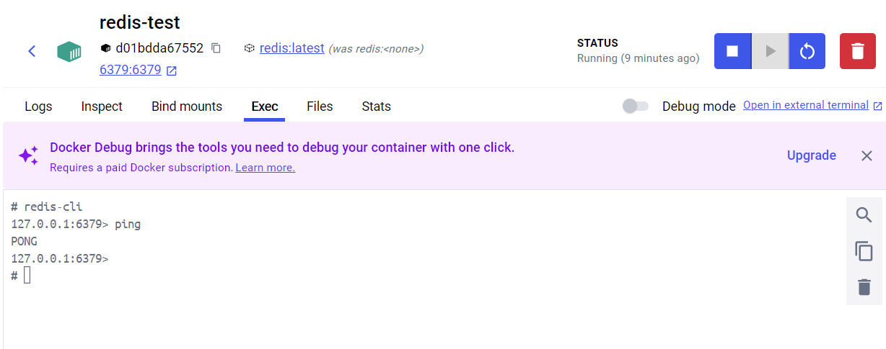

也可以用命令行连接到container中进行交互

```
// 连接到docker
docker exec -it redis-test /bin/bash

// 运行cli
redis-cli
```

## Redis数据结构及基本操作

redis中数据由key - value键值对构成，其中key类型一般为string,而value类型则多种多样。以下是一些常见的VALUE类型：

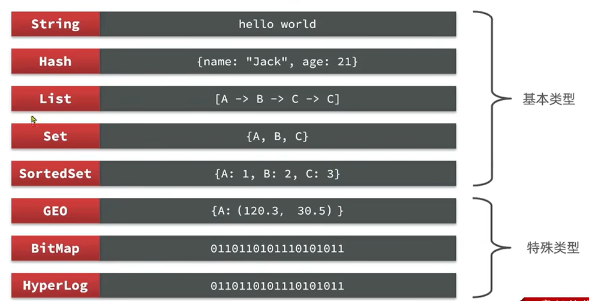

每个数据类型都对应一组操作，可以通过命令help查看，也可以在官网查看 https://redis.io/docs/latest/commands/

### Key的层级

REDIS中的KEY要求独一无二的，所以开发中常常用ID来作为KEY。然而用户和商品可能有相同的ID，为此REDIS提出KEY的层级结构，并以：作为分隔符，例如

```
set user:1 user1JSON
set product:1 prod1JSON
```

### String

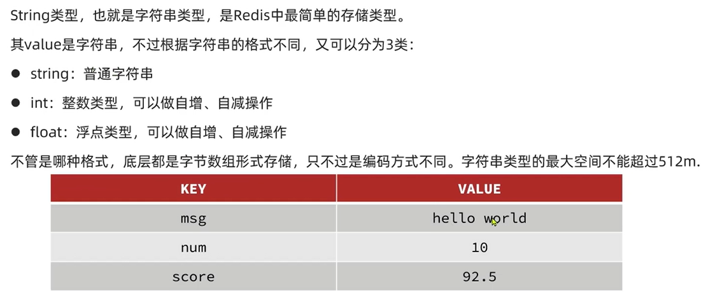

String类型也包含了int和float，只不过它们底层根据二进制编码存储到字节数组中而已。

String的常见命令有:

* SET:添加或者修改已经存在的一个String类型的键值对
* GET:根据key获取String类型的value
* MSET:批量添加多个String类型的
* MGET:根据多个key获取多个String类型的value
* INCR:让一个整型的key自增
* INCRBY:让一个整型的key自增并指定步长,例如:incrby num 2
* INCRBYFLOAT:让一个浮点类型的数字自增并指定步长
* SETNX:添加一个String类型的键值对,前提是这个key不存在,否则不生效
* SETEX:添加一个String类型的键值对,并且指定有效期

### Hash

当VALUE为HASH类型时，VALUE不是整体的一个字符串，而是一组键值对。

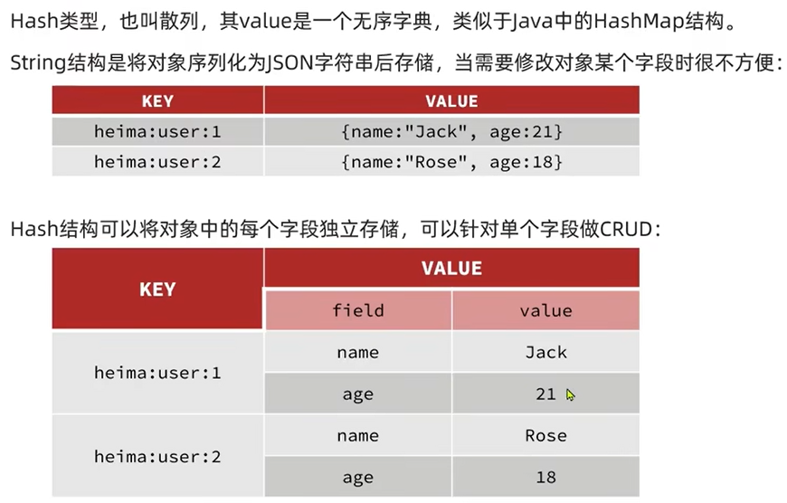

Hash的常见命令有:

* HSET:添加或者修改hash类型key的field的值
* HGET:获取一个hash类型key的field的值
* HMSET:批量添加多个hash类型key的field的值
* HMGET:批量获取多个hash类型key的field的值
* HGETALL:获取一个hash类型的key中的所有的field和value
* HKEYS:获取一个hash类型的key中的所有的field
* HVALS:获取一个hash类型的key中的所有的value
* HINCRBY:让一个hash类型key的字段值自增并指定步长
* HSETNX:添加一个hash类型的key的field值,前提是这个field不存在,否则不执行

### List

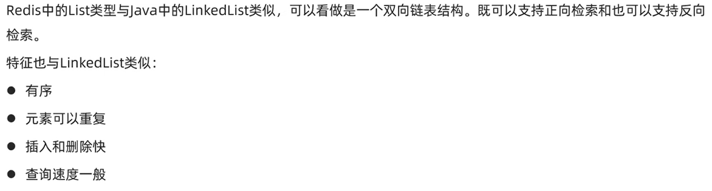

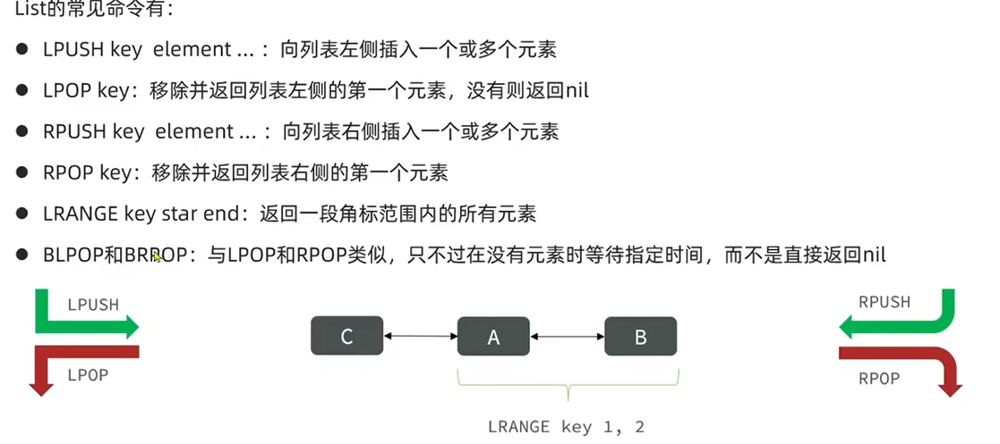

### Set


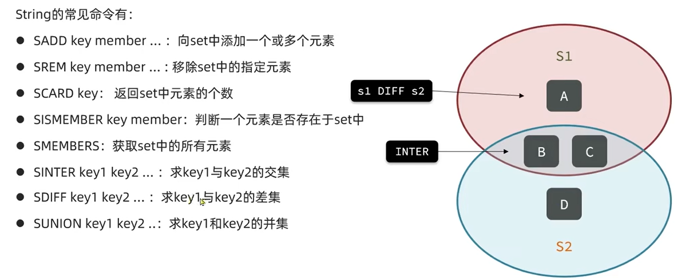


### Sorted Set

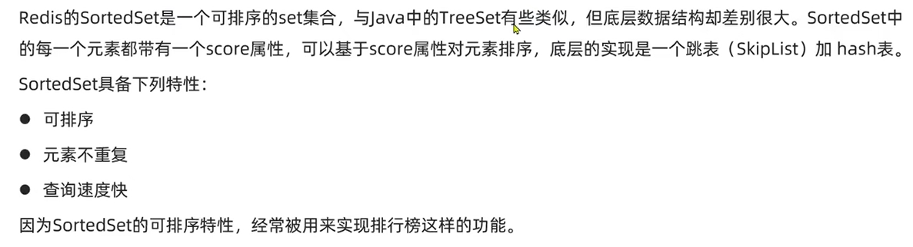

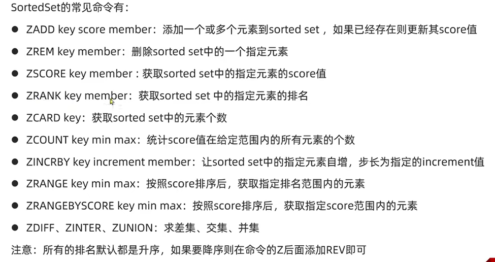

## Redis全局命令

### 查看

在 Redis 中，数据是以键值对的形式存储的，没有传统意义上的“数据表”。不过，你可以使用一些命令来查看 Redis 中的所有键或特定类型的键。以下是一些常用命令：

**查看所有键**：
```
KEYS *
```

**使用模式匹配查看特定键**：
```
KEYS prefix:*
```

**查看TTL**
```
TTL KEY_NAME
```

### 删除

**删除单个**
```
DEL key_name
```

**删除多个**
```
DEL key1 key2 key3
```

**按照格式删除**
```
// 只能在命令行里通过管道进行操作
redis-cli KEYS "your_prefix*" | xargs redis-cli DEL
```


## JAVA客户端--JEDIS

jedis是java和redis的合称，它是一个java客户端，提供API来连接并操作REDIS服务器。其特点为API和redis-cli中使用的方法名称和参数几乎一致，方便上手。

### quick start

1. 添加依赖
```maven
<dependency>
    <groupId>redis.clients</groupId>
    <artifactId>jedis</artifactId>
    <version>5.2.0</version>
</dependency>
```

2. 建立连接并测试
```java
class JedisQuickStartApplicationTests {
    Jedis jedis;

    @BeforeEach
    void setUp() {
        // 连接到redis服务器
        jedis = new Jedis("127.0.0.1", 6379);
        // 选择库
        jedis.select(0);
    }

    @AfterEach
    void tearDown() {
        // 释放连接
        if (jedis != null) {
            jedis.close();
        }
    }

    @Test
    void testString(){
        String result = jedis.set("name", "java-client");
        System.out.println(result);
        String name = jedis.get("name");
        System.out.println(name);
    }
}
```

### Jedis连接池

Jedis没有保证线程安全，所以在使用时推荐使用Jedis连接池来获取连接。Jedis连接池进行了并发控制，并且可以减少创建和释放连接的开销。

```java
public class JedisPoolFactory {
    private static final JedisPool jedisPool;

    static {
        // 设置连接池的配置信息
        JedisPoolConfig config = new JedisPoolConfig();
        config.setMaxTotal(10);
        config.setMaxIdle(10);
        config.setMaxWaitMillis(5000);

        // 创建连接池
        jedisPool = new JedisPool(config, "localhost", 6379);
    }

    public static Jedis getJedis() {
        // 返回一个jedis连接
        return jedisPool.getResource();
    }
}
```

使用示例
```java
    void setUp() {
        // 连接到redis服务器
//        jedis = new Jedis("127.0.0.1", 6379);
        jedis = JedisPoolFactory.getJedis();
        // 选择库
        jedis.select(0);
    }
```

## JAVA客户端--SpringDataRedis

实际开发中更常用的是SpringDataRedis，它是SpringData模块下对Redis操作的支持。SpringDataRedis底层整合了Jedis和Lettus框架，并提供了RedisTemplate这套API。

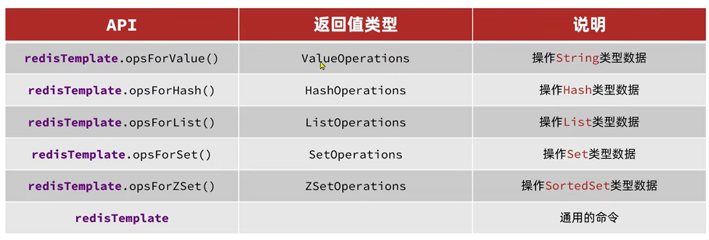

### RedisTemplate Quick Start

1. SpringBoot项目中添加依赖
```maven
<!--RedisTemplate-->
<dependency>
    <groupId>org.springframework.boot</groupId>
    <artifactId>spring-boot-starter-data-redis</artifactId>
</dependency>

<!-- 连接池依赖-->
<dependency>
    <groupId>org.apache.commons</groupId>
    <artifactId>commons-pool2</artifactId>
</dependency>
```

2. 设置application.yml

```ymal
spring:
  data:
    redis:
      host: "127.0.0.1"
      port: 6379
```

3. 使用redisTemplate

```java
@SpringBootTest
public class RedisTemplateTest {
    @Autowired
    private RedisTemplate redisTemplate;

    @Test
    public void test() {
        // 设置serializer来保证从redis-cli访问时编码和java中相同，避免出现乱码
        StringRedisSerializer stringRedisSerializer = new StringRedisSerializer();
        redisTemplate.setKeySerializer(stringRedisSerializer);
        redisTemplate.setValueSerializer(stringRedisSerializer);
        // 进行存储读取操作
        redisTemplate.opsForValue().set("name", "redisTemplate");
        System.out.println(redisTemplate.opsForValue().get("name"));
    }
}
```

### RedisTemplate序列化操作

上述quick start中我们使用了StringRedisSerializer对key和value进行序列化，否则redis-cli中看到key和value存在乱码。虽然不手动设置序列化，在java客户端也可以正常操作redis，但是这会导致redis数据库本身的可读性变差。

那么为什么会有乱码呢，这可以从redisTemplate的源码中发现：

```java
@Nullable
private RedisSerializer keySerializer = null;
@Nullable
private RedisSerializer valueSerializer = null;
@Nullable
private RedisSerializer hashKeySerializer = null;
@Nullable
private RedisSerializer hashValueSerializer = null;

...

if (this.defaultSerializer == null) {
    this.defaultSerializer = new JdkSerializationRedisSerializer(this.classLoader != null ? this.classLoader : this.getClass().getClassLoader());
}
```

从源码可见，RedisTemplate可以设置key,value,hashkey,hashvalue的序列化方式，而且默认方式为JdkSerialization。这种默认的编码形式会将java代码中的key和value序列化为字节串，导致可读性变差。

实际开发中，常见的序列化方式有两种：

```java
@Test
public void test2() {
    // 1. 将key序列化为string
    StringRedisSerializer stringRedisSerializer = new StringRedisSerializer();
    redisTemplate.setKeySerializer(stringRedisSerializer);
    redisTemplate.setHashKeySerializer(stringRedisSerializer);
    
    // 2. 将value序列化为json，这样string和object类型的value在redis数据库中都是可读的
    GenericJackson2JsonRedisSerializer jsonRedisSerializer = new GenericJackson2JsonRedisSerializer();
    redisTemplate.setValueSerializer(jsonRedisSerializer);
    redisTemplate.setHashValueSerializer(jsonRedisSerializer);

    // 存储string类型value
    redisTemplate.opsForValue().set("name", "string value");
    System.out.println(redisTemplate.opsForValue().get("name"));

    // 存储object类型value
    redisTemplate.opsForValue().set("javaObj", new User("cyw",24));
    User user = (User) redisTemplate.opsForValue().get("javaObj");
    System.out.println(user);
}
```

其中GenericJackson2JsonRedisSerializer类需要Jackson依赖：
```maven
<dependency>
    <groupId>com.fasterxml.jackson.core</groupId>
    <artifactId>jackson-databind</artifactId>
</dependency>
```

**StringRedisTemplate**

然而上述序列化存储的user对象有一个问题：

```
"{\"@class\":\"com.cain.jedisquickstart.User\",
\"name\":\"cyw\",
\"age\":24}"
```

即存储内容除了对象本身的信息外，还存储了类名，这是一个额外的开销。类名可以让redisTemplate进行read时直接读取为类，如果我们想避免这个开销，则需要读取出类信息后，我们手动指出要转换的类：

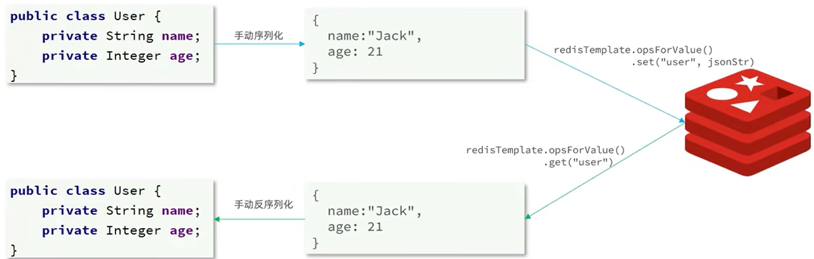

代码如下

```java
// 设置所有key & value都为string serialize的redisTemplate
@Autowired
StringRedisTemplate stringRedisTemplate;

// json转换工具
public static ObjectMapper mapper = new ObjectMapper();

@Test
public void test3() throws JsonProcessingException {
    User user = new User("cain", 33);
    // 手动序列化
    String userString = mapper.writeValueAsString(user);
    stringRedisTemplate.opsForValue().set("jsonString", userString);
    String value = stringRedisTemplate.opsForValue().get("jsonString");
    // 手动反序列化
    User readUser = mapper.readValue(value, User.class);
    System.out.println(readUser);
}
```

## Redis缓存

### 缓存穿透

客户端请求的数据，在缓存和数据库中都不存在，那么则发生了缓存穿透。这种请求无法被缓存拦截，每次都引发数据库查询，影响服务器的性能。

解决方案：

1. 缓存空对象：当客户端拿一个不存在的userID来查询user时，缓存{userID:null}这样的空对象。从而避免下次请求时还会导致缓存穿透。
    * 优点：逻辑简单，容易实现
    * 缺点：缓存中内存被占用

2. 布隆过滤：在缓存前再加一个布隆过滤器，如果布隆过滤器判断userID不存在，则不会进入缓存去查询。
   * 优点：不占用缓存
   * 缺点：布隆过滤器实现复杂，而且判断userID存在时，不一定是真的存在。


### 缓存雪崩

缓存雪崩是指：大量的缓存失效或者缓存服务器宕机，导致大量请求直接访问的数据库，从而影响性能。

解决方案：

1. 设置TTL时添加随机值：避免大量缓存同时过期
2. 服务降级：当缓存服务器宕机时，进行服务降级，直接拒绝请求，而不是进行数据查询
3. 设置缓存集群：减少单个服务器宕机的影响
4. 设置多级缓存：减少单个服务器宕机的影响

### 缓存击穿

缓存击穿是指：当某些`热点key过期`且`缓存重构耗时长`时，会出现缓存击穿。因为热点key过期了，而且短期内还无法添加新的热点key到缓存，那么这段时间里会有大量的请求直接访问到数据库，并且尝试重构缓存，导致响应时间会很长。

解决方案：

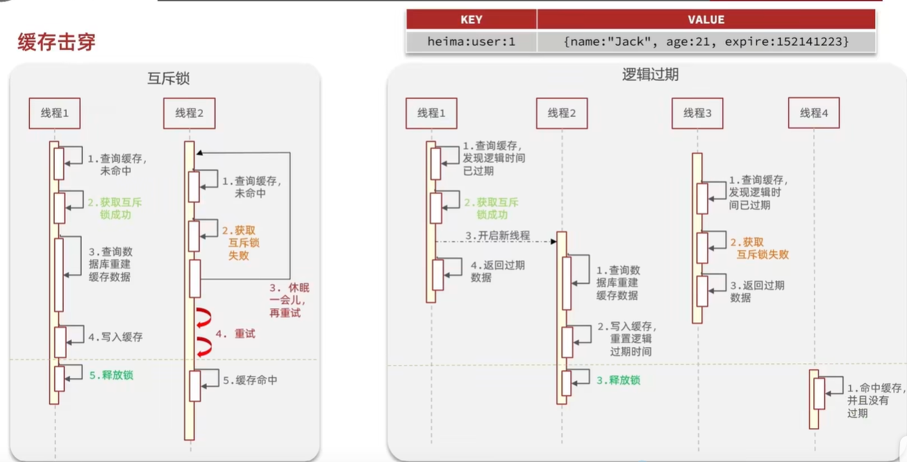

1. 互斥锁：当热点key过期后，第一个访问热点key的线程获取互斥锁，然后进行缓存重构，其余线程进行等待。

2. 逻辑过期：热点key的ttl写到value中，而不是真的设置TTL，从而保证该key不会在缓存中消失。此外，当value中的过期时间到了时，第一个请求的线程获取互斥锁，并进行缓存重构，其它线程直接返回已过期的热点key。

## Redis实现秒杀功能（高并发）

### 全局唯一ID

一般情况下，ID都是从0开始自增的，但是这会带来两个问题：

1. ID存在规律，会暴露出来一些信息（例如用户数量有多少）
2. 如果数据量很大，数据要放在多张表。多张表独立自增，会带来ID冲突。

所以需要一个全局唯一ID生产器，它需要以下特征：

1. 高可用：ID生成是频繁发生的，所以该服务必须高可用
2. 高性能：生成ID的耗时要少
3. 唯一性：生成的ID不能重复
4. 递增性：为了方便数据库索引，ID需要自增
5. 安全性：隐藏ID携带的信息

其中常见保证ID`安全性，递增性和唯一性`的方法：

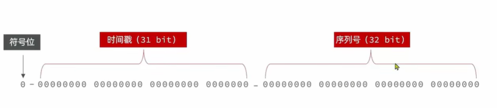

ID用64位的long类型存储，并分为三个组成部分:

* 符号位:1bit,永远为0

* 时间戳:31bit,以秒为单位,可以使用69年

* 序列号:32bit,秒内的计数器,支持每秒产生2^32个不同ID

根据ID创建时间确定时间戳，如果这一秒内有多个ID创建，则增加序列号保证唯一性。


### 分布式锁

分布式锁：在分布式的情况下，多台机器可以察觉并获取相同的互斥锁。

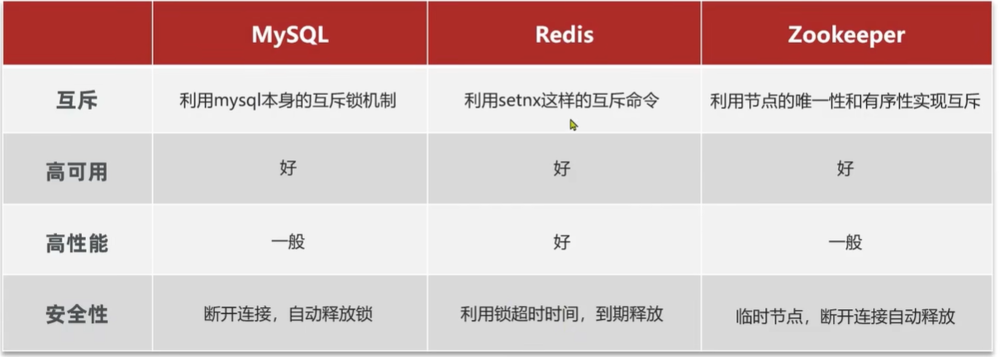

### LUA脚本

Redis提供了Lua脚本功能,在一个脚本中编写多条Redis命令,确保多条命令执行时的原子性。Lua是一种编程语言,它的基本语法大家可以参考网站:https://www.runoob.com/lua/lua-tutorial.html

例如：
```lua
-- 参数列表
local seckillVoucherID = ARGV[1]
local userID = ARGV[2]

-- key列表
local stockKey = 'seckill:stock:'..seckillVoucherID
local orderKey = 'seckill:order:'..seckillVoucherID

-- 1. 查看秒杀券库存是否充足
if tonumber(redis.call('get', stockKey)) <= 0 then
    -- 秒杀券不足则返回1
    return 1
end

-- 2. 判断一人一单
if redis.call('sismember', orderKey, userID) == 1 then
    --此人已经下过单
    return 2
end

-- 3. 减库存并且创建订单
redis.call('incrby',stockKey, -1)
redis.call('sadd',orderKey, userID)
return 0
```

这些操作可以被看做为一个原子操作并执行。

```java
// 加载Lua脚本
private static DefaultRedisScript<Long> seckillScript;
static {
    seckillScript = new DefaultRedisScript<>();
    seckillScript.setLocation(new ClassPathResource("buySeckillVoucher.lua"));
    seckillScript.setResultType(Long.class);
}

...

// 执行Lua脚本，完成缓存中的扣减库存和添加订单
Long result = stringRedisTemplate.execute(seckillScript, Collections.emptyList(),
        voucherID + "", id.toString());

```

### Redission

Redisson是一个在Redis的基础上实现的Java驻内存数据网格(In-Memory Data Grid)。它不仅提供了一系列的分布式的Java常用对象,还提供了许多分布式服务,其中就包含了各种分布式锁的实现。


#### Quick Start

1. 添加依赖

```
<dependency>
    <groupId>org.redisson</groupId>
    <artifactId>redisson</artifactId>
    <version>3.13.6</version>
</dependency>
```

2. 配置Redisson

```
@Configuration
public class RedissonConfig {
    @Bean
    public RedissonClient redissonClient(){
        Config config = new Config();
        config.useSingleServer().setAddress("redis://127.0.0.1:6379");
        return Redisson.create(config);
    }
}
```

3. 使用Redission
```java
// 使用Redisson提供的分布式锁
RLock lock = redissonClient.getLock("redisson-lock:order:" + userID);   //可重入锁
boolean isLock = lock.tryLock();    //设置为不等待
if (!isLock) {
    // 获取锁失败：说明该用户ID对应的锁已经存在，也就是该用户已经正在购买了
    return Result.fail("一个用户只能下一单");
}
try {
    // 获取锁后实现业务
    IVoucherOrderService proxy = (IVoucherOrderService) AopContext.currentProxy();
    return proxy.createOrderInDB(voucherID, userID);
} finally {
    // 释放锁
    lock.unlock();
}
```

### 消息队列

Redis常见的缓存场景是：客户端和Redis进行交互，在内存中完成事务处理，而不进行数据库操作；而数据库操作则是由单独的线程池来进行处理。结果就是客户端可以很快得到响应，而服务端可以自己慢慢处理数据库。而这种异步通讯的方式，往往需要消息队列。

**消息队列关注的特性：**

1. 持久性：宕机不会导致数据丢失
2. 内存大小：消息数量往往很多，需要大内存
3. 消息丢失：如果消息被取走，而消费者宕机，是否会导致消息丢失
4. 消息共享：能否让一个消息被多个消费者拿走

为此有专门的服务来负责消息队列，例如RabbitMQ。而且Redis也提供了消息队列的服务。

**基于List实现消息队列**

就是使用Redis中的list作为消息队列，利用POP,PUSH（BPOP,BPUSH）方法来操作消息队列。

优点：
* 内存由Redis负责
* 数据持久化

缺点：
* 无法实现消息共享
* 无法处理消息丢失。


**基于PubSub的消息队列**

PubSub(发布订阅)是Redis2.0版本引入的消息传递模型。顾名思义,消费者可以订阅一个或多个channel,生产者向对应channel发送消息后,所有订阅者都能收到相关消息。

* SUBSCRIBE channel [channel]:订阅一个或多个频道
* PUBLISH channel msg:向一个频道发送消息
* PSUBSCRIBE pattern[pattern]:订阅与pattern格式匹配的所有频道

优点：
* 实现消息共享

缺点：
* 不进行消息持久化：如果没人阻塞订阅，消息直接丢失（消费者必须一直在监听）
* 消费者监听到的消息缓存在消费者特定区域，当超出内存时消息直接丢失
* 无法处理消息丢失

**基于Stream的消息队列**

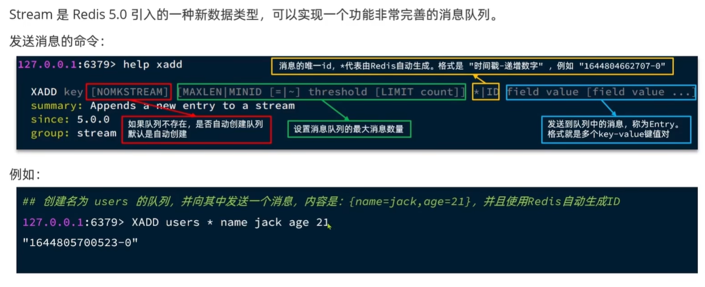

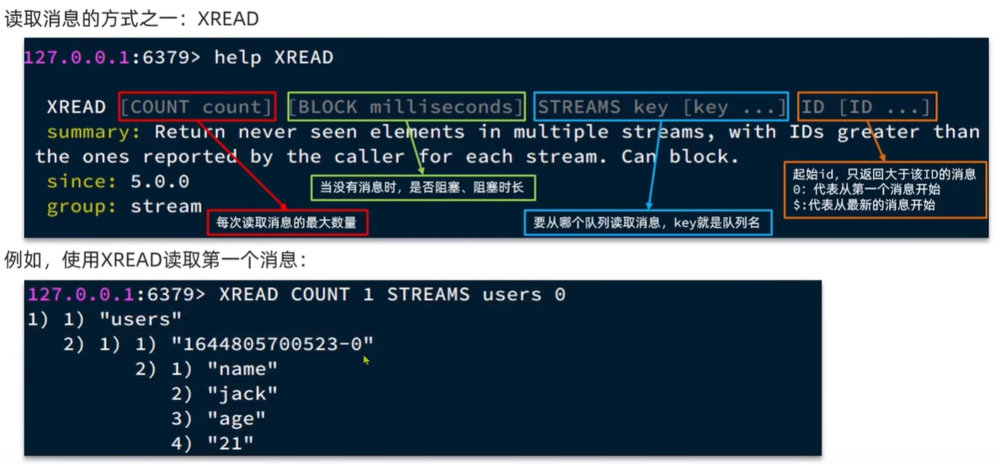

用XADD/XREAD实现消息队列的缺点是可能消息漏读：消费者每次都选择处理一个最新的消息，但是新消息一次可以来好几个，那么其它新消息就漏读了。

**消费者组**：

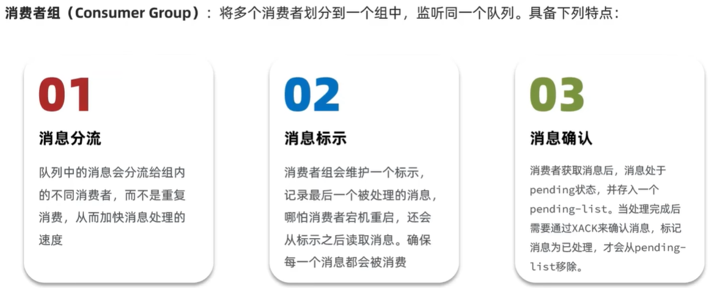


创建消费者组:

```
XGROUP CREATE key groupName ID [MKSTREAM]
```

* key：队列名称
* groupName：消费者组名称
* ID：起始ID标示,$代表队列中最后一个消息（该消费组不要队列原有的消息），0则代表队列中第一个消息（该消费组要队列原有的消息）
* MKSTREAM：队列不存在时自动创建队列

从消费者组读取消息:

```
XREADGROUP GROUP group consumer [COUNT count] [BLOCK milliseconds] [NOACK] STREAMS key [key ... ] ID [ID ... ]
```
*  group:消费组名称
*  consumer:消费者名称,如果消费者不存在,会自动创建一个消费者
*  count:本次查询的最大数量
*  BLOCK milliseconds:当没有消息时最长等待时间
*  NOACK:无需手动ACK,获取到消息后自动确认
*  STREAMS key:指定队列名称
*  ID:获取消息的起始ID:
   * ">":从下一个未消费的消息开始
   *  其它:根据指定id从pending-list中获取已消费但未确认的消息,例如0,是从pending-list中的第一个消息开始

其它常见命令:
```
# 删除指定的消费者组
XGROUP DESTORY key groupName

# 给指定的消费者组添加消费者
XGROUP CREATECONSUMER key groupname consumername

# 删除消费者组中的指定消费者
XGROUP DELCONSUMER key groupname consumername
```