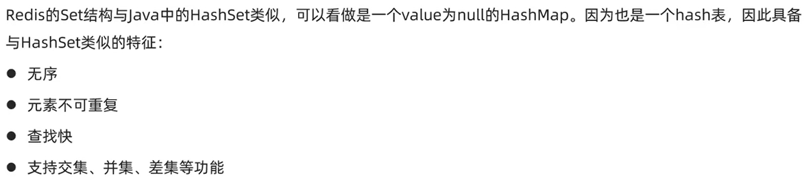

## 认识Redis

Redis诞生于2009年全称是Remote Dictionary Server,远程词典服务器,是一个基于内存的键值型NoSQL数据库。

特征:

● 键值(key-value)型,value支持多种不同数据结构,功能丰富

● 单线程,每个命令具备原子性

● 低延迟,速度快(基于内存、I0多路复用、良好的编码)。

● 支持数据持久化

● 支持主从集群、分片集群

● 支持多语言客户端

## 安装REDIS

可以在docker上直接pull redis的image，然后设置一个端口运行container即可，非常方便。教程：https://www.runoob.com/docker/docker-install-redis.html

redis本身是一个数据库服务器，之前的docker运行时会自动运行服务端，但它还需要一个客户端跟它交互，就跟MYSQL一样。而container也包含了客户端程序：redis-cli

启动客户端可以直接在docker container里运行


也可以用命令行连接到container中进行交互

```
// 连接到docker
docker exec -it redis-test /bin/bash

// 运行cli
redis-cli
```

## Redis数据结构及基本操作

redis中数据由key - value键值对构成，其中key类型一般为string,而value类型则多种多样。以下是一些常见的VALUE类型：


每个数据类型都对应一组操作，可以通过命令help查看，也可以在官网查看 https://redis.io/docs/latest/commands/

### Key的层级

REDIS中的KEY要求独一无二的，所以开发中常常用ID来作为KEY。然而用户和商品可能有相同的ID，为此REDIS提出KEY的层级结构，并以：作为分隔符，例如

```
set user:1 user1JSON
set product:1 prod1JSON
```

### String


String类型也包含了int和float，只不过它们底层根据二进制编码存储到字节数组中而已。

String的常见命令有:

* SET:添加或者修改已经存在的一个String类型的键值对
* GET:根据key获取String类型的value
* MSET:批量添加多个String类型的
* MGET:根据多个key获取多个String类型的value
* INCR:让一个整型的key自增
* INCRBY:让一个整型的key自增并指定步长,例如:incrby num 2
* INCRBYFLOAT:让一个浮点类型的数字自增并指定步长
* SETNX:添加一个String类型的键值对,前提是这个key不存在,否则不生效
* SETEX:添加一个String类型的键值对,并且指定有效期

### Hash

当VALUE为HASH类型时，VALUE不是整体的一个字符串，而是一组键值对。


Hash的常见命令有:

* HSET:添加或者修改hash类型key的field的值
* HGET:获取一个hash类型key的field的值
* HMSET:批量添加多个hash类型key的field的值
* HMGET:批量获取多个hash类型key的field的值
* HGETALL:获取一个hash类型的key中的所有的field和value
* HKEYS:获取一个hash类型的key中的所有的field
* HVALS:获取一个hash类型的key中的所有的value
* HINCRBY:让一个hash类型key的字段值自增并指定步长
* HSETNX:添加一个hash类型的key的field值,前提是这个field不存在,否则不执行

### List


### Set




### Sorted Set


## JAVA客户端--JEDIS

jedis是java和redis的合称，它是一个java客户端，提供API来连接并操作REDIS服务器。其特点为API和redis-cli中使用的方法名称和参数几乎一致，方便上手。

### quick start

1. 添加依赖
```maven
<dependency>
    <groupId>redis.clients</groupId>
    <artifactId>jedis</artifactId>
    <version>5.2.0</version>
</dependency>
```

2. 建立连接并测试
```java
class JedisQuickStartApplicationTests {
    Jedis jedis;

    @BeforeEach
    void setUp() {
        // 连接到redis服务器
        jedis = new Jedis("127.0.0.1", 6379);
        // 选择库
        jedis.select(0);
    }

    @AfterEach
    void tearDown() {
        // 释放连接
        if (jedis != null) {
            jedis.close();
        }
    }

    @Test
    void testString(){
        String result = jedis.set("name", "java-client");
        System.out.println(result);
        String name = jedis.get("name");
        System.out.println(name);
    }
}
```

### Jedis连接池

Jedis没有保证线程安全，所以在使用时推荐使用Jedis连接池来获取连接。Jedis连接池进行了并发控制，并且可以减少创建和释放连接的开销。

```java
public class JedisPoolFactory {
    private static final JedisPool jedisPool;

    static {
        // 设置连接池的配置信息
        JedisPoolConfig config = new JedisPoolConfig();
        config.setMaxTotal(10);
        config.setMaxIdle(10);
        config.setMaxWaitMillis(5000);

        // 创建连接池
        jedisPool = new JedisPool(config, "localhost", 6379);
    }

    public static Jedis getJedis() {
        // 返回一个jedis连接
        return jedisPool.getResource();
    }
}
```

使用示例
```java
    void setUp() {
        // 连接到redis服务器
//        jedis = new Jedis("127.0.0.1", 6379);
        jedis = JedisPoolFactory.getJedis();
        // 选择库
        jedis.select(0);
    }
```

## JAVA客户端--SpringDataRedis

实际开发中更常用的是SpringDataRedis，它是SpringData模块下对Redis操作的支持。SpringDataRedis底层整合了Jedis和Lettus框架，并提供了RedisTemplate这套API。


### RedisTemplate Quick Start

1. SpringBoot项目中添加依赖
```maven
<!--RedisTemplate-->
<dependency>
    <groupId>org.springframework.boot</groupId>
    <artifactId>spring-boot-starter-data-redis</artifactId>
</dependency>

<!-- 连接池依赖-->
<dependency>
    <groupId>org.apache.commons</groupId>
    <artifactId>commons-pool2</artifactId>
</dependency>
```

2. 设置application.yml

```ymal
spring:
  data:
    redis:
      host: "127.0.0.1"
      port: 6379
```

3. 使用redisTemplate

```java
@SpringBootTest
public class RedisTemplateTest {
    @Autowired
    private RedisTemplate redisTemplate;

    @Test
    public void test() {
        // 设置serializer来保证从redis-cli访问时编码和java中相同，避免出现乱码
        StringRedisSerializer stringRedisSerializer = new StringRedisSerializer();
        redisTemplate.setKeySerializer(stringRedisSerializer);
        redisTemplate.setValueSerializer(stringRedisSerializer);
        // 进行存储读取操作
        redisTemplate.opsForValue().set("name", "redisTemplate");
        System.out.println(redisTemplate.opsForValue().get("name"));
    }
}
```

### RedisTemplate序列化操作

上述quick start中我们使用了StringRedisSerializer对key和value进行序列化，否则redis-cli中看到key和value存在乱码。虽然不手动设置序列化，在java客户端也可以正常操作redis，但是这会导致redis数据库本身的可读性变差。

那么为什么会有乱码呢，这可以从redisTemplate的源码中发现：

```java
@Nullable
private RedisSerializer keySerializer = null;
@Nullable
private RedisSerializer valueSerializer = null;
@Nullable
private RedisSerializer hashKeySerializer = null;
@Nullable
private RedisSerializer hashValueSerializer = null;

...

if (this.defaultSerializer == null) {
    this.defaultSerializer = new JdkSerializationRedisSerializer(this.classLoader != null ? this.classLoader : this.getClass().getClassLoader());
}
```

从源码可见，RedisTemplate可以设置key,value,hashkey,hashvalue的序列化方式，而且默认方式为JdkSerialization。这种默认的编码形式会将java代码中的key和value序列化为字节串，导致可读性变差。

实际开发中，常见的序列化方式有两种：

```java
@Test
public void test2() {
    // 1. 将key序列化为string
    StringRedisSerializer stringRedisSerializer = new StringRedisSerializer();
    redisTemplate.setKeySerializer(stringRedisSerializer);
    redisTemplate.setHashKeySerializer(stringRedisSerializer);
    
    // 2. 将value序列化为json，这样string和object类型的value在redis数据库中都是可读的
    GenericJackson2JsonRedisSerializer jsonRedisSerializer = new GenericJackson2JsonRedisSerializer();
    redisTemplate.setValueSerializer(jsonRedisSerializer);
    redisTemplate.setHashValueSerializer(jsonRedisSerializer);

    // 存储string类型value
    redisTemplate.opsForValue().set("name", "string value");
    System.out.println(redisTemplate.opsForValue().get("name"));

    // 存储object类型value
    redisTemplate.opsForValue().set("javaObj", new User("cyw",24));
    User user = (User) redisTemplate.opsForValue().get("javaObj");
    System.out.println(user);
}
```

其中GenericJackson2JsonRedisSerializer类需要Jackson依赖：
```maven
<dependency>
    <groupId>com.fasterxml.jackson.core</groupId>
    <artifactId>jackson-databind</artifactId>
</dependency>
```

**StringRedisTemplate**

然而上述序列化存储的user对象有一个问题：

```
"{\"@class\":\"com.cain.jedisquickstart.User\",
\"name\":\"cyw\",
\"age\":24}"
```

即存储内容除了对象本身的信息外，还存储了类名，这是一个额外的开销。类名可以让redisTemplate进行read时直接读取为类，如果我们想避免这个开销，则需要读取出类信息后，我们手动指出要转换的类：


代码如下

```java
// 设置所有key & value都为string serialize的redisTemplate
@Autowired
StringRedisTemplate stringRedisTemplate;

// json转换工具
public static ObjectMapper mapper = new ObjectMapper();

@Test
public void test3() throws JsonProcessingException {
    User user = new User("cain", 33);
    // 手动序列化
    String userString = mapper.writeValueAsString(user);
    stringRedisTemplate.opsForValue().set("jsonString", userString);
    String value = stringRedisTemplate.opsForValue().get("jsonString");
    // 手动反序列化
    User readUser = mapper.readValue(value, User.class);
    System.out.println(readUser);
}
```


