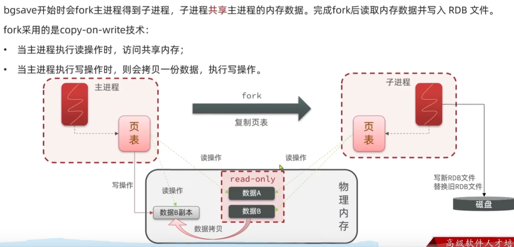

# Redis基本使用

## 安装REDIS

可以在docker上直接pull redis的image，然后设置一个端口运行container即可，非常方便。教程：https://www.runoob.com/docker/docker-install-redis.html

redis本身是一个数据库服务器，之前的docker运行时会自动运行服务端，但它还需要一个客户端跟它交互，就跟MYSQL一样。而container也包含了客户端程序：redis-cli

启动客户端可以直接在docker container里运行


也可以用命令行连接到container中进行交互

```
// 连接到docker
docker exec -it redis-test /bin/bash

// 运行cli
redis-cli
```

## 数据结构以及基本使用

### 基本操作

redis中数据由key - value键值对构成，其中key类型一般为string,而value类型则多种多样。以下是一些常见的VALUE类型：


每个数据类型都对应一组操作，可以通过命令help查看，也可以在官网查看 https://redis.io/docs/latest/commands/

#### Key的层级

REDIS中的KEY要求独一无二的，所以开发中常常用ID来作为KEY。然而用户和商品可能有相同的ID，为此REDIS提出KEY的层级结构，并以：作为分隔符，例如

```
set user:1 user1JSON
set product:1 prod1JSON
```

#### String


String类型也包含了int和float，只不过它们底层根据二进制编码存储到字节数组中而已。

String的常见命令有:

* SET:添加或者修改已经存在的一个String类型的键值对
* GET:根据key获取String类型的value
* MSET:批量添加多个String类型的
* MGET:根据多个key获取多个String类型的value
* INCR:让一个整型的key自增
* INCRBY:让一个整型的key自增并指定步长,例如:incrby num 2
* INCRBYFLOAT:让一个浮点类型的数字自增并指定步长
* SETNX:添加一个String类型的键值对,前提是这个key不存在,否则不生效
* SETEX:添加一个String类型的键值对,并且指定有效期


#### Hash

当VALUE为HASH类型时，VALUE不是整体的一个字符串，而是一组键值对。


Hash的常见命令有:

* HSET:添加或者修改hash类型key的field的值
* HGET:获取一个hash类型key的field的值
* HMSET:批量添加多个hash类型key的field的值
* HMGET:批量获取多个hash类型key的field的值
* HGETALL:获取一个hash类型的key中的所有的field和value
* HKEYS:获取一个hash类型的key中的所有的field
* HVALS:获取一个hash类型的key中的所有的value
* HINCRBY:让一个hash类型key的字段值自增并指定步长
* HSETNX:添加一个hash类型的key的field值,前提是这个field不存在,否则不执行

#### List


#### Set


#### Sorted Set


## Redis全局命令

### 查看

在 Redis 中，数据是以键值对的形式存储的，没有传统意义上的“数据表”。不过，你可以使用一些命令来查看 Redis 中的所有键或特定类型的键。以下是一些常用命令：

**查看所有键**：
```
KEYS *
```

**使用模式匹配查看特定键**：
```
KEYS prefix:*
```

**查看TTL**
```
TTL KEY_NAME
```

### 删除

**删除单个**
```
DEL key_name
```

**删除多个**
```
DEL key1 key2 key3
```

**按照格式删除**
```
// 只能在命令行里通过管道进行操作
redis-cli KEYS "your_prefix*" | xargs redis-cli DEL
```


## JAVA客户端--JEDIS

jedis是java和redis的合称，它是一个java客户端，提供API来连接并操作REDIS服务器。其特点为API和redis-cli中使用的方法名称和参数几乎一致，方便上手。

### quick start

1. 添加依赖
```maven
<dependency>
    <groupId>redis.clients</groupId>
    <artifactId>jedis</artifactId>
    <version>5.2.0</version>
</dependency>
```

2. 建立连接并测试
```java
class JedisQuickStartApplicationTests {
    Jedis jedis;

    @BeforeEach
    void setUp() {
        // 连接到redis服务器
        jedis = new Jedis("127.0.0.1", 6379);
        // 选择库
        jedis.select(0);
    }

    @AfterEach
    void tearDown() {
        // 释放连接
        if (jedis != null) {
            jedis.close();
        }
    }

    @Test
    void testString(){
        String result = jedis.set("name", "java-client");
        System.out.println(result);
        String name = jedis.get("name");
        System.out.println(name);
    }
}
```

### Jedis连接池

Jedis没有保证线程安全，所以在使用时推荐使用Jedis连接池来获取连接。Jedis连接池进行了并发控制，并且可以减少创建和释放连接的开销。

```java
public class JedisPoolFactory {
    private static final JedisPool jedisPool;

    static {
        // 设置连接池的配置信息
        JedisPoolConfig config = new JedisPoolConfig();
        config.setMaxTotal(10);
        config.setMaxIdle(10);
        config.setMaxWaitMillis(5000);

        // 创建连接池
        jedisPool = new JedisPool(config, "localhost", 6379);
    }

    public static Jedis getJedis() {
        // 返回一个jedis连接
        return jedisPool.getResource();
    }
}
```

使用示例
```java
    void setUp() {
        // 连接到redis服务器
//        jedis = new Jedis("127.0.0.1", 6379);
        jedis = JedisPoolFactory.getJedis();
        // 选择库
        jedis.select(0);
    }
```

## JAVA客户端--SpringDataRedis

实际开发中更常用的是SpringDataRedis，它是SpringData模块下对Redis操作的支持。SpringDataRedis底层整合了Jedis和Lettus框架，并提供了RedisTemplate这套API。


### RedisTemplate Quick Start

1. SpringBoot项目中添加依赖
```maven
<!--RedisTemplate-->
<dependency>
    <groupId>org.springframework.boot</groupId>
    <artifactId>spring-boot-starter-data-redis</artifactId>
</dependency>

<!-- 连接池依赖-->
<dependency>
    <groupId>org.apache.commons</groupId>
    <artifactId>commons-pool2</artifactId>
</dependency>
```

2. 设置application.yml

```ymal
spring:
  data:
    redis:
      host: "127.0.0.1"
      port: 6379
```

3. 使用redisTemplate

```java
@SpringBootTest
public class RedisTemplateTest {
    @Autowired
    private RedisTemplate redisTemplate;

    @Test
    public void test() {
        // 设置serializer来保证从redis-cli访问时编码和java中相同，避免出现乱码
        StringRedisSerializer stringRedisSerializer = new StringRedisSerializer();
        redisTemplate.setKeySerializer(stringRedisSerializer);
        redisTemplate.setValueSerializer(stringRedisSerializer);
        // 进行存储读取操作
        redisTemplate.opsForValue().set("name", "redisTemplate");
        System.out.println(redisTemplate.opsForValue().get("name"));
    }
}
```

### RedisTemplate序列化操作

上述quick start中我们使用了StringRedisSerializer对key和value进行序列化，否则redis-cli中看到key和value存在乱码。虽然不手动设置序列化，在java客户端也可以正常操作redis，但是这会导致redis数据库本身的可读性变差。

那么为什么会有乱码呢，这可以从redisTemplate的源码中发现：

```java
@Nullable
private RedisSerializer keySerializer = null;
@Nullable
private RedisSerializer valueSerializer = null;
@Nullable
private RedisSerializer hashKeySerializer = null;
@Nullable
private RedisSerializer hashValueSerializer = null;

...

if (this.defaultSerializer == null) {
    this.defaultSerializer = new JdkSerializationRedisSerializer(this.classLoader != null ? this.classLoader : this.getClass().getClassLoader());
}
```

从源码可见，RedisTemplate可以设置key,value,hashkey,hashvalue的序列化方式，而且默认方式为JdkSerialization。这种默认的编码形式会将java代码中的key和value序列化为字节串，导致可读性变差。

实际开发中，常见的序列化方式有两种：

```java
@Test
public void test2() {
    // 1. 将key序列化为string
    StringRedisSerializer stringRedisSerializer = new StringRedisSerializer();
    redisTemplate.setKeySerializer(stringRedisSerializer);
    redisTemplate.setHashKeySerializer(stringRedisSerializer);
    
    // 2. 将value序列化为json，这样string和object类型的value在redis数据库中都是可读的
    GenericJackson2JsonRedisSerializer jsonRedisSerializer = new GenericJackson2JsonRedisSerializer();
    redisTemplate.setValueSerializer(jsonRedisSerializer);
    redisTemplate.setHashValueSerializer(jsonRedisSerializer);

    // 存储string类型value
    redisTemplate.opsForValue().set("name", "string value");
    System.out.println(redisTemplate.opsForValue().get("name"));

    // 存储object类型value
    redisTemplate.opsForValue().set("javaObj", new User("cyw",24));
    User user = (User) redisTemplate.opsForValue().get("javaObj");
    System.out.println(user);
}
```

其中GenericJackson2JsonRedisSerializer类需要Jackson依赖：
```maven
<dependency>
    <groupId>com.fasterxml.jackson.core</groupId>
    <artifactId>jackson-databind</artifactId>
</dependency>
```

**StringRedisTemplate**

然而上述序列化存储的user对象有一个问题：

```
"{\"@class\":\"com.cain.jedisquickstart.User\",
\"name\":\"cyw\",
\"age\":24}"
```

即存储内容除了对象本身的信息外，还存储了类名，这是一个额外的开销。类名可以让redisTemplate进行read时直接读取为类，如果我们想避免这个开销，则需要读取出类信息后，我们手动指出要转换的类：


代码如下

```java
// 设置所有key & value都为string serialize的redisTemplate
@Autowired
StringRedisTemplate stringRedisTemplate;

// json转换工具
public static ObjectMapper mapper = new ObjectMapper();

@Test
public void test3() throws JsonProcessingException {
    User user = new User("cain", 33);
    // 手动序列化
    String userString = mapper.writeValueAsString(user);
    stringRedisTemplate.opsForValue().set("jsonString", userString);
    String value = stringRedisTemplate.opsForValue().get("jsonString");
    // 手动反序列化
    User readUser = mapper.readValue(value, User.class);
    System.out.println(readUser);
}
```

# Redis理论知识

## 认识Redis

Redis诞生于2009年全称是Remote Dictionary Server,远程词典服务器,是一个`基于内存的键值型NoSQL数据库`。

特征:
* 键值(key-value)型,value支持多种不同数据结构,功能丰富
* 单线程,每个命令具备原子性
* 低延迟,速度快(基于内存、I0多路复用、良好的数据结构)。
* 支持数据持久化
* 支持主从集群、分片集群
* 支持多语言客户端

### 键值对类型数据库

Redis是一个键值对数据库，数据库中的键值对由字典保存。每个数据库都有一个对应的字典，这个字典被称之为键空间。当用户添加一个键值对到数据库时（不论键值对是什么类型）， 程序就将该键值对添加到键空间。

字典的键是一个字符串对象。字典的值则可以是包括【字符串、列表、哈希表、集合或有序集】在内的任意一种 Redis 类型对象。


上图展示了一个包含 number 、 book 、 message 三个键的数据库 —— 其中 number 键是一个列表，列表中包含三个整数值； book 键是一个哈希表，表中包含三个键值对； 而 message 键则指向另一个字符串。

### 为什么Redis这么快


1. 基于内存
2. 使用单线程和多路复用（详见 https://xie.infoq.cn/article/b3816e9fe3ac77684b4f29348 ）
3. 使用高效的数据结构

那既然都这么快了，为什么不直接用 Redis 当主数据库呢？主要是因为内存成本太高且 Redis 提供的数据持久化仍然有数据丢失的风险。

### 为什么使用单线程

Redis 选择使用单线程模型处理客户端的请求主要还是因为 CPU 不是 Redis 服务器的瓶颈，使用多线程模型带来的性能提升并不能抵消它带来的开发成本和维护成本。

不过，Redis 也并非完全是单线程的，从 4.0 开始，Redis 就引入了 UNLINK 这类命令，用于异步执行删除等重操作，并在 6.0 以后引入了专门的 IO 线程，实现了多线程的非阻塞式 IO，它们也进一步的提升了 Redis 的执行效率。

## Redis数据结构


### 底层实现


见上图中3的内容。

* SDS： https://open8gu.com/redis/data-structure/tbsvrxr5qlmqkauh/
* 压缩列表：https://open8gu.com/redis/data-structure/vych53ypih8ksobn/
* 跳表：https://open8gu.com/redis/data-structure/uo5bw9bha6ba4g1h/#2-%E6%95%B0%E6%8D%AE%E7%BB%93%E6%9E%84


## Redis缓存

### 缓存读写策略

#### Cache Aside Pattern 旁路缓存模式

这是最常用的模型，就如名字一般，用缓存作为数据库的辅助。

客户端发起读请求：

1. 先去缓存查找，找到之间返回
2. 缓存没找到则去数据库查找
3. 将数据查找到的放入缓存并返回

客户端发起写请求：

1. 更改数据库
2. 删除缓存
  
    这里先修改数据库再更改缓存是为了减少`数据不一致`的时间，因为更改数据库耗时长，删除缓存耗时短。如果先删除缓存，则较长一段时间内，其它请求会发现缓存不存在。

#### Read/Write Through Pattern 读写穿透模式

Read/Write Through Pattern 中服务端把 cache 视为主要数据存储，从中读取数据并将数据写入其中。cache 服务负责将此数据读取和写入 db，从而减轻了应用程序的职责。

客户端发起读请求：

1. 先去缓存查找，找到之间返回
2. 缓存没找到则去数据库查找
3. 将数据查找到的放入缓存并返回

客户端发起写请求：

1. 更改缓存，由缓存负责将修改的数据同步到数据库
  
#### Write Behind Pattern 异步写入

读写操作和`Read/Write Through Pattern`一致，只是前者写请求更改的数据需要立刻同步数据库。而该模式是异步模式，等空闲时将cache中的数据进行同步即可。

### 缓存穿透

客户端请求的数据，在缓存和数据库中都不存在，那么则发生了缓存穿透。这种请求无法被缓存拦截，每次都引发数据库查询，影响服务器的性能。

解决方案：

1. 缓存空对象：当客户端拿一个不存在的userID来查询user时，缓存{userID:null}这样的空对象。从而避免下次请求时还会导致缓存穿透。
    * 优点：逻辑简单，容易实现
    * 缺点：缓存中内存被占用

2. 布隆过滤：在缓存前再加一个布隆过滤器，如果布隆过滤器判断userID不存在，则不会进入缓存去查询。
   * 优点：占用极小的内存，能快速判断集合中是否包含某个元素
   * 缺点：存在误判的可能。（判断为不存在则一定不存在，但判断为存在不一定真的存在）


#### 布隆过滤器

布隆过滤器包含一组hash函数和一个boolean数组，用来快速判断元素是否存在于集合中。

具体来说，boolean数组的初始值全部置为 0。在插入一个元素时，将该元素经过多个哈希函数映射到位数组上的多个位置，并将这些位置的值置为 1。


在查询一个元素是否存在时，会将该元素经过多个哈希函数映射到位数组上的多个位置，如果所有位置的值都为 1，则认为元素存在；如果存在任一位置的值为 0，则认为元素不存在。

### 缓存雪崩

缓存雪崩是指：大量的缓存失效或者缓存服务器宕机，导致大量请求直接访问的数据库，从而影响性能。

解决方案：

1. 设置TTL时添加随机值：避免大量缓存同时过期
2. 服务降级：当缓存服务器宕机时，进行服务降级，直接拒绝请求，而不是进行数据查询
3. 设置缓存集群：减少单个服务器宕机的影响
4. 设置多级缓存：减少单个服务器宕机的影响

### 缓存击穿

缓存击穿是指：当某些`热点key过期`且`缓存重构耗时长`时，会出现缓存击穿。因为热点key过期了，而且短期内还无法添加新的热点key到缓存，那么这段时间里会有大量的请求直接访问到数据库，并且尝试重构缓存，导致响应时间会很长。

解决方案：


1. 互斥锁：当热点key过期后，第一个访问热点key的线程获取互斥锁，然后进行缓存重构，其余线程进行等待。

2. 逻辑过期：热点key的ttl写到value中，而不是真的设置TTL，从而保证该key不会在缓存中消失。此外，当value中的过期时间到了时，第一个请求的线程获取互斥锁，并进行缓存重构，其它线程直接返回已过期的热点key。

## Redis 内存管理

### 到期删除
在 Redis 中，我们可以用 EXPIRE、PEXPIRE、EXPIREAT 和 PEXPIREAT四个命令来按毫秒或秒设置 Key 的过期时间。其中，前两者指定的是 Key 的有效时间，而后两者指定的是 Key 的到期时间点。

这些时间最终会被转换为一个时间戳并，与 Key 一一对应保存在一个到期字典中，然后 Redis 会根据 Key 在到期字典中的到期时间，通过主动和被动两种方式清理到期的 Key。

**被动删除是指**: 每次访问 Key 键时，Redis 会检查 Key 是否已到期，如果是就将其删除并返回空值。不过如果仅靠被动删除是不够的，因为如果 Key 的访问频率不高，可能会导致一些数据一直不能被删除，内存也无法得到释放，因此所以还需要定期的主动删除。

**主动删除是指**: Redis 会每秒扫描10次到期字典，随机抽取 20 个 Key 并删除其中已经到期的部分。然后，如果这次抽样中到期键的 Key 的比例超过 25%，就会继续抽样，直到不满足条件或超时为止。

以上两种删除机制互相配合，基本能保证 Redis 中到期键的数量不会超过总数据量的 25%。

另外，Redis 在持久化的时候也会针对到期的 Key 做额外的处理。Redis 在 AOF 的时候，如果 Key 过期了，则会向文件追加一条 DEL 指令，而如果是在 AOF 重写和 RDB 的时候，则检查并直接忽略掉过期的 Key。

最后是集群，在集群里面，当主节点发现 Key 到期时，会向所有从节点发送 DEL 命令，但是当从节点发现键到期时，只会将其标记为已删除，直到收到主节点的删除指令才会真正删除，以确保数据一致性。

### 淘汰策略

内存总是有限的，因此当 Redis 内存超出最大内存时，就需要根据一定的策略去主动的淘汰一些 Key，来腾出内存，这就是内存淘汰策略。我们可以在配置文件中通过 maxmemory-policy 配置指定策略。


默认为noeviction：即不淘汰任何数据，OOM直接报错。

### 内存碎片

在Rediss使用过程中，在多次请求内存和释放内存的过程中会产生内存碎片。Redis本身也提供了内存清理的功能。

由于内存清理可能耗时较长，会阻塞进程，所以可以在配置文件中修改配置来控制合适进行内存清理。

## Redis事务

可以将 Redis 中的事务理解为：Redis 事务提供了一种将多个命令请求打包的功能。然后，再按顺序执行打包的所有命令，并且不会被中途打断。Redis 事务实际开发中使用的非常少，功能比较鸡肋。

### 事务指令

Redis 可以通过 MULTI，EXEC，DISCARD 和 WATCH 等命令来实现事务(Transaction)功能。

```
> MULTI
OK
> SET PROJECT "JavaGuide"
QUEUED
> GET PROJECT
QUEUED
> EXEC
1) OK
2) "JavaGuide"
```

MULTI表示开始事务，之后的命令被加入到事务中，EXEC表示执行事务。

### 事务缺陷

Redis事务不保证`原子性`和`持久性`。

Redis 事务在运行错误的情况下，除了执行过程中出现错误的命令外，其他命令都能正常执行。并且，Redis 事务是不支持回滚（roll back）操作的。因此，Redis 事务其实是不满足原子性的。

要满足持久性需要设置AOF，要求其对每次更改都进行存储，性能很差。所以基本上是无法保证持久性的。

### LUA脚本

Redis提供了Lua脚本功能,在一个脚本中编写多条Redis命令,确保多条命令执行时的原子性。不过这Lua也无法进行回滚，持久性也依靠AOF来保证。


Lua是一种编程语言,它的基本语法大家可以参考网站:https://www.runoob.com/lua/lua-tutorial.html

例如：
```lua
-- 参数列表
local seckillVoucherID = ARGV[1]
local userID = ARGV[2]

-- key列表
local stockKey = 'seckill:stock:'..seckillVoucherID
local orderKey = 'seckill:order:'..seckillVoucherID

-- 1. 查看秒杀券库存是否充足
if tonumber(redis.call('get', stockKey)) <= 0 then
    -- 秒杀券不足则返回1
    return 1
end

-- 2. 判断一人一单
if redis.call('sismember', orderKey, userID) == 1 then
    --此人已经下过单
    return 2
end

-- 3. 减库存并且创建订单
redis.call('incrby',stockKey, -1)
redis.call('sadd',orderKey, userID)
return 0
```

这些操作可以被看做为一个原子操作并执行。

```java
// 加载Lua脚本
private static DefaultRedisScript<Long> seckillScript;
static {
    seckillScript = new DefaultRedisScript<>();
    seckillScript.setLocation(new ClassPathResource("buySeckillVoucher.lua"));
    seckillScript.setResultType(Long.class);
}

...

// 执行Lua脚本，完成缓存中的扣减库存和添加订单
Long result = stringRedisTemplate.execute(seckillScript, Collections.emptyList(),
        voucherID + "", id.toString());

```

## Redis持久化

### RDB

RDB全称Redis Database Backup file(Redis数据备份文件),也被叫做Redis数据快照。简单来说就是把内存中的所有数据都记录到磁盘中。当Redis实例故障重启后,从磁盘读取快照文件,恢复数据。

```
#由Redis主进程来执行RDB,会阻塞所有命令
127.0.0.1:6379>save 

#开启子进程执行RDB,避免主进程受到影响
127.0.0.1:6379>bgsave 
```
Redis停机时会执行一次RDB，生成的快照文件为RDB文件,默认是保存在当前运行目录。

除此之外，Redis运行时也会定期执行RDB来存储数据,可以在redis.conf文件中配置:
```
# 900秒内,如果至少有1个key被修改,则执行bgsave; 如果是save "" 则表示禁用RDB
save 900 1
save 300 10
save 60 10000
```

RDB的其它配置也可以在redis.conf文件中设置:
```
# 是否压缩 ,建议不开启,压缩也会消耗cpu,磁盘的话不值钱
rdbcompression yes

# RDB文件名称
dbfilename dump.rdb

# 文件保存的路径目录
dir ./
```

#### bgsave分析



bgsave命令让redis主线程进行fork创建出子线程，然后子线程来进行数据存储。子线程运行时是独立的，但是子线程的创建需要主线程阻塞进行。为了减少主线程的阻塞时间，fork时只将主线程的页表（即数据的地址）拷贝到子线程，而不是真的将redis的数据拷贝一份。

在子线程运行时需要读取数据，而此时主线程也可能修改数据，为了避免脏读，子线程将数据标记为只读。而主线程要修改标记为只读的数据时，进行数据拷贝，然后修改拷贝的数据。

### AOF

AOF全称为Append Only File(追加文件)。Redis处理的每一个写命令都会记录（追加）在AOF文件,可以看做是命令日志文件。

AOF默认是关闭的,需要修改redis.conf配置文件来开启AOF:
```
# 是否开启AOF功能,默认是no
appendonly yes
# AOF文件的名称
appendfilename "appendonly.aof"
```

AOF的命令记录的频率也可以通过redis.conf文件来配:
```
# 表示每执行一次写命令,立即记录到AOF文件
appendfsync always
#写命令执行完先放入AOF缓冲区,然后表示每隔1秒将缓冲区数据写到AOF文件,是默认方案
appendfsync everysec
# 写命令执行完先放入AOF缓冲区,由操作系统决定何时将缓冲区内容写回磁盘
appendfsync no
```

AOF的特点就是它记录写命令，而不是数据。所以每次持久化只需要将命令追加到文件中，而不需要将整个数据重新写入磁盘，使得AOF每次持久化耗时少。但是AOF记录所有操作，而一条数据往往有多个写操作，所以AOF文件往往比RDB文件大很多。

#### AOF重写

为了减少AOF文件大小，Redis提供了重写操作--bgrewirteaof，来将过期的（被覆盖的）写操作删除。

Redis也会在触发阈值时自动去重写AOF文件。阈值也可以在redis.conf中配置:
```
# AOF文件比上次文件 增长超过多少百分比则触发重写
auto-aof-rewrite-percentage 100
# AOF文件体积最小多大以上才触发重写
auto-aof-rewrite-min-size 64mb
```

## Redis 的其它应用

Redis除了进行缓存外，还可以实现其它功能

### 全局唯一ID

一般情况下，ID都是从0开始自增的，但是这会带来两个问题：

1. ID存在规律，会暴露出来一些信息（例如用户数量有多少）
2. 如果数据量很大，数据要放在多张表。多张表独立自增，会带来ID冲突。

所以需要一个全局唯一ID生产器，它需要以下特征：

1. 高可用：ID生成是频繁发生的，所以该服务必须高可用
2. 高性能：生成ID的耗时要少
3. 唯一性：生成的ID不能重复
4. 递增性：为了方便数据库索引，ID需要自增
5. 安全性：隐藏ID携带的信息

其中常见保证ID`安全性，递增性和唯一性`的方法：


ID用64位的long类型存储，并分为三个组成部分:

* 符号位:1bit,永远为0

* 时间戳:31bit,以秒为单位,可以使用69年

* 序列号:32bit,秒内的计数器,支持每秒产生2^32个不同ID

根据ID创建时间确定时间戳，如果这一秒内有多个ID创建，则增加序列号保证唯一性。


### 分布式锁

分布式锁：在分布式的情况下，多台机器可以察觉并获取相同的互斥锁。

一个最基本的分布式锁需要满足：
* 互斥：任意一个时刻，锁只能被一个线程持有。
* 高可用：锁服务是高可用的，当一个锁服务出现问题，能够自动切换到另外一个锁服务。并且，即使客户端的释放锁的代码逻辑出现问题，锁最终一定还是会被释放，不会影响其他线程对共享资源的访问。这一般是通过超时机制实现的。
* 可重入：一个节点获取了锁之后，还可以再次获取锁。

除了上面这三个基本条件之外，一个好的分布式锁还需要满足下面这些条件：
* 高性能：获取和释放锁的操作应该快速完成，并且不应该对整个系统的性能造成过大影响。
* 非阻塞：如果获取不到锁，不能无限期等待，避免对系统正常运行造成影响。
  
分布式锁的常见实现方式有哪些？


#### Redission

Redisson是一个在Redis的基础上实现的Java驻内存数据网格(In-Memory Data Grid)。它不仅提供了一系列的分布式的Java常用对象,还提供了许多分布式服务,其中就包含了各种分布式锁的实现。


**Quick Start**

1. 添加依赖

```
<dependency>
    <groupId>org.redisson</groupId>
    <artifactId>redisson</artifactId>
    <version>3.13.6</version>
</dependency>
```

2. 配置Redisson

```
@Configuration
public class RedissonConfig {
    @Bean
    public RedissonClient redissonClient(){
        Config config = new Config();
        config.useSingleServer().setAddress("redis://127.0.0.1:6379");
        return Redisson.create(config);
    }
}
```

3. 使用Redission
```java
// 使用Redisson提供的分布式锁
RLock lock = redissonClient.getLock("redisson-lock:order:" + userID);   //可重入锁
boolean isLock = lock.tryLock();    //设置为不等待
if (!isLock) {
    // 获取锁失败：说明该用户ID对应的锁已经存在，也就是该用户已经正在购买了
    return Result.fail("一个用户只能下一单");
}
try {
    // 获取锁后实现业务
    IVoucherOrderService proxy = (IVoucherOrderService) AopContext.currentProxy();
    return proxy.createOrderInDB(voucherID, userID);
} finally {
    // 释放锁
    lock.unlock();
}
```

### 消息队列

Redis常见的缓存场景是：客户端和Redis进行交互，在内存中完成事务处理，而不进行数据库操作；而数据库操作则是由单独的线程池来进行处理。结果就是客户端可以很快得到响应，而服务端可以自己慢慢处理数据库。而这种异步通讯的方式，往往需要消息队列。

**消息队列关注的特性：**

1. 持久性：宕机不会导致数据丢失
2. 内存大小：消息数量往往很多，需要大内存
3. 消息丢失：如果消息被取走，而消费者宕机，是否会导致消息丢失
4. 消息共享：能否让一个消息被多个消费者拿走

为此有专门的服务来负责消息队列，例如RabbitMQ。而且Redis也提供了消息队列的服务。

**基于List实现消息队列**

就是使用Redis中的list作为消息队列，利用POP,PUSH（BPOP,BPUSH）方法来操作消息队列。

优点：
* 内存由Redis负责
* 数据持久化

缺点：
* 无法实现消息共享
* 无法处理消息丢失。


**基于PubSub的消息队列**

PubSub(发布订阅)是Redis2.0版本引入的消息传递模型。顾名思义,消费者可以订阅一个或多个channel,生产者向对应channel发送消息后,所有订阅者都能收到相关消息。

* SUBSCRIBE channel [channel]:订阅一个或多个频道
* PUBLISH channel msg:向一个频道发送消息
* PSUBSCRIBE pattern[pattern]:订阅与pattern格式匹配的所有频道

优点：
* 实现消息共享

缺点：
* 不进行消息持久化：如果没人阻塞订阅，消息直接丢失（消费者必须一直在监听）
* 消费者监听到的消息缓存在消费者特定区域，当超出内存时消息直接丢失
* 无法处理消息丢失

**基于Stream的消息队列**


用XADD/XREAD实现消息队列的缺点是可能消息漏读：消费者每次都选择处理一个最新的消息，但是新消息一次可以来好几个，那么其它新消息就漏读了。

**消费者组**：


创建消费者组:

```
XGROUP CREATE key groupName ID [MKSTREAM]
```

* key：队列名称
* groupName：消费者组名称
* ID：起始ID标示,$代表队列中最后一个消息（该消费组不要队列原有的消息），0则代表队列中第一个消息（该消费组要队列原有的消息）
* MKSTREAM：队列不存在时自动创建队列

从消费者组读取消息:

```
XREADGROUP GROUP group consumer [COUNT count] [BLOCK milliseconds] [NOACK] STREAMS key [key ... ] ID [ID ... ]
```
*  group:消费组名称
*  consumer:消费者名称,如果消费者不存在,会自动创建一个消费者
*  count:本次查询的最大数量
*  BLOCK milliseconds:当没有消息时最长等待时间
*  NOACK:无需手动ACK,获取到消息后自动确认
*  STREAMS key:指定队列名称
*  ID:获取消息的起始ID:
   * ">":从下一个未消费的消息开始
   *  其它:根据指定id从pending-list中获取已消费但未确认的消息,例如0,是从pending-list中的第一个消息开始

其它常见命令:
```
# 删除指定的消费者组
XGROUP DESTORY key groupName

# 给指定的消费者组添加消费者
XGROUP CREATECONSUMER key groupname consumername

# 删除消费者组中的指定消费者
XGROUP DELCONSUMER key groupname consumername
```

# Redis 优化

## 减少网络传输

一个 Redis 命令的执行可以简化为以下 4 步：
1. 发送命令
2. 命令排队
3. 命令执行
4. 返回结果
   
其中，第 1 步和第 4 步耗费时间之和称为 Round Trip Time (RTT,往返时间) ，也就是数据在网络上传输的时间。

所以使用批量操作可以减少网络传输次数，进而有效减小网络开销，大幅减少 RTT。

### 使用批量操作指令

例如MSET, MGET等

### 使用pipeline

对于不支持批量操作的指令，可以使用pipeline来让其顺序执行。

### Lua脚本

Lua脚本也可以认为是一种批量处理指令。

## 避免bigkey

由于设计不当，可能会出现bigKey（bigKey其实指value过大的数据），其会带来如下问题：

1. 客户端超时阻塞：由于 Redis 执行命令是单线程处理，然后在操作大 key 时会比较耗时，那么就会阻塞 Redis，从客户端这一视角看，就是很久很久都没有响应。
2. 网络阻塞：每次获取大 key 产生的网络流量较大，如果一个 key/value 的大小是 1 MB，每秒访问量为 1000，那么每秒会产生 1000MB 的流量，这对于普通千兆网卡的服务器来说是灾难性的。
3. 工作线程阻塞：如果使用 del 删除大 key 时，会阻塞工作线程，这样就没办法处理后续的命令。大 key 造成的阻塞问题还会进一步影响到主从同步和集群扩容。

避免bigkey的方法：

1. 利用hash将bigKey进行分割
2. 改变数据结构，尝试存储较小的内容

本质上没有好的办法，只是在设计上来避免缓存bigkey。


# Redis集群

## 主从架构

为了提高Redis的性能，可以构建主从架构来做读写分离：


首先要启动多个Redis应用来创建多个实例，每个实例有自己的IP地址和端口号。但这些实例还没有任何关系,要配置主从可以使用replicaof或者slaveof(5.0以前)命令。（在配置文件中设置则永久有效，在redis-cli客户端设置则重启后失效）

```
# 设置当前实例为指定节点的slave
slaveof <masterip> <masterport>

# 查看当前节点的状态
INFO replication
```

通过上述命令给多个实例构建主从关系后，Redis会自动实现数据同步，而且保证只能在主节点写，从节点读。（在从节点写会直接报错）所以Redis的主从架构配置非常简单，只需要设置谁是谁的SLAVE即可。

### 数据同步

**全量同步**：第一次同步


master如何判断slave是不是第一次来同步数据?这里会用到两个很重要的概念:

* Replication ld:简称replid,是数据集的标记,id一致则说明是同一数据集。每一个master都有唯一的replid,slave则会继承master节点的replid

* offset:偏移量,随着记录在repl_baklog中的数据增多而逐渐增大。slave完成同步时也会记录当前同步的offset。如果slave的offset小于master的offset,说明slave数据落后于master,需要更新。

因此slave做数据同步,必须向master声明自己的replication id 和offset,master才可以判断到底需要同步哪些数据

**增量同步**


repl_baklog大小有上限,写满后会覆盖最早的数据。如果slave断开时间过久,导
致数据被覆盖,则无法实现增量头现增重同步,只能再次全量同步。

**同步优化**

可以从以下几个方面来优化Redis主从就集群:
* 在master中配置repl-diskless-sync yes启用无磁盘复制,避免全量同步时的磁盘I0，而是生成RDB时直接发送到网关。

* Redis单节点上的内存占用不要太大,减少RDB导致的过多磁盘I0

* 适当提高repl_baklog的大小,发现slave宕机时尽快实现故障恢复,尽可能避免全量同步

* 限制一个master上的slave节点数量,如果实在是太多slave,则可以采用主-从-从链式结构,减少master压力


## 哨兵

Redis提供了哨兵(Sentinel)机制来实现主从集群的自动故障恢复，其功能主要为：

* 监控:Sentinel会不断检查您的master和slave是否按预期工作

* 自动故障恢复:如果master故障,Sentinel会将一个slave提升为master。当故障实例恢复后也以新的master为主

* 通知:Sentinel充当Redis客户端的服务发现来源,当集群发生故障转移时,会将最新信息推送给Redis的客户端

哨兵和主从集群是配套使用的，因为主从集群是多个实例，直接使用java向多个实例通讯会比较繁琐，所以由哨兵来提供服务发现的功能，java和哨兵进行通信。

### 监控的实现原理

Sentinel基于心跳机制监测服务状态,每隔1秒向集群的每个实例发送ping命令:
* 主观下线:如果某sentinel节点发现某实例未在规定时间响应,则认为该实例主观下线。
* 客观下线:若超过指定数量(quorum)的sentinel都认为该实例主观下线,则该实例客观下线。（quorum值最好超过Sentinel实例数量的一半）

### 故障恢复流程

一旦发现master故障,sentinel需要在salve中选择一个作为新的master,选择依据是这样的:

* 首先会判断slave节点与master节点断开时间长短,如果超过指定值(down-after-milliseconds*10)则会排除该slave节点
* 然后判断slave节点的slave-priority值,越小优先级越高,如果是O则永不参与选举
* 如果slave-prority一样,则判断slave节点的offset值,越大说明数据越新,优先级越高
* 最后是判断slave节点的运行id大小,越小优先级越高。

当选中了其中一个slave为新的master后(例如slave1),故障的转移的步骤如下:

* sentinel给备选的slave1节点发送`slaveof no one`命令,让该节点成为master
* sentinel给所有其它slave发送`slaveof [IP] [Port]`命令,让这些slave成为新master的从节点,开始从新的master上同步数据。
* 最后,sentinel将故障节点标记为slave,当故障节点恢复后会自动成为新的master的slave节点

### 哨兵集群的创建

哨兵本身也算是Redis实例，不过它是通过redis-sentinal命令启动，而不是redis-server。其中哨兵实例的配置也写在配置文件中：

```
// 哨兵端口
port 27001
// 哨兵IP
sentinel announce-ip 192.168.150.101
// 要监视的主从集群（只需要主节点的IP,PORT即可）
sentinel monitor mymaster 192.168.150.101 7001 2
// 超时时间
sentinel down-after-milliseconds mymaster 5000
sentinel failover-timeout mymaster 60000
// 该配置文件所在的目录
dir "/tmp/s1"
```

不过哨兵为什么也要创建集群呢？我想应该是避免某个哨兵宕机，以及主从集群发生故障时多台哨兵进行投票来决定是否更换master。在投票决定更换master后，哨兵集群本身也要选一个实例来负责故障恢复，默认情况是谁最先发现故障的谁负责。

### RedisTemplate使用哨兵集群

在Sentinel集群监管下的Redis主从集群,其节点会因为自动故障转移而发生变化,Redis的客户端必须感知这种变化,及时更新连接信息。Spring的RedisTemplate底层利用lettuce实现了节点的感知和自动切换。

1. 在pom文件中引入redis的starter依赖:
    ```
    <dependency>
        <groupId>org. springframework.boot</groupId>
        <artifactId>spring-boot-starter-data-redis</artifactId>
    </dependency>
    ```

2. 然后在配置文件application.yml中指定sentinel相关信息:
    ```
    spring:
        redis:
            sentinel:
                master: mymaster # 指定master名称
                nodes:# 指定redis-sentinel集群信息
                    - 192.168.150.101:27001
                    - 192.168.150.101:27002
                    - 192.168.150.101:27003
    ```
3. 配置主从读写分离
    ```java
    @Bean
    public LettuceClientConfigurationBuilderCustomizer configurationBuilderCustomizer(){
        return configBuilder -> configBuilder.readFrom(ReadFrom.REPLICA_PREFERRED);
    }
    ```

    这里的ReadFrom是配置Redis的读取策略,是一个枚举,包括下面选择:
    * MASTER:从主节点读取
    * MASTER_PREFERRED:优先从master节点读取,master不可用才读取replica
    * REPLICA:从slave(replica)节点读取
    * REPLICA_PREFERRED:优先从slave(replica)节点读取,所有的slave都不可用才读取master

之后正常使用RedisTemplate即可，主从和哨兵已经配置完成，不需要额外添加或修改代码。


## 分片集群

主从和哨兵可以解决高可用、高并发读的问题。但是依然有两个问题没有解决

* 海量数据存储问题
* 高并发写的问题

使用分片集群可以解决上述问题,分片集群特征:


* 集群中有多个master,每个master保存不同数据
* 每个master都可以有多个slave节点
* master之间通过ping监测彼此健康状态，无需哨兵
* 客户端请求可以访问集群任意节点,最终都会被转发到正确节点

### 创建分片集群

1. 运行多个redis实例，每个实例的配置文件中指出使用分片集群
   
   ```
   port 6379
   # 开启集群功能
   cluster-enabled yes
   #集群的配置文件名称,不需要我们创建,由redis自己维护
   cluster-config-file /tmp/6379/nodes.conf
   # 节点心跳失败的超时时间
   cluster-node-timeout 5000
   # 持久化文件存放目录
   dir /tmp/6379
   # 绑定地址
   bind 0.0.0.0
   # 让redis后台运行
   daemonize yes
   # 注册的实例ip
   replica-announce-ip 192.168.150.101
   # 保护模式
   protected-mode no
   # 数据库数量
   databases 1
   # 日志
   logfile /tmp/6379/run.log
   ```

2. 在redis-cli中配置多个redis实例为一个集群

    ```
    redis-cli --cluster create --cluster-replicas 1 192.168.150.101:7001 192.168.150.101:7002 192.168.150.101:7003 192.168.150.101:8001 192.168.150.101:8002 192.168.150.101:8003
    ```
    其中`--cluster create`表示创建集群；`--cluster-replicas 1`表示每个master有1个slave，所以后续的6个示例中，前三个作为master，后三个作为slave。

### 散列插槽

现在问题是数据来了应该存储在哪个master上，为此Redis提供了散列插槽（Hash Slot），其长度为16384。redis会根据key的有效部分计算插槽值,分两种情况:

* key中包含{},且{}中至少包含1个字符,{}中的部分是有效部分
* key中不包含{},整个key都是有效部分

例如:key是num,那么就根据num计算,如果是{itcast}num,则根据itcast计算。

计算方式是利用CRC16算法得到一个hash值,然后对16384取余,得到的结果就是slot值，而每个master均匀地负责部分slot。

不将数据直接分配给master，而是为数据计算slot值，根据slot值去找master的行为是为了分片集群的动态性。这样master宕机或者额外添加时，更容易重新分配数据。

### 动态扩容&故障恢复

通过`redis-cli --cluster add-node`指令可以为已有的分片集群进行扩容，添加的node默认为master也可以设置为某个master的slave。需要注意的是，此时添加的master并不负责任何slot，需要通过`rehash`命令来将某个已有的master的slot分给新增的master。

而且分片集群自带故障恢复，因为master之间通过心跳来互相检测。当某个master宕机时，会选该master的一个slave升级为master，宕机的master恢复后则成为slave。也可以通过`failover`指令来主动将slave升级为master，将master降级为slave。

### RedisTemplate使用分片集群

RedisTemplate底层同样基于lettuce实现了分片集群的支持,而使用的步骤与哨兵模式基本一致:

1. 引入redis的starter依赖
2. 配置分片集群地址
3. 配置读写分离

与哨兵模式相比,唯一的区别是第二步：将哨兵的地址改为分片集群的地址
```
spring:
    redis:
        cluster :
            nodes:  #指定分片集群的每一个节点信息
                - 192.168.150.101:7001
                - 192.168.150.101:7002
                - 192.168.150.101:7003
                - 192.168.150.101:8001
                - 192.168.150.101:8002
                - 192.168.150.101:8003
```