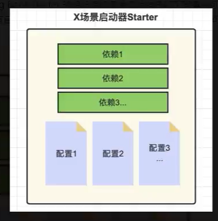

## 手动SSM配置整合

整体思路为：

1. 导入所有SSM本身需要的依赖
2. 利用IOC容器来协作，由于Spring和SPring MVC本来就依赖于IOC容器，所以核心配置就是将Mybatis导入到Spring家族中
3. 每个SSM部分单独构建Config类，然后利用MVC中的那个启动配置类来将所有配置类加进去就行


## SpringBoot简介

在上边手动将SSM三个框架整合的过程中可谓是非常痛苦，需要依赖版本是否匹配，需要为每个部分单独写配置文件，需要不同的IOC容器等等。总得来说，就是当spring整合的东西越来越多时，一个项目中需要添加的配置也越来越多，从而出现bug的概率也越来越多。

SpringBoot就是来负责`简化Spring项目构建`的框架，它有以下特点：
1. 约定大于配置：只要按照Spring Boot约定的项目结构构建项目，就不需要写配置文件，Spring Boot已经写了默认的配置文件。
2. 版本控制：通过指定Srping Boot Stater Paren父工程，所有版本都会被父工程统一管理。
3. 依赖整合：根据常见场景提出Spring Boot Starter * 整合包，其中包括了完成特定类型项目所需的全部依赖
4. 统一配置管理：用户需要自定义配置信息的话，无论是哪个组件的配置，统一写在application.properties文件中，从而简化配置管理。
5. 内嵌服务：Spring boot除了整合框架外，还提供了额外服务，例如内嵌tomcat
6. 配置动态设置：在项目打包后，可以通过命令参数动态修改spring boot配置

此外SpringBoot会根据starter包提供的配置文件为其创建Bean，所以IOC容器创建和Bean之间的依赖注入也不需要由程序员负责。

## POM文件讲解

**1. Parent 标签**

```
<parent>
    <!--Spring Boot-->
    <groupId>org.springframework.boot</groupId>
    <artifactId>spring-boot-starter-parent</artifactId>
    <version>3.2.2</version>
</parent>
```

这里是通过指明父工程来进行项目依赖的版本管理，在父工程中指明了版本的依赖都不需要再声明版本号。

**2. starter依赖包**

```
<dependency>
    <groupId>org.springframework.boot</groupId>
    <artifactId>spring-boot-starter-web</artifactId>
</dependency>
```

除了Maven依赖传递进行纵向的依赖管理，Spring starter依赖包是进行横向的依赖管理。它根据常见的场景来将所需依赖（和配置文件）打包为一个starter。



## 启动类
被@SpringBootApplication注解配置的类为启动类，启动类的main方法必须通过SpringApplication.run()函数来启动程序：

```
@SpringBootApplication
public class Main {
    public static void main(String[] args) {
        SpringApplication.run(Main.class,args);
    }
}
```

@SpringBootApplication注解是一个组合注解，其包含：

* @SpringBootConfiguration：声明该类是一个配置类
* @EnableAutoConfiguration：启动配置类扫描，将其它配置类添加到程序
* @ComponentScan：开启组件扫描（默认范围是当前类所在的包及其子包）

## 统一配置管理
根据spring-boot-starter-parent父工程的要求，配置文件是需要统一写在application.propeties/ymal文件中的：

```
// spring-boot-starter-parent的POM文件
<resource>
<directory>${basedir}/src/main/resources</directory>
<filtering>true</filtering>
<includes>
    <include>**/application*.yml</include>
    <include>**/application*.yaml</include>
    <include>**/application*.properties</include>
</includes>
</resource>
```

### 配置信息分类
application配置文件的信息可以分为两类：

1. `固定的Key`: 修改Spring Boot提供的默认配置文件则需要使用固定的key。参考文件：https://docs.spring.io/spring-boot/docs/current/reference/html/application-properties.html

    ```
    // resource/application.properties
    // 修改端口号
    server.port=888
    ```

2. `自定义Key`: 自定义的key可以给成员变量赋值，或者给自己构建的配置类赋值。但是要注意：自定义的key不能与默认key重名！！！（例如user.name已经被使用了）


    在property文件中，定义变量并赋值
    ````
    user.namee=gala
    user.age=13
    ````

    **@Value**

    @Value只能修饰成员变量，并且本质是依赖注入。框架在启动时会查找application.property中同名变量并为被@Value修饰的bean赋值。
    ````
    @Data
    @Component
    public class User {
        @Value("${user.namee}")
        String name;

        @Value("${user.age}")
        int age;
    }
    ````

    **@ConfigurationProperties**

    @Value在修饰很多值的时候会显得臃肿，@ConfigurationProperties可以修饰整个类，而不是单个成员变量。

    @ConfigurationProperties(prefix = "")会在property文件中查找prefix为特定值的变量，并根据变量名来匹配类中的成员变量。

    ````
    @Data
    @Component
    @ConfigurationProperties(prefix = "user")
    public class User {
        String namee;
        int age;
    }
    ````

### 多环境配置

项目开发过程中可能有多个环境，例如开发有开发用的数据库，测试有测试用的数据库，如何在不同的环境用不同的配置信息？

只要将不同的配置环境写在不同的文件，在application中指明要用的配置环境即可。不过其它配置环境的文件格式必须为application-{env}。

```
// application.properties
#user.namee=gala
#user.age=13

spring.profiles.active=dev
```

```
// application-dev.properties
user.namee=gala
user.age=13
```

此外也可以通过命令行的spring.profiles.active指令来指定配置环境。而且如果application-dev和application有命名冲突，首先使用dev中的key。

**额外功能：**（类似的也可以写application-druid.properties来将application解体为多个配置文件）

## Spring Boot 项目部署

spring boot构建的web项目本身已经自带了tomcat服务器，所以无需打war包，直接打jar包即可。（不过maven自带的插件有问题，需要导入插件）

1. 添加插件
```
<build>
    <plugins>
        <plugin>
            <groupId>org.springframework.boot</groupId>
            <artifactId>spring-boot-maven-plugin</artifactId>
        </plugin>
    </plugins>
</build>
```

2. 打包
点击Lifecycle-package即可生成jar包。

3. 将jar包放到服务器
4. cmd指令执行jar包
```
java -jar xxx.jar
```
5. 可以动态修改spring boot 参数

```
//修改端口号为555
java -jar -Dserver.port=555 SpringBoot-SSM-1.0-SNAPSHOT.jar
```

## SpringBoot 整合 SSM 实例（不包括AOP和tx）

1. 添加依赖

```
<?xml version="1.0" encoding="UTF-8"?>
<project xmlns="http://maven.apache.org/POM/4.0.0"
         xmlns:xsi="http://www.w3.org/2001/XMLSchema-instance"
         xsi:schemaLocation="http://maven.apache.org/POM/4.0.0 http://maven.apache.org/xsd/maven-4.0.0.xsd">
    <modelVersion>4.0.0</modelVersion>

    <groupId>org.example</groupId>
    <artifactId>SpringBoot-SSM</artifactId>
    <version>1.0-SNAPSHOT</version>

    <parent>
        <!--Spring Boot-->
        <groupId>org.springframework.boot</groupId>
        <artifactId>spring-boot-starter-parent</artifactId>
        <version>3.2.2</version>
    </parent>

    <properties>
        <maven.compiler.source>17</maven.compiler.source>
        <maven.compiler.target>17</maven.compiler.target>
        <project.build.sourceEncoding>UTF-8</project.build.sourceEncoding>
    </properties>

    <dependencies>
        <!--Spring MVC/ Json / Tomcat-->
        <dependency>
            <groupId>org.springframework.boot</groupId>
            <artifactId>spring-boot-starter-web</artifactId>
        </dependency>
        <!-- Druid-->
        <dependency>
            <groupId>com.alibaba</groupId>
            <artifactId>druid-spring-boot-3-starter</artifactId>
            <version>1.2.21</version>
        </dependency>
        <!-- Mysql Dirver-->
        <dependency>
            <groupId>com.mysql</groupId>
            <artifactId>mysql-connector-j</artifactId>
            <scope>runtime</scope>
        </dependency>
        <!-- Mybatis Framework-->
        <dependency>
            <groupId>org.mybatis.spring.boot</groupId>
            <artifactId>mybatis-spring-boot-starter</artifactId>
            <version>3.0.3</version>
        </dependency>
        <!--Other Utils-->
        <dependency>
            <groupId>org.projectlombok</groupId>
            <artifactId>lombok</artifactId>
            <version>1.18.30</version>
            <scope>provided</scope>
        </dependency>
    </dependencies>

</project>
```

2. 写配置文件

```
# 端口
server.port=888

# druid连接池配置
spring.datasource.type=com.alibaba.druid.pool.DruidDataSource
spring.datasource.druid.username=root
spring.datasource.druid.password=123456
spring.datasource.druid.url=jdbc:mysql://localhost:3306/itheima
spring.datasource.druid.driver-class-name=com.mysql.cj.jdbc.Driver

# mybatis指明mapper.xml文件位置
mybatis.mapper-locations=classpath:/mappers/*.xml
```

3. 写启动类

```
@SpringBootApplication
public class Main {
    public static void main(String[] args) {
        SpringApplication.run(Main.class,args);
    }
}
```

4. 写三层架构

```
@RestController
public class EmployeeController {
    @Autowired
    private EmployeeService employeeService;

    @RequestMapping("/emps")
    public List<Employee> getAllEmps(){
        return employeeService.getAllEmps();
    }
}
```

```
@Service
public class EmployeeService {
    @Autowired
    private EmployeeMapper employeeMapper;

    public List<Employee> getAllEmps(){
        return employeeMapper.getAllEmps();
    }
}
```

```
@Mapper
public interface EmployeeMapper {
    public List<Employee> getAllEmps();
}
```

5. 写Mapper映射文件

```
// 在resources/mappers/EmployeeMapper.xml
<?xml version="1.0" encoding="UTF-8" ?>
<!DOCTYPE mapper
        PUBLIC "-//mybatis.org//DTD Mapper 3.0//EN"
        "https://mybatis.org/dtd/mybatis-3-mapper.dtd">

<mapper namespace="com.cain.mapper.EmployeeMapper">
    <select id="getAllEmps" resultType="com.cain.pojo.Employee">
        select * from employee
    </select>
</mapper>
```