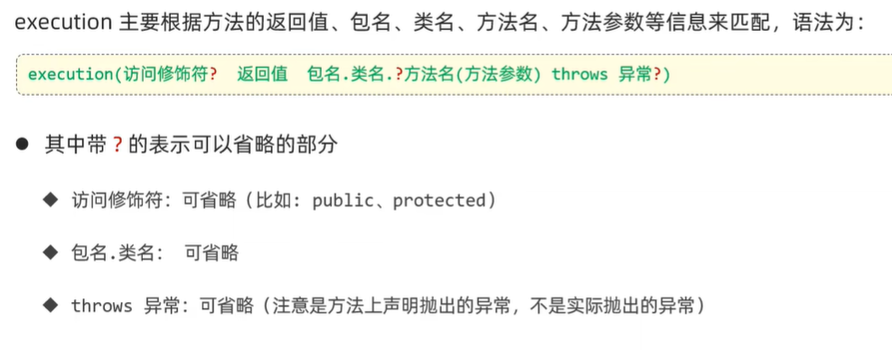
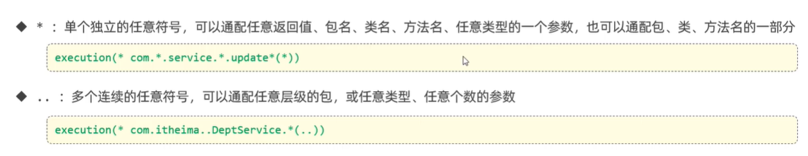

## Spring Boot Quick Start

1. 创建springboot工程并添加web依赖
2. 创建请求处理类

    ````
    package com.cain.italias.controller;

    import org.springframework.web.bind.annotation.RequestMapping;
    import org.springframework.web.bind.annotation.RestController;

    @RestController
    public class DeptController {
        @RequestMapping("/hello")
        public String hello(){
            System.out.println("Hello world");
            return "return of hello funciton";
        }
    }
    ````
3. 启动app,可根据端口号进行访问

*Note:创建SpringBoot工程是联网下载的* 

## Web服务器
想要别人能够通过网络访问到自己的资源，需要所谓的web服务器来负责处理协议以及实现部署。

而在框架中，我们不是将资源交给服务器，单纯依赖服务器来实现所有功能，而是需要和服务器进行交互来实现一些业务逻辑。为此我们希望框架中的web服务器可以：

1. 封装HTTP协议，便于web开发
2. 部署web项目，使其能够通过浏览器访问

在上述springBoot的web依赖中已经包含了`Tomcat` Web服务器了。

### Tomcat服务器
Tomcat支持Servlet规范（java servlet感觉是java用于web的类，之后需深入了解），可以运行Servlet程序，因此也被成为Servlet容器。

## Tomcat 在Spring boot中的应用


首先，Springboot底层提供了DispatcherServlet类，这个类实现了Servlet接口，也就符合Servlet规范。所以它可以被Tomcat识别，也可以用它来使用Tomcat。

浏览器的请求由Tomcat接收，然后它将其封装为Servlet，Servlet再被处理为Controller。响应也是同理，先在Controller中指明要返回的值，然后（我猜是springboot）将Controller转为Servlet，Tomcat将Servlet发送给客户端。<br>
（浏览器的请求和响应分别被Tomcat封装为HttpServletRequest和HttpServletResponse类，这个要等学了Servlet才能搞懂，暂且不管）

我们通过写Controller类便可以实现浏览器的请求和响应。

## 请求响应操作
就如同quickstart中那样，创建请求处理类即可。所谓的请求处理类就是加了`@RestController`的类，类中用`@RequestMapping(/path)`注解来实现对应URL的请求处理方法。

### 注解：
`@RequestMapping(/path)`用来修饰方法，`path`指的是URL。它将HTTP请求映射到被注解的方法上<br>
`@RestController`其实包括了`@ResponseBody`和`@Controller`。<br>
`@ResponseBody`可以作用于类或者方法，它会将方法的返回值封装为浏览器的响应。<br>
`@Controller`用于类，指明该类为Controller组件。

#### RequestMapping指定请求方法
````
@RequestMapping(value = "/depts",method = RequestMethod.GET)
````

为了简写可以用如下方法：
````
@GetMapping("depts")

//类似的
@PostMapping("depts")
@PutMapping("depts")
````

### 处理不同请求类型

#### 传统模式：
````
@RequestMapping("/trad")
public String traditional(HttpServletRequest request){
    String name = request.getParameter("name");
    System.out.println(name);
    return "paramater name: "+name;
}
````

这里传递参数HttpServletRequest，然后从中提起想要的参数并且进行类型转换，处理完数据后，利用return将数据返回给浏览器。

#### SpringBoot模式：

方法的参数名需要和浏览器请求用的get/post方法中的参数名相同。也是利用return将数据返还给浏览器。

#### 1. 简单参数
通常用于get方法，参数在url中
````
@RequestMapping("/sim")
public String simplePara(String name){
    System.out.println(name);
    return "paramater name: "+name;
}
````


#### 2. 路径参数
有时参数会通过路径传递
````
@DeleteMapping("depts/{id}")
public Result deleteMethodDepts(@PathVariable Integer id){
    return deptService.deptDelete(id);
}
````

#### 3. Json参数
json数据在http请求体中，需要加@RequestBody，json内容会自动和标注的变量匹配。

注意： @RequestBody通常用于json或者xml数据，它并非适用所有类型的参数体，例如http body 为text或者form-data类型时无法匹配。它要求Content-Type为application/json或者application/xml类型。
````
@PostMapping("depts")
public Result postMethodDepts(@RequestBody Department dept){
    return deptService.deptAdd(dept);
}
````

#### 4. 文件
上传文件要求前端三要素：input type = file; method=post; enctype="multipart/form-data"。
````
<form action="/upload" method="post" enctype="multipart/form-data">
    name: <input type="text" name="username"> <br>
    file: <input type="file" name="file"><br>
    <input type="submit" value="submit">
</form>
````

文件类型储存到MultipartFile类型中，注意变量名和input name要相同
````
@PostMapping("/upload")
public void upload(MultipartFile file) {
    System.out.println(file.getOriginalFilename());
}
````
MultipartFile封装了一些方法，有获取文件名，获取文件内容，存储文件等功能

## 分层解耦
以请求响应为例，我们可以将全部的代码都写在@RequsetMapping修饰的方法中，但这不利于维护，也不符合`单一职责原则`。

例子：
````
@RestController
public class EmployeeController {
    @RequestMapping("/EmpList")
    public List<Employee>getEmpList(){
        // 1. 获取数据
        // 数据可能来自文件或数据库，方便起见我直接在程序中创建数据来模拟读取过程
        // Employee 有俩属性：String name; String gender
        // 数据中用0，1代表性别
        Employee e1 = new Employee("cain", "1");
        Employee e2 = new Employee("gala", "0");
        List<Employee> ls = new ArrayList<>();
        ls.add(e1); ls.add(e2);

        // 2. 对数据进行处理
        ls.forEach(e ->{
            if(e.getGender() == "0")
                e.setGender("Female");
            else
                e.setGender("Male");
        });

        // 3. 响应请求
        return ls;
    }
}
````

### 三层架构
`Controller`: 控制层，负责接受请求和响应数据。<br>
`Service`:业务逻辑层，处理具体的业务逻辑<br>
`Dao(Data Access Object)`:数据访问层，负责数据库的操作。

对于Service和Dao层，通常创建一个接口和一个实现包，结构如下：


项目代码见：D:\Programming\JavaStudy\springBoot\quickstart

### 解耦
耦合：层与层之间或者模块与模块之间的依赖程度。

在三层框架中，Controller层需要创建Service层类，Service层需要创建Dao层类，所有它们之间的耦合度很高，当底层的类发生改变时，上层的代码也需要改变，这不好维护。为此，springboot提出了一些新概念。

### 控制反转 Inversion of Contorl
对象的创建控制权由程序自身转移到外部（容器）。<br>容器负责创建和管理对象。

对于要交给IOC容器的类，只需要为其加上注解@Component

````
@Component
public class EmpServiceImp implements EmpService {
    // 使用DI来注入empDap接口
    @Autowired
    private EmployeeDAO empDao;

    @Override
    public List<Employee> getEmpList() {
        List<Employee> ls = empDao.getEmpList();
        // 2. 对数据进行处理
        ls.forEach(e -> {
            if (e.getGender() == "0")
                e.setGender("Female");
            else
                e.setGender("Male");
        });

        return ls;
    }
}
````

### 依赖注入 Dependency Injection
容器为程序提供其所依赖的资源。

用法： 声明成员变量（通常是一个接口），然后使用@Autowire注解来为其赋值。与IOC搭配使用。
````
@RestController
public class EmployeeController {
    // 使用DI为empService接口注入
    @Autowired
    private EmpService empService;
    
    @RequestMapping("/EmpList")
    public List<Employee>getEmpList(){
        List<Employee> ls = empService.getEmpList();
        // 3. 响应请求
        return ls;
    }
}
````

如果IOC容器中有多个实现该接口的类，则会报错。为此可以使用@Primary, @Qualifier, @Resource。不过它们的功能只是允许显式指明要使用哪个Bean，感觉用处不大。

### Bean对象
IOC容器中创建和管理的对象，称为Bean。

#### Bean 类型
被@Component注解声明的类被当作Bean对象。除了宽泛的@Component外，还有衍生的@Controller,@Service,@Repository来分别创建控制层，逻辑层和数据层的Component。


#### Bean 扫描
@ComponentScan注解用来声明去哪里寻找Bean。默认范围是注解所在的当前包和子包。

@ComponentScan包含在启动类的@SpringBootApplication注解中。

## 配置文件
### 配置文件类型
Spring Boot 支持property和yml两种类型的配置文件，它们俩语法不同，但是作用是完全相同的。

### 参数配置化
项目中有很多代码需要配置参数，例如连接数据库，连接云端服务器等，与其将代码分散配置，不如放在配置文件中统一管理。

#### property
在property文件中，可以定义变量并赋值
````
myTest.v1 = hello
myTest.v2 = cain
````

#### @Value
@Value只能修饰成员变量，框架在启动时会查找application.property中同名变量并为被@Value修饰的类创建实例并且作为bean。
````
public someclass{
    @Value("${myTest.v1}")
    private String v1;

    @Value("${myTest.v2}")
    private String v2;
}
````

#### @ConfigurationProperties
@Value在修饰很多值的时候会显得臃肿，@ConfigurationProperties可以修饰整个类，而不是单个成员变量。

创建一个配置类，该类必须有get/set方法以及需要成为bean，所有有@Data和@Component。（一般来说，该配置类会在utils包下）

@ConfigurationProperties(prefix = "")会在property文件中查找prefix为特定值的变量，并根据变量名来匹配类中的成员变量。

````
@Data
@Component
@ConfigurationProperties(prefix = "ali.yun")
public class AliYunConfigure {
    private String endpoint;
    private String accessKeyId;
    private String bucketName;
}
````
application.property
````
ali.yun.endpoint = "endpoint1"
ali.yun.access-key-id= "123456"
ali.yun.bucket-name="bucket1"
````

在使用时需要创建bean对象：
````
@Autowired
private AliYunConfigure aliYunConfigure;

@RequestMapping("/test")
public void test() {
    System.out.println(aliYunConfigure.getEndpoint());
    System.out.println(aliYunConfigure.getAccessKeyId());
    System.out.println(aliYunConfigure.getBucketName());
}
````

### 工具包
有个工具包可以智能识别被标注的变量，从而在写property时，能够自动补全变量名。

````
<dependency>
    <groupId>org.springframework.boot</groupId>
    <artifactId>spring-boot-configuration-processor</artifactId>
</dependency>
````

## 登录校验
### 总体流程


每次登录成功后，数据库存储一个登录标记，之后用户访问其它数据就出示这个标记。为了避免在每个url下都写标记检查代码，提出了统一拦截的思想。

### 会话
`会话`：当浏览器和服务器建立连接后，之后的多次请求响应都属于同一个会话，只有浏览器关闭后，会话结束。

`会话跟踪`：对于属于同一个会话的请求响应，很多数据是可以共享的。会话跟踪就是用来检查请求响应是否属于同一个会话。

### 会话跟踪技术：

1. Cookie


在用户登录后，服务器为创建一个cookie储存用户信息，然后将cookie在http 响应报文的 Set-Cookie字段中传递给浏览器。浏览器收到cookie后，会自动储存到本地。然后该会话中的所有请求报文中，都在Cookie字段设置cookie。

````
public class SessionController {
    //设置cookie
    @GetMapping("/c1")
    public void setCookie(HttpServletResponse response){
        response.addCookie(new Cookie("username", "cookie-user"));
    }

    //获取cookie
    @GetMapping("/c2")
    public void getCookie(HttpServletRequest request){
        Cookie[] cookies = request.getCookies();
        for (Cookie cookie : cookies) {
            System.out.println(cookie.getName()+" : "+cookie.getValue());
        }
    }
}
````

cookie优点：http协议支持

缺点：存储的内容不安全；移动端不支持；跨域不支持；

2. session
   


session是基于cookie实现的，只是将cookie中的数据存储在服务器的session中。

第一次连接到服务器，服务器创建session，并在该session中存储该会话的信息。然后服务器将session id用cookie传递会浏览器，浏览器存储session id，并在之后的请求中用cookie传递该session id。

````
@GetMapping("/s1")
// spring来传递session，如果是第一次请求，此时没有session，spring则创建session
public void setSession(HttpSession session) {
    // 在session中存放数据
    session.setAttribute("username", "user-session");
}

@GetMapping("/s2")
public void getSession(HttpServletRequest request) {
    HttpSession session = request.getSession();
    System.out.println(session.getAttribute("username"));
}
````

3. 令牌

思路和上述一致，第一次连接时，服务器创建令牌并交给浏览器，浏览器存储令牌，并在会话中的每次请求使用令牌。

由于令牌技术并不依赖cookie，所以在移动端也可以使用。

#### Json Web Token (JWT令牌)


个人感觉和cookie差不多，而且使用base64编码，不是加密，所以感觉安全性没有保证。但是有些库好像实现了加密功能。

此外从图中也可以看出，令牌只是单纯的字符串，并不依赖cookie或者其它机制，完全是自实现的。

````
public class JWT {
    private static SecretKey key = Jwts.SIG.HS256.key().build();

    public static String generateJWT(Map<String,Object> load){
        String jwt = Jwts.builder().claims(load).signWith(key).compact();
        return jwt;
    }

    public static Map<String,Object> parsarJWT(String jwt){
        return Jwts.parser().verifyWith(key).build().parseSignedClaims(jwt).getPayload();
    }
}
````
注意：http 协议的header是可以自定义字段的。所以当用户登录成功并且获取jwt后，客户端可以自己决定如何存储jwt，只要在之后的请求中，在header添加自定义的字段来传输jwt即可。

### Filter 统一拦截
可以创建一个或多个Filter类来统一拦截访问各个url的请求。

Filter类在Controller类之前获取请求，并且由Filter决定是否将请求交给Controller处理。


(1) 该类要实现javax.servlet.Filter接口，并实现它的doFilter方法。该方法指定对拦截url的处理。

(2) 该类需要@WebFilter(urlPatterns = "/*")来指定拦截对象。

(3) 在application类上加@ServletComponentScan注解

(4) 多个Filter的话，会按照Fliter类名的字母顺序进行多次拦截。

#### Filter类
````
@WebFilter(urlPatterns = "/*")
public class DemoFilter implements Filter {

    @Override
    public void doFilter(ServletRequest request, ServletResponse response,
            FilterChain chain) throws IOException, ServletException {

        HttpServletRequest httpRequest = (HttpServletRequest) request;
        HttpServletResponse httpResponse = (HttpServletResponse) response;
        String url = httpRequest.getRequestURL().toString();

        // 1. 登录操作，直接放行
        if(url.contains("login")){
            // 放行：允许该url去请求和获取响应
            chain.doFilter(request, response);  
            return;
        }
        // 2. 非登录操作，但携带jwt
        String jwt = httpRequest.getHeader("token");
        try {
            JWT.parsarJWT(jwt);
        } catch (Exception e) {
            // 捕获到异常说明jwt错误或者没有jwt
            // 不放行，并且直接返回信息
            Result res = new Result(0, "Not login", null);
            // 由于不再controller中，只能手动转json并写入response
            String resJsonStr = JSONObject.toJSONString(res);
            response.getWriter().write(resJsonStr);
            return;
        }
        // 没有进入catch，说明jwt验证通过，可以放行
        chain.doFilter(request, response);  
        return;
    }
}
````
注意：dofilter只是允许url对应的controller处理请求并且修改或创建response，但它并没有发送response给浏览器。只有Filter return之后，才会将response返回。

### Interceptor
拦截器Interceptor和过滤器Filter在功能上并无差别。不过Filter不属于Spring，会拦截所有资源；但是Interceptor属于Spring，跟框架更好适配并且只拦截Spring环境中的资源。

注意：Interceptor和Filter是可以同时存在的。


Interceptor类

(1) preHandle：对拦截的请求进行逻辑处理，返回true表示放行；返回false表示不放行

(2) postHandle：对请求放行后这个函数才调用，如果preHandle返回false，该函数不调用。该函数负责Controller处理后继续进行逻辑处理

(3) afterCompletion：我也不知道

````
@Component
public class LoginInterceptor implements HandlerInterceptor{

    // 放行前的操作
    // 对应登录验证，只需要进行放行前操作
    @Override   
    public boolean preHandle(HttpServletRequest request, HttpServletResponse response, Object handler)
    throws Exception {
        // 查看jwt
        String jwt = request.getHeader("token");
        try {
            JWT.parsarJWT(jwt);
        } catch (Exception e) {
            // 捕获到异常说明jwt错误或者没有jwt
            // 不放行，并且直接返回信息
            Result res = new Result(0, "Not login", null);
            // 由于不再controller中，只能手动转json并写入response
            String resJsonStr = JSONObject.toJSONString(res);
            response.getWriter().write(resJsonStr);
            return false;
        }
        // 没有进入catch，说明jwt验证通过，可以放行
        return true;
    }
    
    @Override   // 放行后的操作
    public void postHandle(HttpServletRequest request, HttpServletResponse response, Object handler,
    ModelAndView modelAndView) throws Exception {
        // TODO Auto-generated method stub
        System.out.println("one url is passed");
    }

    @Override   // 说是渲染后的操作，我也不知道是啥
    public void afterCompletion(HttpServletRequest request, HttpServletResponse response, Object handler, Exception ex)
            throws Exception {
        System.out.println("completion...");
    }
}
````

配置类

对应Interceptor类，需要在配置类中注册。
````
@Configuration
public class WebConfig  implements WebMvcConfigurer{
    @Autowired
    LoginInterceptor loginInterceptor;

    @Override
    public void addInterceptors(InterceptorRegistry registry) {
        registry.addInterceptor(loginInterceptor).addPathPatterns("/**").excludePathPatterns("/login");
    }
}
````
注意：


## 异常处理
在框架中也会有异常发生，例如sql语句执行失败。下层的异常会向上层抛出Mapper->Service->Controller->Spring。

为了捕获和处理异常，我们可以定义异常处理类来处理所有Controller层的异常。

````
@RestControllerAdvice
public class ControllerExceptionHandler {
    @ExceptionHandler(Exception.class) //指明处理的异常类型，这里选的是全部异常
    public Result ex(Exception ex){
        ex.printStackTrace();
        return new Result(0, "Exception happen", null);
    }
}
````

## 事务处理

事务是指一组不可分割的操作集合，要么全都执行，要么全都不执行。

Service层可能会设计多个数据库操作，但是我们希望它们要么都发生，要么都不发生。

在spring中，只需要在方法/类/接口上加@Transactional即可，框架会自动将方法配置为事务。
````
@Transanctional
public Result deptDelete(int id) {
    int affectedNum = deptMapper.deptDelete(id);
    empMapper.deleteEmp(id);
}
````

此外@Transacntional也可以进行配置。默认情况下，@Transanctional遇到runtimeException时才会回滚，可通过`@Transactional(rollbackFor = Exception.class)`来配置为所有异常都回滚。

也可以配置事务之间的传播行为来处理多个事务的情景，这个略微复杂，有需要再查看。

## AOP Aspect oriented programming

面向切片编程其实就是面向特定方法编程。

例子：如何统计Service层所有方法的耗时？相较于改变每个方法的代码，可以声明AOP程序来统一更改。

### quick start
（1） 添加依赖
````
<dependency>
    <groupId>org.springframework.boot</groupId>
    <artifactId>spring-boot-starter-aop</artifactId>
</dependency>
````

（2） 创建一个AOP包，并写AOP类
````
@Component
@Aspect     //声明为AOP程序
public class TimeAspect {
    // @Around 指定对哪些方法进行修改
    @Around("execution(* com.example.itheima.service.*.*(..))")
    public Object recordTime(ProceedingJoinPoint joinPoint) throws Throwable{
        long beginTime = System.currentTimeMillis();

        // 调用原始方法运行，Object返回值也是原始方法的返回值，继续返回就行
        Object result = joinPoint.proceed();

        long endTime = System.currentTimeMillis();
        System.out.println(joinPoint.getSignature()+" costs: "+(endTime-beginTime));
        return result;
    }
}
````

### 通知
AOP 类中的方法被成为通知，通知作用于的方法被称为目标方法。

#### 通知类型


#### 通知执行顺序
如果多个AOP类作用于相同的目标方法，可以通过@Order()注解来指示AOP类的执行顺序。


### 切入点表达式
切入点表达式就是“execution(* com.example.itheima.service.*.*(..))”，它声明了去哪找目标方法，被称为切入点表达式。

切入点表达式有多种类型，这里介绍exectuion和@annotation两种。

#### Execution


````
@Around("execution(* com.example.itheima.service.*.*(..))")
````

其中路径必须到达方法。即`com.example.itheima.service`到达service包；`.*`选择service包下的所有类；`.*.*`选择了service包下所有类的所有方法；(..)表示任意参数类型的方法都被选择。此外，开头的 `*`表示任意返回类型的方法都被选择。

#### @Annotation
@Annotation是基于注解定位切入点的。

1. 自定义注解
2. 对目标方法添加自定义注解
3. 在AOP类的方法上，添加@Annotation(自定义注解的全类名)作为切入点表达式。

#### 抽取切入点表达式
由于AOP中每个方法都要写切入点表达式，可以用@Pointcut来将它提取出来。

````
@Component
@Aspect
public class TestAspect {
    @Pointcut("execution(* com.example.itheima.controller.*.*(..))")
    public void pt(){}

    @Before("pt()")
    public void Before(){
        System.out.println("Before ...");
    }

    @After("pt()")
    public void After(){
        System.out.println("After ...");
    }
}
````

### 连接点
在AOP的方法中，可以通过连接点参数来获取目标方法的相关信息，例如类名，方法名，参数等。

对于@Around通知类型，使用ProceedingJoinPoint参数；对于其它类型，使用JoinPoint参数。其中ProceedingJoinPoint是JoinPoint的子类。


