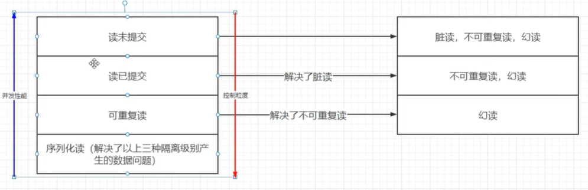

## Spring 框架

框架就是一个半成品应用，通过添加自己的代码来实现完整程序。而 Spring Framework就是一个轻量级开源框架。

## Quick Start

1. 创建新项目作为父项目，在父项目下创建module作为子项目
2. 在子项目中添加spring依赖

```
<dependencies>
    // spring 依赖
    <dependency>
        <groupId>org.springframework</groupId>
        <artifactId>spring-context</artifactId>
        <version>6.1.2</version>
    </dependency>

    // junit 依赖
    <dependency>
        <groupId>org.junit.jupiter</groupId>
        <artifactId>junit-jupiter-api</artifactId>
        <version>5.10.1</version>
        <scope>test</scope>
    </dependency>
</dependencies>
```

3. 在子项目中创建User类

```
package com.example.pojo;

public class User {
    public void hello(){
        System.out.println("hello, here is User.hello() func!");
    }
}
```
4. 在resource下创建bean.xml，将User类添加其中

```
<?xml version="1.0" encoding="UTF-8"?>
<beans xmlns="http://www.springframework.org/schema/beans"
       xmlns:xsi="http://www.w3.org/2001/XMLSchema-instance"
       xsi:schemaLocation="http://www.springframework.org/schema/beans http://www.springframework.org/schema/beans/spring-beans.xsd">

    <bean id="user" class="com.example.pojo.User"></bean>
</beans>
```

5. 在单元测试中创建User实例并且测试

```
@Test
public void userTest(){
    // 加载xml配置文件
    ApplicationContext applicationContext = new ClassPathXmlApplicationContext("bean.xml");

    // 获取bean对象
    User user = (User)applicationContext.getBean("user");

    // 使用对象
    user.hello();
}
```


## IOC 控制反转

IOC (Inverse of control)是spring 框架中在一个重要思想：对象的创建和管理不再由程序员负责，而是由Spring来负责。这有助于程序的松耦合。

Spring中使用IOC容器来负责对象的实例化和初始化，并控制对象和对象之间的依赖关系。由IOC管理的对象被称为bean。

IOC本质上也是一个JAVA类来实现的，只要实现了BeanFactory接口的JAVA类都可以当作IOC。JAVA中IOC接口和实现类为：


## 基于 XML 进行 Bean 管理

在xml文件中通过id和class定义bean元素，id可以自定义，class是类的全类名：

```
<bean id="user" class="com.example.pojo.User"></bean>
```

之后将xml交给beanFactory的实现类，由其进行对象管理
```
ApplicationContext applicationContext = new ClassPathXmlApplicationContext("bean.xml");
```

### Bean 获取

1. 根据id获取

```
User user = (User)applicationContext.getBean("user");
```

2. 根据类名获取

```
User user = (User) applicationContext.getBean(PersonInterface.class);
```

该方法常用于通过接口来获取对应的实现类，但如果xml文件中根据该接口找到了两个或更多实现类，则会报错。

### 依赖注入

BeanFactory创建类默认用无参构造，依赖注入允许beanfactory创建对象的时候为其赋值。*（不过写死到配置文件中有什么用？）*

**1. 通过setter**

首先在类中写set方法
```
public void setName(String myname){
    this.name = myname;
}
```

然后在xml中配置property
```
<bean id="user" class="com.example.pojo.User">
    <property name="name" value="cain"></property>
</bean>
```

这里name="name"是指要调用setName方法，"name"对应setName中的Name，value是传入set方法的参数。

这样创建bean时，对象就有值了
```
User user = (User)applicationContext.getBean("user");
System.out.println(user)
```

**2. 通过有参构造器**

首先在类中写有参构造器
```
public User(String myname, int age) {
    this.name = myname;
    this.age = age;
}
```

然后在xml中配置要传递的值
```
<bean id="user" class="com.example.pojo.User">
    <constructor-arg name="myname" value="cain"></constructor-arg>
    <constructor-arg name="age" value="18"></constructor-arg>
</bean>
```

**3. 特殊值处理**

在上述两种方法赋值的过程中，会有一些特殊情况：

* 值为null
```
<constructor-arg name="myname">
    <null></null>
</constructor-arg>
```

* 使用了特殊字符，例如<>，需要用CDATE标签来包含特殊值

```
<constructor-arg name="myname">
    <value><![CDATA[a<b]]></value>
</constructor-arg>
```

**4. 复杂类型赋值**

类中的成员变量也可能为其它类，列表，数组等

* 类对象：使用ref标签引用另一个xml元素

```
<bean id="user" class="com.example.pojo.User">
    <constructor-arg name="name" value="cain"></constructor-arg>
    <constructor-arg name="age" value="18"></constructor-arg>
    <constructor-arg name="card" ref="card"></constructor-arg>
</bean>

<bean id="card" class="com.example.pojo.Card">
    <property name="cname" value="cain's card"></property>
</bean>
```

* 数组：用array标签包围value

```
<bean id="user" class="com.example.pojo.User">
    <constructor-arg name="name" value="cain"></constructor-arg>
    <constructor-arg name="age" value="18"></constructor-arg>
    <constructor-arg name="hobbies">
        <array>
            <value>swim</value>
            <value>dance</value>
        </array>
    </constructor-arg>
</bean>
```

* 列表：类似于数组，将array标签替换为list就行

* Map: 用Map标签和entry标签

```
<bean id="user" class="com.example.pojo.User">
    <constructor-arg name="name" value="cain"></constructor-arg>
    <constructor-arg name="age" value="18"></constructor-arg>
    <constructor-arg name="pair">
        <map>
            <entry key="my son" value="18"></entry>
        </map>
    </constructor-arg>
</bean>
```

* 外部文件：用外部文件中的值来赋值

首先写外部文件，例如jdbc.properties:
```
username=root
password=123456
url=jdbc:mysql://localhost:3306/
driver=com.mysql.cj.jdbc.Driver
```

然后在bean.xml文件中添加一个context scheme
```
<beans xmlns="http://www.springframework.org/schema/beans"
       xmlns:xsi="http://www.w3.org/2001/XMLSchema-instance"
       xmlns:context = "http://www.springframework.org/schema/context"
       xsi:schemaLocation="http://www.springframework.org/schema/beans
       http://www.springframework.org/schema/beans/spring-beans.xsd
       http://www.springframework.org/schema/context
       http://www.springframework.org/schema/context/spring-context.xsd">
```

指明要用的外部文件和值
```
<context:property-placeholder location="classpath:jdbc.properties"></context:property-placeholder>

<bean id="druidDataSource" class="com.alibaba.druid.pool.DruidDataSource">
    <property name="url" value="${url}"></property>
</bean>
```

**5. bean的构造时机**

xml文件中的bean有scope属性，其有两个值：singleton和prototype

singleton是默认值，表示该类为单实例，在IOC容器初始化时就创建实例

prototype表示多实例，在获取bean时才创建实例（每次调用都会创建一个新的实例）

之所以用单例，是因为没必要每个请求都新建一个对象，这样子既浪费CPU又浪费内存；

之所以用多例，是为了防止并发问题；即一个请求改变了对象的状态，此时对象又处理另一个请求，而之前请求对对象状态的改变导致了对象对另一个请求做了错误的处理；


```
<bean id="user" class="com.example.pojo.User" scope="prototype">
    <constructor-arg name="name" value="cain"></constructor-arg>
    <constructor-arg name="age" value="18"></constructor-arg>
</bean>
```

**6. bean的生命周期**

bean的生命周期为：构造函数->setter->初始化->使用bean->摧毁bean

其中初始化方法和摧毁方法需要在类中声明，以及在xml中指出
```
<bean id="user" class="com.example.pojo.User" scope="prototype" init-method="initMethod" destroy-method="destroyMethod">
        <constructor-arg name="name" value="cain"></constructor-arg>
        <constructor-arg name="age" value="18"></constructor-arg>
</bean>
```

```
public void initMethod(){
    System.out.println("initMethod is called");
}

public void destroyMethod(){
    System.out.println("destroyMethod is called");
}
```

其实在初始化前后还有处理器函数可以设置，这俩函数会作用于xml文件中的所有bean对象，暂且不知道有啥用，所以略过。

**7. 自动注入**

在类中声明成员变量和setter方法后，如果该成员变量是个类，而这个成员变量的类也放在IOC容器中了，那么可以使用autowire属性来让spring自己去找setter方法应该传递的值。

```
public class User{
    private String name;
    private int age;
    private Card card;

    public User(String name, int age) {
        this.name = name;
        this.age = age;
        System.out.println("parameter construct method is called");
    }

    public void setCard(Card card){
        System.out.println("setCard func is called");
        this.card = card;
    }
}
```

```
<bean id="user" class="com.example.pojo.User" autowire="byType">
    <constructor-arg name="name" value="cain"></constructor-arg>
    <constructor-arg name="age" value="18"></constructor-arg>
<!--        <property name="card" ref="card"></property>-->
</bean>

<bean id="card" class="com.example.pojo.Card">
    <property name="cname" value="gold card"></property>
</bean>
```

autowire查找setter需要的参数的方式有两种：byType和byName。

byType就是通过setter参数类型在pom文件中找对应类型的bean，所以该方法要求bean为单例

byName则是根据setXXX方法中的XXX作为name，去查找IOC容器中该name对应的bean，从而进行赋值。

## 基于注解管理bean

注解是java中的特殊标识，它允许在不修改原有代码的情况下添加新的信息。

### 创建bean

首先需要在xml中开启component-scan，并指出要扫描的包（包括其子包）

```
<context:component-scan base-package="com.cain"></context:component-scan>
```

之后对需要添加为bean的类加上注解即可
```
@Component(value="user")
public class User {
    public String name;
}
```
注解中的value对应xml文件中bean元素的id，不设置的默认值为类名小写

注解类型有：@Componet,@Controller,@Service,@Repository，其本质没有区别，不过可以给bean分类，然后根据类别剔除注解，例如：

```
<context:component-scan base-package="com.cain">
    <context:exclude-filter type="annotation" expression="org.springframework.stereotype.Controller"/>
</context:component-scan>
```

@Controller注解的类将不会被注册为bean

### Bean对象的依赖注入

可以使用@Autowired注解实现依赖注入，它和xml中的autowire="xxx"有相同功能，并且能实现更精细的控制。例如xml中设置autowire="byType"是作用于所有setter的，而@Autowired加在哪个方法或属性上，才对该方法或属性进行自动注入。

@Autowried注解可以用于：成员变量，setter，构造器，形参变量。其本质是对被注解的元素或方法中的参数进行自动依赖注入。注入规则是先根据Type查找bean，如果有多个bean，则根据name查找bean。

```
@Component
public class User {
    @Autowired
    public Card card;
}
```

如果希望使用autowier="byName"，可以搭配@Qualifier来使用

```
@Component
public class User {
    @Autowired
    @Qualifier(value = "cardID")
    public Card card;
}
```

```
@Component(value = "cardID")
public class Card {
    public void show(){
        System.out.println("I'm a card");
    }
}
```

@Autowired是Spring提供的注解，其实jdk拓展中有个@Resource注解也可以实现相同的功能。根据jdk不同版本，要使用该注解可能需要引用拓展。

@Resource注解默认是byName搜索bean，如果没有搜索到，则使用byType搜索。所以功能比@Autowired稍微强点，但是不多，所以略过。

### 全注解开发

bean的创建和依赖注入都由注解完成，现在xml文件中只是开启了component scan并指明扫描bean的范围。为此可以创建配置类来完全取代xml文件：

```
@Configuration  //声明为配置类
@ComponentScan("com.cain")  //开启组件扫描
public class SpringConfig {
}
```

修改读取xml文件为读取配置类
```
public void userTest(){
    AnnotationConfigApplicationContext applicationContext = new AnnotationConfigApplicationContext(SpringConfig.class);
    User user = applicationContext.getBean("user",User.class);
    user.card.show();
}
```

### @Bean注解

@Bean 注解是Spring框架中用于声明bean的一种方式。它通常用在配置类(也称作Java Config)中,为Spring容器提供bean的定义。

使用 @Bean 注解的一些基本规则如下:

1. 方法级注解: @Bean 注解通常直接添加在方法声明上,表明该方法将返回一个对象,并且这个对象会被Spring容器管理为一个bean。
2. bean名称: 默认情况下,bean的名称就是方法名。也可以通过@Bean(name="customName") 的方式来指定bean的名称。
3. bean作用域: 默认情况下,使用 @Bean 定义的bean作用域为单例(Singleton)。如果需要其他作用域,可以通过 @Scope 注解进行指定。
4. 依赖注入: 在 @Bean 方法中可以接受参数,这些参数会被Spring自动注入,允许bean之间进行依赖关系的设置。
5. 初始化和销毁: 可以使用 @Bean(initMethod="init", destroyMethod="destroy") 的方式来指定bean的初始化和销毁方法。

## IOC原理解析

IOC容器主要依赖反射技术和注解来实现

1. 首先定义注解来标记要注册为bean的类，和要依赖注入的属性

2. 创建beanFactory的实现类，该类的成员变量有Map容器来存储<Class,Object>
   
3. 该类的构造函数需要一个bean检查范围（比如com.cain），根据该检查范围可以获取这个包以及它的子包下的所有类的全类名，根据全类名可以判断各个类是否包含@Bean注解，如果包含@Bean注解，利用反射机制来创建实例，将这个类的<Class,Object>存储到Map容器中。

4. 构造函数检查完所有类后，Map容器已经存储了所有bean了。遍历Map中的object，利用反射机制检查各个类的属性是否包含@Autowired注解，如果有被注解的成员变量，根据该成员变量的类型，在Map中找对应的object进行自动注入

5. 这样bean创建，存储和依赖注入都完成了


## AOP

AOP （Aspect Oriented Programming）是指面向切片编程，它是一种改善面向对象编程的思想。

**其产生思路如下：**

JAVA使用OOB编程，虽然OOB相较于函数式编程有很大进步，但是它本身还是有一些问题的。

例如很多类都需要日志功能，如果每个类都自己写日志功能的话其实是做了很多重复工作：


既然代码重复，自然就想到把这个功能抽取出来作为一个单独的类：


不过每个类要使用日志功能的话，需要引用Logger类，并调用它的函数。这意味这如果我修改了Logger的接口，我需要修改所有引用Logger的所有类。

那能不能进一步降低耦合呢？这就提出了AOP的思想：


我不在创建类了，而是创建一个Aspect（本质上也是一个特殊类），在Aspect里写日志功能，并且通过Aspect Configuration来指明我要在哪个类里的什么时机调用（例如在Object A的function 1调用后调用Logging Aspect）。 这样我修改Logging Aspect后，对于其它类的代码完全不需要修改。

**AOP思想的技术实现**

有一个设计模式的思想和AOP高度重合，那就是代理技术（具体见java/javaFunc.md）。而java中实现的动态代理类就可以用来实现AOP思想，但是动态代理用起来非常麻烦，所以spring就自己实现了srping AOP框架来封装了动态代理类，从而方便地实现了AOP思想。

### Quick Start

1. 添加依赖

```
<dependency>
    <groupId>org.springframework</groupId>
    <artifactId>spring-aop</artifactId>
    <version>6.1.2</version>
</dependency>

<dependency>
    <groupId>org.springframework</groupId>
    <artifactId>spring-aspects</artifactId>
    <version>6.1.2</version>
</dependency>
```

2. 修改xml文件

```
<?xml version="1.0" encoding="UTF-8"?>
<beans xmlns="http://www.springframework.org/schema/beans"
       xmlns:context="http://www.springframework.org/schema/context"
       xmlns:aop="http://www.springframework.org/schema/aop"
       xmlns:xsi="http://www.w3.org/2001/XMLSchema-instance"
       xsi:schemaLocation="http://www.springframework.org/schema/context
       http://www.springframework.org/schema/context/spring-context.xsd
       http://www.springframework.org/schema/aop
       http://www.springframework.org/schema/aop/spring-aop.xsd
       http://www.springframework.org/schema/beans
       http://www.springframework.org/schema/beans/spring-beans.xsd">

    // 设置bean扫描范围
    <context:component-scan base-package="com.cain.AOP"></context:component-scan>
    // 开启自动依赖
    <aop:aspectj-autoproxy></aop:aspectj-autoproxy>

</beans>
```

3. 创建基本类

```
@Component
public class Triangle {
    public void show(){
        System.out.println("I'm a triangle");
    }
}
```

4. 创建aspect类

```
@Aspect
@Component
public class LoggerAspect {
    @Before("execution(void show())")
    public void test(){
        System.out.println("Logger aspect is executed");
    }
}
```

5. 测试

```
@Test
public void aopTest(){
    ClassPathXmlApplicationContext applicationContext = new ClassPathXmlApplicationContext("bean.xml");
    Triangle triangle = applicationContext.getBean("triangle", Triangle.class);
    triangle.show();
}
```


### 通知
Aspect 类中的方法被成为通知，通知作用于的方法被称为目标方法。

#### 通知类型


不同通知类型，除了位置不同，能够获取的参数和能做到事情也是不同的：
```
@Aspect
@Component
public class LoggerAspect {
    // JoinPoint 是所有类型都可以获取的参数，它包含了目标函数的相关信息
    @Before("execution(int sum(..))")
    public void beforeTest(JoinPoint joinPoint){
        System.out.println("before is called");
        System.out.println(Arrays.toString(joinPoint.getArgs()));
        System.out.println(joinPoint.getSignature().getName());
    }

    // After 和 Before 几乎相同
    @After("execution(int sum(..))")
    public void afterTest(){
        System.out.println("after is called");
    }

    // AfterReturning 因为是返回后，可以查看返回结果
    // 标签中returning的值和函数中参数的名称必须一致
    @AfterReturning(value = "execution(int sum(..))", returning = "result")
    public void afterReturnTest(Object result){
        System.out.println("AfterReturn is called, result is "+result);
    }

    // AfterThrowing 可以获取异常值
    // 标签中throwing的值和函数中Throwable 变量名称必须一致
    @AfterThrowing(value = "execution(int sum(..))", throwing = "ex")
    public void afterThrowingTest(Throwable ex){
        System.out.println("AfterThrowing is called, exception is "+ex);
    }
    // round 需要自己负责目标函数调用,也需要将目标函数结果返回
    // 目标函数的执行需要ProceedingJoinPoint
    @Around("execution(int sum(..))")
    public Object aroundTest(ProceedingJoinPoint joinPoint) throws Throwable {
        System.out.println("around is called");
        Object res = joinPoint.proceed();
        return res;
    }
}
```

#### 通知执行顺序
如果多个通知作用于相同的目标方法，可以通过@Order()注解来指示通知的执行顺序。


### 切入点表达式
切入点表达式就是“execution(* com.example.itheima.service.*.*(..))”，它声明了去哪找目标方法，被称为切入点表达式。

切入点表达式有多种类型，这里介绍exectuion和@annotation两种。

#### Execution


````
@Around("execution(* com.example.itheima.service.*.*(..))")
````

其中路径必须到达方法。即`com.example.itheima.service`到达service包；`.*`选择service包下的所有类；`.*.*`选择了service包下所有类的所有方法；(..)表示任意参数类型的方法都被选择。此外，开头的 `*`表示任意返回类型的方法都被选择。

#### 抽取切入点表达式
由于AOP中每个方法都要写切入点表达式，可以用@Pointcut来将它提取出来。

````
@Component
@Aspect
public class TestAspect {
    @Pointcut("execution(* com.example.itheima.controller.*.*(..))")
    public void pt(){}

    @Before("pt()")
    public void Before(){
        System.out.println("Before ...");
    }

    @After("pt()")
    public void After(){
        System.out.println("After ...");
    }
}
````

#### @Annotation
@Annotation是基于注解定位切入点的。

1. 自定义注解
2. 对目标方法添加自定义注解
3. 在AOP类的方法上，添加@Annotation(自定义注解的全类名)作为切入点表达式。

### AOP原理

Spring的AOP实现原理其实很简单，就是通过动态代理实现的。如果我们为Spring的某个bean配置了切面，那么Spring在创建这个bean的时候，实际上创建的是这个bean的一个`代理对象`，我们后续对bean中方法的调用，实际上调用的是代理类重写的代理方法。**（注意：只有用AOP的时候IOC容器里存储的才是代理对象，如果没有Aspect类，则存储的是原本的类）**

不过代理对象的生成方式有两种：JDK代理对象和CGLIB代理对象。Spring会根据不同的情况使用不同的代理方法。例如JDK动态代理是通过目标对象继承的接口来创建代理类的，如果没有bean接口就无法用该方法，只能转CGLIB。

以下是一个测试代理的方式：
```
public void testProxy() {
    ApplicationContext context =
        new AnnotationConfigApplicationContext(AOPConfig.class);
	// 注意，这里只能通过Human.class获取，而无法通过Student.class
    // 因为在Spirng容器中使用JDK动态代理，Ioc容器中，存储的是一个类型为Human的代理对象
    Human human =  context.getBean(Human.class);
    human.display();
    // 输出代理类的父类，以此判断是JDK还是CGLib
    // 如果输出是Proxy说明是JDK（因为JDK方式的代理类是Proxy的子类）
    System.out.println(human.getClass().getSuperclass());
}
```

上述代码判断代理方法的方式很简单，查看代理对象的父类就行，因为JDK中代理类继承的是Proxy方法，而CGLIB中继承的目标类。


### 基于XML的AOP

在上述过程中，都是利用@Aspect和@Before等注解来声明aspect和通知，除了注解声明，也可以在xml文件中声明。知道有就行，需要用在查。

## Spring 整合 Junit

在上述代码中，每次获取bean都需要调用ClassPathXmlApplicationContext类，十分麻烦。Spring提供依赖来整合Junit，从而可以方便地获取bean。

1. 引入依赖

```
// Spring 整合 Junit 依赖
<dependency>
    <groupId>org.springframework</groupId>
    <artifactId>spring-test</artifactId>
    <version>6.1.2</version>
</dependency>

// Junit 本身依赖
<dependency>
    <groupId>org.junit.jupiter</groupId>
    <artifactId>junit-jupiter-api</artifactId>
    <version>5.10.1</version>
    <scope>test</scope>
</dependency>
```

2. 创建单元测试，并且使用bean

```
@SpringJUnitConfig(locations = "classpath:bean.xml")
public class AOPTest {
    @Autowired
    private Triangle triangle;

    @Test
    public void aopTest(){
        int res = triangle.sum(1,2,3);
        System.out.println("res is "+res);
    }
}
```

其中用@SpringJUnitConfig指明xml文件位置，并且用@Autowired来创建bean。

## 事务

### 什么是事务

数据库事务是指要执行的一系列操作,这些操作要么一起成功,要么一起失败,是一个不可分割的工作单元。例如一个service中往往需要调用不同的dao层方法,这些方法要么同时成功要么同时失败,我们需要在service层确保这一点。

#### 事务的四大特性：

* 原子性(Atomicity): 一个事务(transaction)中的所有操作,要么全部完成,要么全部不完成,不会结束在中间某个环节。事务在执行过程中发生错误,会被回滚(Rollback)到事务开始前的状态,就像这个事务从来没有执行过一样。

* 一致性(Consistency): 在事务开始之前和事务结束以后,数据库的完整性没有被破坏。这表示写入的资料必须完全符合所有的预设约束、触发器、级联回滚等。

* 隔离性(Isolation): 数据库允许多个并发事务同时对其数据进行读写和修改,隔离性可以防止多个事务并发执行时由于交叉执行而导致数据的不一致。事务隔离分为不同级别,包括未提交读(Read Uncommitted)、提交读(Read Committed)、可重复读(Repeatable Read)和串行化(Serializable)。

* 持久性(Durability):事务处理结束后,对数据的修改就是永久的,即便系统故障也不会丢失。

### Spring事务的三大基础设施

1. PlatformTransactionManager：该接口定义了Spring事务该有的操作。其功能类似于JDBC，作为Spring要求的一个规范，具体实现由Mysql等厂商提供。
```java
public interface PlatformTransactionManager extends TransactionManager {
    // 获取事务
    TransactionStatus getTransaction(@Nullable TransactionDefinition definition) throws TransactionException;
    // 提交
    void commit(TransactionStatus status) throws TransactionException;
    // 回滚
    void rollback(TransactionStatus status) throws TransactionException;
}
```

2. TransactionStatus：事务的状态，也可以抽象地认为是事务本身
```
public interface TransactionStatus extends TransactionExecution, SavepointManager, Flushable {
    boolean hasSavepoint();

    void flush();
}
```

3. TransactionDefinition：定义事务的行为，例如传播性，隔离级别等


### 编程式事务

1. 导入spring依赖和mysql依赖
```
  <dependencies>
    <dependency>
      <groupId>org.springframework</groupId>
      <artifactId>spring-context</artifactId>
      <version>6.2.0</version>
    </dependency>
    <dependency>
      <groupId>org.springframework</groupId>
      <artifactId>spring-jdbc</artifactId>
      <version>5.3.10</version>
    </dependency>
    <dependency>
      <groupId>com.mysql</groupId>
      <artifactId>mysql-connector-j</artifactId>
      <version>8.2.0</version>
    </dependency>
  </dependencies>
```

2. 配置bean

```
    <!--  1. 配置mysql  -->
    <bean class="org.springframework.jdbc.datasource.DriverManagerDataSource" id="dataSource">
        <property name="username" value="root"/>
        <property name="password" value="123456"/>
        <property name="url" value="jdbc:mysql:///spring_trans"/>
        <property name="driverClassName" value="com.mysql.cj.jdbc.Driver"/>
    </bean>

    <!--  2. 配置事务管理器  -->
    <bean class="org.springframework.jdbc.datasource.DataSourceTransactionManager" id="transactionManager">
        <property name="dataSource" ref="dataSource"/>
    </bean>

    <!--  3. 配置TransactionTemplate  -->
    <bean class="org.springframework.transaction.support.TransactionTemplate" id="transactionTemplate">
        <property name="transactionManager" ref="transactionManager"/>
    </bean>

    <!--  4. 配置jdbcTemplate  -->
    <bean class="org.springframework.jdbc.core.JdbcTemplate" id="jdbcTemplate">
        <property name="dataSource" ref="dataSource"/>
    </bean>
```

3. 进行编程式事务
```java
@Component
public class UserService {
    @Autowired
    JdbcTemplate jdbcTemplate;
    @Autowired
    PlatformTransactionManager transactionManager;
    @Autowired
    TransactionTemplate transactionTemplate;

    public void transfer(){
        // 1.设置transaction规则
        DefaultTransactionDefinition transactionDefinition = new DefaultTransactionDefinition();
        // 2.获取transaction
        TransactionStatus transactionStatus = transactionManager.getTransaction(transactionDefinition);
        try {
            // 3.进行事务逻辑
            jdbcTemplate.update("update user set money = ? where username = ?",1000,"cain");
            // 3.1 成功则提交事务
            transactionManager.commit(transactionStatus);
        } catch (DataAccessException e) {
            // 3.2 失败则回滚事务
            transactionManager.rollback(transactionStatus);
            throw new RuntimeException(e);
        }
    }

    public void transfer2(){
        transactionTemplate.execute(new TransactionCallbackWithoutResult() {
            @Override
            protected void doInTransactionWithoutResult(TransactionStatus status) {
                try {
                    // 进行事务逻辑
                    jdbcTemplate.update("update user set money = ? where username = ?",2000,"cain");
                    int i = 1/0;
                } catch (DataAccessException e) {
                    // 3.2 失败则回滚事务
                    status.setRollbackOnly();
                    throw new RuntimeException(e);
                }
            }
        });
    }
}
```

其中DataSourceTransactionManager是MySQL提供的TransactionManager的实现类，其负责事务操作。而TransactionTemplate是Spring进一步对TransactionManager进行封装，简化事务操作。两者都可以用来操作事务。

从上述示例可见编程式事务中事务代码和业务代码杂糅在一起，导致真正的逻辑不清晰。所以一般使用AOP将事务代码抽取出来，这就是声明式事务的做法。

### 声明式事务

声明式事务核心是AOP。实现AOP可以通过XML文件来添加Aspect，但是比较繁琐，所以下边改用注解的方式来实现声明式事务。

1. 因为使用了AOP，所以需要把AOP的依赖也添加
```
<dependency>
      <groupId>org.springframework</groupId>
      <artifactId>spring-context</artifactId>
      <version>6.2.0</version>
    </dependency>
    <dependency>
      <groupId>org.springframework</groupId>
      <artifactId>spring-jdbc</artifactId>
      <version>5.3.10</version>
    </dependency>
    <dependency>
      <groupId>com.mysql</groupId>
      <artifactId>mysql-connector-j</artifactId>
      <version>8.2.0</version>
    </dependency>
    <dependency>
      <groupId>org.aspectj</groupId>
      <artifactId>aspectjweaver</artifactId>
      <version>1.9.7</version>
    </dependency>
```

2. 配置类中添加 PlatformTransactionManager 并且开启事务

```java
@Configuration
@ComponentScan("com.cain")
// 开启事务
@EnableTransactionManagement
public class SpringConfig {
    @Bean
    public DataSource dataSource() {
        DriverManagerDataSource dataSource = new DriverManagerDataSource();
        dataSource.setDriverClassName("com.mysql.cj.jdbc.Driver");
        dataSource.setUrl("jdbc:mysql://localhost:3306/spring_trans");
        dataSource.setUsername("root");
        dataSource.setPassword("123456");
        return dataSource;
    }

    @Bean
    public JdbcTemplate jdbcTemplate() {
        return new JdbcTemplate(dataSource());
    }

    @Bean
    public PlatformTransactionManager transactionManager() {
        return new DataSourceTransactionManager(dataSource());
    }
}
```

3. 使用事务

```java
@Component
public class UserService2 {
    @Autowired
    JdbcTemplate jdbcTemplate;

    @Transactional
    public void transfer3(){
        jdbcTemplate.update("update user set money = ? where username = ?",3000,"cain");
        int i = 1/0;
    }
}
```

其中需要注意的是，虽然添加事务只需要开启@EnableTransactionManagement并添加@Transactional注解即可，但是Spring容器中要保证有PlatformTransactionManager的bean。


### 隔离级别

为了保证并发性，通常允许多个事务同时执行。而多个事务同时执行会带来一些问题，例如脏读，幻读等。为了避免某个问题，需要事务之间达到某种隔离性。例如事务1修改了value1=100，事务2读value1得到100，事务1发生回滚导致value1=80，那么事务2就发生了脏读。为了避免脏读，可以设置事务2只读取已经commit的值，此时事务的隔离级别为read commited。

通常数据库都会提供四种隔离级别，一般隔离性越好，并发性和性能就越差。




#### Read Uncommited 读未提交

```sql
-- 2. 事务1查询到money为50
start transaction;
select * from user;
commit;
```

```sql
-- 1. 事务2将money该为50
start transaction;
update user set money=50 where username='cain';
-- 3. 事务2发生回滚，将money还原为100
rollback
```

这就是脏读问题。

#### Read Commited 读已提交

```sql
-- 1. 事务1修改money为50，但是为提交
start transaction;
update user set money=50 where username='cain';
-- 3. 事务1提交
commit ;
```

```sql
start transaction;
-- 2. 事务2查询money发现是修改前的100
select * from user;
-- 4. 事务2查询money发现是修改后的50
select * from user;
commit;
```

这解决了脏读问题，但是发现事务2两次相同的查询带来不同的结果--即不可重复读的问题。


#### Repeatable Read 可重复读

```sql
-- 2. 事务1修改money为50后提交
start transaction;
update user set money=50 where username='cain';
select * from user;
commit;
```

```sql
start transaction;
-- 1. 事务2读取到money为原始值100
select * from user;
-- 3. 事务2再次读依旧是原始值100
select * from user;
commit;

-- 4. 直到事务提交后再查询才是修改后的值50
select * from user;
```

可重复读保证在事务中进行相同的查询，会得到相同的结果。

#### Serilizable 串行/序列化

```sql
-- 1.串行事务执行
start transaction;
update user set money=100 where username='cain';
commit;
```

```sql
-- 2.其它事务尝试执行
start transaction;
-- 3.这里会卡住，等待串行事务提交
update user set money=100 where username='cain';
commit;
```


串行要求事务真的是一个一个执行的，当事务1未提交时，事务2只能等待。

串行级别事务执行前，如果有其它事务在执行则进行等待；串行事务执行是，其它任意隔离级别的事务要执行也得先等串行事务执行完。

### 传播性

* REQUIRED（默认）: 如果当前存在事务,则加入该事务;如果当前没有事务,则创建一个新的事务
* REQUIRES_NEW: 创建一个新的事务,如果当前存在事务,则把当前事务挂起.
  * 此时外部事务和内部事务是两个独立的事务
  * 注意，如果外部事务和内部事务都访问同一个表锁，则会产生死锁问题
* NESTED：如果当前存在事务,则创建一个事务作为当前事务的嵌套事务来运行;如果当前没有事务,则创建新事务。
  * 此时内部事务是外部事务的子事务，外部回滚内部一定回滚；内部异常被处理外部事务可以不会滚。
* MANDATORY：如果当前存在事务,则加入该事务;如果当前没有事务,则抛出异常
* SUPPORTS：如果当前存在事务,则加入该事务;如果当前没有事务,则以非事务的方式继续运行
* NOT_SUPPORTED：以非事务方式运行,如果当前存在事务,则把当前事务挂起
* NEVER：以非事务方式运行,如果当前存在事务,则抛出异常

### 回滚规则

默认情况下，事务遇到Runtime Exception和Error时才进行回滚，遇到检查时异常并不回滚。当然，也可以通过rollbackFor或者noRollbackFor来指出那些异常进行回滚/不回滚。

```java
@Transactional(rollbackFor = IOException.class)
public void transfer4() throws IOException {
    jdbcTemplate.update("update user set money = ? where username = ?",1000,"cain");
    throw new IOException();
}
```

### 只读事务&超时时间

```java
@Transactional(readOnly = true，timeout = 3000)
public void transfer4(){
    jdbcTemplate.update("update user set money = ? where username = ?",1000,"cain");
}
```

设置readOnly为true说明该事务不能修改数据库，只能进行查询，所以上述的update操作会报错。至于为什么要把查询操作添加到事务中，可能是想利用事务的可重复读的特性。

超时时间是指如果没在规定时间内完成事务就回滚。

### 注意事项

由于Spring事务是通过AOP的动态代理实现的，所以有时会出现事务失效的情况，例如：

1. 事务方法没有设置为public
   * 可能是代理创建是通过继承来创建的
2. 事务方法被该类的其它方法调用
   * 应调用代理的方法