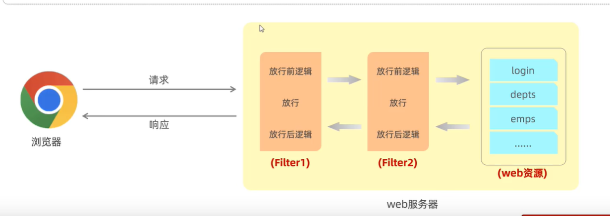

## MVC 概述

首先MVC是程序架构的一种思想，它将项目分为Module，View，和Controller。这方便项目的开发和管理，是独立于技术的。

而在java中，Module层通常使用实体类来存储数据，用Service类来处理数据操作；View层通常是用html或者jsp文件来实现；而Controller层则是用Servlet技术来实现。

**整体流程**为：用户和html页面交互->发送请求到web服务器软件(tomcat)->web服务器软件调用URL对应的servlet->Servlet调用Service类来获取数据或者处理逻辑->Servlet根据Service的结果返回页面或者重定向。 (其中tomcat和servlet详情可见javaServlet.md)

## Spring MVC 概述

Spring MVC是Spring中的一个框架，它可以和Spring的其它框架衔接，例如使用Spring Framwork的IOC容器，这也使得Spring MVC成为主流的`表述层（控制层）框架`。也就是说，虽然名字叫做Spring MVC，但实际做的工作只有Controller层相关的。

Spring MVC的核心是`封装了Servlet`。它提供了一个DispatcherServlet，所有的请求都先经过DispatcherServlet，从而实现`简化前端参数接收和后端数据响应`。


### Spring MVC在Tomcat中的作用


SpringMVC提供了DispatcherServlet类，这个类实现了Servlet接口，也就符合Servlet规范。所以它可以被Tomcat识别，也可以用它来和Tomcat交互。

所以Tomcat只需要将所有的请求封装为ServletRequest丢给DispatcherServlet就行，DispatcherServlet会调用controller等spring自己的逻辑，最后根据规范返回ServletResponse即可。

## Spring MVC 流程

在使用Spring MVC框架后，程序员不需要写servlet来和服务器软件交互，而是由Spring MVC的DispatcherServlet来交互。程序员则需要根据spring的规范来和DispatcherServlet交互,整体流程如图：


（橙色的是程序员需要自己实现的，其它部分是框架实现的）

其中各个组件的责任：
1. DispatcherServelt:负责所以请求接收和响应，根据请求路径找HandleMapping
2. HandlerMapping:存储handler和请求路径的映射关系
3. HandlerAdapter:根据handler方法的参数提取request请求中的内容，传递给Handler；将handler返回值封装到response中
4. Handler:由程序员实现，调用需要的service层来进行事务处理
5. ViewResolver：方便查找和渲染页面（非必须模块）

各个组件之间的协助需要借助IOC容器，都放进IOC容器里后，spring自然可以按照流程进行处理。


## Quick Start

1. 创建WEB项目，配置tomcat（查看/Editor/idea笔记）

2. 添加配置文件

```
    <dependencies>
        <dependency>
            <groupId>org.springframework</groupId>
            <artifactId>spring-webmvc</artifactId>
            <version>6.1.2</version>
        </dependency>
<!--        <dependency>-->
<!--            <groupId>javax.servlet</groupId>-->
<!--            <artifactId>javax.servlet-api</artifactId>-->
<!--            <version>4.0.1</version>-->
<!--            <scope>provided</scope>-->
<!--        </dependency>-->
        <dependency>
            <groupId>jakarta.servlet</groupId>
            <artifactId>jakarta.servlet-api</artifactId>
            <version>6.0.0</version>
            <scope>provided</scope>
        </dependency>
    </dependencies>
```

注意：Spring6用的是jakarta.servlet，而不再是javax.servlet了。与此同时，tomcat也需要改成10版本。

3. 写web.xml配置文件，注册dispatcherServlet

```
<?xml version="1.0" encoding="UTF-8"?>
<web-app xmlns="http://xmlns.jcp.org/xml/ns/javaee"
         xmlns:xsi="http://www.w3.org/2001/XMLSchema-instance"
         xsi:schemaLocation="http://xmlns.jcp.org/xml/ns/javaee http://xmlns.jcp.org/xml/ns/javaee/web-app_4_0.xsd"
         version="4.0">
    
    <servlet>
        <servlet-name>DispatcherServlet</servlet-name>
        <servlet-class>org.springframework.web.servlet.DispatcherServlet</servlet-class>
        <!-- 注册Spring的配置文件 -->
        <init-param>
            <param-name>contextConfigLocation</param-name>
            <param-value>classpath:SpringMVC.xml</param-value>
        </init-param>
    </servlet>
    <servlet-mapping>
        <servlet-name>DispatcherServlet</servlet-name>
<!--        表示所有请求都映射到DispatcherServlet，但是.jsp文件除外。-->
<!--        这个跟jsp文件的性质有关，没用到jsp文件，所以不懂-->
        <url-pattern>/</url-pattern>
    </servlet-mapping>
</web-app>
```

4. 写Spring配置文件（之前的bean.xml），开启组件扫描

```
<?xml version="1.0" encoding="UTF-8"?>
<beans xmlns="http://www.springframework.org/schema/beans"
       xmlns:context="http://www.springframework.org/schema/context"
       xmlns:xsi="http://www.w3.org/2001/XMLSchema-instance"
       xsi:schemaLocation="http://www.springframework.org/schema/context
       http://www.springframework.org/schema/context/spring-context.xsd
       http://www.springframework.org/schema/beans
       http://www.springframework.org/schema/beans/spring-beans.xsd">

    <context:component-scan base-package="com.cain.controller"></context:component-scan>

</beans>
```

5. 写自己的Servlet注册函数

```
@RestController
public class HelloController {
    @RequestMapping("/")
    public void index(){
        System.out.println("index is called");
    }
}
```

## 分层解耦
以请求响应为例，我们可以将全部的代码都写在@RequsetMapping修饰的方法中，但这不利于维护，也不符合`单一职责原则`。

例子：
````
@RestController
public class EmployeeController {
    @RequestMapping("/EmpList")
    public List<Employee>getEmpList(){
        // 1. 获取数据
        // 数据可能来自文件或数据库，方便起见我直接在程序中创建数据来模拟读取过程
        // Employee 有俩属性：String name; String gender
        // 数据中用0，1代表性别
        Employee e1 = new Employee("cain", "1");
        Employee e2 = new Employee("gala", "0");
        List<Employee> ls = new ArrayList<>();
        ls.add(e1); ls.add(e2);

        // 2. 对数据进行处理
        ls.forEach(e ->{
            if(e.getGender() == "0")
                e.setGender("Female");
            else
                e.setGender("Male");
        });

        // 3. 响应请求
        return ls;
    }
}
````

### 三层架构
`Controller`: 控制层，负责接受请求和响应数据。<br>
`Service`:业务逻辑层，处理具体的业务逻辑<br>
`Dao(Data Access Object)`:数据访问层，负责数据库的操作。


## 请求响应操作
所谓的请求处理类就是加了`@RestController`的类，类中用`@RequestMapping(/path)`注解来实现对应URL的请求处理方法。

### 注解：
`@RequestMapping(/path)`用来修饰方法，`path`指的是URL。它将HTTP请求映射到被注解的方法上<br>
`@RestController`其实包括了`@ResponseBody`和`@Controller`。<br>
`@ResponseBody`可以作用于类或者方法，它会将方法的返回值封装为浏览器的响应。<br>
`@Controller`用于类，指明该类为Controller组件。


### @RequestMapping 参数

@RequestMapping用来在HandlerMapping中注册映射关系，其中Value参数必须设置，其它参数可选。

#### Value 参数

value 通过资源路径进行匹配，可以设置多个url

```
@RequestMapping(value = {"/index","/"})
public void index(){
    System.out.println("index is called");
}
```

#### Method 参数

Method 根据请求方法进行筛选

```
@RequestMapping(
        value = {"/index"},
        method = {RequestMethod.POST}
)
public String index(){
    System.out.println("index is called");
    return "index page";
}
```

也可以通过衍生注解名进行配置

```
@PostMapping (
        value = {"/index"}
)
public String index(){
    System.out.println("index is called");

    return "index page";
}
```

#### Parameter 参数

params要求必须携带的参数，也可通过```a=b a!=b !a```来进行更具体的限制。

```
@RequestMapping (
        value = {"/index"},
        params = {"username"}
)
public String index(){
    System.out.println("index is called");
    return "index page";
}
```

#### Header 参数

根据请求头进行限定，要求必须有或者没有某个字段，或者限制字段的值

```
@RequestMapping (
        value = {"/index"},
        headers = ("Host=localhost:8080")
)
public String index(){
    System.out.println("index is called");
    return "index page";
}
```

还有其它参数，需要了再查看API文档

### @RequestMapping 路径匹配

RequestMapping支持ANT风格的路径通配符

* ? 匹配任何单字符
* *匹配0或者任意数量的 字符
* ** 匹配0或者更多的目录这里注意了单个* 是在一个目录内进行匹配。而** 是可以匹配多个目录，一定不要迷糊


### 请求数据

#### ServletRequest

@Controller是由DispatcherServlet调用的，而DispatcherServlet是包含request和response参数的，所以它可以直接穿给@Controller的方法：

```
@RequestMapping("/servletRequest")
public String servletRequest(HttpServletRequest httpServletRequest){
    String user = httpServletRequest.getParameter("user");
    return user;
}
```

其中HttpServletRequest是由DispatcherServlet来赋值的

#### SpringMVC 获取请求参数

通常用于get方法，参数在url中

**获取单个参数**
```
@GetMapping("/directPara")
public String directPara(@RequestParam("username") String username){
    System.out.println("paratest is called: "+username);
    return username;
}
```
这里@RequestParam("username")匹配get请求中的username参数。值得注意的是：在之前的spring版本中，可以不设置@RequestParam注解，只要参数名和请求中的参数名一致就行，但是spring6好像不允许了。

**获取同名参数列表**
```
@RequestMapping("/names")
public String getNames(@RequestParam("name") List<String> names){
    System.out.println(names);
    return "success";
}
```

**实体类封装参数**

除了指定String或者其它基本类型接受参数，还可以直接传递一个实例对象，根据成员变量的名称自动封装请求参数到实例对象中去：

```
@RequestMapping("/pojoTest")
public String pojoTest(User user){
    System.out.println(user);
    return "pojoTest";
}
```
```
@Data
public class User {
    private String username;
    private String password;
}
```


#### 获取请求体（JSON数据）

json请求可以处理更复杂的数据类型，放在请求体中，获取方式为：
```
@RequestMapping("/json")
public User getJson(@RequestBody User user){
    System.out.println(user);
    return user;
}
```

其中使用USER实体类接收的，此外java本身是不能处理json类型的数据的，需要导入依赖

```
<dependency>
    <groupId>com.fasterxml.jackson.core</groupId>
    <artifactId>jackson-databind</artifactId>
    <version>2.16.1</version>
</dependency>
```

并且在handlerAdapter中启用json处理类，由于spring已经将handlerAdapter的初始化封装了，我们只需要指出它的初始化方式即可：
```
// bean.xml中添加：
<mvc:annotation-driven></mvc:annotation-driven>

// 或者配置类上添加
@EnableWebMvc
```

#### 获取请求头

http请求头中也是键值对，也可以用类似@RequestParam的方法获取相关信息

```
@GetMapping("/headerPara")
public String headerPara(@RequestHeader("host") String localhost){
    return localhost;
}
```

#### 获取路径参数
有时参数会通过路径传递
````
@DeleteMapping("depts/{id}")
public Result deleteMethodDepts(@PathVariable Integer id){
    return deptService.deptDelete(id);
}
````


#### 获取文件
上传文件要求前端三要素：input type = file; method=post; enctype="multipart/form-data"。
````
<form action="/upload" method="post" enctype="multipart/form-data">
    name: <input type="text" name="username"> <br>
    file: <input type="file" name="file"><br>
    <input type="submit" value="submit">
</form>
````

文件类型储存到MultipartFile类型中，注意变量名和input name要相同
````
@PostMapping("/upload")
public void upload(MultipartFile file) {
    System.out.println(file.getOriginalFilename());
}
````
MultipartFile封装了一些方法，有获取文件名，获取文件内容，存储文件等功能

#### 获取 Cookie

此外对于cookie也有注解来获取相关信息：@CookieValue。暂且没用，跳过.

### 响应数据

在SpringMVC中响应数据有两种情况：

1. 通过视图解析器返回页面（通常是混合式开发）
2. 不走视图解析器直接返回数据（通常是前后端分离开发）


#### 返回页面

SpringMVC中的handler返回字符串会默认交给视图解析器来处理，其会根据字符串是否有前缀来进行不同处理：

* 普通视图View Name：无前缀
* Internal Resource：forward前缀
* Redirect：redirect前缀

**直接返回视图**

返回ModelAndView

```
@RequestMapping("/thymeleafView")
public ModelAndView thymeleaf(ModelAndView modelAndView){
    System.out.println("thymeleaf is called");
    modelAndView.setViewName("success");
    return modelAndView;
}
```

返回viewName

```
@RequestMapping("/index")
public String index(){
    return "index";
}
```

**内部跳转：InternalResource View**

```
@RequestMapping("/internal")
public ModelAndView internal(ModelAndView modelAndView){
    modelAndView.addObject("username","internal user");
    modelAndView.addObject("password","2211");
    modelAndView.setViewName("forward:/thymeleafView");
    return modelAndView;
}
```

内部跳转直接的参数共享，View的参数传递都是由ModelAndView实现的

**重定向： Redirect View**

```
@RequestMapping("/redirect")
public String redirectView(HttpServletRequest request){
    ServletContext servletContext = request.getServletContext();
    servletContext.setAttribute("username","redirect user");
    servletContext.setAttribute("password","7788");

    return "redirect:/thymeleafView";
}
```

可以用servletContext传参，但是不好用，会很麻烦


#### 返回JSON数据

如果想要直接返回数据（现在都用JSON），也就是不走视图解析器，需要以下三步：

1. 开启@ResponseBody注解
2. 添加JSON依赖
3. 配置类上添加@EnableWebMvc

这样String或者实体类或者列表都会被转换为json数据返回
```
@RequestMapping("/json")
@ResponseBody
public List<User> returnJson(){
    List<User> users = new ArrayList<>();
    User cain = new User("cain", 12);
    User gala = new User("gala", 22);
    users.add(cain);
    users.add(gala);
    return users;
}
```

### 返回静态资源

当配置了DispatcherServlet后，所有的网络请求都会通过DispatcherServlet来处理。而DispatcherServlet每次都会去HandlerMapping中去查找Handler。这导致直接访问静态资源“localhost:8080/imgs/a.jpg”会无法访问，因为这个路径没有对应的handler。

解决方式很简单，修改spring配置文件即可：
```
@Configuration
@ComponentScan("controller")
@EnableWebMvc
public class DispatcherServletConfig implements WebMvcConfigurer {
    // 开启静态资源
    @Override
    public void configureDefaultServletHandling(DefaultServletHandlerConfigurer configurer) {
        configurer.enable();
    }
}
```
底层会创建另一个servlet来允许处理静态资源

## Model和View

正如我们上边所述，model层对应的就是service和dao两部分，而这一块会用Mybatis框架来实现，所以这里略过。

那现在的问题是，如何利用数据来构建View？其实如果做前后端分离就不用考虑了，直接返回数据给前端工程师就好，这也是流行的做法。不过下边还是讲一下一体式开发中如何构建view。

## 共享数据


在服务器端，servlet获取请求后可能跳转到其它servlet，也可能跳转到页面并展示，其中它们之间传递数据就是使用共享空间。共享空间有三种类型：

1. Request:其作用域是一次request
2. Session:作用域是一个session
3. servletContext：作用域是整个项目


### 获取传统Request域

*注意：前文为了方便没有整合thymeleaf，而是用来@RestController注解。下边为了构建view，是添加了thymeleaf注解的，如何添加看笔记：Spring-Other.md*

数据传递的思路是通过共享的Request域来共享数据，然后从controller跳转到html模板。

```
@RequestMapping("/t1")
public String t1(HttpServletRequest httpServletRequest,User user){
    httpServletRequest.setAttribute("username",user.getUsername());
    httpServletRequest.setAttribute("password",user.getPassword());

    return "success";
}
```

###  SpringMVC 获取Request域

**ModelAndView**

这个类可以由DispatcherServlet提供，也可以自己new，但是返回类型必须是ModelAndView。

```
@RequestMapping("/t2")
public ModelAndView t2(ModelAndView modelAndView, User user){
//        ModelAndView modelAndView = new ModelAndView();
    modelAndView.addObject("username",user.getUsername());
    modelAndView.addObject("password",user.getPassword());

    modelAndView.setViewName("success");
    return modelAndView;
}
```

**Model**

```
@RequestMapping("/t3")
public String t2(Model model){
    model.addAttribute("username","model test");

    return "success";
}
```

此外还有通过Map参数，ModelMap参数等方法共享数据。（不过Map,Model,ModelMap的实例对象其实是同一个，它继承了ModelMap，并且实现了Map和Model接口）

### 类似的还有Session和Application域对象，略过


## HttpMessageConverter

HttpMessageConverter是Spring框架提供的一个类，用来进行http报文和java对象之间的转换。它的功能通过httpRequest和response都能实现，只是它更加方便一些：

### @RequestBody

将请求体封装，但也要求请求必须带请求体
```
@RequestMapping("/testConverter")
public String converter(@RequestBody String request){
    System.out.println("request body: "+request);
    return "success";
}
```

### RequestEntity

```
@RequestMapping("/testConverter")
public String converter(RequestEntity<String> request){
    System.out.println("request header: "+request.getHeaders());
    System.out.println("request body: "+request.getBody());
    return "success";
}
```

### @ResponseBody

默认情况下返回字符串是交给thymeleaf来进行页面查找，普通的servlet想要返回页面是进行重定向，想要返回字符串是通过response.write()。而@Response可以直接将返回的字符串作为响应体

```
@RequestMapping("/res")
@ResponseBody
public String res(){
    return "res result";
}
```

虽然http响应体只能是字符串，如果添加了jackson依赖，在添加@ResponseBody注解的话，会自动将java对象转为json格式的字符串

```
@RequestMapping("/res")
@ResponseBody
public User res(){
    return new User("cain","222");
}
```

```
<dependency>
    <groupId>com.fasterxml.jackson.core</groupId>
    <artifactId>jackson-databind</artifactId>
    <version>2.16.1</version>
</dependency>
```

此外还有@RestController，它是@ResponseBody+@Controller

## 拦截器

### Filter 统一拦截
可以创建一个或多个Filter类来统一拦截访问各个url的请求。

Filter类在Controller类之前获取请求，并且由Filter决定是否将请求交给Controller处理。



(1) 该类要实现javax.servlet.Filter接口，并实现它的doFilter方法。该方法指定对拦截url的处理。

(2) 该类需要@WebFilter(urlPatterns = "/*")来指定拦截对象。

(3) 在配置类上加@ServletComponentScan注解

(4) 多个Filter的话，会按照Fliter类名的字母顺序进行多次拦截。

#### Filter类
````java
@WebFilter(urlPatterns = "/*")
public class DemoFilter implements Filter {

    @Override
    public void doFilter(ServletRequest request, ServletResponse response,
            FilterChain chain) throws IOException, ServletException {

        HttpServletRequest httpRequest = (HttpServletRequest) request;
        HttpServletResponse httpResponse = (HttpServletResponse) response;
        String url = httpRequest.getRequestURL().toString();

        // 1. 登录操作，直接放行
        if(url.contains("login")){
            // 放行：允许该url去请求和获取响应
            chain.doFilter(request, response);  
            return;
        }
        // 2. 非登录操作，但携带jwt
        String jwt = httpRequest.getHeader("token");
        try {
            JWT.parsarJWT(jwt);
        } catch (Exception e) {
            // 捕获到异常说明jwt错误或者没有jwt
            // 不放行，并且直接返回信息
            Result res = new Result(0, "Not login", null);
            // 由于不再controller中，只能手动转json并写入response
            String resJsonStr = JSONObject.toJSONString(res);
            response.getWriter().write(resJsonStr);
            return;
        }
        // 没有进入catch，说明jwt验证通过，可以放行
        chain.doFilter(request, response);  
        return;
    }
}
````
注意：dofilter只是允许url对应的controller处理请求并且修改或创建response，但它并没有发送response给浏览器。只有Filter return之后，才会将response返回。


### Interceptor
拦截器Interceptor和过滤器Filter在功能上并无差别。不过Filter不属于Spring，会拦截所有资源；但是Interceptor属于Spring，跟框架更好适配并且只拦截Spring环境中的资源。

注意：Interceptor和Filter是可以同时存在的。


Interceptor类

(1) preHandle：对拦截的请求进行逻辑处理，返回true表示放行；返回false表示不放行

(2) postHandle：对请求放行后这个函数才调用，如果preHandle返回false，该函数不调用。该函数负责Controller处理后继续进行逻辑处理

(3) afterCompletion：我也不知道

````java
@Component
public class LoginInterceptor implements HandlerInterceptor{

    // 放行前的操作
    // 对应登录验证，只需要进行放行前操作
    @Override   
    public boolean preHandle(HttpServletRequest request, HttpServletResponse response, Object handler)
    throws Exception {
        // 查看jwt
        String jwt = request.getHeader("token");
        try {
            JWT.parsarJWT(jwt);
        } catch (Exception e) {
            // 捕获到异常说明jwt错误或者没有jwt
            // 不放行，并且直接返回信息
            Result res = new Result(0, "Not login", null);
            // 由于不再controller中，只能手动转json并写入response
            String resJsonStr = JSONObject.toJSONString(res);
            response.getWriter().write(resJsonStr);
            return false;
        }
        // 没有进入catch，说明jwt验证通过，可以放行
        return true;
    }
    
    @Override   // 放行后的操作
    public void postHandle(HttpServletRequest request, HttpServletResponse response, Object handler,
    ModelAndView modelAndView) throws Exception {
        // TODO Auto-generated method stub
        System.out.println("one url is passed");
    }

    @Override   // 说是渲染后的操作，我也不知道是啥
    public void afterCompletion(HttpServletRequest request, HttpServletResponse response, Object handler, Exception ex)
            throws Exception {
        System.out.println("completion...");
    }
}
````

配置类：上述Interceptor类需要在配置类中注册。
````java
@Configuration
public class WebConfig  implements WebMvcConfigurer{
    @Autowired
    LoginInterceptor loginInterceptor;

    @Override
    public void addInterceptors(InterceptorRegistry registry) {
        registry.addInterceptor(loginInterceptor).addPathPatterns("/**").excludePathPatterns("/login");
    }
}
````
注意：


## 异常处理
在框架中也会有异常发生，例如sql语句执行失败。下层的异常会向上层抛出Mapper->Service->Controller->Spring。

为了捕获和处理异常，我们可以定义异常处理类来处理所有Controller层的异常。

````java
@RestControllerAdvice
public class ControllerExceptionHandler {
    @ExceptionHandler(Exception.class) //指明处理的异常类型，这里选的是全部异常
    public Result ex(Exception ex){
        ex.printStackTrace();
        return new Result(0, "Exception happen", null);
    }
}
````

## 事务处理

事务是指一组不可分割的操作集合，要么全都执行，要么全都不执行。

Service层可能会设计多个数据库操作，但是我们希望它们要么都发生，要么都不发生。

在spring中，只需要在方法/类/接口上加@Transactional即可，框架会自动将方法配置为事务。
````java
@Transanctional
public Result deptDelete(int id) {
    int affectedNum = deptMapper.deptDelete(id);
    empMapper.deleteEmp(id);
}
````

此外@Transacntional也可以进行配置。默认情况下，@Transanctional遇到runtimeException时才会回滚，可通过`@Transactional(rollbackFor = Exception.class)`来配置为所有异常都回滚。

也可以配置事务之间的传播行为来处理多个事务的情景。

## （拓展）用配置类代替xml文件

servlet6中有jakarta.servlet.ServletContainerInitializer接口，服务器会在类路径查找实现了该接口的类，并将其当作配置类。其中Spring写了SpringServletContainerInitializer实现了该类，并且Spring的这个实现类会去查找WebApplicationInitializer的实现类作为配置类，而Spring用AbstractAnnotationConfigDispatcherServletInitializer实现类部分WebApplicationInitializer，我们创建配置类继承它就行：

其中getRootConfigClasses和getServletConfigClasses都是用来指明Spring的配置类，只不过Root的应用范围更广，详情见：https://blog.csdn.net/sujz12345/article/details/52975576

```
// web.xml配置文件对应的配置类
public class WebInit extends AbstractAnnotationConfigDispatcherServletInitializer {
    @Override
    protected Class<?>[] getRootConfigClasses() {
        return new Class[0];
    }

    // 指明Spring相关配置对应的配置类
    @Override
    protected Class<?>[] getServletConfigClasses() {
        return new Class[]{DispatcherServletConfig.class};
    }

    // 指明dispatcherServlet对应的url
    @Override
    protected String[] getServletMappings() {
        return new String[]{"/"};
    }
}
```

DispatcherServletConfig
```
@Configuration
@ComponentScan("com.cain.controller")
@EnableWebMvc
public class DispatcherServletConfig implements WebMvcConfigurer {

    @Override
    public void addViewControllers(ViewControllerRegistry registry) {
        registry.addViewController("/index").setViewName("index");
    }

    @Bean
    ThymeleafViewResolver viewResolver(SpringTemplateEngine engine){
        ThymeleafViewResolver resolver = new ThymeleafViewResolver();
        resolver.setTemplateEngine(engine);
        resolver.setCharacterEncoding("UTF-8");
        return resolver;

    }

    @Bean
    SpringTemplateEngine templateEngine(SpringResourceTemplateResolver templateResolver){
        SpringTemplateEngine engine = new SpringTemplateEngine();
        engine.setTemplateResolver(templateResolver);
        return engine;
    }

    @Bean
    SpringResourceTemplateResolver templateResolver(){
        SpringResourceTemplateResolver resolver = new SpringResourceTemplateResolver();
        resolver.setPrefix("/WEB-INF/templates/");
        resolver.setSuffix(".html");
        resolver.setTemplateMode("HTML");
        resolver.setCharacterEncoding("UTF-8");
        return resolver;
    }
}
```

具体内容可查看spring-other.md