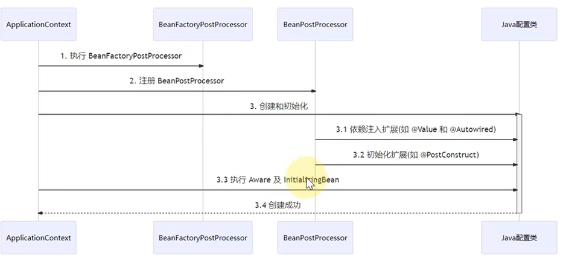
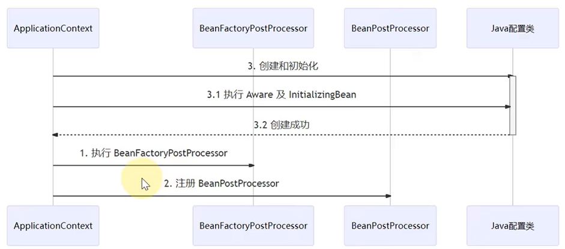
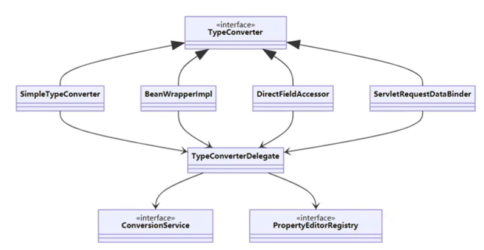
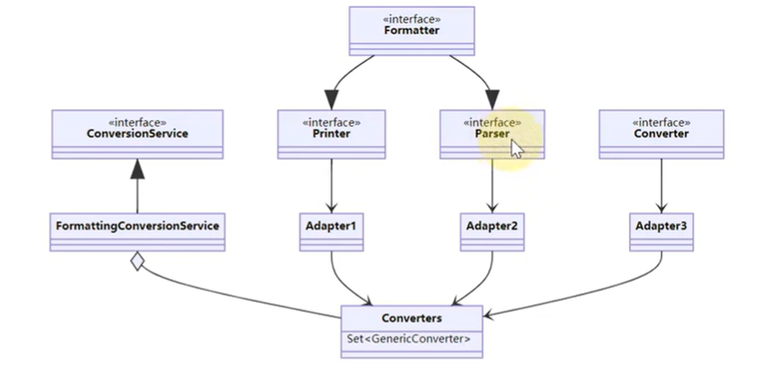
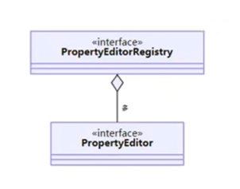
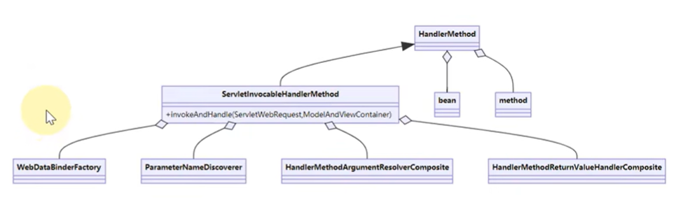
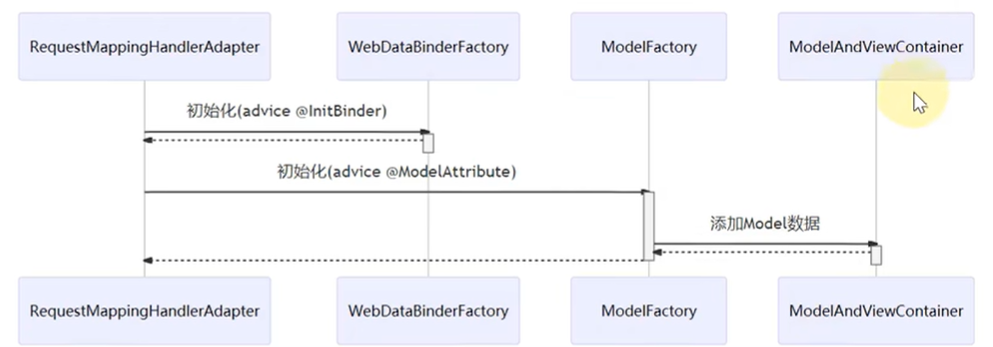
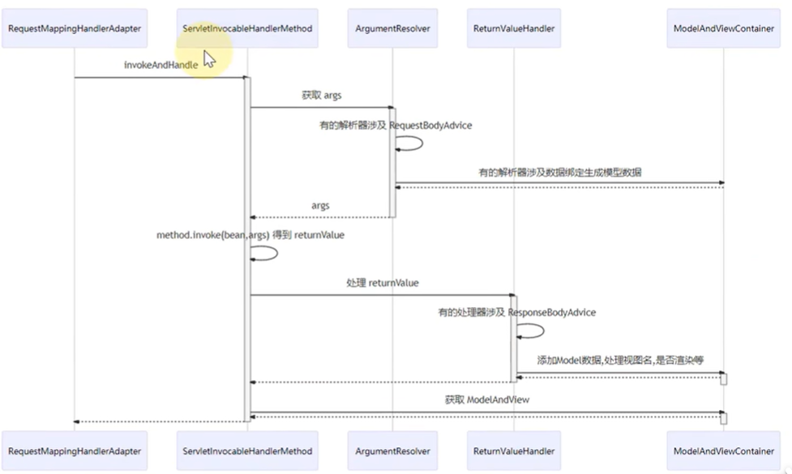
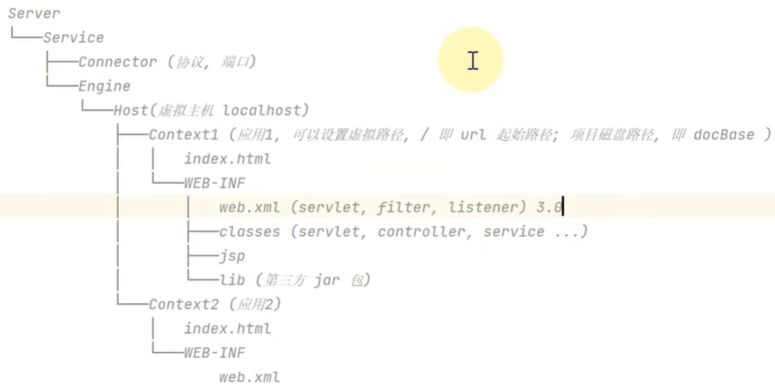

## Spring容器的启动流程

https://open8gu.com/framework/spring/kvy93gg3n2lyfkgd/

### 三级缓存

* 一级缓存：存放创建好的bean
* 二级缓存：存放提前创建的bean
* 三级缓存：存放objectFactory（其用来生成bean或者bean代理）

**核心思路**：

* 场景：A依赖于B，B也依赖于A
* 回顾：bean的生命周期包含：创建实例-依赖注入-初始化-摧毁

1. A先开始创建，A创建实例后，添加A的objectFactory到第三级缓存
2. A进行依赖注入时要用B，发现B不存在，进入B的创建过程
3. B创建实例后，添加B的objectFactory到第三级缓存
4. B进行依赖注入时要用A，在第三级缓存中发现A，则调用objectFactory(A)的getObject方法来获取A实例。此时objectFactory(A)根据A的情况创建A的实例或者代理对象。在创建出A bean或者A proxy后，将其放入第二级缓存，并删除第三级缓存的objectFactory(A)
5. B完成创建后，将B放入到第一级缓存返回到A的创建流程。
6. A完成了依赖注入后，继续进行初始化
7. 最后A检查第二级缓存来判断A在依赖注入过程中是否发生了循环依赖。由于第二级缓存中有A bean或A proxy，A明白发生了循环依赖。于是A将二级缓存中的A bean或A proxy作为最后返回的bean
8. A完成创建并放入第一级缓存。


具体还是要看： https://open8gu.com/framework/spring/am1bw8528v9xdtut/

## beanFactory讲解

以下代码是beanFactory的使用示例：

```java
package com.cain.springtheory;

import org.springframework.beans.factory.annotation.Autowired;
import org.springframework.beans.factory.config.BeanFactoryPostProcessor;
import org.springframework.beans.factory.config.BeanPostProcessor;
import org.springframework.beans.factory.support.AbstractBeanDefinition;
import org.springframework.beans.factory.support.BeanDefinitionBuilder;
import org.springframework.beans.factory.support.DefaultListableBeanFactory;
import org.springframework.context.annotation.AnnotationConfigUtils;
import org.springframework.context.annotation.Bean;
import org.springframework.context.annotation.Configuration;

public class BeanFactoryTest {
    public static void main(String[] args) {
        // 创建bean 容器，此时容器为空
        DefaultListableBeanFactory beanFactory = new DefaultListableBeanFactory();

        // 创建bean定义（class, type）
        AbstractBeanDefinition beanDefinition =
                BeanDefinitionBuilder.genericBeanDefinition(Config.class).setScope("singleton").getBeanDefinition();

        // 向bean容器中添加 bean 定义
        beanFactory.registerBeanDefinition("config", beanDefinition);

        // 发现此时bean容器中只有config类，而没有config中被@bean修饰的bean1,bean2
        System.out.println("---------------------------------");
        for (String definitionName : beanFactory.getBeanDefinitionNames()) {
            System.out.println(definitionName);
        }

        // 通过辅助类给bean容器添加后处理器类
        AnnotationConfigUtils.registerAnnotationConfigProcessors(beanFactory);

        // 调用辅助类添加的 beanFactory 后处理器，其重要功能就是添加额外的bean，例如处理@Bean注解
        for (BeanFactoryPostProcessor postProcessor : beanFactory.getBeansOfType(BeanFactoryPostProcessor.class).values()) {
            postProcessor.postProcessBeanFactory(beanFactory);
        }

        // 此时bean1和bean2被添加
        System.out.println("---------------------------------");
        for (String definitionName : beanFactory.getBeanDefinitionNames()) {
            System.out.println(definitionName);
        }
        // 然而bean1中没有bean2
//        System.out.println("---------------------------------");
//        System.out.println(beanFactory.getBean(Bean1.class).getBean2());

        // 注册bean后处理器类为后处理器(bean后处理器也是配置类添加的，只是它们只被放到了bean容器，并没有实际注册为后处理器)
        // bean后处理器负责bean生命周期的相关工作，例如处理@Autowired，@Resource等注解
        beanFactory.getBeansOfType(BeanPostProcessor.class).values().forEach((beanPostProcessor) -> {
            beanFactory.addBeanPostProcessor(beanPostProcessor);
        });

        // 为了避免getBean时才创建单例bean，可以提前将单例bean创建好
        beanFactory.preInstantiateSingletons();
        // 此时bean1中有bean2
        System.out.println("---------------------------------");
        System.out.println(beanFactory.getBean(Bean1.class).getBean2());

        beanFactory.getDependencyComparator();
    }


    @Configuration
    static class Config {
        @Bean
        public Bean1 bean1(){
            return new Bean1();
        }
        @Bean
        public Bean2 bean2(){
            return new Bean2();
        }
    }

    static class Bean1 {

        public Bean1(){
            System.out.println("Bean1 constructor");
        }

        @Autowired
        private Bean2 bean2;

        public Bean2 getBean2() {
            return bean2;
        }
    }
    static class Bean2 {
        public Bean2(){
            System.out.println("Bean2 constructor");
        }
    }
}

```

从中我们可以观察到beanFactory的一些特点：

1. 不会主动调用beanFactory后处理器
2. 不会主动绑定bean后处理器
3. 不会主动创建单例bean
4. 不会主动解析 ${} 和 #{}

beanFactory只是充当基础的bean容器。

### 后处理器排序

前边提到AnnotationConfigUtils为beanFactory添加了许多后处理器，那如何决定后处理器的执行顺序呢？例如一个bean同时被@Autowired和@Resource注解，应该先使用哪个对应的后处理器？

其实在AnnotationConfigUtils添加后处理器时，也设置了beanFactory的比较器。该比较器会获得后处理器的order属性从而决定哪个后处理器先执行。

## ApplicationContext讲解

ApplicationContext内部包含beanFactory，并且做了一些额外的工作来使用beanFactory。

ApplicationContext有很多实现：
```java
package com.cain.springtheory;

import org.springframework.beans.factory.config.ConfigurableListableBeanFactory;
import org.springframework.beans.factory.support.DefaultListableBeanFactory;
import org.springframework.beans.factory.xml.XmlBeanDefinitionReader;
import org.springframework.boot.autoconfigure.web.servlet.DispatcherServletRegistrationBean;
import org.springframework.boot.web.embedded.tomcat.TomcatServletWebServerFactory;
import org.springframework.boot.web.server.WebServerFactory;
import org.springframework.boot.web.servlet.context.AnnotationConfigServletWebServerApplicationContext;
import org.springframework.boot.web.servlet.server.ServletWebServerFactory;
import org.springframework.context.ApplicationContext;
import org.springframework.context.annotation.AnnotationConfigApplicationContext;
import org.springframework.context.annotation.Bean;
import org.springframework.context.support.ClassPathXmlApplicationContext;
import org.springframework.context.support.FileSystemXmlApplicationContext;
import org.springframework.core.io.ClassPathResource;
import org.springframework.web.context.WebApplicationContext;
import org.springframework.web.context.support.AnnotationConfigWebApplicationContext;
import org.springframework.web.servlet.DispatcherServlet;
import org.springframework.web.servlet.ModelAndView;
import org.springframework.web.servlet.mvc.Controller;

import javax.servlet.http.HttpServletRequest;
import javax.servlet.http.HttpServletResponse;

public class ApplicationContextTest {

    public static void main(String[] args) {
//        testClassPath();
//        testFileSystem();
//        testXmlReader();
        testConfig();
//        testWebConfig();
    }

    public static void testClassPath(){
        ClassPathXmlApplicationContext context = new ClassPathXmlApplicationContext("beans.xml");
        for (String beanDefinitionName : context.getBeanDefinitionNames()) {
            System.out.println(beanDefinitionName);
        }
    }

    public static void testFileSystem(){
        FileSystemXmlApplicationContext context = new FileSystemXmlApplicationContext("src/main/resources/beans.xml");
        for (String beanDefinitionName : context.getBeanDefinitionNames()) {
            System.out.println(beanDefinitionName);
        }
    }

    public static void testConfig(){
        AnnotationConfigApplicationContext applicationContext = new AnnotationConfigApplicationContext(Config.class);
        ConfigurableListableBeanFactory beanFactory = applicationContext.getBeanFactory();
        for (String beanName : beanFactory.getBeanDefinitionNames()) {
            System.out.println(beanName);
        }

        Bean1 bean1 = beanFactory.getBean(Bean1.class);
        System.out.println(bean1.getBean2());
    }

    public static void testWebConfig(){
        AnnotationConfigServletWebServerApplicationContext applicationContext =
                new AnnotationConfigServletWebServerApplicationContext(WebConfig.class);
        ConfigurableListableBeanFactory beanFactory = applicationContext.getBeanFactory();
        for (String beanName : beanFactory.getBeanDefinitionNames()) {
            System.out.println(beanName);
        }
    }

    static class WebConfig{
        // 创建内嵌tomcat服务器
        @Bean
        public ServletWebServerFactory webServerFactory(){
            return new TomcatServletWebServerFactory();
        }

        // 创建DispatcherServlet
        @Bean
        public DispatcherServlet dispatcherServlet(){
            return new DispatcherServlet();
        }

        // 将DispatcherServlet注册到tomcat服务器上
        @Bean
        public DispatcherServletRegistrationBean registrationBean(){
            return new DispatcherServletRegistrationBean(dispatcherServlet(), "/");
        }

        // 创建Controller
        @Bean("/hello")
        public Controller controller1(){
            return new Controller() {
                @Override
                public ModelAndView handleRequest(HttpServletRequest request, HttpServletResponse response) throws Exception {
                    response.getWriter().println("hello world");
                    return null;
                }
            };
        }
    }

    static class Config{
        @Bean
        public Bean1 bean1(Bean2 bean2){
            Bean1 bean1 = new Bean1();
            bean1.setBean2(bean2);
            return bean1;
        }
        @Bean
        public Bean2 bean2(){
            return new Bean2();
        }
    }

    static class Bean1{
        private Bean2 bean2;

        public void setBean2(Bean2 bean2) {
            this.bean2 = bean2;
        }
        public Bean2 getBean2(){
            return bean2;
        }
    }
    static class Bean2{}
}

```

beans.xml
```
<?xml version="1.0" encoding="UTF-8"?>
<beans xmlns="http://www.springframework.org/schema/beans"
       xmlns:xsi="http://www.w3.org/2001/XMLSchema-instance"
       xsi:schemaLocation="http://www.springframework.org/schema/beans http://www.springframework.org/schema/beans/spring-beans.xsd">

    <bean id="Bean1" class="com.cain.springtheory.ApplicationContextTest.Bean1">
        <property name="bean2" ref="Bean2"></property>
    </bean>
    <bean id="Bean2" class="com.cain.springtheory.ApplicationContextTest.Bean2"></bean>
</beans>
```

### ClassPathXmlApplicationContext实现过程

```java
//创建bean容器
DefaultListableBeanFactory beanFactory = new DefaultListableBeanFactory();

//创建reader并设置读取到哪个容器
XmlBeanDefinitionReader reader = new XmlBeanDefinitionReader(beanFactory);

//读取xml文件
reader.loadBeanDefinitions(new ClassPathResource("beans.xml"));

for (String beanName : beanFactory.getBeanDefinitionNames()) {
    System.out.println(beanName);
}
```


## bean的生命周期

```java
package com.cain.springtheory.lifecycle;

import org.springframework.beans.factory.annotation.Autowired;
import org.springframework.stereotype.Component;

import javax.annotation.PostConstruct;
import javax.annotation.PreDestroy;

@Component
public class BeanLifeCycle {
    Bean1 bean;

    public BeanLifeCycle() {
        System.out.println("构造方法");
    }

    @Autowired
    public void autowiredMethod(Bean1 bean1) {
        this.bean = bean1;
        System.out.println("依赖注入方法");
    }

    @PostConstruct
    public void init() {
        System.out.println("初始化方法");
    }

    @PreDestroy
    public void destroy() {
        bean = null;
        System.out.println("销毁方法");
    }
}
```

bean的生命周期为：构造实例->依赖注入->初始化->销毁

bean的创建除了要经过自己的生命周期外，还会经过后处理器类。后处理器会作用于所有bean的创建，其方法包括：

```java
package com.cain.springtheory.lifecycle;

import org.springframework.beans.BeansException;
import org.springframework.beans.PropertyValues;
import org.springframework.beans.factory.config.DestructionAwareBeanPostProcessor;
import org.springframework.beans.factory.config.InstantiationAwareBeanPostProcessor;
import org.springframework.stereotype.Component;

import java.beans.PropertyDescriptor;

@Component
public class MyPostProcessor implements InstantiationAwareBeanPostProcessor, DestructionAwareBeanPostProcessor {
    @Override
    public void postProcessBeforeDestruction(Object o, String s) throws BeansException {
        if(s.equals("beanLifeCycle")){
            System.out.println("后处理器：销毁前执行");
        }
    }

    @Override
    public Object postProcessBeforeInstantiation(Class<?> beanClass, String beanName) throws BeansException {
        if(beanName.equals("beanLifeCycle")){
            System.out.println("后处理器：构造前执行，返回的对象会替换掉bean");
        }
        return null;
    }

    @Override
    public boolean postProcessAfterInstantiation(Object bean, String beanName) throws BeansException {
        if(beanName.equals("beanLifeCycle")){
            System.out.println("后处理器：构造后执行，返回false会跳过依赖注入");
        }
        return true;
    }

    @Override
    public PropertyValues postProcessProperties(PropertyValues pvs, Object bean, String beanName) throws BeansException {
        if(beanName.equals("beanLifeCycle")){
            System.out.println("后处理器：依赖注入时执行");
        }
        return pvs;
    }

    @Override
    public Object postProcessBeforeInitialization(Object bean, String beanName) throws BeansException {
        if(beanName.equals("beanLifeCycle")){
            System.out.println("后处理器：初始化前执行， 返回的对象会替换掉bean");
        }
        return bean;
    }

    @Override
    public Object postProcessAfterInitialization(Object bean, String beanName) throws BeansException {
        if(beanName.equals("beanLifeCycle")){
            System.out.println("后处理器：初始化后执行， 返回的对象会替换掉bean");
        }
        return bean;
    }
}

```

### 模板方法

spring将后处理器和bean生命周期的组合依赖于一个思想：模板方法。下边是一个简易的模拟流程：

```java
package com.cain.springtheory.lifecycle;


import java.util.ArrayList;
import java.util.List;

public class TemplateMethodTest {
    public static void main(String[] args) {
        MyBeanFactory myBeanFactory = new MyBeanFactory();
        //添加后处理器
        myBeanFactory.addPostProcessor(new BeanPostProcessor() {
            @Override
            public void inject() {
                System.out.println("解析@Autowired");
            }
        });

        myBeanFactory.getBean();
    }

    static class MyBeanFactory{
        List<BeanPostProcessor> beanPostProcessorList = new ArrayList<BeanPostProcessor>();

        public void addPostProcessor(BeanPostProcessor beanPostProcessor){
            beanPostProcessorList.add(beanPostProcessor);
        }

        public Object getBean(){
            // 固定方法1
            System.out.println("构造bean");
            // 固定方法2
            System.out.println("初始化bean");
            // 拓展方法1
            for(BeanPostProcessor beanPostProcessor : beanPostProcessorList){
                beanPostProcessor.inject();
            }
            // 固定方法3
            System.out.println("销毁bean");

            return null;
        }
    }

    interface BeanPostProcessor{
        void inject();
    }
}
```

其中bean的生命周期是固定方法，而后处理器是动态的，可拓展的方法。对于拓展方法，通过接口+集合的方式实现。这样后处理器的添加并不会影响原有代码。


## 常见Bean后处理器
```java
package com.cain.springtheory.postprocessor;

import org.springframework.beans.factory.annotation.Autowired;
import org.springframework.beans.factory.annotation.AutowiredAnnotationBeanPostProcessor;
import org.springframework.beans.factory.annotation.Value;
import org.springframework.beans.factory.support.AutowireCandidateResolver;
import org.springframework.beans.factory.support.DefaultListableBeanFactory;
import org.springframework.context.annotation.CommonAnnotationBeanPostProcessor;
import org.springframework.context.annotation.ContextAnnotationAutowireCandidateResolver;
import org.springframework.context.support.GenericApplicationContext;
import org.springframework.stereotype.Component;

import javax.annotation.PostConstruct;
import javax.annotation.PreDestroy;
import javax.annotation.Resource;

public class A04Application {
    public static void main(String[] args) {
        // 这个applicationContext是“干净”的，没有自带后处理器
        GenericApplicationContext genericApplicationContext = new GenericApplicationContext();
        // 添加bean
        genericApplicationContext.registerBean("bean1", Bean1.class);
        genericApplicationContext.registerBean("bean2", Bean2.class);
        genericApplicationContext.registerBean("bean3", Bean3.class);

        // 添加后处理器bean
        genericApplicationContext.registerBean(AutowiredAnnotationBeanPostProcessor.class);     //负责处理 @Autowired @Value 注解
        genericApplicationContext.getDefaultListableBeanFactory()
                .setAutowireCandidateResolver(new ContextAnnotationAutowireCandidateResolver());    //由于上述bean处理@Value有问题，所以要设置这么个东西

        genericApplicationContext.registerBean(CommonAnnotationBeanPostProcessor.class);        //负责处理 @Resource @PostConstruct @PreDestroy
        
        // 初始化容器，包括：将后处理器bean注册为后处理器；运行后处理器；创建bean
        genericApplicationContext.refresh();
        genericApplicationContext.close();
    }
}

@Component
class Bean1{
     Bean2 bean2;
    private Bean3 bean3;

    @Autowired
    public void setBean2(Bean2 bean2) {
        this.bean2 = bean2;
        System.out.println("@Autowired works");
    }

    @Resource
    public void setBean3(Bean3 bean3) {
        this.bean3 = bean3;
        System.out.println("@Resource works");
    }

    @Autowired
    public void setValue(@Value("${JAVA_HOME}") String value) {
        // autowired 不会为字符串类型查找bean进行注入，所以这里配合@Value使用
        System.out.println(value);
    }

    @PostConstruct
    public void init(){
        System.out.println("Bean1 @PostConstruct works");
    }

    @PreDestroy
    public void destroy(){
        System.out.println("Bean1 @PreDestroy works");
    }
}

@Component
class Bean2{}

@Component
class Bean3{}
```

上述代码中给出了两个常见后处理器的作用：

1. AutowiredAnnotationBeanPostProcessor：负责处理@Autowired和@Value注解
2. CommonAnnotationBeanPostProcessor：负责处理@Resource @PostConstruct @PreDestroy注解

前边讲bean的生命周期时，将后处理器方法和生命周期方法分开讲解，好像是两者独立。而现在看来，bean的生命周期方法本身也是依赖于后处理器的。(@Autowired属于声明周期的依赖注入，但是@Autowired注解需要beanPostProcessor来处理)


### AutowiredAnnotationBeanPostProcessor分析

```java
public class AutowiredProcessorStudy {
    public static void main(String[] args) {
        // 创建beanFactory，添加bean2, bean3并且配置@Value相关的解析器
        DefaultListableBeanFactory beanFactory = new DefaultListableBeanFactory();
        beanFactory.registerSingleton("bean2", new Bean2());
        beanFactory.registerSingleton("bean3", new Bean3());
        beanFactory.setAutowireCandidateResolver(new ContextAnnotationAutowireCandidateResolver());

        // 创建@Autowired的后处理器
        AutowiredAnnotationBeanPostProcessor processor = new AutowiredAnnotationBeanPostProcessor();
        processor.setBeanFactory(beanFactory);

        // 对比bean1来查看后处理器的效果
        Bean1 bean1 = new Bean1();
        System.out.println(bean1);
        processor.postProcessProperties(null, bean1,"bean1");
        System.out.println(bean1);
    }

}
```

其中AutowiredAnnotationBeanPostProcessor的核心方法是调用postProcessProperties方法，再调用该方法后，bean1即完成了@Autowired注解的处理并且实现了依赖注入。

此外，这里的后处理器需要绑定beanFactory是因为解析@Autowired时需要进行依赖注入，而依赖注入需要IOC容器。

postProcessProperties源码：
```java
public PropertyValues postProcessProperties(PropertyValues pvs, Object bean, String beanName) {
    InjectionMetadata metadata = this.findAutowiringMetadata(beanName, bean.getClass(), pvs);

    try {
        metadata.inject(bean, beanName, pvs);
        return pvs;
    } catch (BeanCreationException var6) {
        BeanCreationException ex = var6;
        throw ex;
    } catch (Throwable var7) {
        Throwable ex = var7;
        throw new BeanCreationException(beanName, "Injection of autowired dependencies failed", ex);
    }
}
```

该方法很简单，核心步骤只有两个：
1. findAutowiringMetadata来读取该bean类中有哪些方法和字段被@Autowired标记了。
2. metadata.inject 对被注解的方法和字段进行依赖注入即可。在上一步中已经得到Method或者Field了，那么很容易得到需要注入的bean的类型，根据类型在IOC容器中进行查找即可。

    ```java
    // 根据findAutowiringMetadata()方法的返回值可以获得Field
    Field bean3Filed = Bean1.class.getField("bean3");
    // 封装为DependencyDescriptor
    DependencyDescriptor dependencyDescriptor = new DependencyDescriptor(bean3Filed, false);
    // 从IOC容器中查找
    Bean3 o = (Bean3) beanFactory.doResolveDependency(dependencyDescriptor, null,null,null);
    ```


## 常见beanFactory后处理器

```java
package com.cain.springtheory.beanFactoryPostProcessor;

import org.mybatis.spring.mapper.MapperScannerConfigurer;
import org.springframework.context.annotation.ConfigurationClassPostProcessor;
import org.springframework.context.support.GenericApplicationContext;

public class ApplicationContext {
    public static void main(String[] args) {
        GenericApplicationContext applicationContext = new GenericApplicationContext();
        applicationContext.registerBean("config", Config.class);
        applicationContext.registerBean(ConfigurationClassPostProcessor.class);     // 负责处理 @ComponentScan @Bean等注解
        applicationContext.registerBean(MapperScannerConfigurer.class, db->{
            db.getPropertyValues().add("basePackage", "com.cain.springtheory.beanFactoryPostProcessor.mappers");
        });         //mybatis提供的，负责扫描mapper并创建bean
        applicationContext.refresh();

        for (String beanDefinitionName : applicationContext.getDefaultListableBeanFactory().getBeanDefinitionNames()) {
            System.out.println(beanDefinitionName);
        }

        applicationContext.close();
    }
}
```

这里有两个常见的beanFactory后处理器：
1. ConfigurationClassPostProcessor：处理@ComponentScan @Bean等注解
2. MapperScannerConfigurer: 根据basepackage处理mapper接口

beanFactory后处理器负责添加bean到beanFactory中；而bean后处理器是负责处理bean本身的。

### @ComponentScan分析

对于ConfigurationClassPostProcessor中对@ComponentScan注解的处理，我们用以下代码进行了模拟：

```java
public static void componentScanSimulation() throws IOException {
    GenericApplicationContext context = new GenericApplicationContext();

    // 查看配置类上是否有@ComponentScan
    ComponentScan componentScan = AnnotationUtils.findAnnotation(Config.class, ComponentScan.class);
    // 读取@ComponentScan中的basepackages
    for (String basePackage : componentScan.basePackages()) {
        // 包名转路径名
        String path = "classpath*:"+basePackage.replace(".", "/")+"/*.class";
        // 利用applicationContext来读取resource
        Resource[] resources = context.getResources(path);
        // 利用CachingMetadataReaderFactory来读取resource的内容
        CachingMetadataReaderFactory readerFactory = new CachingMetadataReaderFactory();
        // 判断每个文件（resource）是否包含@Component及其衍生注解
        for (Resource resource : resources) {
            MetadataReader metadataReader = readerFactory.getMetadataReader(resource);
            if( metadataReader.getAnnotationMetadata().hasAnnotation(Component.class.getName()) ||
                    metadataReader.getAnnotationMetadata().hasMetaAnnotation(Component.class.getName())){
                // 添加该类为beanDefinition
                AbstractBeanDefinition beanDefinition = BeanDefinitionBuilder
                        .genericBeanDefinition(metadataReader.getClassMetadata().getClassName())
                        .getBeanDefinition();
                // 为该beanDefinition取名
                AnnotationBeanNameGenerator beanNameGenerator = new AnnotationBeanNameGenerator();
                String beanName = beanNameGenerator.generateBeanName(beanDefinition, context);
                // 将该beanDefinition添加到IOC容器
                context.registerBeanDefinition(beanName, beanDefinition);
            }
        }
    }

    // 查看被添加的beanDefinition
    for (String beanDefinitionName : context.getBeanDefinitionNames()) {
        System.out.println(beanDefinitionName);
    }
}
```

其思路还是很简单的：

1. 读取配置类上的@ComponentScan注解，获取其中的basePackages
2. 根据basePackages中的包名，将其转换为路径名，读取该路径下的class文件
3. 判断class文件是否包含@Component及衍生注解
4. 如何包含，则创建为beanDefinition并添加到IOC容器中

### @Bean分析

```java
GenericApplicationContext context = new GenericApplicationContext();

CachingMetadataReaderFactory readerFactory = new CachingMetadataReaderFactory();
// 读取配置类的信息
MetadataReader metadataReader = readerFactory.getMetadataReader("com.cain.springtheory.beanFactoryPostProcessor.Config");
// 获取被Bean注释的方法
for (MethodMetadata annotatedMethod : metadataReader.getAnnotationMetadata().getAnnotatedMethods(Bean.class.getName())) {
    // 将该方法设置为工厂方法并获取beanDefinition
    BeanDefinitionBuilder builder = BeanDefinitionBuilder.genericBeanDefinition();
    builder.setFactoryMethod(annotatedMethod.getMethodName());
    builder.setAutowireMode(AbstractBeanDefinition.AUTOWIRE_CONSTRUCTOR);   //设置bean方法的依赖注入模式
    AbstractBeanDefinition beanDefinition = builder.getBeanDefinition();

    // 将beanDefinition注册到IOC容器
    context.registerBeanDefinition(annotatedMethod.getMethodName(),beanDefinition);
}
```

其思路为：
1. 读取配置类的信息，获取被@Bean注解的方法
2. 将被注解的方法设置为工厂方法并获取beanDefinition（代码是这么做的，具体怎么处理工厂方法来获取bd由BeanDefinitionBuilder来实现）
3. 将方法名作为bean名，将beanDefinition添加到IOC容器即可

### Mapper分析

```java
public static void mapperSimulation() throws IOException {
    GenericApplicationContext context = new GenericApplicationContext();

    // 根据basePackage路径读取目录下的class文件，将其读为resource
    PathMatchingResourcePatternResolver patternResolver = new PathMatchingResourcePatternResolver();
    Resource[] resources = patternResolver.getResources("classpath*:com/cain/springtheory/beanFactoryPostProcessor/mappers/*.class");
    CachingMetadataReaderFactory readerFactory = new CachingMetadataReaderFactory();
    for (Resource resource : resources) {
        MetadataReader metadataReader = readerFactory.getMetadataReader(resource);
        ClassMetadata classMetadata = metadataReader.getClassMetadata();
        // 判断每个resource是否为接口
        if (classMetadata.isInterface()) {
            // 为该接口生成MapperFactoryBean
            AbstractBeanDefinition beanDefinition = BeanDefinitionBuilder.genericBeanDefinition(MapperFactoryBean.class)
                    .addConstructorArgValue(classMetadata.getClassName())
                    .setAutowireMode(AbstractBeanDefinition.AUTOWIRE_BY_TYPE)
                    .getBeanDefinition();
            // 生成辅助beanDefinition，只是用来生成bean name
            AbstractBeanDefinition bd2 = BeanDefinitionBuilder.genericBeanDefinition(classMetadata.getClassName()).getBeanDefinition();
            AnnotationBeanNameGenerator beanNameGenerator = new AnnotationBeanNameGenerator();
            String beanName = beanNameGenerator.generateBeanName(bd2, context);

            // 添加bd到IOC容器
            context.registerBeanDefinition(beanName, beanDefinition);
        }
    }
}    
```

其流程为：
1. 根据basepackage查找目录下的class文件并读取
2. 判断该class是不是接口
3. 为接口生成MapperFactoryBean,并根据MapperFactoryBean构造函数和依赖注入的需要配置BeadDefinitionBuilder。

（关于MapperFactoryBean如何工作的，看视频https://www.bilibili.com/video/BV1P44y1N7QG?p=24&vd_source=9cddb128bdf59e171399ffe93da6d348）

## Aware和InitializingBean接口

自己写的bean还可以实现各种Aware接口，这些接口用来提供回调函数。回调函数会在bean被创建时由Spring调用，调用时相关参数也会被传进回调函数。

```java
public class Bean1 implements BeanNameAware, BeanFactoryAware, InitializingBean{
    @Override
    public void afterPropertiesSet() throws Exception {
        System.out.println("Initializing Bean");
    }

    @Override
    public void setBeanFactory(BeanFactory beanFactory) throws BeansException {
        System.out.println("Bean1 BeanFactoryAware setBeanFactory "+beanFactory);
    }

    @Override
    public void setBeanName(String s) {
        System.out.println("Bean1 setBeanName: " + s);
    }
}
```

上述是一些常见的回调函数：
1. BeanNameAware:可以获取bean的名字
2. BeanFactoryAware：可以获取beanFactory
3. InitializingBean:可以设置初始化方法

然而，这些功能也可以通过其它注解来实现，例如如果我们想得到BeanFactory，我们可以通过@Autowired注解来获得；对于InitializingBean，也可以使用@PostConstruct注解

```java
@Autowired
public void fetchBeanFactory(BeanFactory beanFactory){
    System.out.println("Use @Autowired to get "+beanFactory);
}

@PostConstruct
public void postConstruct(){
    System.out.println("PostConstruct");
}
```

这里Aware和@Autowired等注解的核心区别是：Aware属于内置方法，Spring创建bean时一定会调用；而@Autowired等注解属于拓展方法，需要对应的bean后置处理器来实现，可能失效。

## 后处理器，回调函数等执行流程

首先看一个@Autowired失效的例子：
```java
public class A06ApplicationContext {
    public static void main(String[] args) {
        GenericApplicationContext context = new GenericApplicationContext();
//        context.registerBean("myBean1", Bean1.class);
        context.registerBean("config1", Config1.class);
        context.registerBean(AutowiredAnnotationBeanPostProcessor.class);
        context.registerBean(CommonAnnotationBeanPostProcessor.class);
        context.registerBean(ConfigurationClassPostProcessor.class);
        context.refresh();
        context.close();
    }
}

@Configuration
public class Config1 {
    @Autowired
    public void fetchBeanFactory(BeanFactory beanFactory){
        System.out.println("Use @Autowired to get "+beanFactory);
    }

    @PostConstruct
    public void postConstruct(){
        System.out.println("PostConstruct");
    }

    @Bean
    public Bean1 bean1(){
        return new Bean1();
    }

    @Bean
    public BeanFactoryPostProcessor aaa(){
        return (ConfigurableListableBeanFactory beanFactory)->{
            System.out.println("BeanFactoryPostProcessor");
        };
    }
}
```

其中@Autowired和@PostConstruct并未生效。这跟后处理器的执行流程有关，一般情况下执行流程为：



这里BeanFactoryPostProcessor执行时，如果发现@Bean注解中没有BeanFactory类型的bean，则会等到配置类创建和初始化后再创建@Bean注解的bean。（因为@Bean注解是通过注册为工厂方法来生成bean的，所以需要配置类的实例才能运作）

然而，如果BeanFactoryPostProcessor发现配置类中@Bean注解了返回值为BeanFactory类型的方法，则必须立刻创建配置类以及BeanFactory类型的bean，从而确保BeanFactory在最开始都执行了。此时流程如下：



而这种提前创建配置类时，bean后处理器还未注册，所以配置类上的@Autowired等注解不生效。解决方法也很简单，将@Autowired等注解替换为Aware接口即可。

## 初始化和摧毁方法

```java
@SpringBootApplication
public class A07ApplicationContext {
    public static void main(String[] args) {
        ConfigurableApplicationContext applicationContext = SpringApplication.run(A07ApplicationContext.class, args);
        applicationContext.close();
    }

    @Bean(initMethod = "myInit")
    public Bean1 bean1(){
        return new Bean1();
    }

    @Bean(destroyMethod = "myDestroy")
    public Bean2 bean2(){
        return new Bean2();
    }
}

class Bean1 implements InitializingBean {
    @PostConstruct
    public void init(){
        System.out.println("init 1");
    }

    @Override
    public void afterPropertiesSet() throws Exception {
        System.out.println("init 2");
    }

    public void myInit(){
        System.out.println("init 3");
    }
}

class Bean2 implements DisposableBean {
    @PreDestroy
    public void preDestroy(){
        System.out.println("destroy 1");
    }

    @Override
    public void destroy() throws Exception {
        System.out.println("destroy 2");
    }

    public void myDestroy(){
        System.out.println("destroy 3");
    }
}
```

上述展示了三种初始化和摧毁方法，顺序打印xxx 1,xxx 2, xxx 3。

## Scope种类以及失效情况

Bean的Scope有5种：
1. singleton： 单例
2. prototype： 多例
3. request： 每次请求创建一个实例
4. session： 每次会话创建一个实例，一般一个浏览器算一个会话，不同标签页共享会话
5. application: 一个应用创建一个实例

示例：
```java
@Component
@Scope("request")
public class RequestBean {
}

@Component
@Scope("session")
public class SessionBean {
}

@Component
@Scope("application")
public class ApplicationBean {
}

@RestController
public class HelloController {
    @Lazy
    @Autowired
    ApplicationBean applicationBean;

    @Lazy
    @Autowired
    SessionBean sessionBean;

    @Lazy
    @Autowired
    RequestBean requestBean;

    @GetMapping("/hello")
    public String hello() {
        return "hello"+applicationBean+"|"+sessionBean+"|"+requestBean;
    }
}
```
(这里反射使用到了jdk对象的tostring方法，所以要添加jvm参数：--add-opens=java.base/java.lang=ALL-UNNAMED 才能避免报错illegalAccess)

### Scope失效

**多例对象注入单例，会导致多例失效**

```java
@ComponentScan("com.cain.springtheory.ScopeStudy")
public class A09ApplicationContext {
    public static void main(String[] args) {
        AnnotationConfigApplicationContext applicationContext = new AnnotationConfigApplicationContext(A09ApplicationContext.class);
        E bean = applicationContext.getBean(E.class);

        // 获取单例bean上的多例属性
        System.out.println(bean.getF1().getClass());
        System.out.println(bean.getF1());
        System.out.println(bean.getF1());

        applicationContext.close();
    }
}

@Component
class E{
    @Autowired
//    @Lazy
    private F1 f1;

    public F1 getF1() {
        return f1;
    }
}

@Component
@Scope("prototype")
//@Scope(value = "prototype", proxyMode = ScopedProxyMode.TARGET_CLASS)
class F1{
}
```

解决方法也很简单：
1. 在多例属性上添加@Lazy注解
2. 在多例的@Scope上设置proxyMode = ScopedProxyMode.TARGET_CLASS

两者的原理都是相同的，即为多例F1创建代理对象进行依赖注入，而每次调用F1的方法时，代理对象每次都会创建一个新的F1对象，实现多例的效果。

3. 使用ObjectFactory，直接依赖注入ObjectFactory，每次使用F1从工厂创建即可
   ```java
    @Autowired
    private ObjectFactory<F1> f1Factory;

    public F1 getF1() {
        return f1Factory.getObject();
    }
   ```

4. 使用ApplicationContext
   ```java
    @Autowired
    private ApplicationContext applicationContext;

    public F1 getF1() {
        return applicationContext.getBean(F1.class);
    }
   ``` 

## AOP 

通常AOP的实现是通过动态代理的：
```java
@SpringBootApplication
public class A09ApplicationContext {
    public static void main(String[] args) {
        ConfigurableApplicationContext applicationContext = SpringApplication.run(A09ApplicationContext.class, args);
        Bean1 bean1 = applicationContext.getBean(Bean1.class);

        bean1.message();
        System.out.println(bean1.getClass());

        applicationContext.close();
    }
}

@Component
public class Bean1 {
    public void message(){
        System.out.println("some message");
    }
}

@Aspect
@Component
public class MyAspect {
    @Before("execution(void com.cain.springtheory.aopStudy.Bean1.message())")
    public void before(){
        System.out.println("Before Method");
    }
}
```

其中Aspect注解的类需要@Component注解来添加为bean。

然而除了动态代理，还要其他实现AOP的方法。

### ajc编译器

通过添加ajc编译器的插件即可实现AOP代理，该编译器会修改目标类（Bean1）的代码，直接添加代理逻辑，无需生成代理对象。

通过该方法，无需将Aspectj类注册为bean，也可以对static方法直接进行增强，解决了代理类无法处理静态方法的问题。

### agent处理

还可以通过jvm指令javaagent来实现AOP。这里也不需要将Aspet对象添加为bean，实现原理也是通过直接修改目标类的class文件。

### Spring代理选择

首先简单回顾一下AOP的几个概念：

* 切点(pointcut)：@Before("execution(void foo())")，指明哪些方法进行增强
* 通知(advice)：代理增强的逻辑
* 切面(aspect)：一组`切点+通知`
* 更细粒度的切面(advisor)：一个`切点+通知`

其中aspect底层由advisor实现。

代理流程为：
```java
import org.aopalliance.intercept.MethodInterceptor;
import org.springframework.aop.aspectj.AspectJExpressionPointcut;
import org.springframework.aop.framework.ProxyFactory;
import org.springframework.aop.support.DefaultPointcutAdvisor;

public class A15 {
    public static void main(String[] args) {
        // 1. 创建切点
        AspectJExpressionPointcut pointcut = new AspectJExpressionPointcut();
        pointcut.setExpression("execution(* foo())");

        // 2. 创建通知 (注意这里的MethodInterceptor是AOP包下的，不是CGLIB的)
        MethodInterceptor advice = invocation -> {
            System.out.println("前置增强");
            Object result = invocation.proceed();
            System.out.println("后置增强");
            return result;
        };

        // 3. 创建切面
        DefaultPointcutAdvisor advisor = new DefaultPointcutAdvisor(pointcut, advice);

        // 4. 创建代理
        ProxyFactory proxyFactory = new ProxyFactory();
        proxyFactory.addAdvisor(advisor);
        proxyFactory.setTarget(new Target1());
        proxyFactory.setInterfaces(Target1.class.getInterfaces());  //setTarget()方法不会自动判断target是否实现了接口，需要该方法来指明
        proxyFactory.setProxyTargetClass(true);     //用来选择代理方式，默认为false

        I1 proxy = (I1) proxyFactory.getProxy();

        // 5. 使用代理
        proxy.foo();
        proxy.bar();
    }
}

interface I1{
    public void foo();

    public void bar();
}

class Target1 implements I1{

    @Override
    public void foo() {
        System.out.println("Target1 foo");
    }

    @Override
    public void bar() {
        System.out.println("Target1 bar");
    }
}
```

其中我们关注的是ProxyFactory什么时候使用JDK代理，什么时候使用CGLIB代理。

ProxyFactory有setProxyTargetClass方法来设置代理类型，默认值为false，对应JDK代理；当设置为true时则使用CGLIB代理。然而JDK必须有接口，如果ProxyTargetClass为false，而没有通过setInterfaces设置接口，则依旧使用CGLIB代理。

总体来说就是三种类型：
1. ProxyTargetClass为false，设置了接口，使用JDK代理
2. ProxyTargetClass为false，没有设置接口，使用CGLIB代理
3. ProxyTargetClass为true，使用CGLIB代理

### 切点匹配逻辑

```java
import org.springframework.aop.aspectj.AspectJExpressionPointcut;
import org.springframework.context.annotation.Lazy;

public class A16 {
    public static void main(String[] args) throws NoSuchMethodException {
        // 1. 根据表达式进行方法匹配
        AspectJExpressionPointcut pointcut = new AspectJExpressionPointcut();
        pointcut.setExpression("execution(* foo())");
        System.out.println(pointcut.matches(MyTarget1.class.getMethod("foo"), MyTarget1.class));
        System.out.println(pointcut.matches(MyTarget1.class.getMethod("bar"), MyTarget1.class));

        // 2. 根据注解进行方法匹配
        AspectJExpressionPointcut pointcut2 = new AspectJExpressionPointcut();
        pointcut2.setExpression("@annotation(org.springframework.context.annotation.Lazy)");
        System.out.println(pointcut2.matches(MyTarget2.class.getMethod("foo"), MyTarget2.class));
        System.out.println(pointcut2.matches(MyTarget2.class.getMethod("bar"), MyTarget2.class));
    }
}

class MyTarget1 {
    public void foo() {
        System.out.println("MyTarget1.foo()");
    }

    public void bar() {
        System.out.println("MyTarget1.bar()");
    }
}

class MyTarget2 {
    public void foo() {
        System.out.println("MyTarget2.foo()");
    }

    @Lazy
    public void bar() {
        System.out.println("MyTarget2.bar()");
    }
}
```

切点匹配的逻辑还是比较简单的，就是遍历所有类上的方法，然后调用match方法来判断该方法是否匹配。match方法则根据表达式和当前方法来判断是否匹配。

在上述的方法增强中，match应该只需要方法信息即可；然而对于一些加在类上的注解，要对它们进行匹配则需要类信息，所以match方法的接口要求提供类信息和方法信息。

### Aspect 和 Advisor

```java
import org.aopalliance.aop.Advice;
import org.aopalliance.intercept.MethodInterceptor;
import org.aspectj.lang.annotation.After;
import org.aspectj.lang.annotation.Aspect;
import org.aspectj.lang.annotation.Before;
import org.springframework.aop.Advisor;
import org.springframework.aop.aspectj.AspectJExpressionPointcut;
import org.springframework.aop.aspectj.annotation.AnnotationAwareAspectJAutoProxyCreator;
import org.springframework.aop.framework.autoproxy.AbstractAdvisorAutoProxyCreator;
import org.springframework.aop.framework.autoproxy.AbstractAutoProxyCreator;
import org.springframework.aop.support.DefaultPointcutAdvisor;
import org.springframework.context.annotation.Bean;
import org.springframework.context.annotation.Configuration;
import org.springframework.context.annotation.ConfigurationClassPostProcessor;
import org.springframework.context.support.GenericApplicationContext;

import java.lang.reflect.InvocationTargetException;
import java.lang.reflect.Method;
import java.util.List;

public class A017Application {

    public static void main(String[] args) throws NoSuchMethodException, InvocationTargetException, IllegalAccessException {
        // 1.创建IOC容器，添加目标类和负责切面的后处理器
        GenericApplicationContext context = new GenericApplicationContext();
        context.registerBean(Target.class);
        context.registerBean(Aspect1.class);
        context.registerBean(Config.class);
        context.registerBean(ConfigurationClassPostProcessor.class);            //处理配置类
        context.registerBean(AnnotationAwareAspectJAutoProxyCreator.class);     //处理切面的后处理器
        context.refresh();

//        for (String name : context.getBeanDefinitionNames()) {
//            System.out.println(name);
//        }

        // 2.测试负责切面的后处理器的核心方法1：检测目标类有几个切面
        AnnotationAwareAspectJAutoProxyCreator creator = context.getBean(AnnotationAwareAspectJAutoProxyCreator.class);
        // 由于AnnotationAwareAspectJAutoProxyCreator中的方法是protected的，所以这里用反射来调用
        Method findEligibleAdvisors = AbstractAdvisorAutoProxyCreator.class.getDeclaredMethod("findEligibleAdvisors", Class.class, String.class);
        findEligibleAdvisors.setAccessible(true);
        // 调用findEligibleAdvisors获取IOC容器中对Target生效的advisor
        List<Advisor> advisors = (List<Advisor>) findEligibleAdvisors.invoke(creator, Target.class, "target");
        // 总共获取到4个advisor，一个spring自动添加的，一个配置类中的advisor，两个从@Aspect中获得的
        for (Advisor advisor : advisors) {
            System.out.println(advisor);
        }

        // 3.测试负责切面的后处理器的核心方法2：为目标类创建代理对象，实现切面逻辑
        Method wrapIfNecessary = AbstractAutoProxyCreator.class.getDeclaredMethod("wrapIfNecessary", Object.class, String.class, Object.class);
        wrapIfNecessary.setAccessible(true);
        Object proxyTarget = wrapIfNecessary.invoke(creator, new Target(), "target", "target");
        System.out.println(proxyTarget.getClass());
        ((Target) proxyTarget).foo();
    }
}

class Target{
    public void foo(){
        System.out.println("Target foo");
    }

    public void bar(){
        System.out.println("Target bar");
    }
}

@Aspect
class Aspect1{
    @Before("execution(* foo())")
    public void before(){
        System.out.println("Aspect1 before");
    }

    @After("execution(* foo())")
    public void after(){
        System.out.println("Aspect1 after");
    }
}

@Configuration
class Config{
    @Bean
    public Advisor advisor2(Advice advice){
        AspectJExpressionPointcut pointcut = new AspectJExpressionPointcut();
        pointcut.setExpression("execution(* foo())");
        return new DefaultPointcutAdvisor(pointcut,advice);
    }

    @Bean
    public Advice advice(){
        MethodInterceptor methodInterceptor = invocation -> {
            System.out.println("Advisor2 before");
            Object result = invocation.proceed();
            System.out.println("Advisor2 after");
            return result;
        };
        return methodInterceptor;
    }
}
```

上述代码测试了advisor和@Aspect的用法，其中展示了一个核心的后处理器：AnnotationAwareAspectJAutoProxyCreator。该后处理器负责处理切面，@Aspect注解的切面也会被转换为多个advisor切面。

该注解有两个核心方法：

1. findEligibleAdvisors：为target类查找作用在该类上的切面
2. wrapIfNecessary：为target类创建代理并且实现切面逻辑

### 代理创建时机

```java
import javax.annotation.PostConstruct;
import org.aspectj.lang.annotation.Aspect;
import org.aspectj.lang.annotation.Before;
import org.springframework.aop.aspectj.annotation.AnnotationAwareAspectJAutoProxyCreator;
import org.springframework.beans.factory.annotation.Autowired;
import org.springframework.beans.factory.annotation.AutowiredAnnotationBeanPostProcessor;
import org.springframework.context.annotation.Bean;
import org.springframework.context.annotation.CommonAnnotationBeanPostProcessor;
import org.springframework.context.annotation.Configuration;
import org.springframework.context.annotation.ConfigurationClassPostProcessor;
import org.springframework.context.support.GenericApplicationContext;

public class ProxyCreateTime {
    public static void main(String[] args) {
        GenericApplicationContext context = new GenericApplicationContext();
        context.registerBean(ConfigurationClassPostProcessor.class);            //处理@Config
        context.registerBean(AnnotationAwareAspectJAutoProxyCreator.class);     //处理@Aspect
        context.registerBean(CommonAnnotationBeanPostProcessor.class);          //处理@PostConstructor
        context.registerBean(AutowiredAnnotationBeanPostProcessor.class);       //处理@Autowired
        context.registerBean(MyConfig.class);
        context.registerBean(MyAspect.class);
        context.refresh();
    }

    @Aspect
    public static class MyAspect {
        @Before("execution(* foo())")
        public void before() {
            System.out.println("MyAspect Before execution");
        }
    }

    @Configuration
    static class MyConfig{
        @Bean
        public Bean1 bean1(){
            return new Bean1();
        }

        @Bean
        public Bean2 bean2(){
            return new Bean2();
        }
    }

    static class Bean1{
        public void foo(){
            System.out.println("Bean1 Foo");
        }

        public Bean1(){
            System.out.println("Bean1 Constructor");
        }

        // 这里就构成了循环依赖，产生不同的代理时机
//        @Autowired
//        public void setBean2(Bean2 bean2){
//            System.out.println("Bean1 setBean2 as" + bean2.getClass());
//        }

        @PostConstruct
        public void postConstruct(){
            System.out.println("Bean1 init");
        }
    }

    static class Bean2{
        public Bean1 bean1;

        public Bean2(){
            System.out.println("Bean2 Constructor");
        }

        @Autowired
        public void setBean1(Bean1 bean1){
            this.bean1 = bean1;
            System.out.println("Bean2 setBean1 as "+bean1.getClass());
        }

        @PostConstruct
        public void postConstruct(){
            System.out.println("Bean2 init");
        }
    }
}
```

在bean的生命周期中，创建代理对象的时机有两个：构造->(代理)依赖注入->初始化(代理)

1. 依赖注入前：如果出现循环依赖则在此时创建代理
2. 初始化后：正常情况在此时创建代理

这一块在循环依赖会有详细说明。

### 切面执行顺序

一个目标类可以添加多个切面，而切面的执行顺序也是可以通过@Order注解控制的，order值越小越先执行。

不过@Order注解对于方法是不生效的，如果切面类实现了Order相关的接口，也可以通过setOrder方法来设置order。

### @Aspect解析为Advisor

```java
public class AspectToAdvisor {
    public static void main(String[] args) {
        // 1.查找Aspect注解的类
        if(MyAspect.class.isAnnotationPresent(Aspect.class)){
            // 2.查找@Befor注解的方法
            for (Method method : MyAspect.class.getDeclaredMethods()) {
                if(method.isAnnotationPresent(Before.class)){
                    // 3. 根据@Before中的值创建切点
                    String expression = method.getAnnotation(Before.class).value();
                    AspectJExpressionPointcut pointcut = new AspectJExpressionPointcut();
                    pointcut.setExpression(expression);

                    // 4. 根据@Befor选择通知类型，根据Method创建通知
                    SingletonAspectInstanceFactory factory =
                            new SingletonAspectInstanceFactory(new MyAspect());    // method的调用需要实例
                    AspectJMethodBeforeAdvice advice = new AspectJMethodBeforeAdvice(method, pointcut, factory);

                    // 5. 创建切面
                    DefaultPointcutAdvisor advisor = new DefaultPointcutAdvisor(pointcut, advice);
                    System.out.println(advisor);
                }
            }
        }
    }
}

@Aspect
class MyAspect{
    @Before("execution(* foo())")
    public void before(){
        System.out.println("Before Aspect");
    }
}
```

上述是@Before注解的切面解析为Advisor的大体思路，注解足够多，不再赘述

### 统一转为环绕通知

至此我们已经知道proxyFactory可以接收target和advisor来创建代理对象，而且AnnotationAwareAspectJAutoProxyCreator后处理器可以将@Aspect注解的切面类转换为多个advisor。

不过需要注意的是，@Before, @Around注解的方法转换成的通知（Advice）类型是不同的，例如AspectJMethodBeforeAdvice，AspectJAroundAdvice。其中实现了MethodInterceptor接口的通知为环绕通知。

proxyFactory为了方便创建代理，会将不同类型的通知统一为环绕通知。

```java
import org.aspectj.lang.annotation.AfterReturning;
import org.aspectj.lang.annotation.Around;
import org.aspectj.lang.annotation.Aspect;
import org.aspectj.lang.annotation.Before;
import org.springframework.aop.Advisor;
import org.springframework.aop.aspectj.*;
import org.springframework.aop.framework.ProxyFactory;
import org.springframework.aop.support.DefaultPointcutAdvisor;

import java.lang.reflect.Method;
import java.util.ArrayList;
import java.util.List;

public class A18 {
    public static void main(String[] args) throws NoSuchMethodException {
        ArrayList<Advisor> advisors = new ArrayList<>();

        SingletonAspectInstanceFactory factory =
                new SingletonAspectInstanceFactory(new MyInnerAspect());
        // 1. 根据Aspect切面类创建Advisor，并添加到advisors中
        if(MyInnerAspect.class.isAnnotationPresent(Aspect.class)){
            for (Method method : MyInnerAspect.class.getDeclaredMethods()) {
                if(method.isAnnotationPresent(Before.class)){
                    String expression = method.getAnnotation(Before.class).value();
                    AspectJExpressionPointcut pointcut = new AspectJExpressionPointcut();
                    pointcut.setExpression(expression);

                    AspectJMethodBeforeAdvice advice = new AspectJMethodBeforeAdvice(method, pointcut, factory);
                    DefaultPointcutAdvisor advisor = new DefaultPointcutAdvisor(pointcut, advice);
                    advisors.add(advisor);
                } else if(method.isAnnotationPresent(Around.class)){
                    String expression = method.getAnnotation(Around.class).value();
                    AspectJExpressionPointcut pointcut = new AspectJExpressionPointcut();
                    pointcut.setExpression(expression);

                    AspectJAroundAdvice advice = new AspectJAroundAdvice(method, pointcut, factory);
                    DefaultPointcutAdvisor advisor = new DefaultPointcutAdvisor(pointcut, advice);
                    advisors.add(advisor);
                } else if(method.isAnnotationPresent(AfterReturning.class)){
                    String expression = method.getAnnotation(AfterReturning.class).value();
                    AspectJExpressionPointcut pointcut = new AspectJExpressionPointcut();
                    pointcut.setExpression(expression);

                    AspectJAfterReturningAdvice advice = new AspectJAfterReturningAdvice(method, pointcut, factory);
                    DefaultPointcutAdvisor advisor = new DefaultPointcutAdvisor(pointcut, advice);
                    advisors.add(advisor);
                }
            }
        }

        // 2. 查看提取到的advisors类型
        for (Advisor advisor : advisors) {
            System.out.println(advisor);
        }

        // 3. 用proxyFactory创建代理对象
        ProxyFactory proxyFactory = new ProxyFactory();
        proxyFactory.setTarget(new Target());
        proxyFactory.addAdvisors(advisors);

        // 4. 查看代理对象的foo方法绑定的advisors
        List<Object> interceptors = proxyFactory.getInterceptorsAndDynamicInterceptionAdvice(Target.class.getMethod("foo"), Target.class);
        System.out.println(">>>>>>>>>>>>>>>>>>>>>>>>>");
        for (Object interceptor : interceptors) {
            System.out.println(interceptor);
        }
    }

    @Aspect
    static class MyInnerAspect {
        @Before("execution(* foo())")
        public void before(){
            System.out.println("Before Aspect");
        }

        @AfterReturning("execution(* foo())")
        public void afterReturning(){
            System.out.println("AfterReturning Aspect");
        }

        @Around("execution(* foo())")
        public void around(){
            System.out.println("Around Aspect");
        }
    }

    static class Target{
        public void foo(){
            System.out.println("Target foo method");
        }
    }
}
```

### 适配器模式

上述将@Before解析出来的AspectJMethodBeforeAdvice 转换为 MethodBeforeAdviceInterceptor的思想被成为适配器模式。

适配器模式指的是将一套接口转为另一套接口，从而去完成另一系列任务。（就是一个很简单的思想啦）


### 调用链执行

proxyFactory只需设置target对象和advisors切面即可，但是在proxyFactory内部是由MethodInvocation调用链对象来实际完成代理工作的。

上边我们知道proxyFactory内部会将advisors都转为环绕通知类型，这是因为MethodInvocation需要target对象和环绕通知数组作为参数，来实现代理功能。

示例如下：

```java
import org.aopalliance.intercept.MethodInvocation;
import org.aspectj.lang.ProceedingJoinPoint;
import org.aspectj.lang.annotation.AfterReturning;
import org.aspectj.lang.annotation.Around;
import org.aspectj.lang.annotation.Aspect;
import org.aspectj.lang.annotation.Before;
import org.springframework.aop.Advisor;
import org.springframework.aop.aspectj.*;
import org.springframework.aop.framework.ProxyFactory;
import org.springframework.aop.framework.ReflectiveMethodInvocation;
import org.springframework.aop.interceptor.ExposeInvocationInterceptor;
import org.springframework.aop.support.DefaultPointcutAdvisor;

import java.lang.reflect.Constructor;
import java.lang.reflect.Method;
import java.util.ArrayList;
import java.util.List;

public class A18 {
    public static void main(String[] args) throws Throwable {
        ArrayList<Advisor> advisors = new ArrayList<>();

        SingletonAspectInstanceFactory factory =
                new SingletonAspectInstanceFactory(new MyInnerAspect());
        // 1. 根据Aspect切面类创建Advisor，并添加到advisors中
        if(MyInnerAspect.class.isAnnotationPresent(Aspect.class)){
            for (Method method : MyInnerAspect.class.getDeclaredMethods()) {
                if(method.isAnnotationPresent(Before.class)){
                    String expression = method.getAnnotation(Before.class).value();
                    AspectJExpressionPointcut pointcut = new AspectJExpressionPointcut();
                    pointcut.setExpression(expression);

                    AspectJMethodBeforeAdvice advice = new AspectJMethodBeforeAdvice(method, pointcut, factory);
                    DefaultPointcutAdvisor advisor = new DefaultPointcutAdvisor(pointcut, advice);
                    advisors.add(advisor);
                } else if(method.isAnnotationPresent(Around.class)){
                    String expression = method.getAnnotation(Around.class).value();
                    AspectJExpressionPointcut pointcut = new AspectJExpressionPointcut();
                    pointcut.setExpression(expression);

                    AspectJAroundAdvice advice = new AspectJAroundAdvice(method, pointcut, factory);
                    DefaultPointcutAdvisor advisor = new DefaultPointcutAdvisor(pointcut, advice);
                    advisors.add(advisor);
                } else if(method.isAnnotationPresent(AfterReturning.class)){
                    String expression = method.getAnnotation(AfterReturning.class).value();
                    AspectJExpressionPointcut pointcut = new AspectJExpressionPointcut();
                    pointcut.setExpression(expression);

                    AspectJAfterReturningAdvice advice = new AspectJAfterReturningAdvice(method, pointcut, factory);
                    DefaultPointcutAdvisor advisor = new DefaultPointcutAdvisor(pointcut, advice);
                    advisors.add(advisor);
                }
            }
        }

        // 2. 查看提取到的advisors类型
        for (Advisor advisor : advisors) {
            System.out.println(advisor);
        }

        // 3. 用proxyFactory创建代理对象
        Target target = new Target();

        ProxyFactory proxyFactory = new ProxyFactory();
        proxyFactory.setTarget(target);
        proxyFactory.addAdvice(ExposeInvocationInterceptor.INSTANCE);
        proxyFactory.addAdvisors(advisors);

        // 4. 查看代理对象的foo方法绑定的advisors
        List<Object> interceptors = proxyFactory.getInterceptorsAndDynamicInterceptionAdvice(Target.class.getMethod("foo"), Target.class);
        System.out.println(">>>>>>>>>>>>>>>>>>>>>>>>>");
        for (Object interceptor : interceptors) {
            System.out.println(interceptor);
        }

        // 5. 创建调用链对象并进行调用
        System.out.println(">>>>>>>>>>>>>>>>>>>>>>>>>>");
        Constructor<ReflectiveMethodInvocation> declaredConstructor = ReflectiveMethodInvocation.class.getDeclaredConstructor(
                Object.class, Object.class, Method.class, Object[].class, Class.class, List.class
        );
        declaredConstructor.setAccessible(true);
        // 调用链初始化参数：代理对象，目标对象，目标方法，目标方法的参数数组，目标对象的class，目标方法上的环绕通知
        ReflectiveMethodInvocation methodInvocation = declaredConstructor.newInstance(
                null, target, Target.class.getMethod("foo"), new Object[0], Target.class, interceptors
        );
        methodInvocation.proceed();
        System.out.println(">>>>>>>>>>>>>>>>>>>>>>>>");
    }

    @Aspect
    static class MyInnerAspect {
        @Before("execution(* foo())")
        public void before(){
            System.out.println("Before Aspect");
        }

        @AfterReturning("execution(* foo())")
        public void afterReturning(){
            System.out.println("AfterReturning Aspect");
        }

        @Around("execution(* foo())")
        public Object around(ProceedingJoinPoint pjp) throws Throwable {
            System.out.println("Around Aspect before");
            Object result = pjp.proceed();
            System.out.println("Around Aspect after");
            return result;
        }
    }

    static class Target{
        public void foo(){
            System.out.println("Target foo method");
        }
    }
}
```

需要注意的是，proxyFactory.addAdvice(ExposeInvocationInterceptor.INSTANCE)这里添加了一个切面，该切面负责将MethodInvocation对象添加到ThreadLocal里。这是因为环绕通知的调用可能需要MethodInvocation的信息。

这里我们手动添加了ExposeInvocationInterceptor，但实际上AnnotationAwareAspectJAutoProxyCreator后处理器通过findEligibleAdvisors查找切面时，会将ExposeInvocationInterceptor也添加进去。详情回顾上述的A17。


### 模拟调用链

```java
import org.aopalliance.intercept.MethodInterceptor;
import org.aopalliance.intercept.MethodInvocation;

import java.lang.reflect.AccessibleObject;
import java.lang.reflect.Method;
import java.util.List;

public class MethodInvocationSimulation {
    static class Target{
        public void foo(){
            System.out.println("foo");
        }
    }

    static class Advice1 implements MethodInterceptor {
        @Override
        public Object invoke(MethodInvocation invocation) throws Throwable {
            System.out.println("Advice1 before");
            Object result = invocation.proceed();
            System.out.println("Advice1 after");
            return result;
        }
    }

    static class Advice2 implements MethodInterceptor {
        @Override
        public Object invoke(MethodInvocation invocation) throws Throwable {
            System.out.println("Advice2 before");
            Object result = invocation.proceed();
            System.out.println("Advice2 after");
            return result;
        }
    }

    static class MyMethodInvocation implements MethodInvocation{
        private Object target;      // 需要代理的目标对象
        private Method method;      // 目标对象的目标方法
        private Object[] args;      // 目标方法的参数
        private List<MethodInterceptor> interceptorList;    // 通知数组

        private int count = 1;      // proceed被调用的次数（递归结束条件）

        public MyMethodInvocation(Object target, Method method, Object[] args, List<MethodInterceptor> interceptorList) {
            this.target = target;
            this.method = method;
            this.args = args;
            this.interceptorList = interceptorList;
        }

        @Override
        public Method getMethod() {
            return method;
        }

        @Override
        public Object[] getArguments() {
            return args;
        }

        @Override
        // 职责：递归调用通知和目标对象的目标方法
        public Object proceed() throws Throwable {
            if(count > interceptorList.size()){
                // 调用目标方法并且结束递归
                return method.invoke(target, args);
            }
            // 调用通知并且count++
            MethodInterceptor interceptor = interceptorList.get(count++ - 1);
            return interceptor.invoke(this);
        }

        @Override
        public Object getThis() {
            return this;
        }

        @Override
        // 这个方法不知道干嘛的，但也不是我现在关注的
        public AccessibleObject getStaticPart() {
            return method;
        }
    }

    public static void main(String[] args) throws Throwable {
        Target target = new Target();
        List<MethodInterceptor> methodInterceptors = List.of(new Advice1(), new Advice2());
        MyMethodInvocation methodInvocation = new MyMethodInvocation(
                target, Target.class.getMethod("foo"), new Object[0],methodInterceptors
        );
        methodInvocation.proceed();
    }
}
```

其整体思路很简单，看代码即可。该设计模式被称为责任链模式--每个通知负责一个责任，然后通过MethodInvocation串成链。


### 动态通知

动态通知指的是：通知内容是在调用时才确定的，例如动态确定参数

```java
@Before("execution(* foo(..)) && args(num)")
public void before2(int num){
    System.out.println("Before 2 with arg: "+num);
}
```

动态通知并不是直接转成环绕通知，而是InterceptorAndDynamicMethodMatcher，其内部包含MethodIntercept（环绕通知）和MethodMatcher（切点）。因为通知中的num参数需要依赖切点进行传递。

```java
import org.aspectj.lang.annotation.Aspect;
import org.aspectj.lang.annotation.Before;
import org.springframework.aop.Advisor;
import org.springframework.aop.aspectj.annotation.AnnotationAwareAspectJAutoProxyCreator;
import org.springframework.aop.framework.ProxyFactory;
import org.springframework.aop.framework.ReflectiveMethodInvocation;
import org.springframework.aop.framework.autoproxy.AbstractAdvisorAutoProxyCreator;
import org.springframework.context.annotation.Bean;
import org.springframework.context.annotation.ConfigurationClassPostProcessor;
import org.springframework.context.support.GenericApplicationContext;

import java.lang.reflect.InvocationTargetException;
import java.lang.reflect.Method;
import java.util.List;

public class A19 {
    @Aspect
    static class MyAspect{
        @Before("execution(* foo(..))")
        public void before1(){
            System.out.println("Before 1");
        }

        @Before("execution(* foo(..)) && args(num)")
        public void before2(int num){
            System.out.println("Before 2 with arg: "+num);
        }
    }

    static class Target{
        public void foo(int num){
            System.out.println("Target foo(num)");
        }
    }

    static class Config{
        @Bean
        public AnnotationAwareAspectJAutoProxyCreator autoProxyCreator(){
            return new AnnotationAwareAspectJAutoProxyCreator();
        }

        @Bean
        public MyAspect myAspect(){
            return new MyAspect();
        }
    }

    public static void main(String[] args) throws Throwable {
        GenericApplicationContext applicationContext = new GenericApplicationContext();
        applicationContext.registerBean(Config.class);
        applicationContext.registerBean(ConfigurationClassPostProcessor.class);
        applicationContext.refresh();

        // 调用findEligibleAdvisors获取IOC容器中对Target生效的advisor
        Method findEligibleAdvisors = AbstractAdvisorAutoProxyCreator.class.getDeclaredMethod("findEligibleAdvisors", Class.class, String.class);
        findEligibleAdvisors.setAccessible(true);
        AnnotationAwareAspectJAutoProxyCreator creator = applicationContext.getBean(AnnotationAwareAspectJAutoProxyCreator.class);
        List<Advisor> advisors = (List<Advisor>) findEligibleAdvisors.invoke(creator, Target.class, "target");

        // 通过proxyFactory创建代理对象 （AnnotationAwareAspectJAutoProxyCreator底层就是调用proxyFactory进行代理的）
        Target target = new Target();
        ProxyFactory proxyFactory = new ProxyFactory();
        proxyFactory.setTarget(target);
        proxyFactory.addAdvisors(advisors);
        Object proxy = proxyFactory.getProxy();

        // 查看proxyFactory如何处理动态通知，是否也是转为环绕通知
        List<Object> intercepters = proxyFactory.
                getInterceptorsAndDynamicInterceptionAdvice(Target.class.getDeclaredMethod("foo", int.class), Target.class);
        for(Object intercepter : intercepters){
            System.out.println(intercepter);
        }

        System.out.println(">>>>>>>>>>>>>>>>>");
        // 创建ReflectiveMethodInvocation子类的实例（为了访问protected的构造方法）
        ReflectiveMethodInvocation methodInvocation = new ReflectiveMethodInvocation(
            proxy, target, Target.class.getDeclaredMethod("foo", int.class), new Object[]{100}, Target.class, intercepters
        ) {};
        methodInvocation.proceed();
    }
}
```

其中需要注意的是，当有动态通知时，MethodInvocation创建时需要将代理对象也进行传递，而静态通知可以传递null。

## MVC 

### DispatcherServlet初始化

DispatcherServlet是Spring提供的，用在tomcat服务器上的servlet。它会负责所有请求，并查找对应的handler去处理。

DispatcherServlet作为bean存储在IOC容器中。默认情况下，它在第一次使用时（也就是网页第一次发起请求时）进行初始化。不过可以设置其为在Tomcat启动时进行初始化。

```java
import org.springframework.boot.web.servlet.context.AnnotationConfigServletWebServerApplicationContext;

public class A20 {
    public static void main(String[] args) {
        AnnotationConfigServletWebServerApplicationContext applicationContext =
                new AnnotationConfigServletWebServerApplicationContext(WebConfig.class);
    }
}
```

```java
import org.springframework.boot.web.embedded.tomcat.TomcatServletWebServerFactory;
import org.springframework.boot.web.servlet.ServletRegistrationBean;
import org.springframework.context.annotation.Bean;
import org.springframework.web.servlet.DispatcherServlet;

public class WebConfig {
    // 创建Tomcat内嵌服务器
    @Bean
    public TomcatServletWebServerFactory servletContainer() {
        return new TomcatServletWebServerFactory();
    }

    // 创建DispatcherServlet
    @Bean
    public DispatcherServlet dispatcherServlet() {
        return new DispatcherServlet();
    }

    // 注册创建DispatcherServlet到Tomcat
    @Bean
    public ServletRegistrationBean servletRegistrationBean(DispatcherServlet dispatcherServlet) {
        ServletRegistrationBean servletRegistrationBean = new ServletRegistrationBean(dispatcherServlet, "/");
        // 设置DispatcherServlet的优先级，如果>0则在tomcat启动时初始化，而不是第一次访问时初始化
        servletRegistrationBean.setLoadOnStartup(1);
        return servletRegistrationBean;
    }
}
```

DispatcherServlet在初始化过程中做了这些事：

```java
protected void onRefresh(ApplicationContext context) {
    this.initStrategies(context);
}

protected void initStrategies(ApplicationContext context) {
    this.initMultipartResolver(context);
    this.initLocaleResolver(context);
    this.initThemeResolver(context);
    // 配置handlerMapping
    this.initHandlerMappings(context);
    // 配置handlerAdapter
    this.initHandlerAdapters(context);
    // 配置handler的异常处理器
    this.initHandlerExceptionResolvers(context);
    this.initRequestToViewNameTranslator(context);
    this.initViewResolvers(context);
    this.initFlashMapManager(context);
}
```

其中关于handler的方法就是初始化过程的核心，而且它们的流程都是相似的：尝试从IOC容器中查找是否有handlerMapping/handlerAdapter/ExceptionResoulver bean，如果有则拿来使用，如果没有则使用默认提供的。

### RequestMappingHandlerMapping的作用

上述DispatcherServlet中使用的默认handlerMapping就是RequestMappingHandlerMapping。DispatcherServlet用它来解析网络请求，并找到对应的handler。不过需要注意的是如果DispatcherServlet因为没有在IOC容器中找到handlerMapping从而默认使用的RequestMappingHandlerMapping，那么RequestMappingHandlerMapping是不放入IOC容器的。

以下是其使用示例
```java
import org.springframework.boot.web.servlet.context.AnnotationConfigServletWebServerApplicationContext;
import org.springframework.mock.web.MockHttpServletRequest;
import org.springframework.web.method.HandlerMethod;
import org.springframework.web.servlet.HandlerExecutionChain;
import org.springframework.web.servlet.mvc.method.RequestMappingInfo;
import org.springframework.web.servlet.mvc.method.annotation.RequestMappingHandlerMapping;

import java.util.Map;

public class A20 {
    public static void main(String[] args) throws Exception {
        AnnotationConfigServletWebServerApplicationContext applicationContext =
                new AnnotationConfigServletWebServerApplicationContext(WebConfig.class);

        // requestMappingHandlerMapping的职责：
        // 解析@RequestMapping注解及其派生注解，生成"请求路径"与"handler method"的映射关系 （在初始化时进行）
        RequestMappingHandlerMapping mapping = applicationContext.getBean(RequestMappingHandlerMapping.class);

        // 展示解析后的映射关系
        System.out.println(">>>>>>>>>>>>>>>>>>>>>");
        Map<RequestMappingInfo, HandlerMethod> handlerMethods = mapping.getHandlerMethods();
        handlerMethods.forEach((k, v) -> {
            System.out.println(k+" = "+v);
        });

        // 当网络请求来了，返回执行链对象（处理器+拦截器）
        System.out.println(">>>>>>>>>>>>>>>>>>>>>");
        HandlerExecutionChain handlerExecutionChain = mapping.getHandler(new MockHttpServletRequest("GET","/test1"));
        System.out.println(handlerExecutionChain);
    }
}
```

```java
import org.springframework.stereotype.Controller;
import org.springframework.web.bind.annotation.GetMapping;

@Controller
public class Controller1 {
    @GetMapping("/test1")
    public String test1(){
        return "test1";
    }
}
```

```java
import org.springframework.boot.web.embedded.tomcat.TomcatServletWebServerFactory;
import org.springframework.boot.web.servlet.ServletRegistrationBean;
import org.springframework.context.annotation.Bean;
import org.springframework.context.annotation.ComponentScan;
import org.springframework.web.servlet.DispatcherServlet;
import org.springframework.web.servlet.mvc.method.annotation.RequestMappingHandlerMapping;

@ComponentScan
public class WebConfig {
    // 创建Tomcat内嵌服务器
    @Bean
    public TomcatServletWebServerFactory servletContainer() {
        return new TomcatServletWebServerFactory();
    }

    // 创建DispatcherServlet
    @Bean
    public DispatcherServlet dispatcherServlet() {
        return new DispatcherServlet();
    }

    // 注册创建DispatcherServlet到Tomcat
    @Bean
    public ServletRegistrationBean servletRegistrationBean(DispatcherServlet dispatcherServlet) {
        ServletRegistrationBean servletRegistrationBean = new ServletRegistrationBean(dispatcherServlet, "/");
        // 设置DispatcherServlet的优先级，如果>0则在tomcat启动时初始化，而不是第一次访问时初始化
        servletRegistrationBean.setLoadOnStartup(1);
        return servletRegistrationBean;
    }

    // 创建requestMappingHandlerMapping
    @Bean
    public RequestMappingHandlerMapping requestMappingHandlerMapping() {
        return new RequestMappingHandlerMapping();
    }
}
```

### RequestMappingHandlerAdapter的作用

RequestMappingHandlerAdapter主要作用就是执行RequestMappingHandlerMapping中找到的handler，并且还会负责handler中参数和返回值的解析。而且RequestMappingHandlerAdapter也是默认的HandlerAdapter。

```java
// 创建RequestMappingHandlerAdapter的子类，从而设置invoke方法为public
public class MyRequestMappingHandlerAdapter extends RequestMappingHandlerAdapter {
    @Override
    public ModelAndView invokeHandlerMethod(HttpServletRequest request, HttpServletResponse response, HandlerMethod handlerMethod) throws Exception {
        return super.invokeHandlerMethod(request, response, handlerMethod);
    }
}
```

```java
// RequestMappingHandlerAdapter的职责：调用handler
System.out.println(">>>>>>>>>>>>>>>>>>>>>");
MyRequestMappingHandlerAdapter adapter = applicationContext.getBean(MyRequestMappingHandlerAdapter.class);
MockHttpServletResponse response = new MockHttpServletResponse();
adapter.invokeHandlerMethod(request,response, (HandlerMethod) handlerExecutionChain.getHandler());
```

#### RequestMappingHandlerAdapter的参数解析器

有些handler中是带参数的，需要被解析
```java
@Controller
public class Controller1 {
    @GetMapping("/test1")
    public String test1(){
        System.out.println("test1 is called");
        return "test1";
    }

    @PostMapping("/test2")
    public String test2(@Token String token){
        System.out.println("test2 is called with token: " + token);
        return "test2";
    }
}
```
```java
@Target(ElementType.PARAMETER)
@Retention(RetentionPolicy.RUNTIME)
public @interface Token {
}
```

自定义参数解析器
```java
public class TokenResolver implements HandlerMethodArgumentResolver {
    @Override
    public boolean supportsParameter(MethodParameter parameter) {
        // 判断负责哪个参数
        Token token = parameter.getParameterAnnotation(Token.class);
        return token != null;
    }

    @Override
    public Object resolveArgument(MethodParameter parameter, ModelAndViewContainer mavContainer,
                                  NativeWebRequest webRequest, WebDataBinderFactory binderFactory) throws Exception {
        // 处理需要负责的参数，返回值会被赋值给要负责的参数
        String token = webRequest.getHeader("token");
        return token;
    }
}
```

将参数解析器添加到HandlerAdapter
```java
@Bean
public MyRequestMappingHandlerAdapter handlerAdapter() {
    MyRequestMappingHandlerAdapter adapter = new MyRequestMappingHandlerAdapter();
    // 将tokenResolver加入到参数解析器
    adapter.setCustomArgumentResolvers(List.of(new TokenResolver()));
    return adapter;
}
```

测试参数解析器是否工作
```java
// 测试自己的tokenResolver是否运作
System.out.println(">>>>>>>>>>>>>>>>>>>>>");
MockHttpServletRequest requestWithToken = new MockHttpServletRequest("POST", "/test2");
requestWithToken.addHeader("token", "information about a user");
HandlerMethod test2Handler = (HandlerMethod) mapping.getHandler(requestWithToken).getHandler();
adapter.invokeHandlerMethod(requestWithToken, response, test2Handler);
```

#### RequestMappingHandlerAdapter的返回值解析器

handler中的返回值也需要进行解析，这里的返回值是AString，该方法被Cute标注。我希望返回值会被解析为可爱的一句话。（这里没用String作为返回值是因为String类型的返回值会被默认的返回值解析器解析，而不是我自定义的解析器）

```java
@PostMapping("/test3")
@Cute
public AString test3(){
    System.out.println("test3 is called ");
    return new AString("test3");
}
```

```java
@Target(ElementType.METHOD)
@Retention(RetentionPolicy.RUNTIME)
public @interface Cute {
}
```

```java
public class AString{
    public String value;
    public AString(String value) {
        this.value = value;
    }
}
```

为此我创建自定义的解析器，它会给Cute注解的handler的返回值添加~~~字符使其可爱

```java
public class CuteResolver implements HandlerMethodReturnValueHandler {
    @Override
    public boolean supportsReturnType(MethodParameter returnType) {
        // 判断该方法是否为要解析的目标方法
        Cute methodAnnotation = returnType.getMethodAnnotation(Cute.class);
        return methodAnnotation != null;
    }

    @Override
    public void handleReturnValue(Object returnValue, MethodParameter returnType,
                                  ModelAndViewContainer mavContainer, NativeWebRequest webRequest) throws Exception {
        // 对目标方法的返回值进行解析
        // 1. 将返回值转换为自己想要的
        AString transferedValue = (AString) returnValue;
        String result = transferedValue.value + "~~~";

        // 2. 将返回值写入response
        HttpServletResponse response = webRequest.getNativeResponse(HttpServletResponse.class);
        response.setContentType("text/plain;charset=utf-8");
        PrintWriter writer = response.getWriter();
        writer.print(result);
        mavContainer.setRequestHandled(true);   // 表示可以直接返回，不需要再走视图解析器了
    }
}
```

然后将解析器添加到adapter中

```java
@Bean
public MyRequestMappingHandlerAdapter handlerAdapter() {
    MyRequestMappingHandlerAdapter adapter = new MyRequestMappingHandlerAdapter();
    // 将tokenResolver加入到参数解析器
    adapter.setCustomArgumentResolvers(List.of(new TokenResolver()));
    // 将CuteResolver加入到返回值解析器
    adapter.setCustomReturnValueHandlers(List.of(new CuteResolver()));
    return adapter;
}
```

最后测试解析器是否工作

```java
MockHttpServletRequest request3 = new MockHttpServletRequest("POST", "/test3");
HandlerMethod test3Handler = (HandlerMethod) mapping.getHandler(request3).getHandler();
adapter.invokeHandlerMethod(request3, response, test3Handler);
String contentAsString = response.getContentAsString(StandardCharsets.UTF_8);
System.out.println(contentAsString);
```

### 类型转换器和数据绑定器

在Spring创建bean时，需要为bean属性赋值，而且还需要进行类型转换。所以Spring内部有专门的组件负责这部分工作，其结构如下：



它们都实现了TypeConverter这个高层转换接口,在转换时,会用到TypeConverterDelegate 委派ConversionService与PropertyEditorRegistry 真正执行转换(Facade门面模式)。

1. 首先看是否有自定义转换器,@InitBinder添加的即属于这种
2. 再看有没有ConversionService转换
3. 再利用默认的PropertyEditor转换
4. 最后有一些特殊处理

上层组件的功能也有所不同：

* SimpleTypeConverter 仅做类型转换
* BeanWrapperlmpl为bean的属性赋值,当需要时做类型转换,走Property
* DirectFieldAccessor 为bean的属性赋值,当需要时做类型转换,走Field
* ServletRequestDataBinder为bean的属性执行绑定,当需要时做类型转换,根据directFieldAccess选择走Property还是Field,具备校验与获取校验结果功能

**底层ConversionService**



* Printer 把其它类型转为String
* Parser 把String 转为其它类型
* Formatter综合 Printer与Parser功能
* Converter 把类型S转为类型T
* Printer、Parser、Converter 经过适配转换成 GenericConverter放入Converters集合
* FormattingConversionService 利用其它们实现转换

**底层PropertyEditorRegistry**



* PropertyEditor 把String与其它类型相互转换
* PropertyEditorRegistry可以注册多个PropertyEditor对象
* 与第一套接口直接可以通过 FormatterPropertyEditorAdapter 来进行适配

**SimpleTypeConverter**
```java
public class TestSimpleConverter {
    public static void main(String[] args) {
        SimpleTypeConverter converter = new SimpleTypeConverter();
        Integer i = converter.convertIfNecessary("13", int.class);
        System.out.println(i);
        Date date = converter.convertIfNecessary("1999/01/01", Date.class);
        System.out.println(date);
    }
}
```

**BeanWrapper**

```java
public class TestBeanWrapper {
    public static void main(String[] args) {
        User target = new User();
        // 利用反射通过property进行赋值
        BeanWrapper beanWrapper = new BeanWrapperImpl(target);
        beanWrapper.setPropertyValue("birthday", "1999/01/01");
        beanWrapper.setPropertyValue("name", "cain");
        beanWrapper.setPropertyValue("age", "18");
        System.out.println(target);
    }

    static class User{
        String name;
        int age;
        Date birthday;

        public String getName() {return name;}
        public void setName(String name) {this.name = name;}

        public int getAge() {return age;}
        public void setAge(int age) {this.age = age;}

        public Date getBirthday() {return birthday;}
        public void setBirthday(Date birthday) {this.birthday = birthday;}

        @Override
        public String toString() {
            return "User{" +
                    "name='" + name + '\'' +
                    ", age=" + age +
                    ", birthday=" + birthday +
                    '}';
        }
    }
}
```

**FieldAccessor**
```java
public class TestFieldAccessor {
    public static void main(String[] args) {
        User target = new User();
        // 利用反射通过property进行赋值
        DirectFieldAccessor directFieldAccessor = new DirectFieldAccessor(target);
        directFieldAccessor.setPropertyValue("birthday", "1999/01/01");
        directFieldAccessor.setPropertyValue("name", "cain");
        directFieldAccessor.setPropertyValue("age", "18");
        System.out.println(target);
    }

    static class User{
        String name;
        int age;
        Date birthday;

        @Override
        public String toString() {
            return "User{" +
                    "name='" + name + '\'' +
                    ", age=" + age +
                    ", birthday=" + birthday +
                    '}';
        }
    }
}
```

**DataBinder**

```java
public class TestServletDataBinder {
    public static void main(String[] args) {
        User user = new User();
        // web环境下的数据绑定
        ServletRequestDataBinder servletRequestDataBinder = new ServletRequestDataBinder(user); //dataBinder的子类
        servletRequestDataBinder.initDirectFieldAccess(); // 设置用field进行赋值而不是property
        MockHttpServletRequest request = new MockHttpServletRequest();
        request.addParameter("name", "cain");
        request.addParameter("age", "18");
        request.addParameter("birthday", "1999/01/01");
        servletRequestDataBinder.bind(request);

        System.out.println(user);
    }

    static class User{
        String name;
        int age;
        Date birthday;

        @Override
        public String toString() {
            return "User{" +
                    "name='" + name + '\'' +
                    ", age=" + age +
                    ", birthday=" + birthday +
                    '}';
        }
    }
}
```

### 添加自定义类型转换器
```java
import org.springframework.core.convert.ConversionService;
import org.springframework.format.support.FormattingConversionService;
import org.springframework.mock.web.MockHttpServletRequest;
import org.springframework.web.bind.ServletRequestDataBinder;
import org.springframework.web.bind.ServletRequestParameterPropertyValues;
import org.springframework.web.bind.WebDataBinder;
import org.springframework.web.bind.annotation.InitBinder;
import org.springframework.web.bind.support.ConfigurableWebBindingInitializer;
import org.springframework.web.context.request.ServletWebRequest;
import org.springframework.web.context.request.WebRequest;
import org.springframework.web.method.support.InvocableHandlerMethod;
import org.springframework.web.servlet.mvc.method.annotation.ServletRequestDataBinderFactory;

import java.util.Date;
import java.util.List;

public class TestDataBinderFactory {
    public static void main(String[] args) throws Exception {
        User user = new User();

        MockHttpServletRequest request = new MockHttpServletRequest();
        request.addParameter("name", "cain");
        request.addParameter("age", "18");
        // 创建一种自定义的日期格式，需要自定义MyDataFormatter来转换
        request.addParameter("birthday", "1999|01|01");

        // 1. 通过工厂方法获取databinder来进行转换
//        ServletRequestDataBinderFactory binderFactory = new ServletRequestDataBinderFactory(null, null);
//        WebDataBinder binder = binderFactory.createBinder(new ServletWebRequest(request), user, "user");

        // 2. 工厂 + @initBinder
//        // 将@InitBinder注解的方法转换为回调方法并放入binderFactory中
//        InvocableHandlerMethod handlerMethod = new InvocableHandlerMethod(new MyController(), MyController.class.getDeclaredMethod("foo", WebDataBinder.class));
//        ServletRequestDataBinderFactory binderFactory = new ServletRequestDataBinderFactory(List.of(handlerMethod), null);
//        // binderFactory创建databinder时就会调用回调方法，从而添加MyDateFormatter
//        WebDataBinder binder = binderFactory.createBinder(new ServletWebRequest(request), user, "user");

        // 3. 工厂 + FormattingConversionService
        // 创建FormattingConversionService并添加MyDateFormatter
        FormattingConversionService service = new FormattingConversionService();
        service.addFormatter(new MyDateFormatter());
        // 封装MyDateFormatter为initializer
        ConfigurableWebBindingInitializer initializer = new ConfigurableWebBindingInitializer();
        initializer.setConversionService(service);
        // 为factory设置initializer
        ServletRequestDataBinderFactory binderFactory = new ServletRequestDataBinderFactory(null, initializer);
        WebDataBinder binder = binderFactory.createBinder(new ServletWebRequest(request), user, "user");

        // 进行数据绑定并测试结果
        binder.bind(new ServletRequestParameterPropertyValues(request));
        System.out.println(user);
    }

    static class MyController{
        @InitBinder
        public void foo(WebDataBinder binder){
            // 添加MyDataFormatter到databinder中
            binder.addCustomFormatter(new MyDateFormatter());
        }
    }

    static class User{
        String name;
        int age;
        Date birthday;

        public String getName() {
            return name;
        }

        public void setName(String name) {
            this.name = name;
        }

        public int getAge() {
            return age;
        }

        public void setAge(int age) {
            this.age = age;
        }

        public Date getBirthday() {
            return birthday;
        }

        public void setBirthday(Date birthday) {
            this.birthday = birthday;
        }

        @Override
        public String toString() {
            return "User{" +
                    "name='" + name + '\'' +
                    ", age=" + age +
                    ", birthday=" + birthday +
                    '}';
        }
    }
}
```

### 拓展： @InitBinder来源

上述添加自定义转换器时，通过@InitBinder可以创建回调方法，然后将转换器添加到dataBinder中。那么@InitBinder注释的方法什么时候被解析呢？

1. @ControllerAdvice中的@InitBinder方法： 在RequestMappingHandlerAdapter初始化时解析，因为ControllerAdvice是全局配置
2. @Controller中的@InitBinder方法： 在RequestMappingHandlerAdapter首次执行该Controller中方法时进行解析。

解析后得到的方法也就存储在RequestMappingHandlerAdapter中。

### 控制器执行流程

Handler方法内部结构如下：



HandlerMethod（控制器方法） 需要

* bean即是哪个 Controller
* method 即是Controller中的哪个方法

ServletlnvocableHandlerMethod 需要

* WebDataBinderFactory负责对象绑定、类型转换
* ParameterNameDiscoverer负责参数名解析
* HandlerMethodArgumentResolverComposite负责解析参数
* HandlerMethodReturnValueHandlerComposite负责处理返回值

handlerAdapter具体执行流程如下：





下边是一个使用handlerMethod的示例

```java
public class A26 {
    public static void main(String[] args) throws Exception {
        AnnotationConfigServletWebApplicationContext applicationContext =
                new AnnotationConfigServletWebApplicationContext(WebConfig.class);

        // 创建handlerMethod
        ServletInvocableHandlerMethod handlerMethod = new ServletInvocableHandlerMethod(new WebConfig.Controller1(),
                WebConfig.Controller1.class.getDeclaredMethod("foo", WebConfig.User.class));

        // 根据handlerMethod的结构图，为其添加：参数解析器，参数名解析器，类型转换器
        // 这里我们手动为handlerMethod进行添加，实际上应该是handlerAdapter为其进行赋值
        handlerMethod.setHandlerMethodArgumentResolvers(getArgumentResolvers(applicationContext));
        handlerMethod.setDataBinderFactory(new ServletRequestDataBinderFactory(null,null));
        handlerMethod.setParameterNameDiscoverer(new DefaultParameterNameDiscoverer());

        // 构建request和ModelAndView容器，作为invoke的参数
        MockHttpServletRequest request = new MockHttpServletRequest();
        request.addParameter("name", "张三");
        ModelAndViewContainer modelAndViewContainer = new ModelAndViewContainer();

        handlerMethod.invokeAndHandle(new ServletWebRequest(request),modelAndViewContainer);
        // 测试modelAndViewContainer是否存储了中间的model信息
        System.out.println(modelAndViewContainer.getModel());
    }

    // 将handlerAdapter中的默认参数解析器进行手动创建
    public static HandlerMethodArgumentResolverComposite getArgumentResolvers(AnnotationConfigServletWebApplicationContext context) {
        HandlerMethodArgumentResolverComposite composite = new HandlerMethodArgumentResolverComposite();
        composite.addResolvers(
            new RequestParamMethodArgumentResolver(context.getDefaultListableBeanFactory(),false),
            new PathVariableMethodArgumentResolver(),
            new RequestHeaderMethodArgumentResolver(context.getDefaultListableBeanFactory()),
            new ServletCookieValueMethodArgumentResolver(context.getDefaultListableBeanFactory()),
            new ExpressionValueMethodArgumentResolver(context.getDefaultListableBeanFactory()),
            new ServletRequestMethodArgumentResolver(),
            new ServletModelAttributeMethodProcessor( false),
            new RequestResponseBodyMethodProcessor(List.of(new MappingJackson2HttpMessageConverter())),
            new ServletModelAttributeMethodProcessor( true),
            new RequestParamMethodArgumentResolver(context.getDefaultListableBeanFactory(),true)
        );
        return composite;
    }
}
```

```java
@Configuration
public class WebConfig {
    @Controller
    public static class Controller1 {
        @ResponseStatus(HttpStatus.OK)  // 为了避免返回值处理器
        public void foo(@ModelAttribute User user) {
            System.out.println("controller 1 foo method is called, user name = " + user.getName());
        }
    }

    static class User{
        String name;

        public String getName() {
            return name;
        }

        public void setName(String name) {
            this.name = name;
        }

        @Override
        public String toString() {
            return "User{" +
                    "name='" + name + '\'' +
                    '}';
        }
    }
}
```

### 拓展：@ModelAttribute构造Model

上述内容中我们已经知道@ModelAttribute可以用于参数，然后参数解析器会对该参数进行处理，参数也会放入到ModelAndView容器中。

但其实@ModelAttribute也可以放在方法上，方法的返回值也会当作model存储进ModelAndView容器。

```java
@ModelAttribute
public String aa(){
    return "aa";
}
```

1. 当该方法位于@ControllerAdvice中：在全局添加model
2. 当该方法位于@Controller中：在这次handler执行中添加model

### 返回值处理器

在HandlerAdapter中有一组返回值处理器来处理返回值，其基本逻辑为：1.判断返回值类型是否是自己能处理的 2.对支持的返回值类型进行处理。返回值被处理后有两种情况：1.被转换为ModelAndView对象，用于下一步的视图渲染。2.直接写入http response，无需视图渲染。

视图渲染其实就是处理带这种#{variable}的html文件，将其转为真正的html文件。返回值处理后得到的modlerAndView放入modelAndViewContainer中，view用来查找视图文件（通常view名称和视图文件名相同），而model则用来填充该视图文件中的#{variable}数据。

返回值类型对应的处理方法：

* ModelAndView: 直接添加到modelAndViewContainer中
* 自定义对象： 返回的对象当作model添加到modelAndViewContainer中，以请求路径作为默认view名称
* String: 返回值作为view名称添加到modelAndViewContainer

剩余的返回值类型不走视图解析，它们对应的返回值处理器会调用modelAndViewContainer.setRequestHandled(true)，表示不进行视图解析。此外，它们还会调用messageConverter将返回值进行转换（通常是转换为json格式），然后直接写入到响应头/响应体中。

返回值类型对应的处理方法：

* HttpEntity: 返回值进行消息转换并写入响应体
* HttpHeader: 返回值作为响应头
* @ResponseBody+自定义对象：返回的自定义对象进行消息转换后，写入到响应体


### 拓展： ControllerAdvice中的ResponseBodyAdvice

在前后端分离的场景下，我们经常使用@ResponseBody注解来进行返回值处理。不过我们会遇到的一种情况就是我们希望返回某个对象的json数据

```java
@ResponseBody
User xxxMethod(){
    ...
}
```

但实际为了保证数据统一，我们需要返回{code:xxx; msg:xxx; Object:xxx}这种格式的Result类型

```java
@ResponseBody
Result xxxMethod(){
    ...
}
```

这种类型转换我们可以从Controller中的方法提取到ControllerAdvice中，并且在ControllerAdvice中做统一的类型转换。为此需要ControllerAdvice实现ResponseBodyAdvice接口

```java
public interface ResponseBodyAdvice<T> {
    // 该方法用来判断是否需要对ResponseBody进行处理，返回true则是处理
    boolean supports(MethodParameter returnType, Class<? extends HttpMessageConverter<?>> converterType);

    // 该方法用来对ResponseBody进行处理
    T beforeBodyWrite(@Nullable T body, MethodParameter returnType, MediaType selectedContentType, Class<? extends HttpMessageConverter<?>> selectedConverterType, ServerHttpRequest request, ServerHttpResponse response);
}
```

### 异常处理

回顾DispatcherServelt的初始化流程:

```java
protected void initStrategies(ApplicationContext context) {
    this.initMultipartResolver(context);
    this.initLocaleResolver(context);
    this.initThemeResolver(context);
    // 配置handlerMapping
    this.initHandlerMappings(context);
    // 配置handlerAdapter
    this.initHandlerAdapters(context);
    // 配置handler的异常处理器
    this.initHandlerExceptionResolvers(context);
    this.initRequestToViewNameTranslator(context);
    this.initViewResolvers(context);
    this.initFlashMapManager(context);
}
```

其中配置了handlerExceptionResolvers来进行异常处理。当异常发生时，会从异常处理器列表中查找合适的异常处理器来进行处理，这里我们讲解ExceptionHandlerExceptionResolver作为例子：

```java
import org.springframework.http.converter.json.MappingJackson2HttpMessageConverter;
import org.springframework.mock.web.MockHttpServletRequest;
import org.springframework.mock.web.MockHttpServletResponse;
import org.springframework.web.bind.annotation.ExceptionHandler;
import org.springframework.web.bind.annotation.ResponseBody;
import org.springframework.web.method.HandlerMethod;
import org.springframework.web.servlet.mvc.method.annotation.ExceptionHandlerExceptionResolver;
import javax.servlet.ServletRequest;
import java.io.UnsupportedEncodingException;
import java.util.List;
import java.util.Map;

public class A30 {
    public static void main(String[] args) throws NoSuchMethodException, UnsupportedEncodingException {
        // 职责：当发生异常时，查找该controller中被@ExceptionHandler注解的方法，将其作为异常处理流程（类似于handlerAdapter的处理流程）
        ExceptionHandlerExceptionResolver exceptionResolver = new ExceptionHandlerExceptionResolver();
        // 配置消息转换器
        exceptionResolver.setMessageConverters(List.of(new MappingJackson2HttpMessageConverter()));
        // 配置参数处理器和返回值处理器
        exceptionResolver.afterPropertiesSet();

        // 测试异常处理
        MockHttpServletRequest request = new MockHttpServletRequest();
        MockHttpServletResponse response = new MockHttpServletResponse();
        HandlerMethod handlerMethod = new HandlerMethod(new Controller1(), Controller1.class.getMethod("foo"));
        ArithmeticException exception = new ArithmeticException("divide by zero");
        exceptionResolver.resolveException(request,response,handlerMethod,exception);
        // 检查异常处理结果
        System.out.println(response.getContentAsString());
    }

    public static class Controller1{
        public void foo() {}

        @ExceptionHandler
        @ResponseBody
        public Map<String, Object> handleException(Exception ex, ServletRequest request){
            System.out.println(request);
            return Map.of("error", ex.getMessage());
        }
    }
}
```

可见HandlerExceptionResolver和handlerAdapter是很类似的，因为异常处理方法也算是一个handler，需要被HandlerExceptionResolver来进行处理并返回。


### 拓展：@ControllerAdvice中的@ExceptionHandler

当Controller中没有@ExceptionHandler注解的异常处理方法，HandlerExceptionResolver会去查找@ControllerAdvice中的@ExceptionHandler注解的异常处理方法。

HandlerExceptionResolver中的代码如下：

```java
public void afterPropertiesSet() {
    // 从ControllerAdvice中查找@ExceptionHandler并存储
    this.initExceptionHandlerAdviceCache();
    ...
}

private void initExceptionHandlerAdviceCache() {
    List<ControllerAdviceBean> adviceBeans = ControllerAdviceBean.findAnnotatedBeans(this.getApplicationContext());
    Iterator var2 = adviceBeans.iterator();

    // 遍历ControllerAdvice列表，添加所有的@ExceptionHandler
    while(var2.hasNext()) {
        ControllerAdviceBean adviceBean = (ControllerAdviceBean)var2.next();
        Class<?> beanType = adviceBean.getBeanType();
        if (beanType == null) {
            throw new IllegalStateException("Unresolvable type for ControllerAdviceBean: " + adviceBean);
        }

        ExceptionHandlerMethodResolver resolver = new ExceptionHandlerMethodResolver(beanType);
        if (resolver.hasExceptionMappings()) {
            this.exceptionHandlerAdviceCache.put(adviceBean, resolver);
        }

        if (ResponseBodyAdvice.class.isAssignableFrom(beanType)) {
            this.responseBodyAdvice.add(adviceBean);
        }
    }

    ...
}
```

### Tomcat的异常处理

HandlerExceptionResolvers只能处理handler（也就是Controller）中的异常，当异常发生在filter或者其它地方时，上述的异常处理器不起作用，异常会继续抛出，由Tomcat进行处理。

Tomcat有基本的错误处理机制（就是返回一个html页面显示错误信息），下边展示如何自定义Tomcat的异常处理：

```java
@Configuration
pulic class WebConfig{
    @Controller
    public class Controller1 {
        @RequestMapping("test")
        public String test() {
            int i = 1/0;
            return "test";
        }

        @RequestMapping("error")
        @ResponseBody
        public String error(HttpServletRequest request) {
            // Tomcat会将异常存储到request作用域
            Throwable ex = (Throwable) request.getAttribute(RequestDispatcher.ERROR_EXCEPTION);
            return ex.getMessage();
        }
    }

    // 添加Tomcat的错误处理页面，当出现异常时通过“页面跳转”的方法进行跳转
    // 错误处理页面中设置的路径对应Controller中的方法，静态页面等
    @Bean
    public ErrorPageRegistrar errorPageRegistrar(){
        return registry -> registry.addErrorPages(new ErrorPage("/error"));
    }

    // BeanPostProcessor用来处理上边的ErrorPageRegistrar
    @Bean
    public ErrorPageRegistrarBeanPostProcessor errorPageRegistrarBeanPostProcessor(){
        return new ErrorPageRegistrarBeanPostProcessor();
    }
}

```

通过添加了ErrorPageRegistrar，我们可以自定义错误处理页面，让Tomcat进行跳转。上边我们是自己在Controller中写了方法来作为错误处理页面，实际上Tomcat提供了BasicErrorController来作为错误处理页面（默认路径为/error）。

```java
@Configuration
pulic class WebConfig{
    @Bean
    public BasicErrorController basicErrorController(){
        // 设置返回的错误信息的attribute
        DefaultErrorAttributes errorAttributes = new DefaultErrorAttributes();
        // 可以从application.yml中读取property并添加到返回的错误信息中
        ErrorProperties errorProperties = new ErrorProperties();
        errorProperties.setIncludeException(true);
        // BasicErrorController：既可以返回html的错误信息（通过浏览器），也可以返回json（通过Postman)
        return new BasicErrorController(errorAttributes, errorProperties);
    }

    @Bean
    public ErrorPageRegistrar errorPageRegistrar(){
        return registry -> registry.addErrorPages(new ErrorPage("/error"));
    }

    @Bean
    public ErrorPageRegistrarBeanPostProcessor errorPageRegistrarBeanPostProcessor(){
        return new ErrorPageRegistrarBeanPostProcessor();
    }
}
```

### 其它handlerMapping和handlerAdapter

前边我们只讲了RequestMappingHandlerMapping和RequestMappingHandlerAdapter,实际上还有其它类型的handlerMapping和handlerAdapter。

例如：

1. BeanNameUrlHandlerMapping:根据请求路径/test去查找name也为/test的bean来作为handler.
2. SimpleControllerHandlerAdapter：handler需要实现Controller接口，重写的方法中实现handler处理逻辑

其余的暂且不管，用到再说。

## SpringBoot

SpringBoot的启动流程可以分为两大块：构造和运行。

```java
// 代码从这里开始
SpringApplication.run(A39_1.class, args);

// 对应执行的就是new和run
public static ConfigurableApplicationContext run(Class<?>[] primarySources, String[] args) {
    return (new SpringApplication(primarySources)).run(args);
}
```

### 构造流程

Spring中的构造方法为：

```java
public SpringApplication(ResourceLoader resourceLoader, Class<?>... primarySources) {
    this.sources = new LinkedHashSet();
    this.bannerMode = Mode.CONSOLE;
    this.logStartupInfo = true;
    this.addCommandLineProperties = true;
    this.addConversionService = true;
    this.headless = true;
    this.registerShutdownHook = true;
    this.additionalProfiles = Collections.emptySet();
    this.isCustomEnvironment = false;
    this.lazyInitialization = false;
    this.applicationContextFactory = ApplicationContextFactory.DEFAULT;
    this.applicationStartup = ApplicationStartup.DEFAULT;
    this.resourceLoader = resourceLoader;
    Assert.notNull(primarySources, "PrimarySources must not be null");
    // 1. 设置bean Definition的来源
    this.primarySources = new LinkedHashSet(Arrays.asList(primarySources));
    // 2. 推断spring application的类型
    this.webApplicationType = WebApplicationType.deduceFromClasspath();
    this.bootstrapRegistryInitializers = this.getBootstrapRegistryInitializersFromSpringFactories();
    // 3. 添加初始化器
    this.setInitializers(this.getSpringFactoriesInstances(ApplicationContextInitializer.class));
    // 4. 添加事件监听器
    this.setListeners(this.getSpringFactoriesInstances(ApplicationListener.class));
    // 5. 主类推断
    this.mainApplicationClass = this.deduceMainApplicationClass();
}
```

由于上述流程比较复杂，下边是对构造方法的5个主要步骤的模拟：

```java
import org.springframework.boot.SpringApplication;
import org.springframework.boot.WebApplicationType;
import org.springframework.boot.web.embedded.tomcat.TomcatServletWebServerFactory;
import org.springframework.context.ApplicationContextInitializer;
import org.springframework.context.ApplicationEvent;
import org.springframework.context.ApplicationListener;
import org.springframework.context.ConfigurableApplicationContext;
import org.springframework.context.annotation.Bean;
import org.springframework.context.support.GenericApplicationContext;

import java.lang.reflect.InvocationTargetException;
import java.lang.reflect.Method;
import java.util.Set;

public class A39_1 {
    public static void main(String[] args) throws NoSuchMethodException, InvocationTargetException, IllegalAccessException {
        // 1. （模拟）获取bean Definition源
        SpringApplication springApplication = new SpringApplication(A39_1.class);   //主要源
        springApplication.setSources(Set.of("classpath:b01.xml"));                  //额外添加源（xml文件）

        // 2. （模拟）应用类型推断：通过有那些类来判断spring application的类型
        Method deduceFromClasspath = WebApplicationType.class.getDeclaredMethod("deduceFromClasspath");
        deduceFromClasspath.setAccessible(true);
        System.out.println("应用类型： "+deduceFromClasspath.invoke(null));

        // 3. （模拟）添加初始化器: 初始化器会拓展application context，例如添加bean之类的
        springApplication.addInitializers(new ApplicationContextInitializer<ConfigurableApplicationContext>() {
            @Override
            public void initialize(ConfigurableApplicationContext applicationContext) {
                if (applicationContext instanceof GenericApplicationContext gac) {
                    gac.registerBean("bean3",Bean3.class);
                }
            }
        });

        // 4. （模拟）添加事件监听器
        springApplication.addListeners(new ApplicationListener<ApplicationEvent>() {
            @Override
            public void onApplicationEvent(ApplicationEvent event) {
                System.out.println("事件： "+event);
            }
        });

        // 5. （模拟）主类推断
        Method deduceMainApplicationClass = SpringApplication.class.getDeclaredMethod("deduceMainApplicationClass");
        deduceMainApplicationClass.setAccessible(true);
        System.out.println("主类："+deduceMainApplicationClass.invoke(springApplication));

        // 启动spring application从而获得application context
        ConfigurableApplicationContext applicationContext = springApplication.run(args);
        // 打印bean和bean的来源
        for (String name : applicationContext.getBeanDefinitionNames()) {
            System.out.println("bean: "+name+" | source: "+applicationContext.getBeanFactory().getBeanDefinition(name).getResourceDescription());
        }
        applicationContext.close();
    }

    // spring application想要启动必须有一个服务器
    @Bean
    public TomcatServletWebServerFactory tomcatServletWebServerFactory() {
        return new TomcatServletWebServerFactory();
    }

    @Bean
    public Bean2 bean2(){
        return new Bean2();
    }

    static class Bean1{ }
    static class Bean2{ }
    static class Bean3{ }
}
```

### run方法的执行流程

springBoot的run方法可以分为12个步骤：

#### Step1:创建事件发布器

```java
// step1: 创建事件发布器
public class A39_2 {
    public static void main(String[] args) throws ClassNotFoundException, NoSuchMethodException, InvocationTargetException, InstantiationException, IllegalAccessException {
        SpringApplication springApplication = new SpringApplication();
        springApplication.addListeners(event -> System.out.println("事件："+event));   //添加事件监听器

        // 从spring.factories配置文件（spring-boot包里提供的）中读取SpringApplicationRunListener的实现类
        List<String> strings = SpringFactoriesLoader.loadFactoryNames(SpringApplicationRunListener.class, A39_2.class.getClassLoader());

        for (String string : strings) {
            // 创建事件发布器
            System.out.println("发布器：" + string);
            Class<?> clazz = Class.forName(string);
            Constructor<?> constructor = clazz.getConstructor(SpringApplication.class, String[].class);
            SpringApplicationRunListener publisher = (SpringApplicationRunListener) constructor.newInstance(springApplication, args);

            // 发布事件
            DefaultBootstrapContext bootstrapContext = new DefaultBootstrapContext();
            GenericApplicationContext context = new GenericApplicationContext();
            publisher.starting (bootstrapContext);  // spring boot 开始启动
            publisher. environmentPrepared(bootstrapContext, new StandardEnvironment()); //spring boot环境准备完毕
            publisher.contextPrepared(context);     //在 spring 容器创建,并调用初始化器之后,发送此事件
            publisher.contextLoaded(context);       // 所有 bean definition 加载完毕
            context.refresh() ;
            publisher.started(context);             // spring 容器初始化完成(refresh 方法调用完毕)
            publisher.running(context);             // spring boot 启动完成

            publisher.failed(context,new Exception("出错了"));//spring boot 启动出错
        }
    }
}
```

#### Step2 , 8-12: 创建application context并执行runner

```java
import org.springframework.beans.factory.support.DefaultListableBeanFactory;
import org.springframework.beans.factory.xml.XmlBeanDefinitionReader;
import org.springframework.boot.*;
import org.springframework.boot.web.embedded.tomcat.TomcatServletWebServerFactory;
import org.springframework.boot.web.reactive.context.AnnotationConfigReactiveWebApplicationContext;
import org.springframework.boot.web.reactive.context.AnnotationConfigReactiveWebServerApplicationContext;
import org.springframework.boot.web.servlet.context.AnnotationConfigServletWebServerApplicationContext;
import org.springframework.context.ApplicationContextInitializer;
import org.springframework.context.ConfigurableApplicationContext;
import org.springframework.context.annotation.AnnotatedBeanDefinitionReader;
import org.springframework.context.annotation.AnnotationConfigApplicationContext;
import org.springframework.context.annotation.Bean;
import org.springframework.context.annotation.Configuration;
import org.springframework.context.support.GenericApplicationContext;
import org.springframework.core.io.ClassPathResource;

public class A39_3 {
    public static void main(String[] args) throws Exception {
        SpringApplication springApplication = new SpringApplication();
        springApplication.addInitializers(applicationContext -> System.out.println("初始化器被执行"));

        // 2. 封装参数：将args进行封装，后续的runner可能会用到
        DefaultApplicationArguments arguments = new DefaultApplicationArguments(args);

        // 8. 创建容器：根据springApplication类型创建对应的applicationContext
        GenericApplicationContext applicationContext = createApplicationContext(WebApplicationType.SERVLET);

        // 9. 准备容器：执行springApplication中的初始化器
        for (ApplicationContextInitializer initializer : springApplication.getInitializers()) {
            initializer.initialize(applicationContext);
        }

        // 10. 加载beanDefinition: 根据springApplication中设置的源，从配置类，xml，包下进行读取
        DefaultListableBeanFactory beanFactory = applicationContext.getDefaultListableBeanFactory();
        AnnotatedBeanDefinitionReader reader1 = new AnnotatedBeanDefinitionReader(beanFactory);     //从配置类读取
        XmlBeanDefinitionReader reader2 = new XmlBeanDefinitionReader(beanFactory);                 //从xml中读
        reader1.register(Config.class);
        reader2.loadBeanDefinitions(new ClassPathResource("b05.xml"));

        // 11. refresh容器
        applicationContext.refresh();

        // 12. 执行runner: runner是实现了Runner接口的bean,这里调用它们的run方法来实现某些功能
        for (ApplicationRunner runner : applicationContext.getBeansOfType(ApplicationRunner.class).values()) {
            runner.run(arguments);
        }
        for (CommandLineRunner runner : applicationContext.getBeansOfType(CommandLineRunner.class).values()) {
            runner.run(args);
        }


        // 检查applicationContext中有那些bean
        for (String name : applicationContext.getBeanDefinitionNames()) {
            System.out.println("bean: "+name+" | source: "+beanFactory.getBeanDefinition(name).getResourceDescription());
        }
        applicationContext.close();

    }

    public static GenericApplicationContext createApplicationContext(WebApplicationType type){
        GenericApplicationContext context = null;
        switch (type){
            case SERVLET -> context = new AnnotationConfigServletWebServerApplicationContext();
            case REACTIVE -> context = new AnnotationConfigReactiveWebServerApplicationContext();
            case NONE -> context = new AnnotationConfigApplicationContext();
        }
        return context;
    }

    @Configuration
    static class Config{
        @Bean
        public Bean4 bean4(){
            return new Bean4();
        }

        @Bean
        public ApplicationRunner applicationRunner(){
            return new ApplicationRunner() {
                @Override
                public void run(ApplicationArguments args) throws Exception {
                    System.out.println("application runner is called");
                }
            };
        }

        @Bean
        public CommandLineRunner commandLineRunner(){
            return new CommandLineRunner() {
                @Override
                public void run(String... args) throws Exception {
                    System.out.println("commandline runner is called");
                }
            };
        }

        // spring application想要refresh必须有一个服务器
        @Bean
        public TomcatServletWebServerFactory tomcatServletWebServerFactory() {
            return new TomcatServletWebServerFactory();
        }
    }
    static class Bean4{}
    static class Bean5{}
}
```

#### Step3: 创建applicationEnvironment，并将命令行参数添加到环境中

```java
    public static void main(String[] args) throws IOException {
        // 创建application environment，其中默认读取: systemEnvironment和systemProperty（例如VM option)
        ApplicationEnvironment env = new ApplicationEnvironment(); 
        // 将application.properties添加到环境中
        env.getPropertySources().addLast(new ResourcePropertySource(new ClassPathResource("application.properties")));
        // 将命令行参数添加到环境中
        env.getPropertySources().addFirst(new SimpleCommandLinePropertySource(args));
        for (PropertySource <?> ps : env.getPropertySources()) {
            System.out.println(ps);
            System.out.println(env.getProperty("JAVA_HOME"));
            System.out.println(env.getProperty("server.port"));
        }
    }
```

applicationEnvironment中记录了各种配置的值，例如JAVA_HOME,端口号等。

需要注意的是，上述代码没有复现，因为ApplicationEnvironment在我用的版本里是package-private的，无法创建实例。

#### Step4: 统一applicationEnvironment中的变量名

```java
public static void main(String[] args) throws IOException, NoSuchFieldException {
    ApplicationEnvironment env = new ApplicationEnvironment();
    ConfigurationPropertySources.attach(env);

    System.out.println(env.getProperty("user.first-name"));
    System.out.println(env.getProperty("user.middle-name"));
    System.out.println(env.getProperty("user.last-name"));
}
```

step4在ApplicationEnvironment中添加ConfigurationPropertySources，从而保证Environment中各种格式的变量名，例如firstName,first_name等都会被转换为first-name。


### Step5: 添加Environment相关的后处理器

```java
ConfigDataEnvironmentPostProcessor PostProcessor = new ConfigDataEnvironmentPostProcessor(new DeferredLogs(), new DefaultBootstrapContext());
PostProcessor.postProcessEnvironment(env,application);
```

该后处理器会增强applicationEnvironment，并将application.yaml配置文件添加到environment中去。而且在Spring中，Environment相关的后处理器不止这一个，还有别的后处理器为它添加环境变量，这些后处理器都写在spring.factories中：

```
# Environment Post Processors
org.springframework.boot.env.EnvironmentPostProcessor=\
org.springframework.boot.cloud.CloudFoundryVcapEnvironmentPostProcessor,\
org.springframework.boot.context.config.ConfigDataEnvironmentPostProcessor,\
org.springframework.boot.env.RandomValuePropertySourceEnvironmentPostProcessor,\
org.springframework.boot.env.SpringApplicationJsonEnvironmentPostProcessor,\
org.springframework.boot.env.SystemEnvironmentPropertySourceEnvironmentPostProcessor,\
org.springframework.boot.reactor.DebugAgentEnvironmentPostProcessor
```

而且Spring Boot也不是手动读取配置文件，然后添加后处理器的，实际上step5需要做的只是发布事件即可，会有对应的事件监听器来完成后处理器的添加：

```java
publisher. environmentPrepared(bootstrapContext, environment);
```

#### Step6: Environment赋值给对象

```java
User user = Binder.get(env).bind("user", User.class).get();
System.out.println(user);

User user = new User();
Binder.get(env).bind("user", Bindable.ofInstance(user));
System.out.println(user);
```

第六步就是使用Binder将Environment中的键值对赋值给对象。赋值是通过environment中key的名称和类的属性名进行匹配的。用来赋值的对象可以是新建的，也可以是已有的。

#### Step7: 打印Banner

这一步就是将Spring Boot的那个logo打印出来，logo的设置方式有三种：

1. springboot默认使用SpringBootBanner类来输出logo
2. 在environment中设置`spring.banner.location`指向自己的logo文件(txt类型)
3. 在environment中设置`spring.banner.image.location`指向自己的logo文件（image类型）


### 内嵌Tomcat



Tomcat中各个组件的作用：

* Connector:负责链接部分，可以配置协议和端口号
* Context: 运行在Tomcat中的应用，需要设置虚拟路径(url)和磁盘路径
  * web.xml: 配置servlet,filter,listener，否则它们无法使用。不过Servlet3.0后无需该文件，可通过编程创建servlet
  * class: java代码

Tomcat详情可看javaWeb.md

**代码创建Tomcat:**

```java
public static void main(String[] args) throws IOException, LifecycleException {
    // 1. 创建 Tomcat对象
    Tomcat tomcat = new Tomcat();
    tomcat.setBaseDir("tomcatDir");     //tomcat服务器所在的地址

    // 2.创建项目文件夹,即docBase 文件夹
    File docBase = Files.createTempDirectory( "boot.").toFile();    // context所在的地址
    docBase.deleteOnExit();

    // 3.创建 Tomcat 项目,在 Tomcat 中称为 Context
    Context context = tomcat.addContext("", docBase.getAbsolutePath());

    // 4.编程添加 Servlet
    context.addServletContainerInitializer(new ServletContainerInitializer() {
        @Override
        public void onStartup(Set<Class<?>> set, ServletContext servletContext) throws ServletException {
            servletContext.addServlet("helloServlet", new HelloServlet())
                    .addMapping("/hello");
        }
    }, Collections.emptySet());
    
    //5.启动 Tomcat
    tomcat.start();

    //6.创建连接器,设置监听端口
    Connector connector = new Connector(new Http11Nio2Protocol());
    connector.setPort(8080);
    tomcat.setConnector(connector);
}

public class HelloServlet extends HttpServlet {
    @Override
    protected void doGet(HttpServletRequest req, HttpServletResponse resp) throws ServletException, IOException {
        // 收到任意请求都返回hello world
        resp.setContentType("text/html");
        PrintWriter out = resp.getWriter();
        out.println("<h1>Hello World</h1>");
    }
}
```

**在Spring中内嵌该Tomcat:**

```java
public class TestTomcat {
    public static void main(String[] args) throws IOException, LifecycleException {
        // 1. 创建 Tomcat对象
        Tomcat tomcat = new Tomcat();
        tomcat.setBaseDir("tomcatDir");     //tomcat服务器所在的地址

        // 2.创建项目文件夹,即docBase 文件夹
        File docBase = Files.createTempDirectory( "boot.").toFile();    // context所在的地址
        docBase.deleteOnExit();

        // 3.创建 Tomcat 项目,在 Tomcat 中称为 Context
        Context context = tomcat.addContext("", docBase.getAbsolutePath());

        // 4.编程添加 自定义的Servlet 和 Spring提供的Servlet
        AnnotationConfigWebApplicationContext springApplication = getSpringApplication();

        context.addServletContainerInitializer(new ServletContainerInitializer() {
            @Override
            public void onStartup(Set<Class<?>> set, ServletContext servletContext) throws ServletException {
                servletContext.addServlet("helloServlet", new HelloServlet())
                        .addMapping("/hello");
                
                Collection<ServletRegistrationBean> registrationBeans = springApplication.getBeansOfType(ServletRegistrationBean.class).values();
                for (ServletRegistrationBean registrationBean : registrationBeans) {
                    registrationBean.onStartup(servletContext);
                }
            }
        }, Collections.emptySet());

        //5.启动 Tomcat
        tomcat.start();

        //6.创建连接器,设置监听端口
        Connector connector = new Connector(new Http11Nio2Protocol());
        connector.setPort(8080);
        tomcat.setConnector(connector);
    }

    public static AnnotationConfigWebApplicationContext getSpringApplication(){
        // 这里没有用AnnotationConfigServletWebServerApplicationContext，因为其已经内嵌了tomcat服务器了
        AnnotationConfigWebApplicationContext applicationContext = new AnnotationConfigWebApplicationContext();
        applicationContext.register(WebConfig.class);
        applicationContext.refresh();

        return applicationContext;
    }

    @Configuration
    public static class WebConfig{
        @Bean
        public DispatcherServlet dispatcherServlet(){
            return new DispatcherServlet();
        }

        @Bean
        public ServletRegistrationBean servletRegistrationBean(DispatcherServlet dispatcherServlet) {
            ServletRegistrationBean servletRegistrationBean = new ServletRegistrationBean(dispatcherServlet, "/");
            return servletRegistrationBean;
        }

        @RestController
        public class Controller{
            @RequestMapping("/hello2")
            public String hello2(){
                return "hello2 from spring";
            }
        }
    }
}
```

其实思路很简单，就是在Tomcat注册Servlet时，将spring容器中的ServletRegistrationBean给拿出来。每个ServletRegistrationBean身上都绑了多个Servlet，它负责将Servlet给注册到Tomcat中。

这个过程是在spring application运行时的refresh方法中进行的，也就是第11步中进行。


### 自动装配

Spring boot的一个强大特性就是自动装配：即当我们想要使用第三方的工具时，只需要@Autowired就可以将工具对象给拿到。那么为什么我们只是导入了第三方包的maven依赖，就可以直接使用这个包的对象呢？

基本原理就是：
1. 第三方依赖的包中有META-INF/spring.factories文件，该文件中指出该包下的自动配置类
2. 自动配置类是一个配置类，其中包含了很多bean等待创建
3. SpringBoot启动时，会通过SpringFactoriesLoader读取所有包下的META-INF/spring.factories文件，并获得自动配置类的全类名
4. 将自动配置类的全类名传递给@Import注解，就可以将那些自动配置类添加到自己的Spring项目中了

示例代码：

```java
public class A41 {
    public static void main(String[] args) {
        GenericApplicationContext context = new GenericApplicationContext();
        context.registerBean(Config.class);
        context.registerBean(ConfigurationClassPostProcessor.class);
        context.refresh();

        System.out.println(">>>>>>>>>>>>>>>>");
        for (String name : context.getBeanDefinitionNames()) {
            System.out.println(name);
        }
    }

    public static class MyImportSelector implements ImportSelector{
        // 作用：和@Import注解配合使用，返回值会作为@Import的value，从而将第三方配置类的bean添加到自己项目中
        @Override
        public String[] selectImports(AnnotationMetadata importingClassMetadata) {
            // 从配置文件中读取需要导入的第三方配置类的全类名
            // 需要注意的是SpringFactoriesLoader会读取所有依赖下的META-INF/spring.factories文件
            List<String> names = SpringFactoriesLoader.loadFactoryNames(MyImportSelector.class, null);
            return names.toArray(new String[0]);
        }
    }

    @Configuration  //自己项目的配置类
    @Import(MyImportSelector.class)
    public static class Config{

    }

    @Configuration  //模拟第三方的配置类
    public static class AutoConfig1{
        @Bean
        public Bean1 bean1(){
            return new Bean1();
        }
    }

    @Configuration  //模拟第三方的配置类
    public static class AutoConfig2{
        @Bean
        public Bean2 bean2(){
            return new Bean2();
        }
    }

    public static class Bean1{}
    public static class Bean2{}
}
```