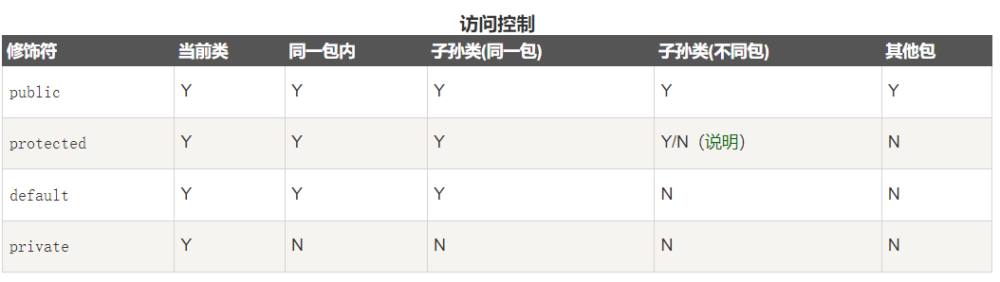

# 类的三大特性

类的特性为：封装，继承和多态。其中多态稍微复杂一点，其表现形式为类方法的重写和父类引用子类。

# 访问修饰符

访问修饰符就是规定该字段，方法或者类能否被`访问`。这个访问由两个因素构成：

1. 访问该方法，字段，类时的`位置`在哪
2. 访问该方法，字段，类的`实例`是什么

访问的语句要在方法中，方法一定数据某个类，这就决定了`位置`；而访问需要通过对象，这就是`实例`。

## 修饰符类型

而java中的访问修饰符有四个：



* default （即默认，什么也不写）: 在同一包内可见，不使用任何修饰符。使用对象：类、接口、变量、方法。
* private : 在同一类内可见。使用对象：变量、方法。 注意：不能修饰类（外部类）

* public : 对所有类可见。使用对象：类、接口、变量、方法

* protected : 对同一包内的类和所有子类可见。使用对象：变量、方法。 注意：不能修饰类（外部类）

protected比较特殊，子类在不同包时能否访问，取决于引用类型。

### protected

protect方法的位置在同一包下可见，而在不同包的子类下就不一定了。

```java
// 定义父类和protected方法
package pack1;

public class Father {
    protected void protectedMethod(){
        System.out.println("This is protect method");
    }
}
```

```java
// 位置：不同包，子类
package pack2;
import pack1.Father;

public class Son extends Father {
    public static void main(String[] args) {
        Father father = new Father();
        father.protectedMethod();       // 报错：因为当前类在不同包下是不可以访问protected
        Son son = new Son();
        son.protectedMethod();          // ok：因为子类在不同包可以访问protected
        Father f2 = new Son();
        f2.protectedMethod();           // 报错：引用为当前类，实际对象为子类时，访问修饰符按引用类型来判断
    }
}
```

# 静态变量

静态变量属于类变量，其内存在类加载时决定，赋值也是在类加载时完成。

## 静态变量的访问和创建
```java
public class MyTest {
    static int num = 0;

    public static void main(String[] args) {
        Student student = new Student();
        student.name = "cain";
        student.count = 10;

        System.out.println(student.name);
        System.out.println(student.count);

        // Student类型的空指针也能访问到静态变量
        student=null;

        System.out.println(student.count);
    }

    public void method1(){
        // 成员方法中，只能访问和修改静态变量，但不能创建静态变量！
//        static int count = 1;
        num++;
        System.out.println(num);
    }
}

class Student{
    String name;
    static int count;
}
```

这里有两个注意点：

* 成员方法不能创建静态变量：这是因为静态变量只能在类加载过程分配内存空间
* 空指针可以访问静态变量：因为静态变量根本不在堆区，对静态变量的访问不是通过引用来访问的

# 泛型

泛型是指类型也当作参数传递给类，接口或者方法，从而在运行时决定其类型。

## 三种泛型

```java
// 泛型接口
public interface GenericInterface <T>{
    public T sum(T a, T b);
}
```

```java
// 泛型类（并且实现泛型接口）
public class GenericClass<V extends Number> implements GenericInterface<V>{
    public V value;
    public V getValue(){
        return value;
    }
    public void setValue(V value){
        this.value = value;
    }

    @Override
    public V sum(V a , V b){
        double sum = (a.doubleValue()+b.doubleValue());
        return (V)Double.valueOf(sum);
    }

    public static void main(String[] args) {
        GenericClass<Integer> integerGenericClass = new GenericClass<>();
        integerGenericClass.setValue(30);
        System.out.println(integerGenericClass.getValue());
        System.out.println(integerGenericClass.sum(3,4));
        System.out.println();
    }
}
```

```java
//泛型方法
public class CommonClass {
    public <T> T getObject(Class<T> a) throws InstantiationException, IllegalAccessException {
        return a.newInstance();
    }

    public static void main(String[] args) throws ClassNotFoundException, InstantiationException, IllegalAccessException {
        CommonClass commonClass = new CommonClass();
        Object object = commonClass.getObject(Class.forName("generic.GenericClass"));
        GenericClass genericClass = (GenericClass) object;
        genericClass.setValue(11);
        System.out.println(genericClass.getValue());
    }
}
```

其中有些需要注意的地方：

* 泛型方法的返回类型为泛型时，接收的引用类型需要是Object

    ```
    Object object = commonClass.getObject(Class.forName("generic.GenericClass"))
    ```

* 泛型类或者泛型接口中使用泛型方法直接用就行，因为类名和接口名处已经声明了泛型了。而泛型方法需要在返回值前单独声明泛型

    ```
    public <T> T getObject(Class<T> a)
    ```

## 泛型的上下限

```java
public class BoundaryStudy {
    public static void showList(List<Object> list){
        for (int i = 0; i < list.size(); i++) {
            Object object = list.get(i);
            System.out.println(object);
        }
    }

    public static void showIntList(List<Integer> list){
        showList(list);     //error
    }

    public static void main(String[] args) {
        List integers= new ArrayList<Integer>();
        integers.add(3);integers.add(5);
        showList(integers); // ok
    }
}
```

上述代码showIntList中将List\<Integer\>传递给List\<Object\>不被允许；需要使用上下限泛型

详情见：https://www.cnblogs.com/jelly12345/p/15720521.html

# 接口

详见： https://www.runoob.com/java/java-interfaces.html