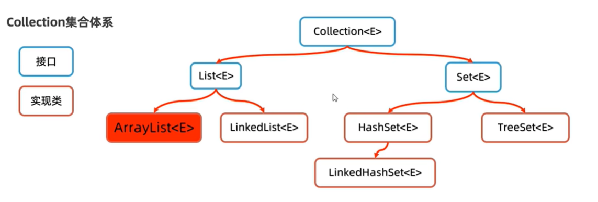
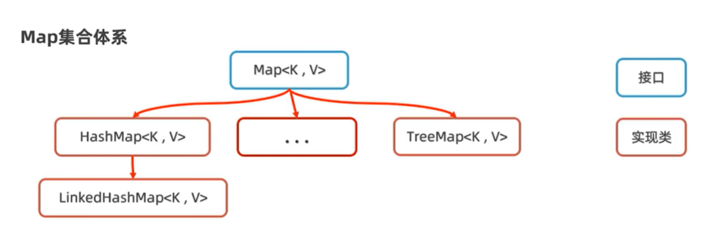

## Collection集合

### 体系结构

注意：Collection也是有父类以及实现的接口的。

**List集合**：有序，可重复，有索引<br>
**Set集合**：无序，不重复，无索引

### Collection常用方法
````
public static void main(String[] args) throws Exception {
    Collection<String> c = new ArrayList<>();
    // 1. add
    c.add("e1");
    c.add("e2");
    c.add("e1");
    c.add("e4");
    System.out.println(c);

    // 2. size()
    System.out.println(c.size());

    // 3. isempty()
    System.out.println(c.isEmpty());

    // 4. contains(Object o)
    System.out.println(c.contains("e4"));

    // 5. remove(Object o)
    c.remove("e2");
    System.out.println(c);

    // 6. Object[] toArray() | E[] toArray(E[] e)
    Object[] objArr = c.toArray();
    String[] strArr = c.toArray(new String[c.size()]);
    // String[] strArr2 = (String[])c.toArray();   // Error: ClassCastException!
    System.out.println(Arrays.toString(strArr));

    // 7. addAll(Collection c)
    Collection<String> c2 = new ArrayList<>();
    c2.addAll(c);
    System.out.println(c2);

    // 8. clear()
    c.clear();
    System.out.println(c);

}
````

### Collection的遍历方式
1. 迭代器
````
public static void iterate(){
    Collection<String> c = new ArrayList<>();
    c.add("E1"); c.add("E2"); c.add("E3");

    //1. create iterator
    Iterator<String> it = c.iterator();
    //2. use iterator
    while(it.hasNext()){
        System.out.println(it.next());
    }
}
````
注意：iterator可以看作指针，next()方法会取出元素并且让指针后移一位。

2. for 循环
````
public static void iterate(){
    Collection<String> c = new ArrayList<>();
    c.add("E1"); c.add("E2"); c.add("E3");

    // use for loop
    for(String e: c){
        System.out.println(e);
    }
}
````

3. Lambda表达式
````
public static void iterate(){
    Collection<String> c = new ArrayList<>();
    c.add("E1"); c.add("E2"); c.add("E3");

    // forEach + lambda
    c.forEach(s -> {
        System.out.println(s);
    });

    // 补充：原本形式
    c.forEach(new Consumer<String>() {
        public void accept(String s){
            System.out.println(s);
        }
    });
}
````
### Collections 工具类
````
public static void main(String[] args){
    List<String> names = new ArrayList<>();
    // 1. addAll(collection<? super T>, T...element)
    Collections.addAll(names, "meiz","cain","gala");
    System.out.println(names);

    // 2. shuffle(List)
    Collections.shuffle(names);
    System.out.println(names);

    // 3. sort(List)
    Collections.sort(names);
    System.out.println(names);
}
````
可以通过调用`Collections`来对数据进行操作。

## List集合 (Collection的子接口)
### List 特有方法
主要特点是可以通过索引获得，以及无需考虑数组长度。
````
public static void list(){
    List<String> ls = new ArrayList<>();
    ls.add("E1");ls.add("E2");

    // 1. add(index, element)
    ls.add(1, "mid");
    System.out.println(ls);

    // 2. element remove(index)
    System.out.println(ls.remove(1));
    System.out.println(ls);

    // 3. get(index)
    System.out.println(ls.get(1));
    System.out.println(ls);

    // 4. set(index, element)
    ls.set(1, "final");
    System.out.println(ls);
}
````

### 遍历方式
1. 迭代器
2. for循环
3. forEach + lambda

和Collection相同，这里不再赘述。

### ArrayList 
1. 基于数组实现
2. 特点：查询速度快；增删效率低

### LinkedList 
1. 基于双链表实现
2. 特点：查询速度慢；增删效率高

## Set集合 (Collection的子接口)
### 特有方法
和Collection大致相同，主要特点为无重复值以及无法通过索引取值。
### 底层原理
原理就是哈希表...不过jdk8版本后，哈希表的实现是：`数组+链表+红黑树`。当冲突的数量过多（链表长度大于64），则不再使用链表，而是使用红黑树。

Set判断重复的根据是hashCode和equals方法，所以当我们决定内容相同的对象否能在set中共存时，需要重写hashCode()和equals()。

LinkedHashSet: 它本质也是`数组+链表+红黑树`，但是它每个元素都添加了双链表机制来记录元素添加的顺序，从而实现`有序`（根据元素添加顺序来排序）。

TreeSet:内部由红黑树来实现，从而实现`可排序`（根据元素的值来排序）。对于自定义对象，必须定义排序方式才能使用Treeset。有两种定义排序方法的办法：

1. 自定义对象实现Comparable接口 
````
public class student implements Comparable<student>{
    int age;
    String name;
    @Override
    public int compareTo(student s) {
        // 返回正数，则是this大
        // 返回负数，则是this小
        // 返回0，相同
        return this.age-s.age;
    }
    
}
````

2. 调用TreeSet(Comparator)构造器来指定规则
````
public static void set(){
    Set<student> s = new TreeSet<>(new Comparator<student>() {
        @Override
        public int compare(student s1,student s2){
            return s1.age - s2.age;
        }
    });
    student s1 = new student(28, "gail");
    student s2 = new student(38, "cain");
    student s3 = new student(28, "none");
    s.add(s1); s.add(s2); s.add(s3);
    System.out.println(s);
}
````

注意：Treeset也会根据排序规则来删除重复值，例如上边我们用年龄来排序，那么年龄相同的对象则被认为是相同的，并且不能共存。

## Map 集合
Map集合和Collection集合是并列存在的，Map集合的元素都是`键值对`的形式，所以也被称为`双列集合`。

注意：Map中是通过Key来判断每一个元素，Value只是附属。而Map中的Key遵循Set集合的特点，是无序，不重复，无索引的。

### Map体系


### Map常用方法
````
public static void main(String[] args) {
    Map<String,Integer> m = new HashMap<>();
    // 1. put(key,value)
    m.put("cain",11); m.put("cain", 13);
    m.put("gala", 14);m.put("loli", 11);
    System.out.println(m);

    // 2. size()
    System.out.println(m.size());

    // 3. isEmpty()
    System.out.println(m.isEmpty());

    // 4. value get(key)
    int age = m.get("gala");
    System.out.println(age);

    // 5. value remove(key)
    m.remove("loli");
    System.out.println(m);

    // 6. containsKey()
    System.out.println(m.containsKey("cain"));

    // 7. containsValue
    System.out.println(m.containsValue(13));

    // 8. Set<K> KeySet()
    Set<String> keys = m.keySet();
    System.out.println(keys);

    // 9. Collection<V> values()
    Collection<Integer> values = m.values();
    System.out.println(values);

    // 10. putAll(Map<K,V>)
    Map<String,Integer> m2 = new HashMap<>();
    m2.put("loli", 13);m2.put("tet", 44);
    m.putAll(m2);
    System.out.println(m);
}
````

### Map遍历方式
1. 拿键找值
````
public static void main(String[] args) {
    Map<String,Integer> m = new HashMap<>();
    m.put("cain",11); m.put("cain", 13);
    m.put("gala", 14);m.put("loli", 11);
    System.out.println(m);

    Set<String> keys = m.keySet();
    for(String key:keys){
        int value = m.get(key);
        System.out.println("Key: "+key+" Value: "+value);
    }
}
````

2. EntrySet
````
public static void main(String[] args) {
    Map<String,Integer> m = new HashMap<>();
    m.put("cain",11); m.put("cain", 13);
    m.put("gala", 14);m.put("loli", 11);
    System.out.println(m);

    Set<Map.Entry<String,Integer>> es = m.entrySet();
    for(Map.Entry<String,Integer> e : es){
        String key = e.getKey();
        int value = e.getValue();
        System.out.println(key+"---->"+value);
    }
}
````

3. Lambda
````
public static void main(String[] args) {
    Map<String,Integer> m = new HashMap<>();
    m.put("cain",11); m.put("cain", 13);
    m.put("gala", 14);m.put("loli", 11);
    System.out.println(m);

    m.forEach((k,v)->{
        System.out.println(k+"--->"+v);
    });
}
````

### 各类的底层实现
**HashMap**

HashMap底层实现与HashSet相同，实际上，HashSet本身就是用HashMap实现的。所以它底层结构也是`数组+链表+红黑树`。

**LinkedHashMap**

LinkedHashMap与LinkedHashSet相同，LinkedHashSet也是依靠LinkedHashMap实现的。

**TreeMap**

TreeMap与TreeSet相同，TreeSet也是依靠TreeMap实现的。


## Stream
Stream是一个接口，提供了便于`链式编程`和`lambda表达式`来处理数据的方法。它是JKD8的新特性。

注意：一个流只能使用一次。

1. 获取stream对象
 ````
public static void main(String[] args) throws Exception {
    // 1. Collection 获取Stream
    Collection<String> names = new ArrayList<String>();
    Collections.addAll(names,"cain","cill","Bob"); 
    Stream<String> s1 = names.stream();
    s1.forEach(e->System.out.println(e));

    // 2. Map 获取Stream
    Map<String,Double> housePrice = new HashMap<>();
    housePrice.put("QuarryBay", 20000d);
    housePrice.put("North", 15000.5d);
    Set<Map.Entry<String,Double>> houPriSet = housePrice.entrySet();
    Stream<Map.Entry<String,Double>> s2 = houPriSet.stream();
    s2.forEach(e -> System.out.println(e.getKey()+"->"+e.getValue()));

    // 3. Array获取Stream
    Integer[] nums = {11,22,33};
    Stream<Integer> s3 = Arrays.stream(nums);
    s3.forEach(e->System.out.println(e));
    Stream<Integer> s4 = Stream.of(nums);
    s4.forEach(e->System.out.println(e));
}
````

2. 常见Stream中间方法
    
    中间方法是指`会返回Stream流`的方法，从而能够继续链式编程。
````
public static void main(String[] args) throws Exception {
    // 1. concat
    Stream<Integer> s1 = Stream.of(11,22,33);
    Stream<Integer> s2 = Stream.of(11,12,13);
    Stream<Integer> s = Stream.concat(s1, s2);

    // 2. filter + sorted
    s.filter(e->e>20).sorted().forEach(System.out::println);

    // 3. sorted
    s.sorted((e1,e2)->e2-e1).forEach(System.out::println);

    // 4. limit
    s.limit(3).forEach(System.out::println);

    // 5. distinct
    s.distinct().forEach(System.out::println);

    // 6. skip()
    s.sorted().skip(3).forEach(System.out::println);

    // 7. map
    s.map(e->e+100).forEach(System.out::println);
}
````

3. Stream的终结方法

    终结方法是指`不返回Strem流`的方法，从而结束链式编程。

````
public static void main(String[] args) throws Exception {
    Stream<Integer> s1 = Stream.of(11,22,33);
    //1. foreach
    //2. count
    System.out.println(s1.count());
    //3. min
    System.out.println(s1.min((e1,e2)->e1-e2));
    //4.max
    System.out.println(s1.max((e1,e2)->e1-e2));
    //5. collect
    List<Integer>nums = s1.collect(Collectors.toList());
    System.out.println(nums);
}
````