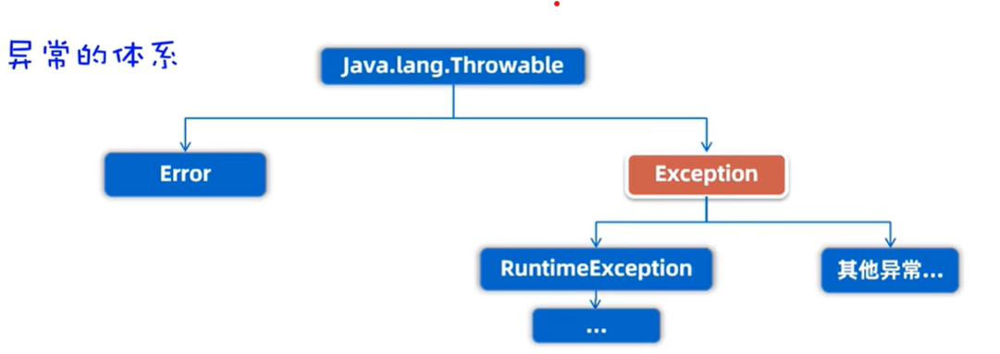

## Expection
异常算是储存异常信息的一个类吧，它的作用是通知上层代码或者运行时有错误发生。例如`void func()`这种无返回值的函数，想要通知调用者函数内部发生的错误，就需要构造异常类并将其抛出。

### 异常的体系


如图，异常可主要分为运行时异常和编译时异常。运行时异常编译器不会检查，但是编译时异常会被检查，导致程序无法编译。

### 异常的处理
由于编译时异常会导致编译不通过，这里有两种方式解决。

1. Try Catch语句
````
try{
    //会抛出异常的代码
}catch(异常类型1){
    //处理异常
}catch(异常类型2){
    //处理异常
}
````
处理异常一般也很简单，只要合理的记录异常已经反馈信息就可以了。

注意：try-catch语句旨在处理异常，所以有catch后，认为异常已被处理，程序也不再自动中止，try-catch后的代码也会被执行！

2. 继续将异常抛出，期待上层程序解决
````
static void main(String[] args) throws 异常1，异常2...{

}
````
main程序并非最上层的程序，其由JVM调用，JVM会提供简单的try-catch处理异常。

### 构建和使用异常
根据异常结构图，我们可以构建运行时异常和编译时异常，分别继承`RuntimeException`和`Exception`。

1. 运行时异常

创建异常类：
````
public class IllegleAgeRuntimeException extends RuntimeException{
    
}
````
这里也可以重写构造方法来自定义如何处理异常信息。

使用异常类：
````
public static void main(String[] args){
    System.out.println("Hello, World!");
    storeAge(-1);
}

public static void storeAge(int age){
    if(age>0 && age<100){
        System.out.println("Success store age: "+age);
        return;
    }else if(age <0){
        // test runtime error
        System.out.println("Error! Age: "+age+" is less than 0");
        throw new IllegleAgeRuntimeException();
        // Attention: code below here is unreachable!
    }
}
````
注意：1. 运行时异常并不严格，*产生异常类的方法*不需要`throws`异常信息，调用*产生异常类方法*的代码也不需要放到`try-catch`中。 2.`throw` 之后的代码是不被执行的！

2. 编译时异常

创建异常类

````
public class TooLargeAgeException extends Exception{
    public TooLargeAgeException(String message){
        super(message);
        System.out.println("age is too large!");
    }  
}
````

使用异常类
````
public static void main(String[] args){
    try {
        storeAge(200);
    } catch (Exception e) {
        // TODO: handle exception
    }
    System.out.println("end");
}

public static void storeAge(int age) throws TooLargeAgeException{
    if(age>0 && age<100){
        System.out.println("Success store age: "+age);
        return;
    }else if(age > 100){
        // test runtime error
        System.out.println("Error! Age: "+age+" is large than 100");
        throw new TooLargeAgeException("error msg");
    }
}
````
注意：1.产生异常的方法现在必须在方法名出`throws`出来异常（throws != throw） 2.调用有throws关键字方法的代码块需要`处理异常`（用上述的两种方法）