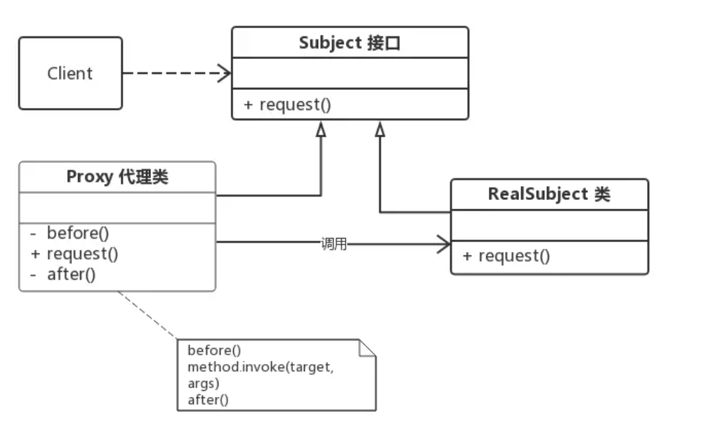
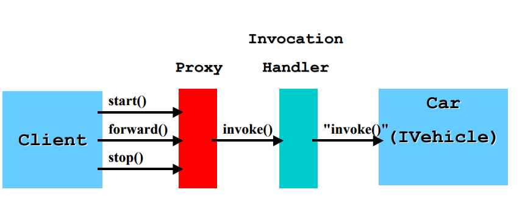

## 可变参数
````
public static void main(String[] args) {
    test(1,2,3);
}

public static void test(int ...args) {
    System.out.println(Arrays.toString(args));
}
````
可变参数本质上是一个`数组`,其声明方式是`类型...参数名`。

注意：1. 一个形参列表中只能有一个可变参数。 2. 可变参数只能放在形参列表最后

## Lambda表达式
用于简化`匿名内部类`的写法

格式为：(匿名类中`被重写的方法`的参数)->{方法体}

前提：只能用于`函数式接口`的匿名内部类，函数式接口指的是只包含一个抽象方法的接口。可选注解：@FunctionalInterface

简化规则：1. 参数类型可以忽略 2. 参数只有一个时，"()"也可以省略 3. 如果方法体只有一行代码，"{}"可以省略,同时也必须要省略"return"和";"。

````
@FunctionalInterface
interface Swimming{
    void swim();
}
public static void main(String[] args){
    Swimming s = ()-> System.out.println("the swimming func");
    s.swim();
}
````

## 方法引用
用于进一步简化lambda表达式。

使用场景：lambda表达式中，函数体只调用一次其它方法。而且lambda表达式的参数与其它方法的参数匹配。则可使用方法引用。

语法：`(p1,p2)->{其它方法(p1,p2)} 可以简化为"其它方法的类::其它方法"`。其中"其它方法"可以为静态方法或者实例方法，甚至可以为"p1.其它方法(p2)"，不过这默认第一个参数为主调参数。也可以为构造器方法，不过语法改为"类名::new"。

例子：
````
@FunctionalInterface
interface Swimming{
    void swim();
}
public static void main(String[] args){
    Swimming s = System.out::println;
    s.swim("call swim func");
}
````

## Classpath
参考文章：https://www.liaoxuefeng.com/wiki/1252599548343744/1260466914339296

classpath是JVM用到的一个环境变量，它用来指示JVM如何搜索class。

因为Java是编译型语言，源码文件是.java，而编译后的.class文件才是真正可以被JVM执行的字节码。因此，JVM需要知道，如果要加载一个abc.xyz.Hello的类，应该去哪搜索对应的Hello.class文件。

所以，classpath就是一组目录的集合，它设置的搜索路径与操作系统相关，windows下为：

```
C:\work\project1\bin;C:\shared;"D:\My Documents\project1\bin"
```

现在我们假设classpath是`.;C:\work\project1\bin;C:\shared`，当JVM在加载abc.xyz.Hello这个类时，会依次查找：

* <当前目录>\abc\xyz\Hello.class
* C:\work\project1\bin\abc\xyz\Hello.class
* C:\shared\abc\xyz\Hello.class

classpath只是声明去哪里找包，还需要把要用到class或者jar包下载到classpath下。注意：jar包是多个class文件的压缩包，相当于文件夹。我们不能直接import xxx.jar，因为我们真正要使用的还是class文件。正确做法是将jar包位置放到classpath中，import <class在jar包中的相对位置>，例如：

```
java -classpath ./hello.jar abc.xyz.Hello
```
这会去导入hello.jar包下的abc/xyz/Hello.class。

此外，jar包还可以包含一个特殊的/META-INF/MANIFEST.MF文件，MANIFEST.MF是纯文本，可以指定Main-Class和其它信息。JVM会自动读取这个MANIFEST.MF文件，如果存在Main-Class，我们就不必在命令行指定启动的类名，而是用更方便的命令：

```
java -jar hello.jar
```

如果是引用当前包下的类不需要`import`，如果是引用其它包下的类，则需要使用`import`关键字。

## 注解

参考文章： https://www.runoob.com/w3cnote/java-annotation.html


## Reflection 反射
详情看：https://pdai.tech/md/java/basic/java-basic-x-reflection.html#google_vignette

反射是用来获取类和操作类的，Java也提供了`Class`关键字来引用类。

其应用是可以从更高的层次上操作类，增强泛用性
### 获取类
    public static void main(String[] args) throws ClassNotFoundException{
        // 1. 类名.class
        Class s1 = Student.class;
        System.out.println(s1.getName());
        System.out.println(s1.getSimpleName());

        // 2. Class.forName()
        Class s2 = Class.forName("com.cain.Student");
        System.out.println(s2.getName());

        // 3. 对象.getClass()
        Student cain = new Student();
        Class s3 = cain.getClass();
        System.out.println(s3.getName());
    }


## 代理

参考连接：https://juejin.cn/post/6844903744954433544

### 代理模式

代理模式是常用的设计模式之一，其目标是将核心代码和非核心代码进行分离。

**代理模式角色**分为 3 种：

* Subject（抽象主题角色）：定义代理类和真实主题的公共对外方法，也是代理类代理真实主题的方法；

* RealSubject（真实主题角色）：真正实现业务逻辑的类；

* Proxy（代理主题角色）：用来代理和封装真实主题；

其结构如图：



根据代理类的构建时机可以分为：

* 静态代理：所谓静态也就是在程序运行前就已经存在代理类的字节码文件，代理类和真实主题角色的关系在运行前就确定了。

* 动态代理：而动态代理的源码是在程序运行期间由JVM根据`反射`等机制动态的生成，所以在运行前并不存在代理类的字节码文件


### 静态代理

例如我们要实现一个计算器类，核心业务为计算功能，非核心业务为“在调用前打印一下”

接口
```
public interface UserService {
    public void select();   
    public void update();
}

```

目标类
```
public class UserServiceImpl implements UserService {  
    public void select() {  
        System.out.println("查询 selectById");
    }
    public void update() {
        System.out.println("更新 update");
    }
}
```

代理类
```
public class UserServiceProxy implements UserService {
    private UserService target; // 被代理的对象

    public UserServiceProxy(UserService target) {
        this.target = target;
    }
    public void select() {
        before();
        target.select();    // 这里才实际调用真实主题角色的方法
        after();
    }
    public void update() {
        before();
        target.update();    // 这里才实际调用真实主题角色的方法
        after();
    }

    private void before() {     // 在执行方法之前执行
        System.out.println(String.format("log start time [%s] ", new Date()));
    }
    private void after() {      // 在执行方法之后执行
        System.out.println(String.format("log end time [%s] ", new Date()));
    }
}

```

### 动态代理

动态代理有两个实现：JDK动态代理和CGLIB动态代理。这里主要写JDK的作为了解。

#### JDK动态代理

JDK动态代理主要依赖java.lang.reflect.Proxy类，它有一个方法可以`动态创建`代理类。

1. 首先创建接口和目标类

    ```
    这里用之前的UserService例子
    ```

2. 创建Handler类要继承InvocationHandler
   ```
   public class LogHandler implements InvocationHandler {
        Object target;

        public LogHandler(Object target) {
            this.target = target;
        }

        @Override
        public Object invoke(Object proxy, Method method, Object[] args) throws Throwable {
            before();
            Object result = method.invoke(target, args);  // 调用 target 的 method 方法
            after();
            return result;  // 返回方法的执行结果
        }
        // 调用invoke方法之前执行
        private void before() {
            System.out.println(String.format("log start time [%s] ", new Date()));
        }
        // 调用invoke方法之后执行
        private void after() {
            System.out.println(String.format("log end time [%s] ", new Date()));
        }
    }
   ```

3. 根据目标类和代理（InvocationHandler）来创建代理类
   ```
       public static void main(String[] args) throws IllegalAccessException, InstantiationException {
        // 1. 创建被代理的对象，UserService接口的实现类
        UserServiceImp userServiceImpl = new UserServiceImp();
        // 2. 获取对应的 ClassLoader
        ClassLoader classLoader = userServiceImpl.getClass().getClassLoader();
        // 3. 获取所有接口的Class，这里的UserServiceImpl只实现了一个接口UserService，
        Class[] interfaces = userServiceImpl.getClass().getInterfaces();
        // 4. 创建一个将传给代理类的调用请求处理器，处理所有的代理对象上的方法调用
        //     这里创建的是一个自定义的日志处理器，须传入实际的执行对象 userServiceImpl
        InvocationHandler logHandler = new LogHandler(userServiceImpl);
        /*
		   5.根据上面提供的信息，创建代理对象 在这个过程中，
               a.JDK会通过根据传入的参数信息动态地在内存中创建和.class 文件等同的字节码
               b.然后根据相应的字节码转换成对应的class，
               c.然后调用newInstance()创建代理实例
		 */
        UserService proxy = (UserService) Proxy.newProxyInstance(classLoader, interfaces, logHandler);
        // 调用代理的方法
        proxy.select();
        proxy.update();

        // 保存JDK动态代理生成的代理类，类名保存为 UserServiceProxy
        // ProxyUtils.generateClassFile(userServiceImpl.getClass(), "UserServiceProxy");
    }
   ```

**Proxy.newProxyInstance**创建要求的参数：

ClassLoader 和 interfaces： 它们跟反射有关，Proxy类会根据目标类实现的interfaces和ClassLoader来创建类。（也就是被创建的代理类只有interfaces中的方法）

InvocationHandler：描述代理对象应该做的事。

**大概流程**：




**生成的代理类**：

```
import java.lang.reflect.InvocationHandler;
import java.lang.reflect.Method;
import java.lang.reflect.Proxy;
import java.lang.reflect.UndeclaredThrowableException;
import proxy.UserService;

public final class UserServiceProxy extends Proxy implements UserService {
    private static Method m1;
    private static Method m2;
    private static Method m4;
    private static Method m0;
    private static Method m3;

    public UserServiceProxy(InvocationHandler var1) throws  {
        super(var1);
    }

    public final boolean equals(Object var1) throws  {
        // 省略...
    }

    public final String toString() throws  {
        // 省略...
    }

    public final void select() throws  {
        try {
            super.h.invoke(this, m4, (Object[])null);
        } catch (RuntimeException | Error var2) {
            throw var2;
        } catch (Throwable var3) {
            throw new UndeclaredThrowableException(var3);
        }
    }

    public final int hashCode() throws  {
        // 省略...
    }

    public final void update() throws  {
        try {
            super.h.invoke(this, m3, (Object[])null);
        } catch (RuntimeException | Error var2) {
            throw var2;
        } catch (Throwable var3) {
            throw new UndeclaredThrowableException(var3);
        }
    }

    static {
        try {
            m1 = Class.forName("java.lang.Object").getMethod("equals", Class.forName("java.lang.Object"));
            m2 = Class.forName("java.lang.Object").getMethod("toString");
            m4 = Class.forName("proxy.UserService").getMethod("select");
            m0 = Class.forName("java.lang.Object").getMethod("hashCode");
            m3 = Class.forName("proxy.UserService").getMethod("update");
        } catch (NoSuchMethodException var2) {
            throw new NoSuchMethodError(var2.getMessage());
        } catch (ClassNotFoundException var3) {
            throw new NoClassDefFoundError(var3.getMessage());
        }
    }
}

作者：小旋锋
链接：https://juejin.cn/post/6844903744954433544
来源：稀土掘金
著作权归作者所有。商业转载请联系作者获得授权，非商业转载请注明出处。
```

#### CGLIB动态代理

CGLIB是一个第三方包，它没有利用反射技术，而是利用ASM字节码生成框架来实现。

CGLib实现动态代理的原理是：直接对需要代理的类的字节码进行操作，生成这个类的一个子类，并重写了类的所有`可重写的方法（非final方法）`。在子类中采用方法拦截的技术拦截所有父类方法的调用，顺势织入横切逻辑。

所以其整体逻辑和JDK还是非常相似的，流程如下：(注意，我这里报错了，没有运行成功！！！但是逻辑和代码应该没问题，好像是包和jdk17不适配的问题)

1. 导入包
    ```
    <dependency>
        <groupId>cglib</groupId>
        <artifactId>cglib</artifactId>
        <version>3.3.0</version>
    </dependency>
    ```
2. 写目标类
   ```
   public class UserDao {
        public void select(){
            System.out.println("select 查询");
        }

        public void update(){
            System.out.println("update 更新");
        }
    }
   ```

3. 写代理逻辑
    ```
    import net.sf.cglib.proxy.MethodInterceptor;
    import net.sf.cglib.proxy.MethodProxy;
    import java.util.Date;

    import java.lang.reflect.Method;

    public class LogInterceptor implements MethodInterceptor {
        @Override
        public Object intercept(Object o, Method method, Object[] objects, MethodProxy methodProxy) throws Throwable {
            before();
            Object result = methodProxy.invokeSuper(o, objects);   // 注意这里是调用 invokeSuper 而不是 invoke，否则死循环，methodProxy.invokesuper执行的是原始类的方法，method.invoke执行的是子类的方法
            after();
            return result;
        }
        private void before() {
            System.out.println(String.format("log start time [%s] ", new Date()));
        }
        private void after() {
            System.out.println(String.format("log end time [%s] ", new Date()));
        }
    }
    ```

4. 构建代理类
    ```
    public static void main(String[] args) {
        Enhancer enhancer = new Enhancer();
        // 设置目标类
        enhancer.setSuperclass(UserDao.class);
        // 设置代理逻辑
        enhancer.setCallback(new LogInterceptor());
        // 获取代理类
        UserDao daoProxy = (UserDao)enhancer.create();
        daoProxy.select();
        daoProxy.update();
    }
    ```


相较于JDK动态代理，CGLIB的好处是：
1. 使用CGLib代理的类，不需要实现接口，因为CGLib生成的代理类是直接继承自需要被代理的类；（JDK是根据目标类实现的接口生成）
   
2. 它使用方法拦截，比使用java反射的JDK动态代理要快。

缺点是：

1. 第三方包，有时候会报错.....
2. 没有办法处理final方法