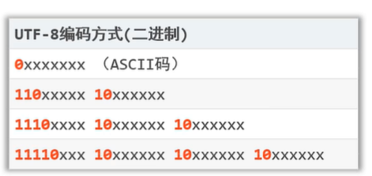

## 字符集
### ASCII字符集
ASCII (American Standard Code for Information Interchange): 包括了英文字母，符号等，使用1个字节来存储信息。

### GBK
GDK（汉字内拓展码规范）：GBK用两个字节来表示汉字，但同时兼容ASCII，并用一个字节编码英文和字符。由于ASCII都是0开头，GDK都是1开头，所以不同长度的字符不会有影响。

### UTF8
UFT8是Unicode字符集的一种编码方案。Unicode是‘万国集’，即可以表示所有的语言。

UTF-8采用变长编码形式，字符可能被编码为：1，2，3，4个字节。区分字节长度的格式为：



其中英文和字符占一字节（与ASCII兼容），中文占三字节。

### 编码和解码
````
public static void main(String[] args) throws Exception {
    String test = new String("abc曹宇巍");

    // 使用默认字符集进行编码
    byte[] encodedBytes = test.getBytes();
    System.out.println(Arrays.toString(encodedBytes));

    // 使用默认字符集进行解码
    String decodedString = new String(encodedBytes);
    System.out.println(decodedString);

    // 使用指定字符集进行编码
    byte[] encodedBytes2 = test.getBytes("Utf-8");
    System.out.println(Arrays.toString(encodedBytes2));

    // 使用指定字符集解码
    String decodedString2 = new String(encodedBytes2, "GBK");
    System.out.println(decodedString2);
}
````

## File与IO流
File是java.io包下的类，用于代表当前操作系统中的文件。我们可以用它查看和修改文件，但是无法查看或修改文件的内容。如需修改文件内容，则需要IO流。

所以IO流也被认为是`数据传输和存储`的解决方案。

## IO流
IO 可以根据输入，输出，字符流（纯文本文件）和字节流（二进制文件）分为四大类。


其中判断是否为纯文本文件的一种方式为：能用windows的记事本打开并读懂。

### 字节流

````
public static void main(String[] args) throws Exception {
    File file = new File("bin\\text.txt");
    // 输入输出流
    FileInputStream is = new FileInputStream(file);
    FileOutputStream os = new FileOutputStream("copy.txt");

    // read() 每次读取一个字节，读到底返回-1。
    // 无法处理中文，因为占据多个字节
    // int b;
    // while ((b = is.read()) != -1) {
    //     System.out.println((char) b);
    // }

    // read(byte[]) 根据buffer大小读取
    int len;
    byte[] buffer = new byte[3];
    while ((len = is.read(buffer)) != -1) {
        os.write(buffer,0,len);
    }

    is.close();
    os.close();
}
````

### 字符流
字符流和字节流用法差不多，但是字节流是每次读取一个byte，而字符流是每次读取一个字符。但是由于编码问题字符流经常无法`正确判断出一个字符并读取`，而且读取字符意义也不大，这里不再介绍。

### IO流的层级
上述的FileInputStream或FileReader可以被认为是基本流，因为它们只提供了最基本的功能。实际上对基本流进行包装来提供更强大的功能。


例如BufferedInputStream就是提供了缓存区，来提高IO效率（但是我觉得基本流应该也是有缓存区的）。以及InputStreamReader可以包装FileInputStream然后指明编码方式来解决编码不一致的问题。

### 其他流
上述的IO流说白了只涉及三个东西：字节，编码和缓存。

但是有个特殊流：DataInpuStream（数据输入流）来存储和读取java的数据。它可以存储java的数据类型和值。注意：它用于java读写数据的，所以不遵守编码规则来让数据具备可读性。

而数据输入输出流中，还有个特殊情况：对象（类）。对于对象数据，需要先进行序列化，然后用ObjectInputStream类来存储和读取。注意：对象要序列化需要实现Serializable接口，并可以通过transient关键字指明不参与序列号的成员变量。

### 资源释放
资源释放有点想释放锁，例如我没有释放文件a，那么在程序运行中，其他程序想要更改文件a是不被允许的。

为了保证程序释放，往往使用try-catch-finally块。

#### try-catch-finally
````
public static void main(String[] args){
    FileInputStream is = null;
    try{
        is = new FileInputStream("bin\\text.txt");
        is.read();
    }catch(Exception e){
        e.printStackTrace();
    }finally{
        try {
            if(is != null) is.close();
        } catch (IOException e) {
            e.printStackTrace();
        }
    }
}
````
其中第一个try-catch是确保程序最终释放资源，内部的try-catch是处理资源释放时可能产生的异常。

#### try-catch-resource
由于try-catch-finally代码比较臃肿，提出了try-catch-resource,专门处理资源的释放。

语法：try(定义资源){...} catch(异常){...}

````
public static void main(String[] args){
    try(FileInputStream is = new FileInputStream("bin\\text.txt");){
        is.read();
    }catch(Exception e){
        e.printStackTrace();
    }
}
````