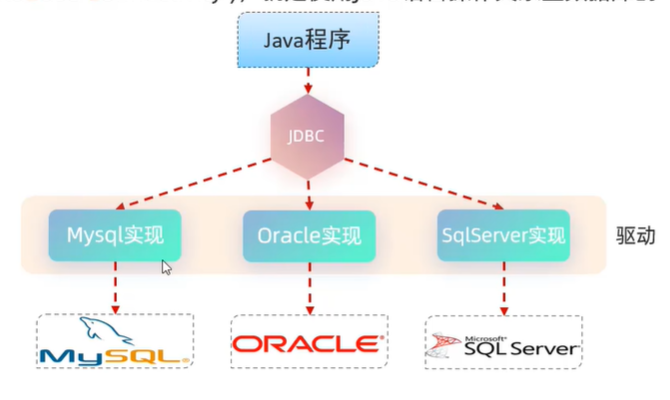

## JDBC 概念


JDBC是Java操作**关系型数据库**的`接口`，其中只是定义了规范而没有真正实现如何操作数据库。实现是由各个数据库厂商负责的，他们会提供对应的`驱动jar包`。

这样的好处就是可以封装底层的数据库操作，程序员直接面向jdbc接口写代码，这样同一套代码可以在不同的数据库上运行。

## Quick Start

1. 添加依赖
   
```
<dependency>
	<groupId>com.mysql</groupId>
	<artifactId>mysql-connector-j</artifactId>
	<scope>runtime</scope>
</dependency>
```

2. 编写面向jdbc的代码
   
````
public void testJDBC() throws ClassNotFoundException, SQLException{
	// 1. 注册驱动
	Class.forName("com.mysql.cj.jdbc.Driver");

	// 2. 连接到数据库
	String url = "jdbc:mysql://localhost:3306/db01";
	String username = "root";
	String password = "123456";
	Connection connection = DriverManager.getConnection(url,username,password);
	
	// 3. 执行sql语句
	String sql = "select * from user";
	Statement statement = connection.createStatement();
	ResultSet resultSet = statement.executeQuery(sql);

	// 4. 封装结果数据
	List<User> list = new ArrayList<>();
	while (resultSet.next()) {
		int id = resultSet.getInt("id");
		String name = resultSet.getString("name");
		String gender = resultSet.getString("gender");

		User user = new User(id,name,gender);
		list.add(user);
	}

	// 5.释放资源
	statement.close();
	resultSet.close();

	list.forEach(e->{
		System.out.println(e);
	});
}
````

## JDBC API详解

### DriverMangement

DriverManagement有两个功能：

**1. 配置驱动类**

```
Class.forName("com.mysql.cj.jdbc.Driver");
```

这段代码只是利用反射技术将Driver类加载进内存而已，而com.mysql.cj.jdbc.Driver中有个静态代码块：

```
public class Driver extends NonRegisteringDriver implements java.sql.Driver {
    public Driver() throws SQLException {
    }

    static {
        try {
            DriverManager.registerDriver(new Driver());
        } catch (SQLException var1) {
            throw new RuntimeException("Can't register driver!");
        }
    }
}
```

这段代码用```DriverManager.registerDriver(new Driver());```来真的地注册驱动。

**2. 与数据库建立连接**

由于数据库可能存在于本地，云端或者其它地方，我们需要指明数据库的位置。并且数据库的实现类型也不同（例如MySQL，Oracal等），连接时也需要指明数据库类型。

所以基本语法为：**jdbc : < driver protocal > : < driver connection details >**

而MySQL的语法为：**jdbc : mysql : // < IP > : < Port > / < database > ? < 参数键值对1 > & < 参数键值对2 >**

此外还需要指明数据库的用户名和密码:

```
String url = "jdbc:mysql://localhost:3306/worker";
String username = "root";
String password = "123456";
Connection connection = DriverManager.getConnection(url, username, password);
```

### Connection

当与数据库建立连接后会返回一个connection对象，可以用它来操作数据库。它也有两个主要功能

1. 创建statement

如果是普通的statement，当只能用字符串拼接来动态构建sql语句，这有sql注入的问题。
```
Statement statement = connection.createStatement();
String name = "cain";
String sql = "Select * from employees WHERE name = '"+cheatName+"'";
System.out.println(sql);
ResultSet resultSet = statement.executeQuery(sql);
```

所以还有preparedStatement，通过?占位符和setXXX方法来动态构建sql语句，防止了sql注入问题
```
String name = "cain";
PreparedStatement preparedStatement = connection.prepareStatement("SELECT * FROM employees WHERE name=?");
preparedStatement.setString(1,name);
ResultSet resultSet = preparedStatement.executeQuery();
```

**preparedStatement可以做两件事：预编译 和 转义**

如果按照字符拼接的方式，每次拼接的sql语句传到MySQL里都需要重新进行语法检查和编译（生产执行方案？）过程。而开启预编译后，通过setXXX更改sql语句并不会重新进行语法检查和编译。

```
// 通过参数开启预编译
String url = "jdbc:mysql://localhost:3306/worker?useServerPrepStmts=true"
```

此外，preparedStatement如何通过setXXX方法生产安全的sql语句的？其实是对敏感字符进行转义，例如 ' 转为 \\' 。

2. 创建事务

通过connection的setAutoCommit，commit，和rollBack方法可以模拟出Transaction。

```
String sql1 = "UPDATE employees SET age=18 WHERE id=1";
String sql2 = "UPDATE employees SET name=gala WHERE id=1";

try {
	// 默认情况下每次execute语句都会commit
	// 关闭autoCommit相当于开启Transaction了
	connection.setAutoCommit(true);

	statement.execute(sql1);
	int i = 3/0;
	statement.execute(sql2);

	connection.commit();
} catch (Exception e){
	connection.rollback();
	e.printStackTrace();
}
```

### Statement

statement就是用来执行sql语句的，但是它有不同的execute方法，会带来不同的返回值：

```
Statement statement = connection.createStatement();
String sql = "Insert INTO employees VALUES (2,\"xiaoming\",33,1)";
String sql2 = "SELECT * FROM employees";

// executeUpdate 是进行增删改操作
// 它的返回值是Int， 指示被影响的行数
int count = statement.executeUpdate(sql);
System.out.println("affected row number is "+count);

// executeQuery 是进行查找操作
// 它的返回值是ResultSet，里边储存了查询结果
ResultSet resultSet = statement.executeQuery(sql2);

// resultSet.next() 查询下一行内容，并且返回boolean来指示这行是否有内容
while (resultSet.next()){
	// resultSet.getXXX 可以根据列名来查询内容并转换类型为XXX
	String name = resultSet.getString("name");
	int age = resultSet.getInt("age");
	System.out.println(name+"-"+age);
}
```

## 数据库连接池

在上述例子中，如果有多个用户使用java程序访问数据库的话，每个用户使用过程中都需要创建connection，在使用完之后再释放connection。

而数据库连接池就是一个connection容器，它管理多个connection对象。用户需要用就从连接池拿，不用就放回去，从而节省了创建和释放的开销。（当然，连接池本身的实现更复杂）

### Quick Start

1. 添加依赖

```
<dependency>
	<groupId>com.alibaba</groupId>
	<artifactId>druid</artifactId>
	<version>1.2.21</version>
</dependency>
```

2. 写配置文件

```
driverClassName=com.mysql.cj.jdbc.Driver
url=jdbc:mysql://localhost:3306/worker
username=root
password=123456

#<!-- ??????? -->
initialSize=6
#<!-- ?????????? -->
maxActive=20
#<!-- ?????????? -->
```

3. 创建连接池并使用
```
public static void main(String[] args) throws Exception {
	Properties properties = new Properties();
	properties.load(new FileInputStream("src/main/resources/druid.properties"));
	DataSource dataSource = DruidDataSourceFactory.createDataSource(properties);
	Connection connection = dataSource.getConnection();

	// 有connection后，执行语句和之前的一样
	String name = "cain";
	PreparedStatement preparedStatement = connection.prepareStatement("SELECT * FROM employees WHERE name=?");
	preparedStatement.setString(1,name);
	ResultSet resultSet = preparedStatement.executeQuery();
	while (resultSet.next()){
		// resultSet.getXXX 可以根据列名来查询内容并转换类型为XXX
		String uname = resultSet.getString("name");
		int age = resultSet.getInt("age");
		System.out.println(uname+"-"+age);
	}
}
```

## Spring Framwork 中的 JDBCTemplate 封装

Spring框架提供了JDBCTemplate类来封装使用数据库连接池操作数据库的操作。

### 1. 引入依赖
```
<dependency>
	<groupId>org.springframework</groupId>
	<artifactId>spring-jdbc</artifactId>
	<version>6.1.2</version>
</dependency>
```

### 2.配置JDBCTemplate类

数据库连接池信息的外部文件

```
url=jdbc:mysql://localhost:3306/worker
uname=root
password=123456
driver=com.mysql.cj.jdbc.Driver
```

bean.xml文件
```
<context:property-placeholder location="classpath:druid.properties"></context:property-placeholder>

<bean id="druidDataSource" class="com.alibaba.druid.pool.DruidDataSource">
	<property name="driverClassName" value="${driver}"></property>
	<property name="url" value="${url}"></property>
	<property name="username" value="${uname}"></property>
	<property name="password" value="${password}"></property>
</bean>

<bean id="jdbcTemplate" class="org.springframework.jdbc.core.JdbcTemplate">
	<property name="dataSource" ref="druidDataSource"></property>
    </bean>
```

### 3.jdbcTemplate.update实现 增删改 操作
```
@SpringJUnitConfig(locations = "classpath:bean.xml")
public class JDBCTest {
    @Autowired
    private JdbcTemplate jdbcTemplate;

    @Test
    public void JDBCTemplateTest(){
        // 1. 编写预编译语句
        String sql = "INSERT INTO employees VALUES (?,?,?,?)";
        // 2. jdbcTemplate直接执行
        // update 效果等同于preparedStatement.executeUpdate
        int affectedRows = jdbcTemplate.update(sql,4,"wule",12,0);
        System.out.println(affectedRows);
    }
}
```

### 4. 查询操作

query方法有个RomMapper接口，需要实现它的mapRow方法，并且在里边描述如何封装返回的结果，并且指明返回值的类型。

```
public void JDBCTemplateQuery(){
	String sql = "SELECT * FROM employees";

	List<Worker> results = jdbcTemplate.query(sql, new RowMapper<Worker>() {
		@Override
		public Worker mapRow(ResultSet rs, int rowNum) throws SQLException {
			Worker worker = new Worker();

			worker.setId(rs.getInt("id"));
			worker.setName(rs.getString("name"));
			worker.setAge(rs.getInt("age"));
			worker.setGender(rs.getInt("gender"));
			return worker;
		}
	});
	System.out.println(results);
}
```
```
@Data
public class Worker {
    private int id;
    private String name;
    private int age;
    private int gender;
}
```

不过spring已经提供了RomMapper接口的实现类，它做的工作和我们上述的代码类似，应该也是按照名称匹配的。
```
@Test
public void JDBCTemplateQuery2(){
	String sql = "SELECT * FROM employees";

	List<Worker> results = jdbcTemplate.query(sql, new BeanPropertyRowMapper<>(Worker.class));
	System.out.println(results);
}
```

### Spring Transaction 

Spring的jdbc依赖除了提供template来方便数据库访问，也提供了Transaction相关的类来进行事务管理。

**首先在xml中配置TransactionManager**
```
// 允许用注解进行事务管理
<!-- http://www.springframework.org/schema/tx
http://www.springframework.org/schema/tx/spring-tx.xsd -->
<tx:annotation-driven transaction-manager="dataSourceTransactionManager"></tx:annotation-driven>

// 创建事务管理类
<bean class="org.springframework.jdbc.datasource.DataSourceTransactionManager" id="dataSourceTransactionManager">
	<property name="dataSource" ref="druidDataSource"></property>
</bean>
```

**之后要创建事务，就在函数上添加注解**，该函数所有跟数据库相关的操作都会被认为同一个事务。（但是要注意，这只是保证数据库操作的一致性，如果是因为判断逻辑导致没有发送某个sql请求，事务并不会取消其它的sql请求。）

```
@Transactional
public void transferAge(int u1,int u2, int amount){
	boolean r1 = workerService.deleteAge(u1,amount);
	boolean r2 = workerService.addAge(u2,amount);
	if(r1 && r2){
		System.out.println("transfer age successful");
	}
}
```

**事务配置**

在Transaction中有配置，可以用@Transaction标签中的属性进行配置，例如timeout和readonly等。

## BUG 总结

### 连接池初始化失败

连接池初始化失败多半是因为配置文件写的有问题：

1. 检查属性名是否正确

例如这样driverClassName不可错写成driver
```
<bean id="druidDataSource" class="com.alibaba.druid.pool.DruidDataSource">
	<property name="driverClassName" value="${driver}"></property>
	<property name="url" value="${url}"></property>
	<property name="username" value="${username}"></property>
	<property name="password" value="${password}"></property>
</bean>
```

2. 检查properties中是否存在引号或者空格

```
url=jdbc:mysql://localhost:3306/worker
username=root
password=123456
driver=com.mysql.cj.jdbc.Driver
```

其中不可有引号不可有空格

3. 连接mysql的用户名不同于自己设置的用户名

报错 : 

create connection Exception, url: jdbc:mysql://localhost:3306/worker, errorCode 1045, state 28000
java.sql.SQLException: Access denied for user '14017'@'localhost' (using password: YES)

原因：
```
<bean id="druidDataSource" class="com.alibaba.druid.pool.DruidDataSource">
	<property name="driverClassName" value="${driver}"></property>
	<property name="url" value="${url}"></property>
	<property name="username" value="${username}"></property>
	<property name="password" value="${password}"></property>
</bean>
```
```
url=jdbc:mysql://localhost:3306/worker
username=root
password=123456
driver=com.mysql.cj.jdbc.Driver
```

这里想用${username}指向了root，但是报错显示用户名为14017'@'localhost，说明环境中有文件已经使用了username这个变量，并设置为了14017'@'localhost。

解决方法：

不用username这个变量名就行

```
uname=root
```
