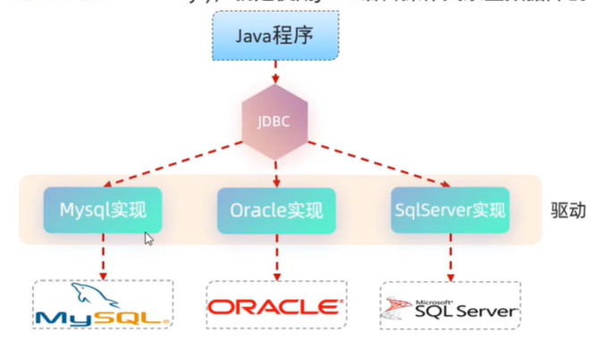

## JDBC 概念


JDBC是Java操作**关系型数据库**的`接口`，其中只是定义了规范而没有真正实现如何操作数据库。实现是由各个数据库厂商负责的，他们会提供对应的`驱动jar包`。

这样的好处就是可以封装底层的数据库操作，程序员直接面向jdbc接口写代码，这样同一套代码可以在不同的数据库上运行。

## Quick Start

1. 添加依赖
   
```xml
<dependency>
	<groupId>com.mysql</groupId>
	<artifactId>mysql-connector-j</artifactId>
	<scope>runtime</scope>
</dependency>
```

2. 编写面向jdbc的代码
   
````java
public void testJDBC() throws ClassNotFoundException, SQLException{
	// 1. 注册驱动
	Class.forName("com.mysql.cj.jdbc.Driver");

	// 2. 连接到数据库
	String url = "jdbc:mysql://localhost:3306/db01";
	String username = "root";
	String password = "123456";
	Connection connection = DriverManager.getConnection(url,username,password);
	
	// 3. 执行sql语句
	String sql = "select * from user";
	Statement statement = connection.createStatement();
	ResultSet resultSet = statement.executeQuery(sql);

	// 4. 封装结果数据
	List<User> list = new ArrayList<>();
	while (resultSet.next()) {
		int id = resultSet.getInt("id");
		String name = resultSet.getString("name");
		String gender = resultSet.getString("gender");

		User user = new User(id,name,gender);
		list.add(user);
	}

	// 5.释放资源
	statement.close();
	resultSet.close();

	list.forEach(e->{
		System.out.println(e);
	});
}
````

## JDBC API详解

### DriverMangement

DriverManagement有两个功能：

**1. 配置驱动类**

```java
Class.forName("com.mysql.cj.jdbc.Driver");
```

这段代码只是利用反射技术将Driver类加载进内存而已，而com.mysql.cj.jdbc.Driver中有个静态代码块：

```java
public class Driver extends NonRegisteringDriver implements java.sql.Driver {
    public Driver() throws SQLException {
    }

    static {
        try {
            DriverManager.registerDriver(new Driver());
        } catch (SQLException var1) {
            throw new RuntimeException("Can't register driver!");
        }
    }
}
```

这段代码用```DriverManager.registerDriver(new Driver());```来真的地注册驱动。

**2. 与数据库建立连接**

由于数据库可能存在于本地，云端或者其它地方，我们需要指明数据库的位置。并且数据库的实现类型也不同（例如MySQL，Oracal等），连接时也需要指明数据库类型。

所以基本语法为：**jdbc : < driver protocal > : < driver connection details >**

而MySQL的语法为：**jdbc : mysql : // < IP > : < Port > / < database > ? < 参数键值对1 > & < 参数键值对2 >**

此外还需要指明数据库的用户名和密码:

```java
String url = "jdbc:mysql://localhost:3306/worker";
String username = "root";
String password = "123456";
Connection connection = DriverManager.getConnection(url, username, password);
```

### Connection

当与数据库建立连接后会返回一个connection对象，可以用它来操作数据库。它也有两个主要功能

1. 创建statement

	如果是普通的statement，当只能用字符串拼接来动态构建sql语句，这有sql注入的问题。
	```java
	Statement statement = connection.createStatement();
	String name = "cain";
	String sql = "Select * from employees WHERE name = '"+cheatName+"'";
	System.out.println(sql);
	ResultSet resultSet = statement.executeQuery(sql);
	```

	所以还有preparedStatement，通过?占位符和setXXX方法来动态构建sql语句，防止了sql注入问题
	```java
	String name = "cain";
	PreparedStatement preparedStatement = connection.prepareStatement("SELECT * FROM employees WHERE name=?");
	preparedStatement.setString(1,name);
	ResultSet resultSet = preparedStatement.executeQuery();
	```

	**preparedStatement可以做两件事：预编译 和 转义**

	上述通过字符串拼接会导致`用户输入可以作为mysql命令，而不仅仅是文本值`，从而导致mysql注入问题。

	而preparedStatement默认开启开启预编译，通过占位符将mysql的命令结构固定了，然后用户输入只能作为`纯文本`进行填充，不会作为Mysql命令。

	```java
	// 通过参数开启预编译
	String url = "jdbc:mysql://localhost:3306/worker?useServerPrepStmts=true"
	```

	此外，preparedStatement还会对对敏感字符进行转义，例如 ' 转为 \\' ，从而保证Mysql安全。

2. 创建事务

	通过connection的setAutoCommit，commit，和rollBack方法可以模拟出Transaction。

	```java
	String sql1 = "UPDATE employees SET age=18 WHERE id=1";
	String sql2 = "UPDATE employees SET name=gala WHERE id=1";

	try {
		// 默认情况下每次execute语句都会commit
		// 关闭autoCommit相当于开启Transaction了
		connection.setAutoCommit(false);

		statement.execute(sql1);
		int i = 3/0;
		statement.execute(sql2);

		connection.commit();
	} catch (Exception e){
		connection.rollback();
		e.printStackTrace();
	}
	```

### Statement

statement就是用来执行sql语句的，但是它有不同的execute方法，会带来不同的返回值：

```java
Statement statement = connection.createStatement();
String sql = "Insert INTO employees VALUES (2,\"xiaoming\",33,1)";
String sql2 = "SELECT * FROM employees";

// executeUpdate 是进行增删改操作
// 它的返回值是Int， 指示被影响的行数
int count = statement.executeUpdate(sql);
System.out.println("affected row number is "+count);

// executeQuery 是进行查找操作
// 它的返回值是ResultSet，里边储存了查询结果
ResultSet resultSet = statement.executeQuery(sql2);

// resultSet.next() 查询下一行内容，并且返回boolean来指示这行是否有内容
while (resultSet.next()){
	// resultSet.getXXX 可以根据列名来查询内容并转换类型为XXX
	String name = resultSet.getString("name");
	int age = resultSet.getInt("age");
	System.out.println(name+"-"+age);
}
```

## 数据库连接池

在上述例子中，如果有多个用户使用java程序访问数据库的话，每个用户使用过程中都需要创建connection，在使用完之后再释放connection。

而数据库连接池就是一个connection容器，它管理多个connection对象。用户需要用就从连接池拿，不用就放回去，从而节省了创建和释放的开销。（当然，连接池本身的实现更复杂）

由于连接池负责数据库的连接和释放，所以它需要用到JDBCDriverManager，也算是稍微封装了JDBC？

### Quick Start

1. 添加依赖

```xml
<dependency>
	<groupId>com.alibaba</groupId>
	<artifactId>druid</artifactId>
	<version>1.2.21</version>
</dependency>
```

2. 写配置文件

```xml
driverClassName=com.mysql.cj.jdbc.Driver
url=jdbc:mysql://localhost:3306/worker
username=root
password=123456

initialSize=6
maxActive=20
```

3. 创建连接池并使用
```java
public static void main(String[] args) throws Exception {
	Properties properties = new Properties();
	properties.load(new FileInputStream("src/main/resources/druid.properties"));
	DataSource dataSource = DruidDataSourceFactory.createDataSource(properties);
	Connection connection = dataSource.getConnection();

	// 有connection后，执行语句和之前的一样
	String name = "cain";
	PreparedStatement preparedStatement = connection.prepareStatement("SELECT * FROM employees WHERE name=?");
	preparedStatement.setString(1,name);
	ResultSet resultSet = preparedStatement.executeQuery();
	while (resultSet.next()){
		// resultSet.getXXX 可以根据列名来查询内容并转换类型为XXX
		String uname = resultSet.getString("name");
		int age = resultSet.getInt("age");
		System.out.println(uname+"-"+age);
	}
}
```

## Spring Framwork 中的 JDBCTemplate 封装

Spring框架提供了JDBCTemplate类来封装使用数据库连接池操作数据库的操作。（我的理解是它封装了JDBC,和Mybatis一样都是框架）

### 1. 引入依赖
```xml
<dependency>
	<groupId>org.springframework</groupId>
	<artifactId>spring-jdbc</artifactId>
	<version>6.1.2</version>
</dependency>
```

### 2.配置JDBCTemplate类

数据库连接池信息的外部文件

```xml
url=jdbc:mysql://localhost:3306/worker
uname=root
password=123456
driver=com.mysql.cj.jdbc.Driver
```

bean.xml文件
```xml
<context:property-placeholder location="classpath:druid.properties"></context:property-placeholder>

<bean id="druidDataSource" class="com.alibaba.druid.pool.DruidDataSource">
	<property name="driverClassName" value="${driver}"></property>
	<property name="url" value="${url}"></property>
	<property name="username" value="${uname}"></property>
	<property name="password" value="${password}"></property>
</bean>

<bean id="jdbcTemplate" class="org.springframework.jdbc.core.JdbcTemplate">
	<property name="dataSource" ref="druidDataSource"></property>
</bean>
```

### 3.jdbcTemplate.update实现 增删改 操作
```java
@SpringJUnitConfig(locations = "classpath:bean.xml")
public class JDBCTest {
    @Autowired
    private JdbcTemplate jdbcTemplate;

    @Test
    public void JDBCTemplateTest(){
        // 1. 编写预编译语句
        String sql = "INSERT INTO employees VALUES (?,?,?,?)";
        // 2. jdbcTemplate直接执行
        // update 效果等同于preparedStatement.executeUpdate
        int affectedRows = jdbcTemplate.update(sql,4,"wule",12,0);
        System.out.println(affectedRows);
    }
}
```

### 4. 查询操作

query方法有个RomMapper接口，需要实现它的mapRow方法，并且在里边描述如何封装返回的结果，并且指明返回值的类型。

```java
public void JDBCTemplateQuery(){
	String sql = "SELECT * FROM employees";

	List<Worker> results = jdbcTemplate.query(sql, new RowMapper<Worker>() {
		@Override
		public Worker mapRow(ResultSet rs, int rowNum) throws SQLException {
			Worker worker = new Worker();

			worker.setId(rs.getInt("id"));
			worker.setName(rs.getString("name"));
			worker.setAge(rs.getInt("age"));
			worker.setGender(rs.getInt("gender"));
			return worker;
		}
	});
	System.out.println(results);
}
```
```java
@Data
public class Worker {
    private int id;
    private String name;
    private int age;
    private int gender;
}
```

不过spring已经提供了RomMapper接口的实现类，它做的工作和我们上述的代码类似，应该也是按照名称匹配的。
```java
@Test
public void JDBCTemplateQuery2(){
	String sql = "SELECT * FROM employees";

	List<Worker> results = jdbcTemplate.query(sql, new BeanPropertyRowMapper<>(Worker.class));
	System.out.println(results);
}
```

### Spring Transaction 

Spring的jdbc依赖除了提供template来方便数据库访问，也提供了Transaction相关的类来进行事务管理。

**首先在xml中配置TransactionManager**
```xml
// 允许用注解进行事务管理
<!-- http://www.springframework.org/schema/tx
http://www.springframework.org/schema/tx/spring-tx.xsd -->
<tx:annotation-driven transaction-manager="dataSourceTransactionManager"></tx:annotation-driven>

// 创建事务管理类
<bean class="org.springframework.jdbc.datasource.DataSourceTransactionManager" id="dataSourceTransactionManager">
	<property name="dataSource" ref="druidDataSource"></property>
</bean>
```

**之后要创建事务，就在函数上添加注解**，该函数所有跟数据库相关的操作都会被认为同一个事务。（但是要注意，这只是保证数据库操作的一致性，如果是因为判断逻辑导致没有发送某个sql请求，事务并不会取消其它的sql请求。）

```java
@Transactional
public void transferAge(int u1,int u2, int amount){
	boolean r1 = workerService.deleteAge(u1,amount);
	boolean r2 = workerService.addAge(u2,amount);
	if(r1 && r2){
		System.out.println("transfer age successful");
	}
}
```

**事务配置**

在Transaction中有配置，可以用@Transaction标签中的属性进行配置，例如timeout和readonly等。

### Spring Transaction 原理分析

#### 1. 分层全景：注解 → 事务管理器 → JDBC

一条 `@Transactional` 从方法到数据库，中间隔着四层，各层职责如下：

| 层 | 角色 | 提供方 | 干什么 |
| --- | --- | --- | --- |
| `@Transactional` 注解 | 标记 | spring-tx | 只声明"此方法需要事务"，本身不含任何逻辑 |
| 事务拦截器（代理） | 执行者 | Spring 容器自动注册 | 看到注解 → 回调事务管理器完成 开/提交/回滚 |
| `PlatformTransactionManager` | 接口（抽象） | spring-tx | 定义事务管理器契约：getTransaction / commit / rollback |
| `DataSourceTransactionManager` | 实现类 | spring-jdbc | 针对 JDBC 的场景实现，内部操作 `java.sql.Connection` |
| `Connection` | JDBC API | JDBC 标准 | `setAutoCommit(false)` / `commit()` / `rollback()` 真正落在这里 |

**核心认知：注解不干活，拦截器只认接口，真正碰数据库的是实现类调用的 JDBC Connection。**

#### 2. Spring 提供的是"接口 + 实现类"

Spring 不是只给接口，而是为每种持久化技术都配套了实现类，按需注册成 bean：

| 实现类 | 所在模块 | 适用场景 |
| --- | --- | --- |
| `DataSourceTransactionManager` | spring-jdbc | JDBC / JdbcTemplate /（经 SqlSessionTemplate 的 MyBatis） |
| `JpaTransactionManager` | spring-orm | JPA（Hibernate 作为 JPA 实现） |
| `HibernateTransactionManager` | spring-orm | 原生 Hibernate |
| `JtaTransactionManager` | spring-tx | 分布式事务（XA / 应用服务器） |

业务代码只认 `@Transactional`，换持久化技术只需换 bean 的 class，代码零改动——这是"面向接口编程"的又一次体现。

#### 3. 注解如何生效：AOP 代理

容器发现 bean 上有 `@Transactional`，就不会注册它本身，而是注册一个**代理对象**（bean 有接口 → JDK 动态代理；无接口 → CGLIB 子类代理）。`@Autowired` 注入的、外部调用到的都是这个代理：

```
调用方
  ↓ 拿到的是 代理对象（不是真身）
代理.invoke():
  ① txManager.getTransaction()   ← 真正方法执行【前】开事务
  ② target.方法体()               ← 此刻你的代码才执行
  ③ 正常返回 → txManager.commit()
     抛异常   → txManager.rollback() → 继续向上抛
```

拦截器内部逻辑（概念还原，真实源码远复杂于此但骨架一致）：

```java
Object invoke(MethodInvocation mi) {
    TransactionStatus ts = txManager.getTransaction(definition); // 开事务
    try {
        Object result = mi.proceed();     // ★ 到这一步才执行你的方法体
        txManager.commit(ts);             // 正常结束 → 提交
        return result;
    } catch (RuntimeException ex) {
        txManager.rollback(ts);           // 抛异常 → 回滚
        throw ex;                         // 异常继续抛给上层
    }
}
```

**自调用陷阱（验证代理的经典例子）**：同一个类内部用 `this` 调用另一个 `@Transactional` 方法，事务不生效——因为 `this` 是"真身"，绕过了代理：

```java
@Service
public class AccountService {
    @Transactional
    public void outer() {
        this.inner();   // ✗ this 是真身，注解没人拦截 → inner 不在事务里
    }

    @Transactional
    public void inner() { /* ... */ }
}
```

#### 4. 核心机制：连接怎么"跨类共享"（ThreadLocal）

事务管理器开的连接，业务代码（JdbcTemplate、DAO 等）凭什么拿到同一条？靠 `TransactionSynchronizationManager` 的 **ThreadLocal**：

```java
// TransactionSynchronizationManager（概念还原）
// 每个线程一份私有 map：key = DataSource，value = 包装 Connection 的 holder
class TransactionSynchronizationManager {
    private static final ThreadLocal<Map<Object, Object>> RESOURCES = new ThreadLocal<>();

    // 事务管理器开事务时调用：把连接"绑定到当前线程"
    static void bindResource(Object dataSource, Object connectionHolder) {
        Map<Object, Object> map = RESOURCES.get();   // 当前线程的私有储物柜
        if (map == null) { map = new HashMap<>(); RESOURCES.set(map); }
        map.put(dataSource, connectionHolder);
    }

    // 任何代码都能用同一个 DataSource 来查
    static Object getResource(Object dataSource) {
        Map<Object, Object> map = RESOURCES.get();
        return map == null ? null : map.get(dataSource);
    }
}
```

而 JdbcTemplate **不是**直接 `dataSource.getConnection()`，它统一走 `DataSourceUtils`，**先查储物柜**：

```java
// DataSourceUtils.getConnection（概念还原）—— JdbcTemplate 拿连接的真实入口
static Connection getConnection(DataSource dataSource) {
    // ① 先查当前线程储物柜，key = dataSource
    ConnectionHolder holder = TransactionSynchronizationManager.getResource(dataSource);
    // ② 查到了 → 直接用事务管理器绑定那条连接，绝不再新开
    if (holder != null) return holder.getConnection();
    // ③ 没查到 → 才自己从连接池拿一条
    return dataSource.getConnection();
}
```

**为什么能命中？** 配置里事务管理器和 JdbcTemplate 持有**同一个 DataSource bean（同一对象引用）**，绑定和查询用的是同一个 key：

```
事务管理器: bindResource( dataSource, 连接A )   // 存入当前线程储物柜
JdbcTemplate: getResource( dataSource )          // 同一 key → 查到连接A → 共用 ✓
```

**事务结束时的清理**：commit/rollback 后事务管理器会从储物柜**解绑**并归还连接。这步必须做干净——Web 服务器的线程是复用的，若不清理，下一个请求复用该线程时会拿到上一个请求残留的连接，造成串数据。

#### 5. 完整示例：带异常回滚的转账

配置（bean.xml 节选，AccountService 需另行注册为 bean，如 @Component + 组件扫描）：

```xml
<bean id="dataSource" class="com.alibaba.druid.pool.DruidDataSource">
    <property name="driverClassName" value="com.mysql.cj.jdbc.Driver"/>
    <property name="url" value="jdbc:mysql://localhost:3306/worker"/>
    <property name="username" value="root"/>
    <property name="password" value="123456"/>
</bean>

<bean id="jdbcTemplate" class="org.springframework.jdbc.core.JdbcTemplate">
    <property name="dataSource" ref="dataSource"/>
</bean>

<!-- Spring 提供的实现类：包在 dataSource 外面，专门控制它的连接事务 -->
<bean id="dataSourceTransactionManager"
      class="org.springframework.jdbc.datasource.DataSourceTransactionManager">
    <property name="dataSource" ref="dataSource"/>
</bean>

<!-- 注册"注解拦截器"，并告诉它用哪个事务管理器 bean -->
<tx:annotation-driven transaction-manager="dataSourceTransactionManager"/>
```

业务代码：

```java
@Service
public class AccountService {

    @Autowired
    private JdbcTemplate jdbcTemplate;

    @Transactional
    public void transferAge(int fromId, int toId, int amount) {
        // ① 扣钱
        jdbcTemplate.update("UPDATE employee SET age = age - ? WHERE id = ?", amount, fromId);

        // ② 埋雷：模拟运行期异常（RuntimeException）
        int x = 1 / 0;

        // ③ 加钱 —— 永远执行不到
        jdbcTemplate.update("UPDATE employee SET age = age + ? WHERE id = ?", amount, toId);
    }
}
```

运行时实际发生（调用 `accountService.transferAge(1, 2, 10)`）：

| 步骤 | 谁在动 | 发生了什么 |
| --- | --- | --- |
| ① | 拦截器（代理） | 发现 `@Transactional`，先不执行方法，向事务管理器要事务 |
| ② | DataSourceTransactionManager | 从连接池拿连接 conn → `conn.setAutoCommit(false)` → 把 conn 绑进当前线程 ThreadLocal |
| ③ | 拦截器 | 事务就绪，才调用真正的方法体 |
| ④ | 业务方法 | 第一条 update（扣款）执行：JdbcTemplate 经 DataSourceUtils 命中 ② 那条 conn → 扣款在事务内，**未真正落库** |
| ⑤ | 业务方法 | `1 / 0` 抛 ArithmeticException（RuntimeException） |
| ⑥ | 拦截器 | 捕获异常 → 调 `txManager.rollback()` |
| ⑦ | DataSourceTransactionManager | `conn.rollback()` → 从 ThreadLocal 解绑 → 连接还回连接池 |
| ⑧ | 拦截器 | 把异常继续抛给调用方，本次业务失败 |

对比：若把 `1 / 0` 删掉，则 ⑤ 正常执行第三条 update → 方法正常返回 → 拦截器调 `commit()` → 两条 update **一起落库**。

#### 6. 反例：验证"同线程 + 同 DataSource"两个硬条件

```java
// 反例①：换一个 DataSource 实例 → key 不同，查不到 → 新开连接 → 不在事务里，SQL 自己自动提交
JdbcTemplate t2 = new JdbcTemplate(otherDataSource);

// 反例②：新开线程 → 新线程的储物柜是空的 → 新开连接 → 不在事务里
new Thread(() -> jdbcTemplate.update("...")).start();
```

**"同一个线程 + 同一个 DataSource"是组成一个 Spring JDBC 事务的两个硬性条件。**

#### 7. 自研 DAO 框架如何接入 Spring 事务

自己的 DAO 想被 `@Transactional` 管理，**不需要自己发明一套共享机制**，只要让"获取连接的入口经过 Spring 的资源绑定通道"：

```java
public class MyDao {
    private final DataSource dataSource;

    public int update(String sql, Object... args) {
        Connection conn = DataSourceUtils.getConnection(dataSource);  // ① 先查 ThreadLocal
        try {
            // 用 conn 正常执行 SQL（PreparedStatement 建在这条事务连接上）
            // ...
        } finally {
            DataSourceUtils.releaseConnection(conn, dataSource);      // ② 经 Spring 通道释放
        }
        // ③ 绝不自己 commit() / rollback() / close() —— 事务边界归事务管理器
    }
}
```

三条纪律：

1. 拿连接：`DataSourceUtils.getConnection(dataSource)`（不要直接 `dataSource.getConnection()`）；
2. 释放：`DataSourceUtils.releaseConnection(conn, dataSource)`（事务中它只是登记，不会真的关闭）；
3. 不自己 commit / rollback。

⚠️ 代价：DAO 代码直接依赖了 spring-jdbc。更解耦的做法是学 MyBatis：核心框架只定义"给我一个连接"的抽象（MyBatis 的 `Transaction` SPI），由单独的 Spring 适配包（mybatis-spring 的 `SpringManagedTransaction`）用 `DataSourceUtils` 实现——核心框架零 Spring 依赖。另外 Spring 还提供 `TransactionAwareDataSourceProxy` 包装 DataSource，让**无法改源码**的存量代码直接 `getConnection()` 也能命中 ThreadLocal 中的事务连接。

## BUG 总结

### 连接池初始化失败

连接池初始化失败多半是因为配置文件写的有问题：

1. 检查属性名是否正确

例如这样driverClassName不可错写成driver
```
<bean id="druidDataSource" class="com.alibaba.druid.pool.DruidDataSource">
	<property name="driverClassName" value="${driver}"></property>
	<property name="url" value="${url}"></property>
	<property name="username" value="${username}"></property>
	<property name="password" value="${password}"></property>
</bean>
```

2. 检查properties中是否存在引号或者空格

```
url=jdbc:mysql://localhost:3306/worker
username=root
password=123456
driver=com.mysql.cj.jdbc.Driver
```

其中不可有引号不可有空格

3. 连接mysql的用户名不同于自己设置的用户名

报错 : 

create connection Exception, url: jdbc:mysql://localhost:3306/worker, errorCode 1045, state 28000
java.sql.SQLException: Access denied for user '14017'@'localhost' (using password: YES)

原因：
```
<bean id="druidDataSource" class="com.alibaba.druid.pool.DruidDataSource">
	<property name="driverClassName" value="${driver}"></property>
	<property name="url" value="${url}"></property>
	<property name="username" value="${username}"></property>
	<property name="password" value="${password}"></property>
</bean>
```
```
url=jdbc:mysql://localhost:3306/worker
username=root
password=123456
driver=com.mysql.cj.jdbc.Driver
```

这里想用${username}指向了root，但是报错显示用户名为14017'@'localhost，说明环境中有文件已经使用了username这个变量，并设置为了14017'@'localhost。

解决方法：

不用username这个变量名就行

```
uname=root
```
