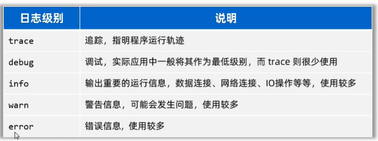

## 日志体系结构


现有很多日志框架来进行日志技术，而这些框架也遵循某种日志接口，从而方便我们学习。

## Logback

LogBack是比较新的一套日志框架，旨在解决Log4j框架的问题。LogBack包含三个模块：core, classic and access。 

Core是核心模块，是其它俩模块的基础。Classic是对SLF4J接口的实现，而access是整合了servlet，从而提供HTTP-ACCESS服务。

### 信息LEVEL



不同信息类别的级别是不同的，在配置文件中可以设置显示哪些级别的信息来方便查看。

### 导入包
要使用LOGBACK，至少要core和classic模块，并且引入SLF4J接口。

````
<!-- https://mvnrepository.com/artifact/ch.qos.logback/logback-core -->
<dependency>
    <groupId>ch.qos.logback</groupId>
    <artifactId>logback-core</artifactId>
    <version>1.2.3</version>
</dependency>

<!-- https://mvnrepository.com/artifact/ch.qos.logback/logback-classic -->
<dependency>
    <groupId>ch.qos.logback</groupId>
    <artifactId>logback-classic</artifactId>
    <version>1.2.3</version>
</dependency>

<!-- https://mvnrepository.com/artifact/org.slf4j/slf4j-api -->
<dependency>
    <groupId>org.slf4j</groupId>
    <artifactId>slf4j-api</artifactId>
    <version>1.7.26</version>
</dependency>
````

### 代码内使用
主要就是声明一个logger类后，用该类记录不同level的信息。

````
public static final Logger logger = LoggerFactory.getLogger("testLog");
public static void main(String[] args) {
    logger.debug("this is debug message");
    logger.info("this is important info");
    logger.warn("warn message");
    logger.error("error message");
}
````

### 配置文件
在项目的/src/main/resource下创建logback.xml文件，在里边配置日志信息。

#### 控制台
这里可以配置输出到控制台的信息。
````
<appender name="STDOUT" class="ch.qos.logback.core.ConsoleAppender">
    <encoder>
        <pattern>%d{HH:mm:ss.SSS} [%thread] %-5level %logger{36} -%kvp- %msg%n</pattern>
    </encoder>
</appender>
````

#### 文件
这里可以配置输出到文件的信息，例如文件位置，编码格式，文件拆分规则等。
````
<appender name="FILE" class="ch.qos.logback.core.rolling.RollingFileAppender">
    <rollingPolicy class="ch.qos.logback.core.rolling.TimeBasedRollingPolicy">
        <fileNamePattern>logFile.%d{yyyy-MM-dd}.log</fileNamePattern>
        <maxHistory>30</maxHistory>
    </rollingPolicy>
    <encoder>
        <pattern>%d{HH:mm:ss.SSS} [%thread] %-5level %logger{35} - %msg%n</pattern>
    </encoder>
    <file>D:\Programming\JavaStudy\basic\Log\log\src\main\log\test.log</file>
</appender>
````

#### 总配置
这里选择记录哪些level的信息，是否输出到控制台或者文件。
````
<root level="debug">
    <appender-ref ref="STDOUT" />
    <appender-ref ref="FILE" />
</root>
````
