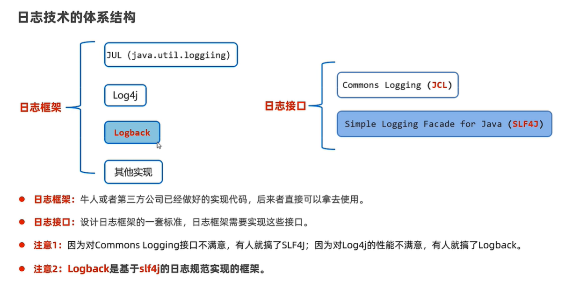

## 日志体系结构



现有很多日志框架来进行日志技术，而这些框架也遵循某种日志接口，从而方便我们学习。

## Logback简介

LogBack是比较新的一套日志框架，旨在解决Log4j框架的问题。LogBack包含三个模块：core, classic and access。 

Core是核心模块，是其它俩模块的基础。Classic是对SLF4J接口的实现，而access是整合了servlet，从而提供HTTP-ACCESS服务。

## Logback 依赖
要使用LOGBACK，至少要core和classic模块，并且引入SLF4J接口。

````
<dependency>
    <groupId>ch.qos.logback</groupId>
    <artifactId>logback-core</artifactId>
    <version>1.2.3</version>
</dependency>

// classic 依赖于其它两个，所以只引入它就行
<dependency>
    <groupId>ch.qos.logback</groupId>
    <artifactId>logback-classic</artifactId>
    <version>1.2.3</version>
</dependency>

<dependency>
    <groupId>org.slf4j</groupId>
    <artifactId>slf4j-api</artifactId>
    <version>1.7.26</version>
</dependency>
````

## quick start
```
package chapters.introduction;

public class HelloWorld2 {

    public static void main(String[] args) {
        Logger logger = LoggerFactory.getLogger("chapters.introduction.HelloWorld2");
        logger.debug("Hello world");
        
        // 打印Logback自身的日志
        LoggerContext lc = (LoggerContext)LoggerFactory.getILoggerFactory();
        StatusPrinter.print(lc);
    }
}
```
这里没有配置logback的xml文件，但是依旧可以使用，因为没有配置文件也会进行默认配置。

## logback的架构

logback主要由3部分构成：
* logger: 日志消息对象。通过logger对象可以将日志空间划分为树状结构，从而可以只输出需要的日志。
* Appender: 日志消息的输出对象，一个logger可以绑定多个logger，从而输出到多个地点。
* Layout: TBD

### logger 树状结构

logger的树状结构是根据logger名称划分的，根节点为root。其它节点的继承关系由 . 来区分。例如com.example是com的子类。

### logger 创建和获取

在上述代码中，都是通过LoggerFactory.getLogger(loggerName)获取logger，如果logger不存在，则创建logger。

此外，也可以在logback配置文件中创建logger，并且设置logger的属性。
```
<logger name="com" level="INFO">
    <appender-ref ref="STDOUT"/>
</logger>
```
为了降低耦合，感觉在配置文件中创建logger更好。官方建议logger的名称为使用该logger类的全类名。

### logger level

logger可以指定输出的level，其中TRACE < DEBUG < INFO < WARN < ERROR。

logger level也是有继承关系的，如果com.aa没有指明level，那它将继承其父类com的level。其中root默认的level为debug。

```
public void layerTest(){
    // 父类为info level，不会打印debug信息
    ch.qos.logback.classic.Logger logger = (ch.qos.logback.classic.Logger) LoggerFactory.getLogger("com");
    logger.setLevel(Level.INFO);
    logger.debug("debug father");

    // 子类继承父类，也为info level，不会打印debug信息
    ch.qos.logback.classic.Logger logger2 = (ch.qos.logback.classic.Logger) LoggerFactory.getLogger("com.aaa");
    logger2.debug("debug child");

    // 没有父类，没设置level，继承root，level为debug
    ch.qos.logback.classic.Logger logger3 = (ch.qos.logback.classic.Logger) LoggerFactory.getLogger("org");
    logger3.debug("debug other");
}
```

### Logger Additifity

上边logger继承关系的也会导致日志消息的传递：子类的消息会传递给父类；父类的消息会传递给root。

如果每个层级的logger都设置了appender来打印消息，这种叠加性（additifity）会导致日志消息多次打印。

为此我们可以设置additivity属性来显示指明是否开启叠加性（默认开启）：

```
<logger name="com" level="INFO">
    <appender-ref ref="STDOUT"/>
</logger>

<logger name="com.aaa" additivity="false">
    <appender-ref ref="STDOUT"/>
</logger>

<root level="debug">
    <appender-ref ref="STDOUT"/>
</root>
```

## 配置文件

在应用程序当中使用日志语句需要耗费大量的精力。推荐使用配置文件来管理这些日志语句。

### 配置文件初始化
以下是 logback 的初始化步骤：

1. logback 会在类路径下寻找名为 logback-test.xml 的文件。
2. 如果没有找到，logback 会继续寻找名为 logback.groovy 的文件。
3. 如果没有找到，logback 会继续寻找名为 logback.xml 的文件。
4. 如果没有找到，将会通过 JDK 提供的 ServiceLoader 工具在类路径下寻找文件 META-INFO/services/ch.qos.logback.classic.spi.Configurator，该文件的内容为实现了 Configurator 接口的实现类的全限定类名。
5. 如果以上都没有成功，logback 会通过 BasicConfigurator 为自己进行配置，并且日志将会全部在控制台打印出来。

对于maven项目，在 src/test/resources 下新建 logback-test.xml。maven 会确保它不会被生成。所以你可以在测试环境中给配置文件命名为 logback-test.xml，在生产环境中命名为 logback.xml。

**配置文件结构：**
```
<configuration>
	<appender name="STDOUT" class="ch.qos.logback.core.ConsoleAppender">
		<encoder>
			<pattern>%d{HH:mm:ss.SSS} [%thread] %-5level %logger{36} - %msg%n</pattern>
		</encoder>
	</appender>
	
	<logger name="chapters.configuration" level="INFO" />

	<root level="DEBUG">
		<appender-ref ref="STDOUT" />
	</root>
</configuration>
```


## 推荐参考资料
https://github.com/YLongo/logback-chinese-manual