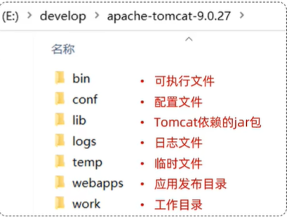
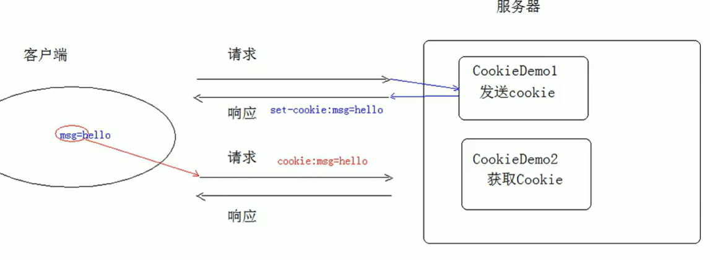
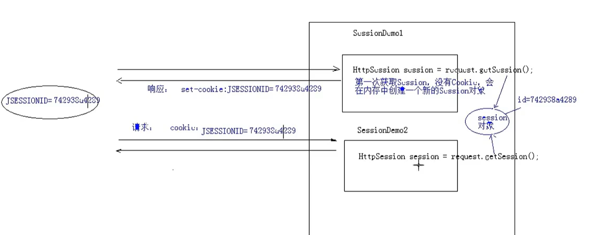

# Web服务器
想要别人能够通过网络访问到自己的资源和程序，需要下载`web服务器软件`来负责处理协议以及实现部署。

web服务器可以：

1. 封装HTTP协议（网络请求），便于web开发
2. 部署web项目，使其能够通过浏览器访问

## Tomcat服务器
服务器和部署的程序交互需要接口，而Tomcat支持的是Servlet规范，可以运行Servlet程序，因此也被成为Servlet容器。

工作流程如下：
1. Client发送http请求给服务器（tomcat）
2. 如果是静态资源，服务器之间返回页面
3. 如果是动态资源，查看Web.xml中注册的servlet
4. 调用对应的servlet实现类（因为tomcat也是知道servlet接口的，并且提供了servlet依赖，所以它知道如何处理servlet类。servlet相当于服务器和java遵循的规则）

### TomCat下载、配置、启动

下载地址：https://tomcat.apache.org/ 选择版本下载zip，解压就行，不需要安装过程。

配置端口： 修改conf/server.xml文件中的Connector port

````
<Connector port="9000" protocol="HTTP/1.1"
            connectionTimeout="20000"
            redirectPort="8443"
            maxParameterCount="1000"
            />
````

日志乱码： 修改conf/logging.properties中的java.util.logging.ConsoleHandler.encoding，将UTF-8改为GDK

启动：双击bin/startup.mat

部署项目： 要将项目部署到服务器上，只需要将项目放到webapps目录下即可

### Tomcat目录结构


### 注意
springboot中的起步依赖也包含了tomcat，但那个相当于又下载了一个`内嵌tomcat`，与这个单独下载的不是同一个程序。

**IDEA 配置 Tomcat**

见/Editor/idea.md里的笔记


# Servlet

Servlet是在服务器端运行的java程序，功能有点类似javascript，是用来构建动态页面的。


## quick start

1. 创建WEB项目并且添加依赖 (javaEE就不需要了)

    由于Servlet不是javeSE的一部分，需要先引入依赖
    ```
    <dependency>
      <groupId>jakarta.servlet</groupId>
      <artifactId>jakarta.servlet-api</artifactId>
      <version>6.1.0</version>
      <scope>provided</scope>
    </dependency>
    ```

2. JAVA文件夹下创建类实现Sevlet接口

    ```java
    public class HelloServlet implements Servlet {
        @Override
        public void init(ServletConfig servletConfig) throws ServletException {

        }

        @Override
        public ServletConfig getServletConfig() {
            return null;
        }

        @Override
        public void service(ServletRequest servletRequest, ServletResponse servletResponse) throws ServletException, IOException {
            System.out.println("service is started");
        }

        @Override
        public String getServletInfo() {
            return null;
        }

        @Override
        public void destroy() {

        }
    }
    ```

3. 配置Web.xml文件

    ```
    <servlet>
        <servlet-name>demo1</servlet-name>
        <servlet-class>com.cain.servlets.HelloServlet</servlet-class>
    </servlet>
    <servlet-mapping>
        <servlet-name>demo1</servlet-name>
        <url-pattern>/demo1</url-pattern>
    </servlet-mapping>
    ```

4. IDEA中配置TOMCAT，并部署webapp，然后启动（详情看Editor/idea.md）
5. 如果启动成功（能看见index.jsp）但是报错：Servlet实例化失败，应该是Servlet的maven依赖和Tomcat的版本不匹配

## 生命周期

**1. 初始化**

Tomcat通过反射技术，使用全类名创建Servlet，创建之后调用servlet的init方法。该方法只会在servlet被创建后调用一次：

```java
@Override
public void init(ServletConfig servletConfig) throws ServletException {
    System.out.println("init...");
}
```

此外，servlet的创建时机也是可以设置的：如果load-on-startup为0或者正数，则启动服务器时创建；如果是负数（也是默认值），则是servlet被访问时创建。
```
<servlet>
    <servlet-name>demo1</servlet-name>
    <servlet-class>com.cain.servlets.HelloServlet</servlet-class>
    <load-on-startup>1</load-on-startup>
</servlet>
```

**2. 运行**

Servelet每次运行都会调用service方法
```java
@Override
public void service(ServletRequest servletRequest, ServletResponse servletResponse) throws ServletException, IOException {
    System.out.println("service2 is started");
}
```

**3. 销毁**

通过destroy方法销毁，在类被销毁时调用
```java
@Override
public void destroy() {
    System.out.println("destroy...");
}
```

## Sevlet体系结构

Servlet是程序员和服务端之间的约定，程序员根据这个接口构建实现类，服务端根据这个接口使用实现类。但Servlet是很泛型的一个接口，为了方便使用，还有protocal specific的Servlet子接口，例如常见的HttpSevlet。

HttpSevlet继承Sevlet，所以服务器端不需要了解HttpSevlet是什么，它依旧是调用service方法就行。而HttpSevlet是实现了Sevlet接口，添加一些http常用的功能，从而构建成了一个抽象类，从而方便程序员实现Sevlet。而它放到了Sevlet-api依赖中，成为了一种规范，所以我们可以直接使用。

## Request请求

程序员和服务器之间除了Sevlet接口的约定外，还有SevletRequest和SevletResponse接口的约定。服务器会按照接口将它实际收到的请求给封装起来，也会按照接口将response中的消息给返回给客户端。

具体流程为：在Tomcat接受的请求后，它会创建ServletRequest和ServletResponse的实现类，并且用它们作为参数调用servlet的service方法。那service方法可以用ServletRequest查看请求消息，并且用ServletResponse存储返回结果。

### Request、Resonpse体系结构

类似的，SevletRequest只是泛型的接口，针对不同的网络协议应该有更具体的接口，例如常见的HttpSevletRequest。HttpSevletRequest继承了SevletRequest接口，并且增加了一些方法来获取http特定的消息。

不过不同于Servlet的体系结构，此时不需要程序员来实现特定接口，而是服务器根据它收到实际网络请求类型来构建对应的特定实现类。由于HttpSevletRequest继承于SevletRequest，服务器可以将HttpSevletRequest传给service方法的SevletRequest参数，程序员只需要进行类型转换就行了（如果用了对应的HttpSevlet，这个抽象类已经做了类型转换，这一步都免了）。

Response也是同理，tomcat根据特定的网络请求类型来创建特定的Response类。

### Request作用

在实际网络请求中的数据都可以在SevletRequest中取出来，由于API繁多，到时候查文档就行。下边是取URL中参数的例子：

```java
@Override
public void service(ServletRequest servletRequest, ServletResponse servletResponse) throws ServletException, IOException {
    HttpServletRequest httpServletRequest = (HttpServletRequest) servletRequest;

    System.out.println(httpServletRequest.getQueryString());
}
```

此外，功能复杂时可能需要多个servlet协助，可以实现servlet跳转并且共享信息：

demo1
```java
public void service(ServletRequest servletRequest, ServletResponse servletResponse) throws ServletException, IOException {
    HttpServletRequest httpServletRequest = (HttpServletRequest) servletRequest;
    // 设置共享数据
    String msg = "msg from demo1";
    httpServletRequest.setAttribute("msg",msg);

    // servlet跳转
    RequestDispatcher dispatcher = httpServletRequest.getRequestDispatcher("/demo2");
    dispatcher.forward(httpServletRequest,servletResponse);
}
```

demo2
```java
@Override
public void service(ServletRequest servletRequest, ServletResponse servletResponse) throws ServletException, IOException {
    // 获取共享数据
    System.out.println(servletRequest.getAttribute("msg"));
}
```

### Reponse作用

与Request类似，HTTP响应体中的内容都可以在response对象中设置，像状态码，响应体之类的

```java
@Override
public void service(ServletRequest servletRequest, ServletResponse servletResponse) throws ServletException, IOException {
    HttpServletResponse httpServletResponse = (HttpServletResponse) servletResponse;
    // 响应字符
    httpServletResponse.getWriter().write("<h1>my response<h1>");
}
```

也可以实现重定向功能，注意这个不同于Servlet跳转。Servlet跳转是内部进行的，对外不可见；而重定向是返回一个重定向消息给客户端，客户端再次发送http请求
```java
@Override
public void service(ServletRequest servletRequest, ServletResponse servletResponse) throws ServletException, IOException {
    HttpServletResponse httpServletResponse = (HttpServletResponse) servletResponse;
    HttpServletRequest httpServletRequest = (HttpServletRequest) servletRequest;

    // 获取资源前缀
    String contextPath = httpServletRequest.getContextPath();
    // url跳转
    httpServletResponse.sendRedirect(contextPath+"/demo2");
}
```

## ServletContext 对象

前边的Requset.setAttribute可以保证在一个request请求中的不同servlet共享信息；而ServletContext则是允许在整个项目运行过程中共享信息。（也就是tomcat不重启部署的项目，信息就一直存在）

demo1
```java
@Override
public void service(ServletRequest servletRequest, ServletResponse servletResponse) throws ServletException, IOException {
    HttpServletResponse httpServletResponse = (HttpServletResponse) servletResponse;
    HttpServletRequest httpServletRequest = (HttpServletRequest) servletRequest;

    // 设置ServletContext信息
    String globalMsg = "this is a global message";
    servletRequest.getServletContext().setAttribute("msg",globalMsg);

    // url跳转
    String contextPath = httpServletRequest.getContextPath();
    httpServletResponse.sendRedirect(contextPath+"/demo2");
}
```

demo2
```java
@Override
public void service(ServletRequest servletRequest, ServletResponse servletResponse) throws ServletException, IOException {
    ServletContext servletContext = servletRequest.getServletContext();
    servletResponse.getWriter().write((String) servletContext.getAttribute("msg"));
}
```

## 注解替代web.xml

web.xml主要功能就是映射url到servlet，在servlet3.0之后，这个工作可以有@WebServlet注解实现：

```
// 映射url到当前servlet
@WebServlet("/demo2")
public class HelloServlet implements Servlet {
}
```

（web.xml内可以不写映射，但是如果我删除web.xml的话会报错）

### 一个Servlet匹配多个url

如果希望一个servlet匹配多个url有两种方法：

一种是通过列表
```
@WebServlet({"/demo2","/ddd"})
```

另一种是通过正则表达式
```
@WebServlet("*.test")
```
# 会话技术

在 Web 开发中，“会话（Session）”是指用户与服务器之间的一次交互过程。（是一个概念，不是特定的操作）

* 目的：是在用户与服务器之间保持状态。
* 功能：在一次会话的范围内的多次请求间,共享数据。
* 技术实现：
  * Cookie--共享数据存在客户端
  * Session--共享数据存在服务端

* 一次会话：浏览器第一次给服务器资源发送请求,会话建立,直到有一方断开为止。断开可能通过：会话过期，浏览器关闭，用户主动登出账号等
* 注意：Session一词多义，既指会话概念，也指特定的技术

## Cookie

### 基本原理

浏览器和服务器通信流程：

1. 浏览器第一次向服务器发送一个普通请求
2. 服务器发现是第一次访问，在响应体里添加set-cookie字段
3. 浏览器收到响应后，会将该cookie存储
4. 下次浏览器向服务器发送请求时，会自动添加存储的cookie到请求中的cookie字段

模拟代码：

```java
@WebServlet("/demo1")
public class CookieDemo1 extends HttpServlet {
    @Override
    protected void doPost(HttpServletRequest req, HttpServletResponse resp) throws ServletException, IOException {
        // 1. 创建Cookie (注意：cookie的内容中不能有空格）
        Cookie cookie = new Cookie("cain", "some-message-about-cain");

        // 2. 发送Cookie
        resp.addCookie(cookie);

        System.out.println("cookie 发送完成");
    }

    @Override
    protected void doGet(HttpServletRequest req, HttpServletResponse resp) throws ServletException, IOException {
        doPost(req, resp);
    }
}
```

```java
@WebServlet("/demo2")
public class CookieDemo2 extends HttpServlet {
    @Override
    protected void doPost(HttpServletRequest req, HttpServletResponse resp) throws ServletException, IOException {
        // 3. 获取Cookie,打印cookie中的键值对
        Cookie[] cookies = req.getCookies();
        if(cookies != null) {
            for (Cookie cookie : cookies) {
                System.out.println(cookie.getName() + "=" + cookie.getValue());
            }
        }
    }

    @Override
    protected void doGet(HttpServletRequest req, HttpServletResponse resp) throws ServletException, IOException {
        doPost(req, resp);
    }
}
```

代码图解：



### cookie的细节

1. 一次可不可以发送多个cookie?
   * 可以。创建多个Cookie对象,使用response调用多次addCookie方法发送cookie即可。
  
2. cookie在浏览器中保存多长时间?
   * 默认情况下,当浏览器关闭后,Cookie数据被销毁

   * 使用setMaxAge(int seconds)方法可以持久存储
     1. 正数:将Cookie数据写到硬盘的文件中，并指定cookie存活时间,超时cookie文件自动失效
     2. 负数:使用默认存储（关闭浏览器则删除）
     3. 零:刪除cookie信息
   
3. cookie能不能存中文?
   * 在tomcat 8 之前 cookie中不能直接存储中文数据。
   * 在tomcat 8 之后,cookie支持中文数据。
  
4. cookie共享范围多大?
   1. 假设在一个tomcat服务器中,部署了多个web项目,那么在这些web项目中cookie能不能共享?
      * setPath(String path):设置哪个路径下的请求可以使用该cookie
      * 默认情况下cookie不能共享，因为默认情况下,setPath设置为当前的虚拟目录
      * 例如默认路径为localhost:8080/webappname，那么访问localhost:8080/webappname/hello是可以的；但是localhost:8080/webappname2/是不可以的

   2. 不同的tomcat服务器间cookie共享问题?
      * setDomain(String path):设置哪个域名下的请求可以使用该cookie
      * 例如：setDomain(".baidu.com"),那么tieba.baidu.com和news.baidu.com中cookie可以共享

### Cookie的特点和使用场景


1. cookie存储数据在客户端浏览器（意味着容易丢失和篡改，不安全）

2. 浏览器对于单个cookie 的大小有限制(4kb)以及 对同一个域名下的总cookie数量也有限制(20个)

* 使用场景
  1. cookie一般用于存出少量的不太敏感的数据
  2. 在不登录的情况下,完成服务器对客户端的身份识别


### 补充知识

* 查看浏览器中存储的cookie：在console中输入`document.cookie`
  
## Session

### 基本使用

```java
@WebServlet("/session1")
public class SessionDemo1 extends HttpServlet {
    @Override
    protected void doGet(HttpServletRequest req, HttpServletResponse resp) throws ServletException, IOException {
        // 第一次访问服务器：创建session并返回
        HttpSession session = req.getSession();
        session.setAttribute("msg","Hello Session");
    }

    @Override
    protected void doPost(HttpServletRequest req, HttpServletResponse resp) throws ServletException, IOException {
        this.doGet(req, resp);
    }
}
```

```java
@WebServlet("/session2")
public class SessionDemo2 extends HttpServlet {
    @Override
    protected void doGet(HttpServletRequest req, HttpServletResponse resp) throws ServletException, IOException {
        // 第二次访问服务器：读取session并打印
        HttpSession session = req.getSession();
        System.out.println(session.getAttribute("msg"));
    }

    @Override
    protected void doPost(HttpServletRequest req, HttpServletResponse resp) throws ServletException, IOException {
        this.doGet(req, resp);
    }
}
```

### 基本原理

Session技术是依赖于Cookie技术的。

1. 浏览器第一次访问服务器，发送普通http请求
2. 服务器发现浏览器是第一次访问，创建Session并存储在服务器内存，然后在响应中添加字段set-cookie:SESSIONID来将session id作为cookie进行返回
3. 浏览器发现set-cookie字段，所以会存储session id作为cookie
4. 浏览器下次请求时，会添加seesion id这个cookie
5. 服务器收到请求时，也会发现session id这个cookie，去内存中找对应的session，从而实现数据共享




### Session的细节

Session可以分为两部分: 
* Session对象：包含共享信息，存储在服务器内存
* Session ID：用来查找Session，作为Cookie存储在浏览器

所以Session的存储时间，失效时间都需要从这两方面考虑。但Session ID的存储，作用范围参考上述的cookie即可，下边讲一下Session对象的存储和销毁：

1. 服务器关闭时，Session对象是否删除？
   * 默认删除，因为Session存储在内存中
   * 但是在服务器关闭前，可以将Session存储到硬盘，下次启动时在读取（Tomcat默认就是这么做的）
     * Session钝化：将Session序列化并存储到硬盘
     * Session活化：将Seesion读取到内存

2. Session的存活时间是多久？
   * 默认是30分钟
   * 可以在web.xml文件或其它选项中进行配置
   * Session对象有删除方法，进行立即删除

3. Session对象的可见范围是多大？
   * 教程中没说，但是我觉得取决于Session所在内存是否在不同程序间共享
   * 至少不同服务器间，Session是不会共享的

### Session的特点

1. Session的数据存储在服务端
2. Session对存储内容的大小和类型没有限制
3. Session相对更安全