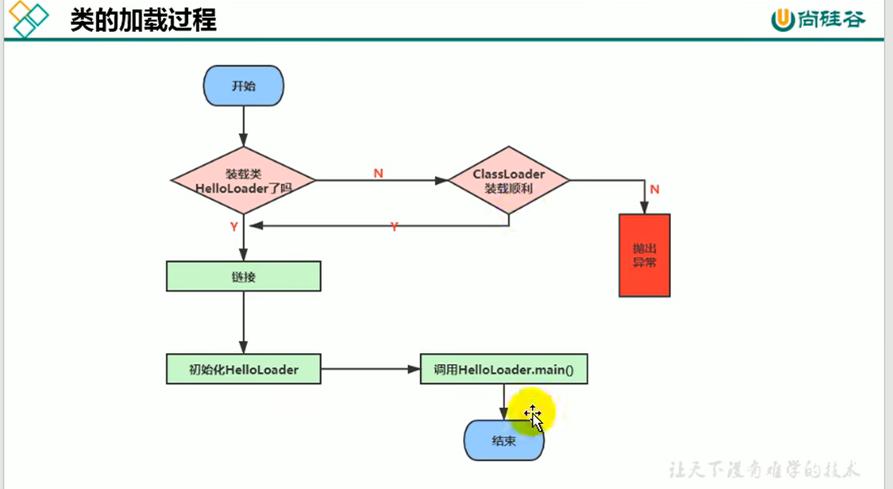
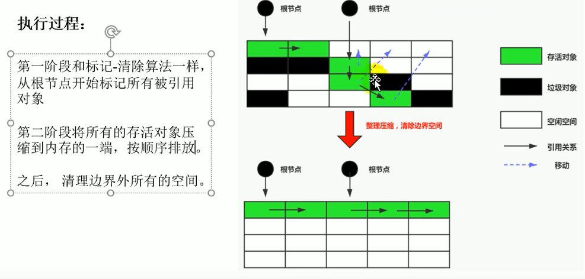

## JVM的架构模型

java编译后的字节码文件属于`栈的指令集`，不同于真正汇编指令的`寄存器的指令集`，二者有如下区别：

**基于寄存器的指令集**
* 性能好，cpu直接读取
* 和机器码一一对应，相当于直接操作硬件
* 相对于寄存器结构，栈结构使用的指令为零地址指令（即不需要指明操作码的地址，因为涉及的操作只有进栈出栈）

**基于栈的指令集**
* 实现简单
* 并不针对硬件，可移植
* 指令集更小，但是要完成一项任务需要的指令多。

## 1. 字节码文件概述


* 字节码文件是跨语言的
* 字节码文件是遵循JVM规范的二进制文件，其内容是JVM的指令

### 字节码文件的生成

生成字节码文件的编译器被称为`前端编译器`（因为在JVM中还有个编译器被称为`后端编译器`）

前端编译器的任务就是将符合JAVA规范的java代码转为符合JVM规范的字节码。

前端编译器也有多个实现：
* 常用的javac编译器，它是全量编译器，每次修改都需要重新编译
* ECJ(Eclipse Compiler for Java)，它是增量编译器，可以编译并整合修改的代码。

编译步骤（略）：应该也是语法解析，生成语法树之类的。
*（java这里好像到语法树就结束了，之后再看一下编译原理）*

### 字节码文件结构

准确内容查看JVM specification，不同java版本的文件是不同的。https://docs.oracle.com/javase/specs/

其中`常量池`的存在主要是为了节省空间，将一些字符串常量，类名，类型名等字面量放在常量池并赋予一个符号，之后要用到用符号引用即可。

### 字节码指令 

指令由操作码和操作数构成，操作码长度为一个字节（所以指令总数小于256）。

这里先补充一下，jvm虚拟机在执行字节码指令时，会场用到栈帧的两个结构：
* 局部变量表：存储方法引用，方法参数和局部变量。
* 操作数栈：临时存储数值用于计算

### 哪些类型有对应的Class对象

1. class
2. interface
3. 数组
4. enum
5. annotation
6. 基本元素类型
7. void


# 类加载系统
类加载器子系统负责加载class文件，被加载的类信息和常量池信息都放在方法区。

*注意：类的加载只负责加载过程，而class文件能否执行由执行引擎负责。*

## 类的生命周期

**从类加载的流程来看**



从中可以看出，类是在被用到的时候才被加载。

**规范的生命周期**


## 1. 加载

### 加载过程


* 首先类加载器通过类的全限定类名读取此类的class文件
* 将class文件中的静态存储结构转为`方法区`的运行时数据结构（模板类/类元信息）
* 在内存（堆）创建代表该类的java.lang.Class对象（也被称为DNA元数据）。

### class文件的读取方式

对应二进制的class文件有多种读取方式：

1. 通过文件系统读入class文件
2. 读入jar包从而获得class文件
3. 在数据库中存放的二进制文件
4. 通过网络获得class文件
5. 运行时创建class文件


### Class对象和类元

类元存储类的静态信息，例如类字段，类方法等；而Class实例是类的`类型`，也是访问类元信息的`入口`，程序需要调用Class对象才能访问类的信息。

Class类的构造函数是私有的，只有JVM才能创造。

`数组类`比较特殊，因为数组是类，但是它没有class文件。所有它不是由类加载器加载的，而是在JVM运行时根据需要创建类元和Class实例。如果数组中的元素不是基本类型，而是对象的话，则需要将该对象的类加载进来。数组类的默认访问权限是public，如果元素是对象，则访问类型和元素的类的访问类型一致。

### 多线程安全
由于被加载的类放在方法区，所以多线程下类应该只被加载一次。然而多个线程同时发现要加载一个类的时候，会请求JVM来加载该类，JVM会保证类只被加载一次，

## 2 链接

### 2.1 验证

验证用来确保class文件符合jvm的要求，保证加载类的正确性和安全性。


* 格式检查和类加载是同步进行的
* 语义检查就是检查java语言是否符合规范，是否合理
* 字节码验证是检查编译后的字节码是否合法安全
* 符号引用验证是检查常量池记录的类，方法等是否存在，此步在解析阶段进行

### 2.2 准备

准备阶段为`类变量（静态变量）`分配内存并设置初始值，即零值。有两点需要注意：

1. final修饰的类变量相当于常量，编译生成的class文件已经为其指定值了，准备阶段就直接赋值即可，而不是用默认值。
2. `实例对象`此时还未创建，所以不会为实例对象赋值。

### 2.3 解析

主要负责将符号引用转为直接引用。

* 符号引用：字面量
* 直接引用：地址偏移量

类加载的大概顺序是按照生命周期流程那样，实际上解析通常在初始化后边进行。

## 3 初始化

初始化的过程就是执行class文件中`clinit`方法的过程，该方法是由javac编译器自动生成的，其负责执行静态代码块以及为类变量赋值。它有以下特征：

* 类变量赋值和静态代码块在clinit方法中的执行顺序取决于代码出现的先后顺序。
* 如果类有父类，那么确保父类的clinit方法先执行
* clinit方法比init（初始化）方法先执行。
* JVM保证clinit是线程安全的。然而如果在类A在clinit方法中请求加载类B，类B在clinit方法中加载类A，则会导致死锁。

### 类的主动使用和被动使用

上边说过，类只有被用到的时候才会被加载。然而，类加载进来后不一定会被初始化，这又取决于类是被主动使用还是被动使用。（也就是贯穿要用到的时候才做相关工作）

**类的主动使用**

主动使用的类会调用clinit方法，以下是主动使用的场景
1. 创建类的实例，例如new，反射（Class.forName），反序列化
2. 调用类的静态方法
3. 访问类的静态字段
4. 子类初始化带来的父类初始化
5. 实现类的初始化不会让接口的初始化；但如果接口有default方法，会使得接口初始化
6. main方法所在类的初始化
7. MethodHandle实例指向的类被初始化

**类的被动使用**

被动使用类不会调用clinit方法，以下是被动使用的场景：
1. 通过子类调用父类的静态方法，是主动使用父类，被动使用子类
2. 数组中元素的类型（例如：Person[]），是被动使用的类
3. 使用类的静态常量是被动使用类，不会触发clinit，因为常量在准备阶段就赋值了
4. 通过classLoader来显式加载类是被动使用，不会初始化

## 类的卸载

类的卸载指的是代表类的类型的Class对象被回收，它的回收也会带来方法区类元数据的卸载。从此这个类就不存在于内存中了。

`注意`：类的卸载不是指类的实例被回收，而是类被回收！

要了解如何卸载类，需要明白Class对象和其它对象的引用关系：


### 类的卸载要求（也是方法区类的回收）：
   * 当一个类及其子类的实例已经不存在
   * 该类的加载器不再被引用（很难达成）
   * 该类的Class对象不再被引用

而且跟普通对象GC一样，不被引用只是说明它可以被GC了，不代表它一定会被GC。

**类加载器能否被回收**

* 启动类加载器：其加载的类整个运行期间不被回收
* 拓展类和系统类加载器：其加载的类大概率不被回收，因为只要有一个类存在，类加载器就存在，那所有被加载的类都存在
* 自定义类加载器：在简单的场景并且强制调用方法区GC的情况下可以被回收，但通常也不会被回收

## 类加载器

类加载器只在加载阶段使用到，在链接和初始化阶段没有用到。由于篇幅较长，所以单独放在最后。

类加载器负责将二进制class文件读入内存，所有类都是由类加载器加载的（数组是JVM创造的），其功能就是上述类的加载的功能。

实际上类加载器除了加载功能外还可以做额外工作，例如对class文件的加密解密等。

### 命名空间和类的唯一性

类是通过加载class文件构造的，上述内容说过类在方法区，JVM保证只有创建一个类存在。但是，如果一个class文件被两个不同的类加载器加载，认为这两个类是不同的，是会在方法区保存两个类的。

这是因为每个类加载器都有自己的命名空间，一个命名空间中不能存在同名的类，但是不同命名空间中是可以有同名的类的。

类加载器的子类（也是类加载器）可以访问父类加载的类，但是父类无法访问子类加载的类。但子类对父类的可见性导致父类加载过的类，子类是不能重复加载的。

类加载器拥有不同命名空间的目的是为类的隔离，构造容器（不懂）

### 类加载器的分类


图中的类只是抽象的概念，并不是真正的类实现。bootstrap class是c/c++实现，而其它类由java代码实现。图中的的继承关系比较特殊，不是实现了extends，而是子类包含了父类的引用，是逻辑上的父子关系，不是java语言上的。

而且jdk17体系结构又发生了变化，这里是jdk8的结构图。

**引导类加载器**

* bootstrap classLoader是c/c++实现的，嵌套在JVM内部获取不到
* 它负责加载核心类库（JVM本身需要的jar包）
* 处于安全考虑，它只能加载java,javax,sun等开头的包
* 它是顶级的类加载器，没有父类加载器。它加载类系统类加载器和拓展类加载器并作为他们的父类

**拓展了加载器**

* extension classLoader由java语言编写，其实现为sun.misc.Launcher$ExtClassLoader(Launcher的内部类)
* 该实现继承ClassLoader抽象类，'父类'为启动类加载器
* 它负责加载jre/lib/ext目录下的jar包

**系统类加载器**

* system classLoader由java语言编写，实现为sun.misc.Launcher$AppClassLoader(Launcher的内部类)
* 该实现继承ClassLoader抽象类，'父类'设置为ExtClassLoader
* 负责加载环境变量下的类，所以程序员自定义类由它负责加载。

**自定义加载类**

理论上来说，只有两种类加载器，引导类和自定义类。拓展类和系统类都属于自定义的类加载器。

不过既然已经有了类加载器，为什么还有自定义？原因是可以进行一下特定操作：

* 修改读取class文件的路径和方式，例如从网络读取
* 防止源码泄露，class文件可能是加密过的，类加载器需要进行解密
* 自定义加载器可以实现插件机制，运行应用程序动态增加新功能
* 每个类加载器都有自己的命名空间，可以通过多个类的加载器实现类的隔离

自定义类加载器只要继承了ClassLoader或者其子类即可。

**数组的类加载器**

上述说过数组其实没有class文件，也不是被类加载器加载，而是JVM自己创建它的Class实例和类元结构。在代码中尝试获取数组的classLoader会返回它元素类型的类加载器。

```
int[] nums = new int[10];
System.out.println(nums.getClass().getClassLoader()); //null
Person[] persons = new Person[10];
System.out.println(persons.getClass().getClassLoader()); //sun.misc.Launcher$AppClassLoader@18b4aac2
```
### ClassLoader概述

ClassLoader是抽象类，自定义类加载器必须继承该抽象类。这个类有如下核心方法：

1. getParent()：该类返回类加载器逻辑上的父类，这是为了实现双亲委派机制。（这个逻辑上的父类是ClassLoader的一个成员变量）
2. loadClass()：实现了双亲委派机制（非常简单）和线程安全，并调用findClass()方法来加载类
3. findClass()：根据类名去读取class文件的二进制数据，然后调用defineClass()方法在内存中构建Class类的实例

ClassLoader的实现类：


其中URLClassLoader实现了findClass方法，即根据类名在文件系统中查找class文件。如果我们不想重新findClass方法，可以直接继承URLClassLoader。

### 双亲委派机制

java类加载是`按需加载`的，并且对应被用到的类使用`双亲委派机制`。

双亲委派机制很简单，就是子加载类收到加载请求时，先调用父加载类来进行加载，如果父类负责，那么子类就不用管了。（类似，父类也先问爷爷类）

例如，我们自定义了一个java.lang.String类，那么使用new String时会加载核心类还是我们自定义的类？根据上述流程是会加载核心类的，因为system的父类是extern，extern的父类是bootstrap。bootstrap能够负责java和javax开头的包，那它就会去把核心类给加载了。

此外，自定义java.lang.String类并且写main方法执行的话也会报错：找不到main方法。原因就是加载的根本不是我们自定义的类，被父类截胡了。

**优势：**
* 避免自定义包名和核心类重复，也避免了子加载器和父加载器不同的命名空间中有同名的类
* 避免用恶意类替代核心类
* 在核心类包下定义的接口不会被替换，保证实现类一定是按照规范实现的。

**弊端：**

双亲委派机制会导致子类加载器可以访问到父类加载器加载的类，而被父类加载器加载的类无法访问到子类加载器加载的类。

**如何避免双亲委派机制？**

1. 在ClassLoader中我们看到loadClass方法中实现了双亲委派机制的逻辑，修改该方法就可以避免双亲委派机制。但是要注意的是：避免了双亲委派机制依旧无法迫害核心类库，因为还有一层保护机制--preDefineClass接口
2. 利用上下文类加载器。由于双亲委派机制导致父类无法访问子类加载器加载的类，它可以请求上下文类加载器来帮忙访问子类加载器加载的类，从而违背了双亲委派机制的
3. 代码热替换和模块热部署

**沙箱安全机制**

沙箱的核心思想是限制代码对本地资源的访问，这种将可疑代码隔离起来的操作好像和类加载器的独立命名空间相关。

# 运行时数据区

## 程序计数器 


程序计数器其实全称是Program Counter Register，但它不是真的寄存器，只是功能和PC寄存器一致，都是存储下一条的指令的地址。

程序计数器是线程私有的，它的生命周期和线程保持一致，它的内存空间是一块独立的运行速度块的小内存。

## 栈空间

栈（stack）是运行时单位，而数据的存储是由堆（heap）来负责的。

每个线程创建都会创建一个对应的栈，其中存储一个个`栈帧`对应着调用的方法。其作用就是主管程序的运行，保存方法的局部变量，部分结果，并参用方法的调用和返回。

**栈的优点：**
* 操作简单，方法执行则入栈，结束出栈
* 不需要垃圾回收（但是可能有内存溢出）

**栈的异常：**
* 没有设置栈的大小，栈动态增长，但是可能内存不过，报错OOM(out of memory)
* 设置栈的固定大小，栈内存不够，报错Stack Overflow.
* 栈大小可以通过-Xss参数来设置（太小不行，会被自动调整）

### 栈帧

栈的数据都是以栈帧的格式存在，栈帧是一个数据集，其中维护方法执行所需要的数据。

栈的操作就是对栈帧进行压栈和出栈。每个时间只会有一个栈帧是活动的，其被成为`当前栈帧`，而该栈帧对应的方法为`当前方法`，该方法属于的类被成为`当前类`。

当方法被调用，就为该方法创建栈帧并且压栈，成为当前栈帧。当该方法结束时，它会返回执行结果给调用者栈帧，自己出栈，当前栈帧更改为调用者。JAVA程序结束有两种情况：正常结束和抛出异常，无论那种情况该方法对应的栈帧都被出栈。

执行引擎运行的字节码指令只针对于当前栈帧进行操作，而且不同线程之间的栈帧`不允许相互调用`。

### 栈帧的内部结构
**局部变量表**

局部变量表是一个`数值数组`，用来存储局部变量和方法参数的值。这些变量类型为基本类型，引用类型或者returnAddress类型。该数值数组每个元素（slot）的大小为32位，所以类型存放规则是：
* boolean, short,char,byte类型转为int占一个槽
* long,double 64位占两个槽
* 变量存放的位置按照变量声明的顺序确定（函数参数在变量前边）
* 如果当前方法是实例方法，那还要this变量存放在index 0的slot
* slot可重复利用，如果两个变量的作用域不重叠（例如b出现的时候a已经死了），那么这两个变量是可以用一个slot来存储的。

局部变量表的大小是在`编译时期`就确定的，存储在字节码文件中方法的Code属性的maximum local variables数据项中。

局部变量表建立在栈帧里，所以是线程私有的，而栈帧之间不通信，所以是线程安全的。

局部变量表建在栈帧里，所以每个方法都有自己的局部变量表，局部变量表的变量也只在该方法中有效。

**操作数栈**

操作数栈是`由数组实现的栈`。在方法执行的过程中，根据字节码指令向操作数栈中读写数据来进行运算，用于保存计算过程中的临时结果，也就是充当了寄存器的作用。所以说jvm是基于栈的结构也就是因为操作数栈。

操作数栈的大小也是在编译阶段就确定了，在字节码文件的函数的Code的max_stack中记录。栈的创建也是随着方法调用创建栈帧的时候创建。

>栈的一些特征为：
* 栈元素的长度32位，只能通过push和pop访问，每次读写的元素数由字节码指令决定。
* 如果被调用方法有返回值的话，返回值会压入调用方法的栈

栈顶缓存：由于栈结构的特性会使得操作码多，执行速度慢，所以提出了一个思想是将栈的数据缓存到寄存器中。


**动态链接**

动态链接是一小块内存区域，里边存储了一个引用地址指向该方法对应的运行时常量池数据。


**补充概念：方法绑定和调用**

* 早期绑定（静态链接/非虚方法）：在编译期就可以确定引用调用的方法究竟是哪个方法。（多态使得父类引用子类时调用的是子类重写的方法）
* 晚期绑定（动态链接/虚方法）：在运行期才能确定被调用的是哪个方法。包括：静态方法，私有方法，final方法，构造器方法和父类方法。

*注意：在编译期确定方法类型就是从调用方法这一条指令中确定，不考虑上下文。如果考虑上下文那任何方法的类型都能确定，这就是运行期的效果了。*


在虚拟机中方法调用有如下类型：
* invokevirtual：调用虚方法（以及final方法）
* invokestatic：调用静态方法
* invokeinterface：调用接口的方法
* invokespecial：调用初始化方法
* invokedynamic：调用lambda表达式（这其实是对动态类型语言的支持，动态类型语言是指在运行时确定变量类型的语言，比如python，从而优化动态类型语言编译成字节码并运行在jvm。而lambda表达式也算动态类型，因为会根据函数体创建类）

对于非虚方法，在链接阶段就可以将符号引用转为真正引用；而虚方法需要在运行期间查找真正的方法。虚方法调用流程如下：

1. 根据操作数栈中存储的（被调用方法的）类引用地址去查找实际对象类型
2. 如果该对象有重写方法，调用该方法；如果没有，查找其父类

由于每次都一层一层查找很麻烦，jvm实现类虚方法表（因为非虚方法不需要查找）：


每个类都有虚方法表，该表为每个方法指出它的真实地址。

**方法返回地址**

方法返回地址也是一小块内存区域，它可以用来判断是否发生异常

* 正常返回：方法返回地址为调用者PC Register的值
* 发生异常：根据异常表决定值

**附加信息**

这块不一定有，只是允许携带与JVM实现相关的一些信息。


## 本地方法栈

### Native 方法

native方法是由java调用但是由非java实现的方法。

这种方法在java中使用`native`关键字，并且没有方法实现，充当本地方法接口。

而本地方法的实现是其它语言做的，例如C编译后生成的字节码文件。这些实现被称为本地方法库。

使用这种方法的原因通常出于效率考虑，以及其它语言可能更好和底层交互。

### 本地方法栈
本地方法栈和JVM普通的栈空间类似，只是本地方法栈是用来装本地方法的。

* 本地方法栈并不是JVM必须的构件，它是否存在以及如何存在取决于jvm的实现。
* 在java8常用的hotSpot虚拟机中本地方法栈和普通栈空间合二为一，调用本地方法和调用java方法一致，只不过这时候方法会动态链接到本地方法库。
* 本地方法被调用后不被虚拟机控制，（比如c方法编译成机器码了直接执行就可以了）


## 堆

堆区在JVM被启动时创建，用来存储所有对象实例和数组。堆区大小可以被指定（-Xms -Xmx），但是它物理上不一定是连续的，只是逻辑上连续。

一个进程就是一个JVM实例，一个JVM实例就只有一个堆。堆空间是进程私有但是线程共享的，为了提高并发还划分线程私有的缓冲区TLAB(Thread Local Allocation Buffer)

堆存储对象实例，栈空间存储对象引用。如果栈空间的引用被释放了，那堆空间的对象实例也应该被释放，这就需要垃圾回收了。（堆空间有垃圾回收，栈空间没有）

### 堆空间细分

由于堆空间很大，它在逻辑上又分为三部分：新生代，老年代，元空间。（元空间比较特殊，它物理上不属于堆空间）


java对象可以根据声明周期分为两类：
* 生命周期短的：放入年轻代中
* 生命周期长的：放入老年代中

这种分类是为了方便GC(garbage collection)，对于老年代的空间可以少去GC。而年轻代中的对象先被放入Eden区，如果在GC中存活，则移入到survivor区中。

**内存分配**

```
// 设置老年代比新生代的比例
// 默认值为2，一般不修改
-XX:NewRatio

// 设置Eden和survivor的比例
// 文档写默认8：1，实际默认6:1
-XX:SurvivorRatio
```

### 对象分配过程

考虑到堆空间经成需要垃圾回收，所有对象分配也是有专门的算法的，这里先提一下流程：


1. 每次创建的对象都被放到Eden区，并且将其age记录为0
2. 当Eden区满的时候，调用YGC/Minor GC对其进行垃圾回收。对于存活的对象放入survivor0区，并将其age增加1


3. 由于survivor0区有数据，而survivor1区没数据，将有数据的作为from区，空的作为to区
4. 当Eden区再次满了并且调用GC时，将Eden区存活的和from区存活的都移入to区，并将其age+1。此外from区和to区也进行交换（因为空的survivor发生了改变）


5. 当某次GC时发现某些存活对象的age达到阈值，则移入到老年代

**特殊情况**


1. 如果Eden区收到了超大对象，GC后也放不下，则直接放入老年代
2. 如果survivor区放不下，（不GC），直接放入老年代
3. 如果老年代收到对象发现放不下，进行FGC/major GC。如果还是放不下就OOM了

总体思想：放不下就丢老年代

*`注意!!`：From区满了并不会触发GC，并且会直接移入老年代。Eden区满了才触发GC，GC会处理Eden和from区。*

**优化情况**
* 动态年龄判断：如果survivor中相同年龄的对象大小总和达到了survivor空间的一半，则将年龄大于等于该年龄的对象放入老年代

### Minor / Major / Full GC

性能调优其实就是想减少GC的次数，因为GC会阻塞用户线程的执行。

JVM每次进行GC的时候并非检查所有的内存区，大部分时候都是针对新生代的。GC有如下分类：

* 部分收集：
  * Minor GC=Yong GC：只对新生代进行GC
  * Major GC=Old GC：只对老年代进行GC
  * Mixed GC：对整个新生代和部分老年代进行GC
* 整堆收集：
  * Full GC：对整个堆（包括方法区）进行GC

**Minor GC**

* 当Eden区满的时候触发
* 处理的内存区小，速度快

**Major GC**

* Major GC处理的内存区大，速度比Minor GC慢10倍以上
* 如果Major GC后还没空间就会OOM

**Full GC**

* 调用System.gc()时，会建议执行Full GC，但是不一定执行
* 任何一个区内存不足都可能调用Full GC
* 应该尽量避免Full GC


### Thread Local Allocate Table

TLAB是为每个线程创建私有缓存空间，它存放在Eden空间：


这种策略可以缓解堆线程共享带来的低并发问题，所有它被称为`快速分配策略`。

* TLAB默认为内存分配的首选，不过也可以手动设置。
* TLAB的内存空间很小，默认只占Eden区的1%
* 当对象无法存储到TLAB，只能放到Eden区的其它共享位置。

### 逃逸分析

如果一个对象在方法中产生，并且只在该方法内部使用，则认为该方法`没有发生逃逸`；如果其它方法也引用了该对象，则认为`发生了逃逸`。

方法中的对象发生逃逸的情况：
* 该对象是返回值
* 该对象赋值给了成员变量（其它函数也可以调用该成员变量）
* 该对象是通过引用别人的（不是自己new的）

**栈上分配**

对于`没有逃逸`的对象，可以直接分配在栈上，从而避免GC（方法结束就释放了）。

**同步消除**

在动态编译同步代码块时，JIT编译器可以通过`锁对象`来判断该锁是否能被线程共享，如果不能，就会消除同步代码块来提高性能。（如果锁对象是没有逃逸的，那自然是应该被消除的）

**标量替换**

在java中基本数据类型被称为标量，即不可再分的元素。而java中的对象可以认为是聚合量，它是标量的集合。

而上述没有逃逸的对象进行`栈上分配`其实就是使用了`标量替换`->即将一个对象分解为多个标量从而存储在栈空间

## 方法区

方法区也叫元空间，逻辑上是堆的一部分，但实现上可以不进行GC，物理存储空间也可以不和堆在一起。


堆存放对象（实例）的信息，而方法区存放类的信息。主要是class文件的内容，例如常量池，字节码等。

不过方法区其它地方和堆类似，都是jvm启动时创建，可指定大小，内存允许不连续，而且线程共享。

Hotsopt的方法区使用的是本地内存，在windows上默认初始值为21M。如果方法区满了，会先进行Full GC，如果内存还是不够，会拓展方法区的大小。


### 内部结构

方法区主要存储：类信息，常量池，静态变量，JIT产生的代码缓存。

**class文件的存储**

对于每个加载的类型（类，接口，枚举，注解），JVM必须存储其class文件中的信息，以及类加载器的信息。

这些信息分别存储在常量池和类信息中。

**运行时常量池**

需要注意，类型信息中的常量池会加载到方法区称为`运行时常量池`，两者有些区别：
* 运行时常量池也是类似数组的结构，存放字面量并且通过索引访问
* 一些符号引用和字面量在运行时常量池里已经成为真实的地址了
* 运行时常量池是动态的，在运行时可能增大的，例如String.intern()方法在运行时常量池存储数据。

**final / static**

被static修饰的成员变量被称为类变量和静态变量，放在方法区。静态变量一般在加载阶段被赋值，而 final修饰的静态变量在编译产生class文件时就确定值了。

### 方法区的演变


元空间和永久代的核心区别就是一个在本地内存，一个在jvm中。用元空间替代永久代的原因是：

* 永久代的空间大小难以确定
* 永久代调优（GC）困难


### 方法区GC

JVM规范对方法区的约束十分宽松，GC也不是强制的，但是hotspot中其实是实现了方法区的GC的：

1. 常量池回收：当常量池中的常量不再被任何地方引用时，它们就可以被回收。例如，当一个类不再被使用时，与之相关的常量也可以被回收。

2. 无用的类卸载（很严苛）：
   * 当一个类及其子类的实例已经不存在
   * 该类的加载器不再被引用
   * 该类的Class对象不再被引用

## 对象的创建过程

### 对象的创建方式

1. new
2. Class.newInstance（反射）
3. clone
4. 反序列化

### 对象的创建过程

1. **加载，链接，初始化**
   
   这个步骤会带来如下效果
   * 将class文件的类信息和常量池加载到方法区
   * 为该类创建Class对象
   * 执行了静态代码块并且为静态变量赋值

2. **为对象分配内存**
   
   根据类信息可以判断出对象需要在heap中占用的内存，而根据内存空间的分布方式有不同的内存分配算法：

   * 如果内存连续：用指针记录空内存位置即可
   * 如果存在内存碎片：可以使用空闲列表记录可用的内存
   
   而内存结构怎么样其实还是取决于用了什么GC算法


3. **处理并发问题**

   因为heap空间是线程共享的，所有会涉及一些并发算法，或者之前说的TLAB

4. **初始化对象空间**

   就是对实例成员变量赋默认值

5. **设置对象的对象头**

   存储对象所属的类，hashcode和GC信息等

6. **执行init方法**

   init方法不仅仅包含构造器方法，还有显示赋值以及代码块都放在了init方法中

### 对象的内存布局


**实例数据**

存放从父类继承的和自己本身的`字段`，数据存放规则：
* 相同长度的字段存放在一起
* 父类的字段在前边


**对象访问**

我们知道引用类型存储的是对象实体的地址，因此可以拿到实例对象的数据。但是访问过程的实现是有不同方式的：

1. **句柄访问**
   
   
   访问过程添加了中间层`句柄`，这样类的位置改变不会影响局部变量的值

2. **直接访问（hotspot使用）**
   
   
   访问效率更高，只用进行一次查找

## 补充：直接内存

这一块不太明白，但是也有点感觉

1. 直接内存不是运行时数据区，是java程序向操作系统请求分配的数据区，可以通过java管理
2. 直接内存比较特殊，好像java可以将数据放到直接内存，而一些本地方法（例如c程序，或者操作系统API）可以直接访问该直接内存
3. 如果不要直接内存，只用堆空间的话，堆空间会很大，存储的数据特性也不同，不利于GC。

# 执行引擎
## 执行引擎概述

执行引擎的任务是将字节码指令编译为机器码指令并执行；输入的是字节码二进制流，输出的是执行结果。


执行引擎的两块核心内容就是解释器和JIT（Just In Time）编译器
* 解释器：将字节码每行代码翻译成机器码并且执行
* 编译器：将一块源码编译成字节码并执行

## 解释器和JIT编译器

当执行引擎启动时，解释器率先工作，可以立刻执行代码。而随着时间推移，根据热点探测功能，JIT编译器会将有价值的字节码编译为本地机器码，从而提升效率。

也可以通过参数选择只使用解释器或者编译器：
```
-Xint //解释器
-Xcomp //编译器
-Xmixed //混合
```

### 解释器的分类

1. 字节码解释器：在执行时一条条解释，效率低下
2. 模板解释器：将每条字节码和一个模板函数关联，模板函数可以直接产生这条代码的机器码。


### JIT编译器的分类

**C1编译器**

JVM在client模式下使用的就是C1编译器；其优化简单，耗时短，策略为：

* 方法内联：将被调用的代码编译到调用者的内部，从而减少栈帧和跳转开销
* 去虚拟化：如果接口或者抽象类的实现只有一个，那就内联成一个类
* 冗余消除：将不会被执行的代码折叠

**C2编译器**

JVM在server模式下使用的就是C2编译器；耗时长，进行激进优化。其优化策略为：

* 标量替换：用标量替换类
* 栈上分配：将未逃逸对象分配到栈
* 同步消除：清除同步操作

**编译器使用情况**
通过参数可以选择编译器的模式，从而使用不同的编译器

```
-cilen 
-server
```
但是java 8安装在64为操作系统上的jdk强制为server模式。此外，在server模式下，默认开启`协作编译（Tired Compile）`，即c1和c2相互协助来编译。

### 热点代码探测

JIT编译器是将`热点代码`编译成字节码并缓存，而热点代码就是：执行频率高的代码。由于这种编译发生在方法执行中，所以也被称为栈上替换（On Stack Replacement）。

HotSpot基于计数器来进行热点探测，其为每个方法都建立两个计数器：
* 方法调用计数器：统计方法的调用次数
* 回边计数器：统计方法体中循环体代码的执行次数

如果计数器到达某个阈值就进行编译。


### 热度衰减

如果程序运行在服务器上，那它会持续很长时间，并且每个方法在不断积累调用次数的情况下都会达到阈值，这可能会给内存带来负担。为此还有热度衰减：

默认情况下程序计数器都有一个时间限度，超过这个限制就将计数减半。这个时间限度被称为`半衰周期`。

半衰周期的长度和是否开启都可以设置的：
```
-XX:-UseCounterDecay //关闭热度衰减
-XX:CounterHalfLifeTime //设置半衰周期
```

### AOT编译器

jdk9引入了AOT(Ahead Of Time)编译器。相较于JIT编译器，AOT编译器在程序执行器进行，将字节码转换为机器码（.so文件）并放在动态库中。

好处是效率更高，不需要热点检测，直接就全部编译了，启动时效率就是最高的。

缺点是so文件是机器码，不是平台独立的，违背了跨平台的特性。

# 垃圾回收

垃圾回收三个经典问题：
* 什么内存需要回收
* 什么时候回收
* 如何回收

## java内存管理

java使用自动内存管理，也就是程序员只需要根据需求创建对象，而不需要关系如何分配内存和释放内存。

但是这种黑匣子也会导致如果内存不足时会难以定位和解决问题。

此外，内存结构的特性也决定了内存管理只存在于堆空间和方法区。而JVM规范也说了不强求堆方法区的GC，所以GC的核心在于堆空间。

### 内存溢出

内存溢出指的是没有空闲内存了，并且GC也无法提供更多的内存。所以在报OutOfMemory错误之前，是会进行一次Full GC的，如果回收后内存还是不够，那就报错OOM.

内存溢出的主要原因：

1. 虚拟机堆空间设置的太小
2. 被引用的对象太多
3. 对象太大，例如一个超大数组（要求连续空间）

### 内存泄漏

内存泄漏是指：对象实际上不被使用了，但是GC又不能回收该对象。内存泄漏不会直接暴漏出问题，但是会导致可用内存减小，从而产生OOM的概率增大。


产生原因：
1. 给类创建了过长的生命周期，该类使用的对象都不会被释放
2. 使用了一些资源后没有close


## 垃圾标记
堆空间中存放大量的类实例，垃圾回收就是找出`死亡`的类实例并将其释放掉。其中`不再被引用`的实例就被认为是死亡的类实例。

以下是两种判断对象是否死亡的算法：

### 引用计数算法
对于每个对象保存一个整数类型的计数器。该对象每被一个局部变量引用就将计数器+1，每个引用被释放就将计数器-1。当计数器为0时就认为其死亡。

优点：
* 简单，容易实现

缺点：
* 引用计数器增加了空间和时间开销（小问题）
* 无法处理循环引用（严重）

   


### 可达性分析（JAVA选择用的）


GC根对象是一组活跃的引用，能够被根对象访问到的对象为存活，无法访问到的为死亡。

GC ROOTS包括（存储位置不同于堆空间中类实例的引用）：

* 虚拟机栈中的对象引用
* 本地方法栈的对象引用
* 静态类成员
* 同步代码块中的对象引用

如果GC不是对整个堆进行回收，而是只对新生代回收，那么老年代中的引用也能作为临时root。

在进行可达性分析的时候，必须保证一致性，为此需要将线程暂停。

## 对象终止
JAVA提供了finalization的机制，允许对象在被释放前进行一些自定义的操作。在java中的object类中就有finalize方法，保证当该对象不被引用并且在GC前，finalize方法会被调用。

finalize不应该被主动调用，应该由GC来调用。原因如下：
* 可能导致对象复活
* 执行时间没有保证，因为由其它线程来负责该方法的执行

finalize的存在也将对象的状态分为三类：
* 可触及的：可以从GC Root到达该对象
* 可复活的：无法从GC root到达，但是finalize()没有调用
* 不可触及的：无法到达并且finalize已经执行过了

只有对象为不可触及的才被回收。

注意：finalize方法只能调用一次，如果对象在finalize方法中变成可触及的，那么它就复活了。但是如果再次不可触及，那就直接变成不可触及的。


## 垃圾清除
当成功区分出死亡对象后，下一个任务就是执行垃圾清除。常见的垃圾清除算法有三种：

### 标记-清除算法
当内存空间不足时，先暂停整个程序（也被称为Stop The World），然后进行标记和清除：

1. 标记阶段： 从根节点开始，递归标记所有能被遍历到的对象
2. 清除阶段：线性遍历整个堆空间，如果对象没被标记则进行清除

缺点：
* 两次遍历，效率略低
* GC时需要暂停整个用户程序
* 清理出来的内存不是连续的，需要维护空闲列表

注意:清除操作就是修改空闲列表，并不是真的覆盖对象

### 复制算法


核心思想是将内存空间分成两部分，一部分正常使用，一部分空着等复制。当第一个区域满了进行GC时，从根节点递归查找被引用的对象，然后将其复制到第二块空闲区域，并将第一块区域作为空区域来使用。

优点：
* 一次遍历，效率较高
* 没有碎片问题

缺点：
* 可用内存空间被砍半
* 复制会产生大量开销，还需要修改局部变量的引用地址

适用场景：
* 垃圾对象非常多，存活对象少
* 新生代中死亡率就很高，所以用了S1,S2来实现该算法


### 标记-压缩算法


标记阶段和标记清除算法相同，区别是第二阶段。压缩阶段除了清除对象，还进行了碎片整理。此时也就不需要维护空闲列表了。

### 方法性能比较


### 分代收集算法
上述算法有各自的使用场景，为此java希望将不同生命周期的对象存放在不同的区域，在不同的区域应用不同的算法，这就是分代收集算法。

Hotspot就使用了分代收集算法，将堆分为了年轻代和老年代：

* 年轻代：区域小，垃圾多，使用复制算法
* 老年代：区域大，垃圾少，使用标记-清除或者标记-整理算法。

HotSpot中使用CMS回收器来处理老年代：默认使用标记-清除算法来GC，当其效果不佳时；再使用标记-压缩算法。

### 增量收集算法
上述算法都需要stop the world，当垃圾收集算法处理时间过长会对用户体验带来影响，而增量收集算法就是解决这个问题。

它的核心思想很简单，依旧使用分代收集算法进行回收，但是每次回收只回收一小部分，然后切回用户进程。反复多次切换从而完成垃圾回收。


### 分区算法


分区算法也是为了解决STW时间过长的问题。它是根据目标的停顿时间将空间划分为多个小区域，每次回收就是回收若干个小区域

### System.gc()

System.gc()会要求进行GC，并且是对新生代和老年代都进行GC。但是它不保证GC会立刻执行。

开发中并不建议调用System.gc()函数，因为GC会带来STW以及额外开销，影响用户体验。

此外System还有runFinalization方法，该方法强制立刻执行失去引用的对象的finalize方法。

## Stop The World

STW是指在GC的过程中（可达性分析），对整个用户程序的暂停。STW是为了保证一致性，即在进行垃圾分析的时候不能增加新的对象（不然误删了怎么办）。暂时只有STW能保证一致性，所以其是必须的。

注意：STW是针对整个JVM进程的，即在JVM上运行的所以线程都会被暂停。

**安全点**

此外，程序要暂停下来需要先进入`安全点`，然后在被挂起。安全点是人为选择的指令，通常选长时间执行的指令为安全点，例如方法调用等，这样就不容易感受到GC并且对性能影响小

如何确认所有线程都进入了安全点：
* 抢先式中断：首先中断所有线程，如果线程不再安全点就恢复线程，让其跑到安全点
* 主动式中断（JVM采用）：设置中断标志，每个线程到安全点后查看该标志，如果需要中断就将自己挂起

**安全区（不太明白）**

安全区是指一段代码片段，在该片段执行的时候对象的引用关系不会发生改变。

线程在执行的过程中才能到达安全点，那如果线程在sleep呢？安全区就是为了处理暂且无法执行的线程，其使用场景如下：

1. 当程序sleep时会标记是否进入安全区
2. GC时会对忽略在安全区的线程
3. 当线程醒来并且要离开安全区时，会检查是否有GC在进行，有的话就等待

个人认为：理论上用安全点也能解决线程sleep，只要让程序醒来检查是否GC就好。使用安全区可能是处于性能考虑，因为其允许GC时还允许运行。


## 引用类型

在实际开发中可能会希望有这样的对象：当内存充足时保留，当内存不足时也可以舍弃。为此，就使用到了多种引用类型：

### 强引用
最传统的引用类型就是强引用，即“Object obj = new Object()”。被强引用关联的对象是永远不会回收的，除非引用不存在了。

### 软引用
软引用是用来描述有用，但非必需的对象。在普通GC时不回收，但在内存溢出前，将软引用的对象进行二次回收。（所以OOM和软引用没有关系的）

软引用通常用来进行缓存,其声明方式为：

```
Test test = new Test(); //强引用
SoftReference<Test> sf = new SoftReference<>(test); //弱引用
```


### 弱引用
弱引用的对象只能存活到下一次GC前。当GC时，无论内存是否充足都进行回收。

使用示例：
```
WeakReference<Test> wf = new WeakReference<>(new Test()); //弱引用
System.out.println(wf.get().num);
```

### 虚引用
一个对象是否有虚引用对其生命周期没有影响，可以当该引用完全不存在，甚至不能从该引用访问对象。虚引用的目的是：在该对象被回收时进行通知。

虚引用在创建时必须要一个引用队列，当被引用的对象清除时，会将虚引用放入队列中：
```
ReferenceQueue<Person> referenceQueue = new ReferenceQueue<>();

PhantomReference<Person> phantomReference = new PhantomReference<>(new Person(), referenceQueue);
```

## 垃圾回收器

### 垃圾回收器分类

按线程数分可以分为：

1. 串行回收器：适用于单CPU的机器，只有一个垃圾回收线程
2. 并行回收器：适用于多CPU的机器，多个垃圾回收线程同时执行

按工作模式来发：

1. 独占式：GC开始时不允许其它线程运行
2. 并发式：GC和应用程序交替执行

按照碎片处理方式：

1. 压缩式：整理内存碎片
2. 非压缩式：不整理内存碎片

按工作区域来分：

1. 年轻代
2. 老年代

### 性能指标

评估各种垃圾回收器的性能有两大指标：

1. 吞吐量

   ```
   吞吐量=用户代码的运行时间/CPU总消耗时间
   ```

2. 响应时间（也是GC暂停的时间）

   ```
   暂停时间=单次GC阻塞其它线程的时间
   ```

吞吐量和响应时间往往是负相关的，因为低延迟就需要多次GC，从而加大了GC开销。而现在的标准更关注吞吐量。


### 各类垃圾回收器


不同垃圾回收器会负责不同的堆区域，（也有G1负责整个堆的回收），为此需要根据不同的场景选择不同的垃圾回收器组合使用：


黑色代表可以配合使用，红色表示8之后删除，绿色表示8之后添加

要查看当前使用的GC，可以输入JVM指令：
```
-XX:+PrintCommandLineFlags 
```

### Serial回收器

Serial是最基本，历史最老的GC，它也是HotSpot在Client端默认的新生代GC。

其特定如下：

* 负责新生代
* 使用复制算法
* 串行回收（也是STW独占式回收）

此外还提供了Serial Old来负责老年代，其特征如下：

* 负责老年代
* 使用标记-压缩回收
* 串行回收（也是STW独占式回收）
* 是client端老年代默认GC；在server端也能和其它老年代回收器配合使用

优势：

* 简单，在单CPU下高效
* 内存小的情况下串行足以胜任

缺点：

* 现在场景大多为多CPU，效率不如并行
* 会阻塞太久，交互式应用无法接受

开启代码
```
// 该参数会配置新生代和老年代都为serial
-XX:+UseSerialGC
```

### ParNew GC

ParNew GC和Serial GC太大区别，就是将串行改成了并行。其特征如下：

* 负责新生代
* 使用复制算法
* 在STW阻塞其它线程后，并行执行多个GC线程

不过它没有在老年代做自己的实现，可以搭配Serial Old或者CMS来使用

优点：
* 利用了多CPU资源，从而增加了GC效率

开启参数：
```
-XX:+UseParNewGC
```

### Parallel Scavenge

Parallel Scavenge和ParNew表现的特点几乎一样，但是它注重`吞吐量`，并且使用了`自适应调节策略`.

具体来说就是此时开始关注GC的效率了，使用该GC允许用户自定义吞吐量和延迟，而Parallel Scavenge的自适应调节策略会默认设置吞吐量，延迟之间的平衡；甚至设置Eden区和Survivor区内存比例等。

其特征如下：
* 负责新生代
* 使用复制算法
* 在STW阻塞其它线程后，并行执行多个GC线程
* 关注吞吐量并使用自适应调节策略

此外，它还为老年代提供了配套的Parallel Old，其特征如下：
* 负责老年代
* 采用标记-压缩算法
* 在STW阻塞其它线程后，并行执行多个GC线程

参数设置
```
-XX:+UseParallelGC //新生代
-XX:+UseParallelOldGC //老年代

-XX:GCTimeRatio  //设置吞吐量
-XX:MaxGCPauseMillis   //设置延迟
-XX:+UseAdaptiveSizePolicy //开启自适应
```

### CMS垃圾回收器

CMS全称是Concurrent Mark Sweep，它注重响应时间，并且允许垃圾回收和用户线程并发执行。


工作流程如下：
1. 初始标记阶段：先STW阻塞用户线程，然后将和GC Root类`直接引用`的类标记出来（耗时短）
2. 并发标记阶段：之后GC线程和用户线程并发执行，此时GC线程负责将于GC ROOT`间接引用`的类标记出来（耗时长）
3. 重新标记阶段：由于并发阶段类会发生变化，并发标记不准确，此时在STW阻塞用户线程然后进行一些修正（耗时短）
4. 并发清理阶段：最后GC线程和用户线程并发执行，此时GC线程进行清理而非压缩，因为压缩会改变存活的对象的地址，而该地址也正被用户线程使用

其特点如下：
* 负责老年代
* 使用标记清除算法
* 由于并发执行，所以不能等到老年代满了再GC，（因为GC时用户线程还可以创建对象）而是要设置一个阈值
* 如果GC时因为碎片问题或者并发问题导致内存不足，此时会专用serial old来负责GC

优点：
* 低延迟

缺点：
* 低吞吐量（多次标记的开销）
* 内存碎片问题
* 并发GC时新增的垃圾并没有被该次GC回收

参数设置：
```
-XX:+UseConcMarkSweepGC //开启CMS-GC 新生代默认为ParNewGC
-XX:CMSInitiatingOccupancyFraction  //设置GC阈值
-XX:-UseCMSCompactAtFullCollection //FULL GC后进行碎片压缩
-XX:CMSFullGCsBeforeCompaction=  //设置几次FULL GC后进行碎片压缩
```

### G1回收器

G1把对分为多个区域（逻辑上的，物理上可不连续），记录每个区域进行GC的价值，从而决定对哪个区域进行GC。其目标是在延迟可控的情况下尽可能提高吞吐量，因此需要在给定时间内选择高价值的区域来回收

**分区收集**


G1依旧使用分代的思想，但是它不跟其它GC一样要求每个代的内存连续，而是将内存化为多个区域，在逻辑上划分为老年代和新生代。为此它是全局回收器，兼顾老年代和新生代。

区域的数量大约为2048个，可以通过参数设置。每个区域的大小相同；物理临近的，逻辑同代的区域也可以合并存放大对象。为此G1提出了一个Humongous区，专门存放周期短的大对象。


每个区域的内部还有TLAB来处理高并发，依旧用指针来记录空闲内存。

**空间整合**

进行GC时，G1对单个区域的回收使用复制算法，而对于多个区域的整合则是使用压缩算法。


**可预测停顿时间**

不同于CMS的尽可能降低停顿时间，G1可以有信心每次停顿不超过X秒（不是100%的信心）。

**记忆集**

回忆一下，垃圾回收需要从根节点GC ROOT从上向下找，而对一个区域进行GC时，非该区域的引用都可以成为GC ROOT。每次回收要先去找GC ROOT，然后顺藤摸瓜把存活类留下。这样新生代回收的时候，除了查找固定的GC ROOT外，还需查看老年代中是否有引用。为避免年轻代每次GC都查找一遍老年代，提出了`记忆集`的概念。


G1为每个区域都提供了一个记忆集，所有对该区域对象的引用都记录在记忆集中，这避免了查找老年代的开销，每次GC查记忆集和固定的GC ROOT就行。

而Reference类型的数据进行写操作（赋值或修改）时，都需要检查引用的对象是哪个区域的。如果和Reference数据在同一个区域则无需操作（同一个区域的引用无法作为GC ROOT），如果在不同区域，就需要在引用对象区域的记忆集中写入该引用。


**回收过程**


**年轻代GC**

当年轻代的Eden区用尽时，G1进行年轻代回收。

1. 根扫描：首先找到GC ROOT和记忆集；
2. 更新Rset：其次处理dirty card queue（dirty card queue是缓存的记忆集对象，因为记忆集的更新需要线程同步，所以加了这个缓存队列）；
3. 处理RSet：这样就找到全部的GC ROOT了，此时使用STW阻塞进程，并且用多个GC线程并行复制算法来回收，存活的对象放入Survivor区或者老年区（根据年龄或者大小）。
4. 处理引用：最后对于软引用，弱引用等做出对应处理。

**老年代并发标记**

当堆内存达到一定值的时候（默认45%），进行老年代并发标记。（注意过程时间长，中间是可能发生Yong GC的）

1. 初始标记：首先进行STW，标记被GC ROOT直接引用的对象；并且扫描survivor区，标记被survivor区引用的对象。
2. 并发标记：并发执行标记程序和用户程序，并且为每个区域计算对象活性（区域中垃圾比例）。如果这时发现某区域全是垃圾，直接将其清理，不用等到特定阶段。
3. 再次标记：当并发标记结束，进行STW来修正之前的标记结果（这里采用了SATB算法）
4. 排序：开启STW，根据每个区域的活性将其排序，确定要进行回收的区域

**混合回收**

当并发标记结束后进行混合回收，这时会根据耗时要求和每个区域的活性来选择性回收（未必全部回收）

1. 根据参数`‐XX:G1MixedGCCountTarget=8`来判断混合回收要分几次执行
2. 回收部分老年代区域（方法于年轻代相同），并且进行Young GC。

**FULL GC**

当老年代空间不足时，会触发FULL GC。FULL GC是G1用单线程，独占式的方法进行回收（也就是最简单粗暴的方式），它会查找所有区域的垃圾进行回收。


## 补充：各种语言

### 机器码
机器码就是可以被机器识别和运行的二进制指令，不同架构的机器会有自己特定的机器码。

### 汇编语言

汇编和机器码指令是一一对应的，它只是方便人读。

## 补充：String

### 基本特性

* 两种**声明方式**
   ```
   String s1 = "string 1"; //字面量方式
   String s2 = new String("string 2");
   ``` 
   如果是字面量方式，实际的存储类型在字符串常量池中，两个相同的字面量引用指向同一个。而两个引用使用new的方式会创建两个类。

* **底层存储**为char数组(1.9后为byte数组，因为大多数字符用一个byte就能存储。也添加了编码标记，允许不同的字符集使用不同数量的byte来存储一个字符)

* 不可改。对String 类型引用的修改都会创建一个新的字符串并且引用过去。

* 字符串常量池底层是一个固定大小的HashTable，如果长度太小会频发冲突，降低效率。此外，该常量池是不会存储相同的字符串的。

* String有intern()方法，会将字符串存储到常量池中

* 字符串拼接： 
  1. 如果是常量拼接，则在编译期优化为一个字符串常量，并且放入常量池
  2. 如果有变量存在，则会在先new StringBuilder然后调用append方法，最后调用toString返回在堆空间创建的String类

   ```
   String s1 = "ab";
   String s2 = "CD";
   String s3 = "abCD";

   String s4 = "ab" + "CD";
   String s5 = s1 + s2;
   String s6 = s1 + "CD";

   System.out.println(s3==s4); //true
   System.out.println(s3==s5); //false
   System.out.println(s3==s6); //false

   final String s7 = "ab";
   final String s8 = "CD";
   String s9 = s7 + s8;
   System.out.println(s3==s9); //true
   ```

* new String("ab")这行代码其实会创建两个对象：一个是常量池中创建ab，一个是new String创建了堆中的对象。最终返回的是堆中对象的引用。不过StringBuilder的toString方法就不会在常量池中创建对象。

* 总的来说，String可能存在的位置有两个：字符串常量池或者堆中独立的一个类。然而，字符串常量池也能会进行优化，直接指向堆中独立的String类，而不是真的创建一个String。这通常是因为intern方法的使用：

   ```
   StringBuilder stringBuilder = new StringBuilder();
   String s3 = stringBuilder.append("a").append("b").toString();
   s3.intern();
   String s4 = "ab";
   System.out.println(s4==s3); // false
   ```

   intern方法在常量池创建引用而不是真的string。

* 当需要使用大量重复只读字符串的话，使用intern方法将字符串存储到常量池可以节省空间，从而其它的临时String可以被GC。（如果字符串常量池存储的内容很多，它也会进行GC）。


