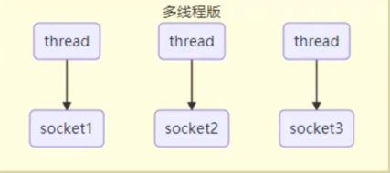
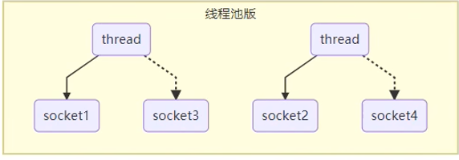
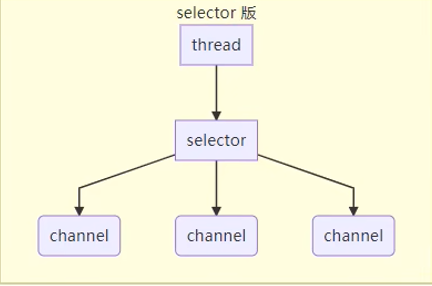

## NIO 概述

NIO全称为Non-blocking IO，其包含三大组件

### 1. Channel

Channel是双向的数据传输通道，不同于单向的InputStream和OutputStream，他们是单向的.

常见的Channel:

* FileChannel：用于文件传输
* DatagramChannel：用于UDP
* SocketChannel：用于TCP，客户端和服务端都能用
* ServerSocketChannel：用于TCP，专用于服务端

### 2. Buffer

Buffer就是存储数据的缓冲区。

常见的Buffer：

* ByteBuffer
  * MappedByteBuffer
  * DirectByteBuffer
  * HeapByteBuffer
* ShortBuffer
* IntBuffer

### 3. selector

selector不好理解，这里用服务器的演变过程介绍selector:

**多线程的服务器**



最直观的想法就是每个客户端连接对应的socket都有单独的线程来处理，但是这会带来一些问题：

* 线程本身是需要开销的，这带来额外负担
* 线程之间的切换也是需要开销的
* 当客户端连接数很大时，服务端很可能是没有足够的内存来创建那么多线程的。

**线程池版的服务器**



对多线程的简单改进就是使用线程池，这样服务器可以保证线程的数量不会超出内存的容量，并且线程切换的开销也是可预测的。

在线程池的模式下，如果连接数超过线程数，那么客户端连接就需要等待thread，每个thread只能一个一个处理socket，这还是有些缺陷的：

* thread处理socket是以阻塞模式处理的，如果该socket没有使用cpu，该thread依旧需要处理完该socket才能处理其他的
* 这种线程池要求客户端是短链接的，意思是每次连接就处理一点事务，不要浪费服务器的CPU

**selector版的服务器**



（图中channel和socket含义类似，都是和客户端的通信，只是不同包的实现不同）

这里thread和客户端连接之间添加了一个中间件selector，selector可以监听多个连接，当连接有事件发生时，thread则会处理该事件。这就解决了上述thread被socket浪费的问题。

## ByteBuffer

基本使用：

```java
public class TestByteBuffer
{
    public static void main( String[] args ) {
        try {
            // 1.创建channel和buffer
            FileChannel channel = new FileInputStream("D:\\Source Code\\JAVA\\Netty\\NIO-1\\BasicUse\\src\\main\\data.txt").getChannel();
            ByteBuffer buffer = ByteBuffer.allocate(10);

            while (true) {
                // 2. 读取数据到buffer
                int len = channel.read(buffer);

                // 3. 将buffer中的内容打印出来
                buffer.flip();      // 将buffer切换至读模式
                while (buffer.hasRemaining()) {
                    System.out.println((char) buffer.get());
                }
                buffer.clear();     // 将buffer切换为写模式

                // 4. 判断数据是否读取完
                if (len == -1) {
                    break;
                }
            }
        } catch (IOException e) {
            throw new RuntimeException(e);
        }
    }
}
```

可以看出channel和buffer的使用还是很简单的，需要注意的是buffer需要切换读写模式，这和buffer的内部结构有关。

### ByteBuffer内部结构

ByteBuffer类似于数组，内部有三个重要的变量：
* capability: 指示buffer的大小
* limit：指示读或者写的范围
* position：指示当前的读写位置

其中数据总是从position开始读写，达到limit时则不允许继续读写。

初始情况如图：


当buffer中写入数据后：


此时如果要读取buffer，则需要flip()函数来切换position和Limit的位置：


此时如果要从读取转为写入，则需要通过clear()再次更改position和limit的位置：


由于clear会将positon放到开头，limit放到结尾，如果上次读取没有将buffer读取完，则会导致数据丢失。所以还要compact方法：


总体来说，ByteBuffer是通过position和limit工作的，由于读写需要不同的postion和limit的位置，所以需要flip,clear,compact方法来更改position和limit指针的位置。

### Allocate函数分配的不同内存类型

```java
public class ByteBufferAllocateTest {
    public static void main(String[] args) {
        System.out.println(ByteBuffer.allocate(1024).getClass());
        System.out.println(ByteBuffer.allocateDirect(1024).getClass());

        /*
        class java.nio.HeapByteBuffer
        class java.nio.DirectByteBuffer
         */
    }
}
```

* HeapByteBuffer：在JVM堆上分配内存，读写效率低，收到GC的影响（GC时避免内存碎片可能移动BUFFER位置）
* DirectByteBuffer：在系统内存上分配，读写效率高，不受GC影响，分配效率低

### 读写操作示例

```java
public static void main(String[] args) {
    ByteBuffer buffer = ByteBuffer.allocate(10);

    // 写入数据
    buffer.put(new byte[]{'a','b','c'});    // 对应值97,98,99
    buffer.flip();

    // 1.get读取单个byte
    System.out.println((char) buffer.get());

    // 2.get读取多个byte
    byte[] bytes = new byte[2];
    buffer.get(bytes);
    System.out.println(Arrays.toString(bytes));

    // 3.rewind():将position设置为0
    buffer.rewind();
    System.out.println((char) buffer.get());

    // 4.mark:将当前position进行标记; reset:将position重置为mark
    buffer.mark();  //对b的位置进行了mark
    System.out.println((char) buffer.get());
    buffer.reset(); //重回到b的位置
    System.out.println((char) buffer.get());

    // 5. get(i):读取第i个byte而不更改position
    System.out.println((char) buffer.get(2));
}
```

### 分散读和集中写

```java
public static void main(String[] args) throws IOException {
    FileChannel channel = new FileInputStream("D:\\Source Code\\JAVA\\Netty\\NIO-1\\BasicUse\\src\\main\\data.txt").getChannel();
    ByteBuffer b1 = ByteBuffer.allocate(5);
    ByteBuffer b2 = ByteBuffer.allocate(5);
    ByteBuffer b3 = ByteBuffer.allocate(3);
    // 分散读
    channel.read(new ByteBuffer[]{b1,b2,b3});
    b1.flip();
    b2.flip();
    b3.flip();
    // 集中写
    FileChannel outChanel = new FileOutputStream("target.txt").getChannel();
    outChanel.write(new ByteBuffer[]{b1,b2,b3});
}
```

在一些业务中会有如下场景：

1. 将一个文件读入到多个buffer中
2. 将多个buffer的内容拷贝到同一个文件中

而分散读就可以直接将文件中的内容拷贝到多个buffer中，而不是先读取到一个buffer，然后再次拷贝到不同的buffer。

而集中写则是一次IO完成多个buffer的写入，避免多次IO。

### 字符串操作

```java
public class BufferAndString {
    public static void main(String[] args) {
        // 1. 字符串转为buffer
        ByteBuffer buffer = Charset.defaultCharset().encode("hello wold");
        System.out.println(buffer);

        // 2. buffer转为字符串
        System.out.println(Charset.defaultCharset().decode(buffer).toString());
    }
}
```

Charset类提供了encode和decode方法来方便处理字符串和buffer之间的转换。

## FileChannel

### 注意事项

1. FileChannel只能工作在阻塞模式下

### 获取FileChannel

无法直接new FileChannel，只能通过FileInputStream, FileOutputStream, RandomAccessFile来获取FileChannel。虽然channel是双向的，可读可写，但是：

* FileInputStream获取的FileChannel只能进行读
* FileOutputStream获取的FileChannel只能进行写
* RandomAccessFile获取的FileChannel的读写能力取决于RandomAccessFile的读写能力

### FileChannel读写

```java
// 读取
channel.read(buffer);

//写入
while(buffer.hasRemaining()){
    channel.write(buffer)
}
```

这里需要注意的是chanel的写入能力可能是有限的，未必能一次将buffer中的内容全部写入到channel,所有使用了while循环。

此外，channel的写入未必是直接写入磁盘的，可能只是先写入到缓存。如果希望每次写入都写入到磁盘，则需要使用channel.force方法。

### 数据传输
```java
public static void main(String[] args) {
    try (FileChannel from = new FileInputStream("data.txt").getChannel();
            FileChannel to = new FileOutputStream("to.txt").getChannel()) {
        // 效率比单纯的inputstream,outputstream高，因为底层使用了操作系统的零拷贝
        from.transferTo(0, from.size(), to);
    } catch (IOException e) {
        e.printStackTrace();
    }
}
```

两文件之间进行数据传输的核心函数就是transferTo，但是该方法一次最多传输2g大小的数据量，所以文件过大时需要利用循环进行多次传输：

```java
public static void main(String[] args) {
    try (FileChannel from = new FileInputStream("data.txt").getChannel();
            FileChannel to = new FileOutputStream("to.txt").getChannel()) {
        long left;
        for(left=from.size(); left>0;){
            long transferred = from.transferTo(from.size() - left, left, to);
            left -= transferred;
        }
    } catch (IOException e) {
        e.printStackTrace();
    }
}
```

## Path & Files

在jdk7之后提出了Path来表示`文件或者路径的抽象`，这个抽象存储文件或路径的信息，并且可以配合Files类来进行相关操作。其中类对应的含义如下：

* Path：文件或者路径的抽象
* Paths: 工具类
* Files：工具类

一个使用示例：

```java
public static void main(String[] args) throws IOException {
    // 获得Path对象
    Path path = Paths.get("data.txt");
    Path path2 = Paths.get("newData.txt");
    // Path对象相关信息
    System.out.println(path.toAbsolutePath());
    // Files操作Path对象
    Files.move(path,path2);
}
```

具体API自行百度即可

### 循环遍历目录

```java
public static void main(String[] args) throws IOException {
    Path path = Paths.get("D:\\Source Code"); //设置起始目录

    // 核心就是重写visitor中的方法，实现遍历到每个文件或文件夹时想做的操作
    Files.walkFileTree(path, new SimpleFileVisitor<Path>() {
        @Override
        public FileVisitResult visitFile(Path file, BasicFileAttributes attrs) throws IOException {
            if (file.toString().endsWith(".java")) {
                System.out.println(file);
            }
            return super.visitFile(file, attrs);

        }
    });
}
```

Files提供了walkFileTree API来方便地遍历目录并实现操作，这也是观察者设计模式的体现。

## 阻塞式服务器和非阻塞式

```java
public class BlockedServer {
    public static void main(String[] args) throws IOException {
        ByteBuffer buffer = ByteBuffer.allocate(16);
        ArrayList<SocketChannel> scList = new ArrayList<>();

        // 1.创建服务器
        ServerSocketChannel ssc = ServerSocketChannel.open();
        // 2. 绑定端口号
        ssc.bind(new InetSocketAddress(8888));

        while (true) {
            // 3.接受客户端请求，创建channel
            SocketChannel socketChannel = ssc.accept(); //阻塞方法
            System.out.println("Accepted connection from " + socketChannel.getRemoteAddress());
            scList.add(socketChannel);

            // 4. 读取channel中的数据并打印
            for (SocketChannel sc : scList) {
                sc.read(buffer);     //阻塞方法
                buffer.flip();
                System.out.println(buffer);
                buffer.clear();
            }
        }
    }
}
```

```java
public class Client {
    public static void main(String[] args) throws IOException {
        SocketChannel socketChannel = SocketChannel.open();
        socketChannel.connect(new InetSocketAddress("127.0.0.1", 8888));
        socketChannel.write(Charset.defaultCharset().encode("hello"));
        socketChannel.close();
    }
}
```

上述服务器代码中，accept和read方法都是阻塞方法，导致该程序无法处理多个客户端。

为此我们可以修改代码为非阻塞的

```java
public class NonBlockedServer {
    public static void main(String[] args) throws IOException {
        ByteBuffer buffer = ByteBuffer.allocate(16);
        ArrayList<SocketChannel> scList = new ArrayList<>();

        ServerSocketChannel ssc = ServerSocketChannel.open();
        // 设置ssc的accept方法为非阻塞的
        ssc.configureBlocking(false);
        ssc.bind(new InetSocketAddress(8888));

        while (true) {
            // 此时ssc为非阻塞的，如果没有客户端连接则返回null并且继续执行，而不是等待连接
            SocketChannel socketChannel = ssc.accept();
            if (socketChannel != null) {
                // 设置sc的read方法为非阻塞的
                socketChannel.configureBlocking(false);
                System.out.println("Accepted connection from " + socketChannel.getRemoteAddress());
                scList.add(socketChannel);
            }

            for (SocketChannel sc : scList) {
                // 非阻塞方法，如果channel中没有值则返回0，而不是等待
                if (sc.read(buffer) > 0){
                    buffer.flip();
                    System.out.println(buffer);
                    buffer.clear();
                }
            }
        }
    }
}
```

非阻塞的服务器可以处理多个客户端，然而这也会导致服务器大部分时间都处于空旋状态，浪费CPU。

## Selector的使用

```java
public class SelectorBasicUse {
    public static void main(String[] args) throws IOException {
        ServerSocketChannel ssc = ServerSocketChannel.open();
        ssc.configureBlocking(false);
        ssc.bind(new InetSocketAddress(8888));

        // 1. 创建selector
        Selector selector = Selector.open();
        // 2. 将ssc注册到该selector，注册后的channel用SelectionKey来访问
        SelectionKey sscKey = ssc.register(selector, 0, null);
        sscKey.interestOps(SelectionKey.OP_ACCEPT);     // 设置ssc只关注accept事件

        while (true) {
            // 3. select方法会检测该selector中注册的channel是否有事件发生，无事件则阻塞
            selector.select();
            // 4. 获取发生事件的SelectionKeys，也就是channels，并对它们遍历处理
            Set<SelectionKey> selectedKeys = selector.selectedKeys();
            Iterator<SelectionKey> iterator = selectedKeys.iterator();
            while (iterator.hasNext()) {
                SelectionKey key = iterator.next();
                // 5. 判断事件类型
                if (key.isAcceptable()) {   //知道是ssckey发生事件了，因为只有它关注accept事件
                    ServerSocketChannel channel = (ServerSocketChannel) key.channel();
                    System.out.println("client connected");
                    // 6. 处理事件： 为客户端请求创建连接，并将该连接也注册到selector
                    SocketChannel socketChannel = channel.accept();
                    socketChannel.configureBlocking(false);
                    socketChannel.register(selector, SelectionKey.OP_READ);     //设置sc关注的事件为read
                } else if (key.isReadable()) {
                    SocketChannel socketChannel = (SocketChannel) key.channel();
                    // 6. 处理事件： 读取数据并打印第一个字符
                    ByteBuffer buffer = ByteBuffer.allocate(1024);
                    int readSize = socketChannel.read(buffer);  // 如果该事件是客户端断开，则readSize返回-1
                    if (readSize > 0) {
                        buffer.flip();
                        System.out.println((char) buffer.get());
                        buffer.clear();
                    }
                }
                // 7. 将事件删除，否则处理后的事件依旧保留到selectedKeys中，下一次其他事件发生时会被再次处理
                iterator.remove();
            }
        }
    }
}
```
其中需要注意：
1. selector的select方法检测到的事件，要么被处理，要么被cancle。如果什么都不做，while循环再次执行到select方法时，该事件还是会被检测到。

2. selector的select方法检测到的事件，被处理或者cancle后依旧需要从selectedKeys中删除，否则新的事件被检测到后，旧事件会被重复处理。

3. 客户端断开时也会触发一次read事件，此时channel.read()返回-1。

此外，selector的事件分为四种类型：

* accept:服务端接收客户端的连接
* connect:客户端成功与服务端建立连接
* read:客户端发送数据或者断开连接
* write: 网络空闲可以进行写入操作

### 处理消息边界

客户端给服务器发送消息时，服务器得到的其实是一个bytebuffer，这个bytebuffer中可能是多条消息（粘包）+未发完半条消息（半包）。所以客户端和服务器之间需要达成消息边界的约定，让服务器能够从bytebuffer中分离出粘包的消息，以及合并半包。

常见的消息边界的约定有三类：
1. 固定buffer大小： 客户端和服务端都使用消息可能达到的最大长度作为buffer大小，而且客户端保证每次只发送一条消息。这么做的好处是简单，坏处是浪费带宽，因为要填充没用完的buffer。
2. 使用分隔符：客户端保证每条消息结束都有分隔符，服务端可以通过分隔符来处理数据。缺点是效率差，因为要遍历buffer中所有字符来找到分隔符
3. TLV：T是type，L是length，V是value。即每条消息都有个头部，其中描述该消息（value）的type和length。这也是http协议的做法。

下边展示如何以/n分隔符作为消息边界：

```java
public class SelectorAndSeperator {
    public static void main(String[] args) throws IOException {
        ServerSocketChannel ssc = ServerSocketChannel.open();
        ssc.configureBlocking(false);
        ssc.bind(new InetSocketAddress(8888));

        Selector selector = Selector.open();
        SelectionKey sscKey = ssc.register(selector, 0, null);
        sscKey.interestOps(SelectionKey.OP_ACCEPT);

        while (true) {
            selector.select();
            Set<SelectionKey> selectedKeys = selector.selectedKeys();
            Iterator<SelectionKey> iterator = selectedKeys.iterator();
            while (iterator.hasNext()) {
                SelectionKey key = iterator.next();
                if (key.isAcceptable()) {
                    ServerSocketChannel channel = (ServerSocketChannel) key.channel();
                    System.out.println("client connected");
                    SocketChannel socketChannel = channel.accept();
                    socketChannel.configureBlocking(false);
                    // 将buffer作为attachment添加到sc上
                    socketChannel.register(selector, SelectionKey.OP_READ, ByteBuffer.allocate(4));
                } else if (key.isReadable()) {
                    SocketChannel socketChannel = (SocketChannel) key.channel();
                    // 获取channel对应的buffer
                    ByteBuffer buffer = (ByteBuffer) key.attachment();
                    int readSize = socketChannel.read(buffer);
                    if (readSize > 0) {
                        buffer.flip();
                        split(buffer);
                        // 如果buffer没有split出消息，说明buffer无法容纳一条消息，需要扩容
                        if (buffer.position() == buffer.limit()) {
                            System.out.println("拓容发生");
                           ByteBuffer newBuffer = ByteBuffer.allocate(buffer.capacity() * 2);
                           // 旧buffer拷贝到新buffer中
                           buffer.flip();
                           newBuffer.put(buffer);
                           // 将新buffer作为channel的attachment
                           key.attach(newBuffer);
                        }
                    }
                }
                iterator.remove();
            }
        }
    }

    // 该方法将buffer中存在的信息分离出来并打印
    public static void split(ByteBuffer buffer) {
        for (int i = 0; i < buffer.limit(); i++) {
            if (buffer.get(i) == '\n') {
                ByteBuffer newBuffer = ByteBuffer.allocate(i - buffer.position()+1);
                for (int j = 0; j < newBuffer.limit(); j++) {
                    newBuffer.put(buffer.get());
                }
                newBuffer.flip();
                System.out.print(Charset.defaultCharset().decode(newBuffer));
            }
        }
        buffer.compact();
    }
}
```

其中将buffer中的内容进行分割和合并是很简单的，重点是当buffer不足以容纳一条消息时，如何对buffer进行扩容。

这时才意识到每个channel都应该有自己的buffer，而selector提供了attachment来处理这种情况，将buffer和channel进行绑定。

### Buffer大小的选择

上边已经说明了每个连接都要有channel，该channel应该有自己对应的buffer，这也能保证线程安全。然而为了实现高连接量，buffer的应该尽可能不浪费空间的，否则内存还是不够用。

所有buffer的大小通常是动态调整的，而这种动态调整有两种实现思路：

1. buffer一开始设置很小，不够用时进行扩容，然后将旧buffer的内容拷贝进新buffer，然后释放旧buffer。缺点是buffer拷贝带来的开销

2. 使用多个数组作为buffer，一开始buffer只有一块内存，当buffer不够用时，分配新的一块内存到数组中，作为buffer的拓展。优点是不需要进行数据拷贝，缺点是buffer由数组构成，不连续，处理起来复杂。


### 发送太多数据

```java
public class WriteServer {
    public static void main(String[] args) throws IOException {
        ServerSocketChannel ssc = ServerSocketChannel.open();
        ssc.configureBlocking(false);
        ssc.bind(new InetSocketAddress(8888));

        Selector selector = Selector.open();
        SelectionKey sscKey = ssc.register(selector, SelectionKey.OP_ACCEPT, null);

        while (true) {
            selector.select();
            Set<SelectionKey> selectedKeys = selector.selectedKeys();
            Iterator<SelectionKey> iterator = selectedKeys.iterator();
            while (iterator.hasNext()) {
                SelectionKey key = iterator.next();
                if (key.isAcceptable()) {
                    ServerSocketChannel channel = (ServerSocketChannel) key.channel();
                    System.out.println("client connected");
                    SocketChannel socketChannel = channel.accept();
                    socketChannel.configureBlocking(false);
                    // 1. 建立连接后，server向client发送一个大数据
                    StringBuilder stringBuilder = new StringBuilder();
                    for (int i = 0; i < 5000000; i++) {
                        stringBuilder.append('a');
                    }
                    ByteBuffer buffer = Charset.defaultCharset().encode(stringBuilder.toString());
                    // 2. 数据太大，可能无法一次write就传输完
                    while (buffer.hasRemaining()){
                        int written = socketChannel.write(buffer);
                        System.out.println(written);
                    }
                }
                iterator.remove();
            }
        }
    }
}
```

```java
public class WriteClient {
    public static void main(String[] args) throws IOException {
        SocketChannel socketChannel = SocketChannel.open();
        socketChannel.connect(new InetSocketAddress("127.0.0.1", 8888));

        ByteBuffer buffer = ByteBuffer.allocate(1024 * 1024);
        int count = 0;
        // 一直监听并读取服务端数据
        while (true){
            count += socketChannel.read(buffer);
            System.out.println(count);
            buffer.clear();
        }
    }
}
```

上述是一个服务器向客户端发送数据的例子，由于发送的数据过多，而socketChannel.write能发送的数据量大小是受网络缓存的影响，所以这里使用了一个while循环来让服务器反复发送。

然而，这个while循环其实是指等待网络资源空闲，这会造成阻塞，违背了NIO的思想。为此，可以对服务端进行改进：

```java
public class WriteServer {
    public static void main(String[] args) throws IOException {
        ServerSocketChannel ssc = ServerSocketChannel.open();
        ssc.configureBlocking(false);
        ssc.bind(new InetSocketAddress(8888));

        Selector selector = Selector.open();
        SelectionKey sscKey = ssc.register(selector, SelectionKey.OP_ACCEPT, null);

        while (true) {
            selector.select();
            Set<SelectionKey> selectedKeys = selector.selectedKeys();
            Iterator<SelectionKey> iterator = selectedKeys.iterator();
            while (iterator.hasNext()) {
                SelectionKey key = iterator.next();
                if (key.isAcceptable()) {
                    ServerSocketChannel channel = (ServerSocketChannel) key.channel();
                    System.out.println("client connected");
                    SocketChannel socketChannel = channel.accept();
                    socketChannel.configureBlocking(false);
                    // 1. 建立连接后，server向client发送一个大数据
                    StringBuilder stringBuilder = new StringBuilder();
                    for (int i = 0; i < 5000000; i++) {
                        stringBuilder.append('a');
                    }
                    ByteBuffer buffer = Charset.defaultCharset().encode(stringBuilder.toString());
                    int written = socketChannel.write(buffer);
                    System.out.println(written);
                    // 2. 数据太大，可能无法一次write就传输完
                    if (buffer.hasRemaining()){
                        // 3.让socketChannel关注write事件，等网络空闲了再来处理
                        SelectionKey scKey = socketChannel.register(selector, 0, null);
                        scKey.interestOps(scKey.interestOps() + SelectionKey.OP_WRITE);     // 在原有关注事件上添加write事件
                        scKey.attach(buffer);   // 将未写完的buffer作为attachment
                    }
                } else if (key.isWritable()) {
                    // 4. 网络空闲时则触发该事件
                    SocketChannel sc = (SocketChannel) key.channel();
                    ByteBuffer buffer = (ByteBuffer) key.attachment();
                    // 5.继续写入操作
                    int written = sc.write(buffer);
                    System.out.println(written);
                    // 6.检查是否写完了，写完了则清理buffer并取消关注write事件
                    if (!buffer.hasRemaining()){
                        key.interestOps(key.interestOps() - SelectionKey.OP_WRITE);
                        key.attach(null);
                    }
                }
                iterator.remove();
            }
        }
    }
}
```

其核心是让socketChannel关注write事件，这样当网络空闲时write事件会被触发，sc可以继续写入操作。