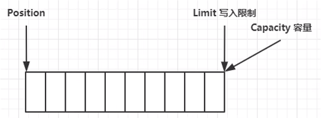
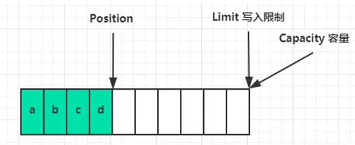
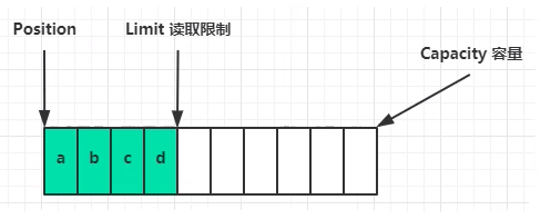
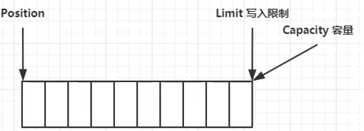
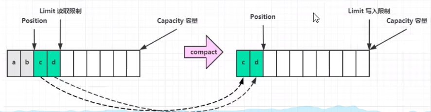

## NIO 概述

NIO全称为Non-blocking IO，其包含三大组件

### 1. Channel

Channel是双向的数据传输通道，不同于单向的InputStream和OutputStream，他们是单向的.

常见的Channel:

* FileChannel：用于文件传输
* DatagramChannel：用于UDP
* SocketChannel：用于TCP，客户端和服务端都能用
* ServerSocketChannel：用于TCP，专用于服务端

### 2. Buffer

Buffer就是存储数据的缓冲区。

常见的Buffer：

* ByteBuffer
  * MappedByteBuffer
  * DirectByteBuffer
  * HeapByteBuffer
* ShortBuffer
* IntBuffer

### 3. selector

TBD

## ByteBuffer

基本使用：

```java
public class TestByteBuffer
{
    public static void main( String[] args ) {
        try {
            // 1.创建channel和buffer
            FileChannel channel = new FileInputStream("D:\\Source Code\\JAVA\\Netty\\NIO-1\\BasicUse\\src\\main\\data.txt").getChannel();
            ByteBuffer buffer = ByteBuffer.allocate(10);

            while (true) {
                // 2. 读取数据到buffer
                int len = channel.read(buffer);

                // 3. 将buffer中的内容打印出来
                buffer.flip();      // 将buffer切换至读模式
                while (buffer.hasRemaining()) {
                    System.out.println((char) buffer.get());
                }
                buffer.clear();     // 将buffer切换为写模式

                // 4. 判断数据是否读取完
                if (len == -1) {
                    break;
                }
            }
        } catch (IOException e) {
            throw new RuntimeException(e);
        }
    }
}
```

可以看出channel和buffer的使用还是很简单的，需要注意的是buffer需要切换读写模式，这和buffer的内部结构有关。

### ByteBuffer内部结构

ByteBuffer类似于数组，内部有三个重要的变量：
* capability: 指示buffer的大小
* limit：指示读或者写的范围
* position：指示当前的读写位置

其中数据总是从position开始读写，达到limit时则不允许继续读写。

初始情况如图：



当buffer中写入数据后：



此时如果要读取buffer，则需要flip()函数来切换position和Limit的位置：



此时如果要从读取转为写入，则需要通过clear()再次更改position和limit的位置：



由于clear会将positon放到开头，limit放到结尾，如果上次读取没有将buffer读取完，则会导致数据丢失。所以还要compact方法：



总体来说，ByteBuffer是通过position和limit工作的，由于读写需要不同的postion和limit的位置，所以需要flip,clear,compact方法来更改position和limit指针的位置。


