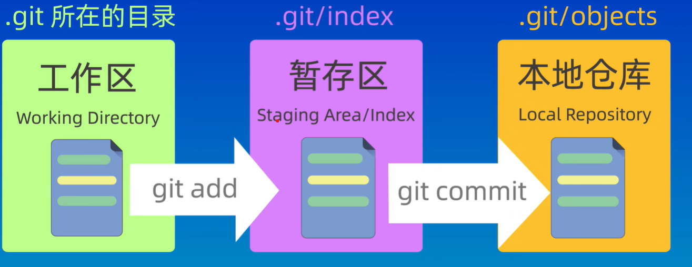
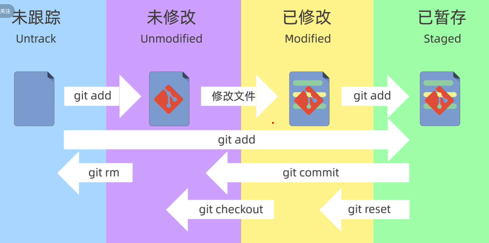
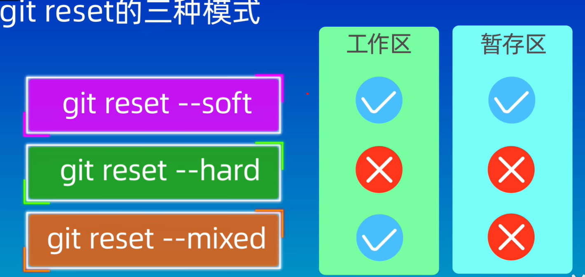
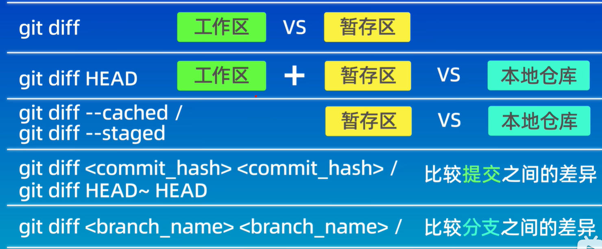

# Git 理论知识

## GIT 官方文档

https://git-scm.com/book/zh/v2/%e8%b5%b7%e6%ad%a5-%e5%85%b3%e4%ba%8e%e7%89%88%e6%9c%ac%e6%8e%a7%e5%88%b6

其实官方文档介绍地很详细，有些内容可能直接查看官方文档而不进行记录了。

## 介绍

git 是用作版本控制的，先通过 init 创建一个仓库，仓库里的文件都将被 git 进行管理。

版本相当于对所有文件的当前状态拍一张照，它记录了所有文件当前的状态。而 git 来进行版本控制就是在当前文件夹下创建一个.git 文件，该文件保存了要管理的文件夹的所有版本，每次 commit 就是将一个版本提交到仓库中去。（注意：每次提交的版本是当前所有文件的状体，而不是和上次版本的差异）

文件区域可以分为三个：工作区(working Directory)，暂存区(Staging Area)和本地仓库(Local Repository)。

工作区：文件存在的区域，也就是.gti 存在的目录。

暂存区：存放即将提交的文件，位于.git/index。

本地仓库：存储文件和版本信息，位于.git/objects。



对应的，文件也可以被分为四个状态：

未跟踪：没有被 git 管理的文件。

未修改：跟踪后但是文件没有变化。

已修改：跟踪的文件并且发生了修改。

已缓存：被放进缓存区的文件。



由图可知文件的状态并非单向转变的。

# 常用命令

## 全局操作

### 配置

```
# 全局配置
git config --global user.name "cian"
git config --global user.email a1401702664@gmail.com

# 本地配置（配置写在.git/config文件中）
git config user.name "cian"
git config user.email a1401702664@gmail.com

# 查看配置(默认先查看本地配置，如果没有则查看全局配置)
git config user.name
git config user.email
git config --global --list

# 删除配置
git config --global --unset user.name
git config --unset user.name
```

### 帮助

```
git command -h
git help command
```

## 仓库操作

### 创建仓库

创建仓库其实就是创建一个.git 文件夹来管理当前的目录。

```
git init    // 将当前目录创建为仓库
git clone url   // 下载远程的仓库
```

也可以不进行 init，直接通过 git clone 来获取远程仓库。

### 查看仓库

```
git status  //查看状态

git log //查看历史提交
git log --oneline   // 简略信息
git log -p  // 详细信息

git ls-files //查看暂存区文件
```

### 增加文件

```
git add filename

git add -all    // 添加所有文件
git add .
```

### 提交文件

```
// 会进入message编辑器，查看vim操作指令来编辑
git commit

git commit -m "message"
git commit -a -m "message"  // 提交全部文件
```

### 修改文件名称

```
git mv from.txt to.txt  // 在工作区和暂存区更改名称
git commit      // 在仓库更改名称
```

### 删除文件

```
rm file1.txt    // 工作区中删除文件
git add file1.txt //通知暂存区删除文件
git commit //通知本地仓库删除文件

git rm file1.txt // 工作区和暂存区中删除文件
git commit //通知本地仓库删除文件

// 当你不想再跟踪file.txt或者忘记将file.txt加入到.ignore中时
git rm --cached file.txt    // 在暂存区中删除，工作区保留
git commit  //在仓库中删除
```

### 清除 untracked 文件

```
// 对于untracked，可以用git clean移除
git clean

// 参数
git clean -f //强制删除文件
git clean -df //强制删除文件夹
git clean -n //查看要被删除的文件
git clean -dff  //强制删除被其它git管理的文件夹
```

### 忽略文件

创建.gitignore，在文件中声明要忽略的文件，可以使用正则表达式。

## 远程仓库

### git clone

如果是通过 git clone 创建的 git 仓库，那么自带一个 origion 远程仓库。

git clone 默认只检出一个分支（通常是远程仓库的默认分支），但会下载所有分支的信息。

具体表现为：

* 所有分支的历史记录和元数据都会被下载到本地的 .git 目录
* 但工作区只显示默认分支（通常是 main 或 master）的内容


### 增删改查操作

```
git remote：列出当前仓库中已配置的远程仓库。
git remote -v：列出当前仓库中已配置的远程仓库，并显示它们的 URL。
git remote add <remote_name> <remote_url>：添加一个新的远程仓库。
git remote rename <old_name> <new_name>：将已配置的远程仓库重命名。
git remote remove <remote_name>：从当前仓库中删除指定的远程仓库。
git remote set-url <remote_name> <new_url>：修改指定远程仓库的 URL。
git remote show <remote_name>：显示指定远程仓库的详细信息，包括 URL 和跟踪分支。
```

### 获取权限

在尝试 git push 来修改远程仓库时需要访问权限，由于 2021 年后不允许使用账号密码登录，这里使用 personal access token 来进行授权。

1. https://github.com/settings/tokens 在这里创建 token
2. 用户认证时，用 token 作为密码

### 远程仓库密码存储

由于 http 协议的限制，每次 push 或者 pull 都需要输入账号密码，为此 git 提供了存储功能来记录认证信息，避免每次操作都需要手动输入账号密码：

```
// 缓存账号密码,15分钟后过期
git config --global credential.helper cache

// 磁盘存储账号密码，明文存储但不会过期
git config --global credential.helper store
```

### 同步仓库

```
// 获取远程仓库的内容，但不进行合并操作
git fetch <remote>

// 等同于git fetch + git merge
git pull

// 将branch分支推送到remote仓库的branch分支
git push <remote> <branch>
```


## 工作流操作

### 撤销操作
```
// 修改上一次提交（快照）
git commit --amend

// 撤销暂存区中对某个文件的修改
git restore --staged <file>

// 撤销工作目录中对某个文件的修改
git restore <file>

// 清除未跟踪的文件
git clean -fd <file>

// 如果已经add但是未提交
git reset        # 取消已暂存
git restore .    # 还原改动
git clean -fd    # 删除未追踪文件和目录
```

### Tag 管理

```
// 查看当前tag list
git tag

// 查看tag对应的提交信息
git show <tagname>

// 为最近一次提交添加tag
git tag <tagname>

// 为之前某一次提交添加tag
git tag <tagname> <hashcode>

// 删除tag
git tag -d <tagname>
```

### 版本控制

参考文献：https://git-scm.com/book/zh/v2/Git-%E5%B7%A5%E5%85%B7-%E9%87%8D%E7%BD%AE%E6%8F%AD%E5%AF%86.html

```
git log     //查看提交记录的版本号
git reset versionNumber
```

reset 命令会以特定的顺序重写 HEAD，暂存区和工作目录。在你指定以下选项时停止：

1. 移动 HEAD 分支的指向 （若指定了 --soft，则到此停止）

2. 使索引看起来像 HEAD （若未指定 --hard，则到此停止）

3. 使工作目录看起来像索引



但要注意的是，就是是使用了--hard 参数，也是有办法撤回的，可以使用 git --reflog 命令查看被删除的版本好，然后 reset 到那个版本。

### 比较差异

我们可以使用 git diff 命令来比较不同版本之间的差异。




## 分支操作

### 基本操作

```
// 创建分支
git branch <branchname>

// 切换分支
git checkout <branchname>

// 删除分支
git branch -d <branchname>
```

### 合并分支

```
// 将当前分支与<branchname>合并
git merge <branchname>
```

### 远程分支

在拉取仓库或者克隆仓库后，远程仓库的分支也会记录在本地文件，例如 origion/master。

而如果我们设置了多个仓库，也会有多个仓库对应的多个分支，其中我们 push 的时候要指出 push 到哪个仓库的哪个分支：

```
// 将本地branch分支推送到remote仓库的branch分支
git push <remote> <branch>

// 删除远程仓库中的分支
git push <remote> --delete <brnahc>

// 只拉取远程仓库的某个分支
git clone -b <分支名> <仓库地址>
```

### 跟踪分支

由于每次 push 或者 pull 时都需要指出本地分支以及对应的远程分支，为了方便，可以将本地分支和远程分支进行绑定，从而成为跟踪分支。跟踪分支知道自己对应的远程分支，进行 push 和 pull 操作时更加简洁：

```
// 指定当前分支的远程分支为<remote>/<branch>
git branch -u <remote>/<branch>
git branch --set-upstream-to <remote>/<branch>

// 从远程分支创建跟踪分支
git checkout -b <branch> <remote>/<branch>

// 当前分支推送到对应的远程分支
git push

// 当前分支拉去对应的远程分支
git pull

// 查看分支对应的远程分支
git branch -vv
```

### 拷贝分支

如果我们想要将一个分支的内容拷贝到另一个分支上，可以使用以下命令：

```
git checkout A -- .// 将分支A的内容拷贝到当前分支
```


# 第三方软件
## github
### 配置 SSH （还是有问题，暂且用 http 吧）

1. 首先生成 ssh 密钥对

```
C:\Users\Cc>ssh-keygen -t rsa -b 4096

    // 选择密钥保存的位置
Enter file in which to save the key (C:\Users\Cc/.ssh/id_rsa): D:\Programming\Git\github-ssh-key
```

2. 将生成的公钥（\*.pub）文件拷贝到 github 设置里的`SSH and GPG Keys`，选择 new SSH Key。

3. 配置私钥来匹配 github

   首先查看 ssh-agent 服务是否开启：

   1. cmd + services.msc 后看 OpenSSH Authentication Agent，右击开启

   2. 或者在 powershell 管理者模式中（不是命令行）

   ```
   Get-Service ssh*    //查看ssh-agent状态
   Start-Service ssh-agent  //开启服务
   ```

   其次添加私钥到 agent 里

   ```
   ssh-add "D:\Programming\Git\github-SSHkey\github-ssh-key"

   ssh-add -l  //查看已添加的私钥
   ```

   3. 测试私钥和公钥是否匹配

   ```
   ssh -T git@github.com
   ```

   补充内容：配置.ssh 文件无用，以及`ssh -i "C:\Users\john\.ssh\id_rsa" git@github.com`可以暂时连接密钥和网站，关闭命令行后失效。

### quick start

```
git init
git commit -m message
git branch -M main
git remote add origin https:url
git push -u origin main
```

### 更改远程仓库

首先在 github 上创建一个仓库，这个仓库会有一个 ssh 连接，根据这个连接，我们把仓库下载下来

```
git clone git@github.com:ablllcd/Note.git
```

然后把文件拷贝到克隆下来的仓库中并且 commit。

最后将本地仓库给 push 到 github 上

```
git push
```
