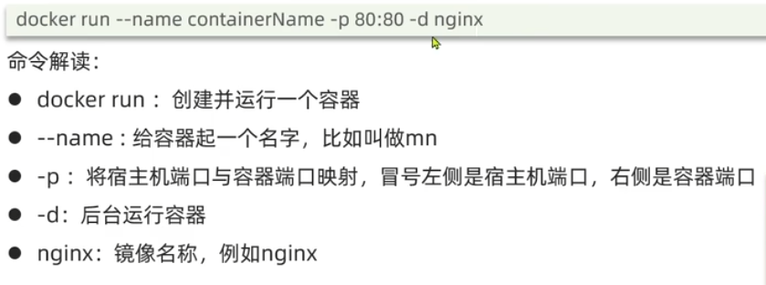

## 简介
docker是一个类似虚拟机的程序，它可以创建很多容器（contianer），每个容器都是独立的虚拟环境，可以在其中安装程序并运行。

此外，docker还有一个重要的概念：镜像(image)。镜像是一个静态模板，它包含了应用程序和程序依赖的环境。我们可以从一个镜像中创建一个容器来布置其指定的环境并运行程序。

Docker也有自己的仓库来储存镜像。

Docker分别提供了GUI和命令行来允许用户使用。


## 命令
#### 镜像操作
````
// 查看镜像
docker images

// 下载删除
docker pull [image]
docker rmi [image]

// image打包 和 导入
docker save -o [targetPath] [image]
docker load -i [inputPath]
````

#### 容器操作
````
// 查看容器
docker ps   // 只查看已激活的
docker ps -a

// 查看容器日志
docker logs [container]

//创建 删除 容器
docker run --name contianerName imageName image并运行
docker rm  contianer    //删除container

//容器开关
docker start container
docker stop container
docker kill container //强制停止

````

#### Docker run 常见参数



#### 其它操作
````
// 拷贝本机数据到容器里
docker cp YOUR_PATH_TO_FOLDER/DBLP-Lab2.tar.gz [containnerName]:/  

// 运行容器的shell
docker exec -it mycassandra /bin/sh

// 创建虚拟网络，允许container相互交流
docker network create [NetName]
````


## 修改DOCKER存储位置

https://www.jianshu.com/p/1ae32787fb14

此外可以在docker设置中查看docker image 的存储位置