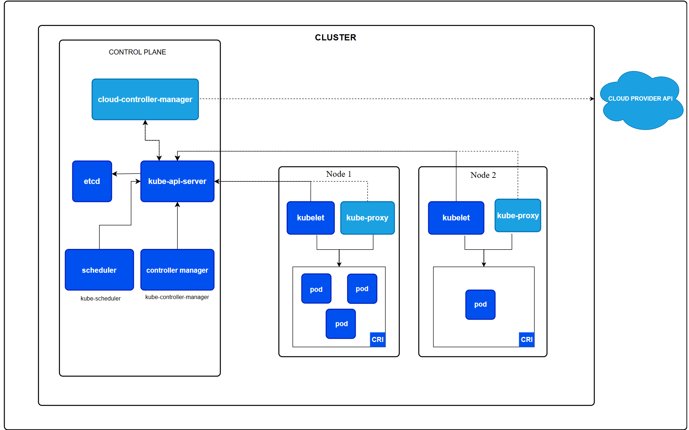

# 基础

## 什么是 Kubernetes

Kubernetes（简称 K8s）是一个开源的容器编排平台，用于自动化容器化应用程序的部署、扩展和管理。它最初由 Google 设计并开源，现在由 Cloud Native Computing Foundation (CNCF) 维护。

注意，kuberenetes 是一个容器编排平台，它是一系列的工具和组件的集合，而不是一个单一的软件。而 minikube/kind/kubeadm 是用来`搭建/部署` Kubernetes 集群的工具。

通俗来说，把kubernetes看作一个操作系统：

* kubeadm 是一个安装这个操作系统的工具
* minikube 是一个在本地虚拟机运行这个操作系统的工具
* kind 是一个在 Docker 容器中运行这个操作系统的工具

## 主要特点

### 1. 容器编排
- **自动化部署**：自动将容器部署到集群中的合适节点
- **自动扩缩容**：根据负载自动增减容器实例
- **滚动更新**：无停机时间的应用更新
- **回滚机制**：快速回滚到之前的版本

### 2. 服务发现和负载均衡
- **DNS 服务发现**：自动为服务分配 DNS 名称
- **负载均衡**：在多个容器实例间分配流量
- **健康检查**：自动检测和替换不健康的容器

### 3. 存储编排
- **持久化存储**：支持各种存储后端（本地存储、云存储等）
- **动态存储供应**：根据需求自动分配存储
- **存储类**：定义不同类型的存储配置

### 4. 自我修复
- **故障检测**：监控容器和节点健康状态
- **自动重启**：重启失败的容器
- **节点故障处理**：将故障节点上的工作负载迁移到健康节点

### 5. 配置和密钥管理
- **ConfigMap**：管理应用配置
- **Secret**：安全存储敏感信息
- **环境变量注入**：动态配置应用参数

## 整体架构

Kubernetes 集群由一个控制平面和一组用于运行容器化应用的工作机器组成， 这些工作机器称作节点（Node）。每个集群至少需要一个工作节点来运行 Pod。



### 控制平面
控制平面负责管理集群的整体状态，包括调度、监控和维护。它由以下组件组成：
- **API Server**：集群的前端接口，处理 REST 请求
- **etcd**：分布式键值存储，保存集群状态
- **Scheduler**：负责将 Pod 调度到合适的节点
- **Controller Manager**：运行控制器进程，负责维护集群的期望状态

控制平面组件可以在集群中的任何节点上运行。 在多节点集群中，控制平面通常不运行在工作节点上，以确保其高可用性和安全性。而在单节点集群中，控制平面和工作负载可以在同一节点上运行。

### 工作节点
工作节点负责运行容器化应用程序。每个工作节点包含以下组件：
- **kubelet**：节点代理，管理 Pod 生命周期
- **kube-proxy**：网络代理，实现服务发现和负载均衡
- **Container Runtime**：容器运行时（Docker、containerd 等）

### 客户端工具
- **kubectl**：命令行工具，用于与 Kubernetes API Server 交互。我们可以使用 kubectl 来部署应用、查看和管理集群资源、以及调试应用程序。（其不属于 Kubernetes 集群的一部分，但它是与 Kubernetes 交互的主要工具。）

## 核心概念

### Pod
- 最小部署单位
- 包含一个或多个紧密相关的容器
- 共享网络和存储

### Service
- 为 Pod 提供稳定的网络访问入口
- 支持负载均衡
- 类型：ClusterIP、NodePort、LoadBalancer、ExternalName

### Deployment
- 管理 Pod 的副本集
- 支持滚动更新和回滚
- 声明式配置

### Namespace
- 逻辑隔离资源
- 多租户支持
- 资源配额管理


## 常见操作

### 查看 Kubernetes 服务和端口
要查看本机（Node）上运行的 Kubernetes 服务，可以使用以下命令:

```sh
kubectl get svc
```

如果想查看某个命名空间下的服务：

```sh
kubectl get svc -n <namespace>
```

要查看本机（Node）上实际运行的 Pod 可以用：

```sh
kubectl get pods -o wide
```

如果需要查看本地端口映射，可以使用 `kubectl port-forward`：

```sh
kubectl port-forward svc/<service-name> <local-port>:<service-port>
```

这样可以将本地端口转发到指定的服务端口，方便本地访问。