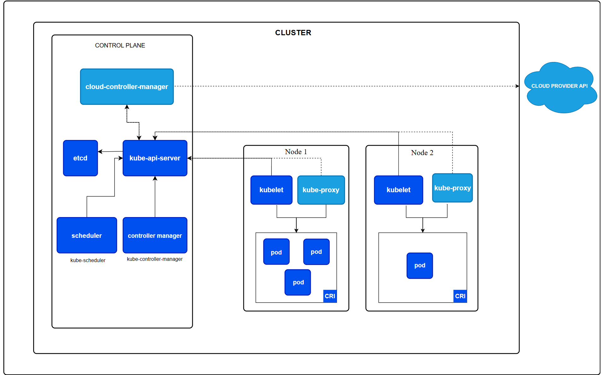

# 基础

## 什么是 Kubernetes

Kubernetes（简称 K8s）是一个开源的容器编排平台，用于自动化容器化应用程序的部署、扩展和管理。它最初由 Google 设计并开源，现在由 Cloud Native Computing Foundation (CNCF) 维护。

注意，kuberenetes 是一个容器编排平台，它是一系列的工具和组件的集合，而不是一个单一的软件。而 minikube/kind/kubeadm 是用来`搭建/部署` Kubernetes 集群的工具。

通俗来说，把kubernetes看作一个操作系统：

* kubeadm 是一个安装这个操作系统的工具
* minikube 是一个在本地虚拟机运行这个操作系统的工具
* kind 是一个在 Docker 容器中运行这个操作系统的工具

## 主要特点

### 1. 容器编排
- **自动化部署**：自动将容器部署到集群中的合适节点
- **自动扩缩容**：根据负载自动增减容器实例
- **滚动更新**：无停机时间的应用更新
- **回滚机制**：快速回滚到之前的版本

### 2. 服务发现和负载均衡
- **DNS 服务发现**：自动为服务分配 DNS 名称
- **负载均衡**：在多个容器实例间分配流量
- **健康检查**：自动检测和替换不健康的容器

### 3. 存储编排
- **持久化存储**：支持各种存储后端（本地存储、云存储等）
- **动态存储供应**：根据需求自动分配存储
- **存储类**：定义不同类型的存储配置

### 4. 自我修复
- **故障检测**：监控容器和节点健康状态
- **自动重启**：重启失败的容器
- **节点故障处理**：将故障节点上的工作负载迁移到健康节点

### 5. 配置和密钥管理
- **ConfigMap**：管理应用配置
- **Secret**：安全存储敏感信息
- **环境变量注入**：动态配置应用参数

## 整体架构

Kubernetes 集群由一个控制平面和一组用于运行容器化应用的工作机器组成， 这些工作机器称作节点（Node）。每个集群至少需要一个工作节点来运行 Pod。



### 控制平面
控制平面负责管理集群的整体状态，包括调度、监控和维护。它由以下组件组成：
- **API Server**：集群的前端接口，处理 REST 请求
- **etcd**：分布式键值存储，保存集群状态
- **Scheduler**：负责将 Pod 调度到合适的节点
- **Controller Manager**：运行控制器进程，负责维护集群的期望状态

控制平面组件可以在集群中的任何节点上运行。 在多节点集群中，控制平面通常不运行在工作节点上，以确保其高可用性和安全性。而在单节点集群中，控制平面和工作负载可以在同一节点上运行。

### 工作节点
工作节点负责运行容器化应用程序。每个工作节点包含以下组件：
- **kubelet**：节点代理，管理 Pod 生命周期
- **kube-proxy**：网络代理，实现服务发现和负载均衡
- **Container Runtime**：容器运行时（Docker、containerd 等）

### 客户端工具
- **kubectl**：命令行工具，用于与 Kubernetes API Server 交互。我们可以使用 kubectl 来部署应用、查看和管理集群资源、以及调试应用程序。（其不属于 Kubernetes 集群的一部分，但它是与 Kubernetes 交互的主要工具。）

## 核心概念

### Pod
- 最小部署单位
- 包含一个或多个紧密相关的容器
- 共享网络和存储

### Service
- 为 Pod 提供稳定的网络访问入口
- 支持负载均衡
- 类型：ClusterIP、NodePort、LoadBalancer、ExternalName

#### Service 类型讲解
| 类型 | 说明 |
|------|------|
| ClusterIP | 默认类型，提供集群内部访问 |
| NodePort | 在每个节点上开放一个端口，允许外部访问 |
| LoadBalancer | 在云环境中创建负载均衡器，提供外部访问 |
| ExternalName | 将 Service 映射到外部 DNS 名称 |

注意：类型是向下兼容的，NodePort 包含 ClusterIP 的功能，LoadBalancer 包含 NodePort 的功能。

### Deployment
- 管理 Pod 的副本集
- 支持滚动更新和回滚
- 声明式配置

Deployment 是一种更高级的控制器，它管理着 ReplicaSet，而 ReplicaSet 又管理着 Pod。我们通常直接使用 Deployment 来管理应用的部署和更新，而不直接操作 ReplicaSet 或 Pod。


### Namespace
- 逻辑隔离资源
- 多租户支持
- 资源配额管理

### Service 和 Pod 的关系

Service 和 Pod 是 Kubernetes 中两个核心且紧密关联的概念，它们的关系可以用一句话概括：**Service 为一组动态变化的 Pod 提供稳定的网络访问入口**。

#### 1. 为什么需要 Service？

Pod 具有以下特性，导致直接访问 Pod 不可靠：

- **IP 不固定**：Pod 每次创建/重启都会被分配新的 IP 地址
- **动态扩缩容**：Pod 的数量会随副本数变化而增减
- **节点迁移**：Pod 可能因节点故障被调度到其他节点

Service 解决了这些问题，为客户端提供一个**固定的虚拟 IP（ClusterIP）和 DNS 名称**。

#### 2. Service 如何关联 Pod —— Label Selector

Service 通过 **Label Selector（标签选择器）** 来匹配合适的 Pod：

```yaml
apiVersion: v1
kind: Service
metadata:
  name: my-app-svc
spec:
  selector:         # ← 标签选择器
    app: my-app     #   选择所有带 app=my-app 标签的 Pod
  ports:
    - protocol: TCP
      port: 80          # Service 端口
      targetPort: 8080  # 转发到 Pod 的端口
```

对应的 Pod 需要带有匹配的标签：

```yaml
apiVersion: v1
kind: Pod
metadata:
  name: my-app-pod
  labels:
    app: my-app     # ← 与 Service selector 匹配
spec:
  containers:
    - name: my-app
      image: my-app:latest
      ports:
        - containerPort: 8080
```

#### 3. 关系示意图

```
┌──────────────────────────────────────────────────┐
│                   Service                         │
│              ClusterIP: 10.0.0.1                  │
│              Port: 80                             │
│         selector: app=my-app                      │
├──────────┬──────────┬──────────┬──────────────────┤
│          │          │          │                   │
│    ┌─────▼────┐ ┌──▼─────┐ ┌──▼──────┐            │
│    │  Pod A   │ │ Pod B  │ │ Pod C   │   ...      │
│    │10.0.1.2  │ │10.0.1.5│ │10.0.1.9 │            │
│    │app=my-app│ │app=my-a│ │app=my-ap│            │
│    └──────────┘ └────────┘ └─────────┘            │
│                                                    │
│  客户端 → Service(10.0.0.1:80) → 随机转发到某个Pod   │
└──────────────────────────────────────────────────┘
```

#### 4. 核心特性

| 特性 | 说明 |
|------|------|
| **稳定访问入口** | Service 的 ClusterIP 和 DNS 名称在生命周期内保持不变 |
| **自动负载均衡** | 请求被随机分发到符合条件的 Pod（默认基于 iptables/IPVS） |
| **动态感知** | Service 持续监听 Pod 变化，自动加入/移除 Endpoint |
| **解耦** | 客户端只需知道 Service 名称，无需关心后端 Pod 的具体 IP |
| **多种暴露方式** | ClusterIP（集群内访问）、NodePort（节点端口）、LoadBalancer（负载均衡器）、ExternalName（外部服务映射） |

#### 5. 哪些pod应该放入相同的Service中？
在 Kubernetes 中，判断 Pod 是否应该放入同一个 Service，核心看一点：`这些 Pod 是否对外提供“无差别”的服务`。

Service 的本质是一个负载均衡器，它将流量随机或按策略分发到后端的 Pod。因此，如果请求发送到 A Pod 和 B Pod，对客户端来说必须是可以互换的，它们才应该在一个 Service 里。

简单来说，同一个应用的多个副本（ReplicaSet 管理的 Pod）通常应该放在同一个 Service 中，因为它们提供相同的功能和接口。而不同应用或不同版本的 Pod 则应该分开到不同的 Service 中，以避免混淆和错误路由。

#### 6. Endpoint 与 EndpointSlice

当 Service 通过 Selector 匹配到 Pod 后，Kubernetes 会自动创建对应的 **Endpoint**（或 **EndpointSlice**，新版默认）资源，记录所有后端 Pod 的 IP 和端口：

```bash
# 查看 Service 对应的 Endpoint
kubectl get endpoints my-app-svc

# 输出示例
NAME         ENDPOINTS                          AGE
my-app-svc   10.0.1.2:8080,10.0.1.5:8080,10.0.1.9:8080   5m
```

这里Service 的ClusterIP 是虚拟IP,只供Cluster内访问; 而Endpoints中的IP是实际物理Pod的IP。当客户端 (Pod) 访问Service的CLuster IP时，kube-proxy会根据Endpoint列表将流量转发到对应的Pod上。

**流量转发流程**：

```
客户端请求 → Service(ClusterIP:Port) → Endpoint(记录Pod列表) → 具体某个Pod
```

注意这里指的是Cluster内部的访问；如果需要从集群外部访问Service，则需要使用<任意NodIP>:<service-port>来访问。

#### 7. 无 Selector 的 Service

Service 也可以不指定 Selector，用于手动管理 Endpoint，常见场景：

- 访问**集群外部的服务**（如外部数据库）
- 跨命名空间访问服务
- 迁移过程中的过渡阶段

```yaml
apiVersion: v1
kind: Service
metadata:
  name: external-db
spec:
  ports:
    - port: 3306
---
apiVersion: v1
kind: Endpoints
metadata:
  name: external-db
subsets:
  - addresses:
      - ip: 192.168.1.100    # 外部数据库 IP
    ports:
      - port: 3306
```


### Namespace的作用

Namespace 位于 Kubernetes 的逻辑组织层，具体位置如下：
```
┌─────────────────────────────────────────────┐
│                集群 (Cluster)               │
│  ┌─────────────┐  ┌─────────────┐           │
│  │ Namespace A │  │ Namespace B │  ...      │
│  │  ┌───────┐  │  │  ┌───────┐  │           │
│  │  │ Pod   │  │  │  │ Pod   │  │           │
│  │  │Service│  │  │  │Service│  │           │
│  │  │ConfigMap││  │  │ConfigMap││           │
│  │  └───────┘  │  │  └───────┘  │           │
│  └─────────────┘  └─────────────┘           │
│          ↓ 物理层面 ↓                        │
│  ┌─────────────────────────────────┐        │
│  │    Node 1    │    Node 2    │   │        │
│  │  Pod(A) Pod(B) Pod(A) Pod(B) │  │        │
│  └─────────────────────────────────┘        │
└─────────────────────────────────────────────┘
```

Namespace 不涉及物理隔离，Pod 依然可以在不同 Node 上混合调度。


### Ingress

#### 1. 为什么需要 Ingress？

Service 的 NodePort 和 LoadBalancer 类型虽然能将服务暴露到集群外，但存在一些局限：

- **端口管理混乱**：每个 Service 一个端口，难以记住和统一管理
- **无法通过 HTTP域名进行访问**：NodePort/LoadBalancer 工作在传输层(TCP/UDP)，无法基于 HTTP 路径、域名等 L7 信息做路由，

**Ingress** 解决了这些问题，它工作在应用层(L7)，为集群内的 Service 提供**统一的 HTTP/HTTPS 入站访问入口**。

#### 2. 什么是 Ingress？

Ingress 是 Kubernetes 的一种 API 资源，用于管理集群外部访问集群内部服务的 HTTP/HTTPS 路由规则。它相当于集群的 **"智能网关"** 或 **"反向代理"**。

```
       ┌──────────────────────────────────────────┐
       │              Internet                     │
       │             http://myapp.com              │
       └────────────────┬─────────────────────────┘
                        │
                 ┌──────▼──────┐
                 │   Ingress    │  ← 统一入口，根据规则分发
                 │  (Nginx/HAProxy/Traefik/...)
                 └──┬───────┬──┘
                    │       │
             ┌──────▼─┐ ┌──▼──────┐
             │Service A│ │Service B│
             │:80      │ │:80      │
             └────┬────┘ └────┬────┘
                  │           │
             ┌────▼────┐ ┌───▼────┐
             │ Pod A1  │ │ Pod B1 │
             │ Pod A2  │ │ Pod B2 │
             └─────────┘ └────────┘
```

#### 3. Ingress 的核心组成

| 组件 | 说明 |
|------|------|
| **Ingress Controller** | 实际的流量转发组件（如 Nginx Ingress Controller、Traefik、HAProxy、AWS ALB Ingress Controller），负责解析 Ingress 规则并实现反向代理 |
| **Ingress 资源** | 定义的 YAML 规则，描述"什么域名/路径 → 转发到哪个 Service" |
| **TLS 证书** | 可选，配置 HTTPS 证书实现 SSL 终止 |

> **注意**：Ingress 资源本身只是一组规则定义，真正的流量转发由 **Ingress Controller** 实现。集群默认不会安装 Ingress Controller，需要手动部署。

#### 4. 一个完整的 Ingress 示例

```yaml
apiVersion: networking.k8s.io/v1
kind: Ingress
metadata:
  name: myapp-ingress
  annotations:
    nginx.ingress.kubernetes.io/rewrite-target: /   # 路径重写
spec:
  ingressClassName: nginx          # 指定 Ingress Controller
  tls:
    - hosts:
        - myapp.example.com
      secretName: myapp-tls-secret # TLS 证书 Secret
  rules:
    - host: myapp.example.com      # 域名路由
      http:
        paths:
          - path: /api
            pathType: Prefix       # 前缀匹配
            backend:
              service:
                name: api-service
                port:
                  number: 80
          - path: /
            pathType: Prefix
            backend:
              service:
                name: web-service
                port:
                  number: 80
    - host: admin.example.com      # 另一个域名
      http:
        paths:
          - path: /
            pathType: Prefix
            backend:
              service:
                name: admin-service
                port:
                  number: 80
```

#### 5. Ingress 路由规则详解

Ingress 支持多种路由方式：

| 路由方式 | 示例 | 说明 |
|----------|------|------|
| **域名路由** | `host: app.example.com` | 根据不同域名转发到不同 Service |
| **路径路由** | `path: /api` | 根据不同 URL 路径转发到不同 Service |
| **域名 + 路径** | 两者组合 | 同时匹配域名和路径 |
| **默认后端** | 不指定 host | 处理所有未匹配规则的请求 |

**pathType 说明**：

| pathType | 行为 |
|----------|------|
| `Prefix` | 前缀匹配，如 `/api` 匹配 `/api`、`/api/v1`、`/api/v2/users` |
| `Exact` | 精确匹配，如 `/api` 只匹配 `/api` |
| `ImplementationSpecific` | 由 Ingress Controller 自行决定匹配规则 |

#### 6. 流量流转完整路径

```
用户请求 (http://myapp.example.com/api/users)
  │
  ▼
① DNS 解析 → 指向集群入口（NodeIP 或 LB 地址）
  │
  ▼
② Ingress Controller（如 Nginx）接收请求
  │  检查 Ingress 规则：host=myapp.example.com, path=/api → api-service:80
  ▼
③ Service (api-service) 接收请求
  │  kube-proxy 根据 Endpoint 列表转发
  ▼
④ Pod (api-service-xxx) 处理请求并返回响应
```

#### 7. Ingress 输出讲解
```
root@node1:~# kubectl get ingress
NAME                        CLASS    HOSTS               ADDRESS                   PORTS     AGE
orch-ingress                <none>   orch.astri.local    10.168.0.100,10.168.0.5   80        39d
sco-harbor-harbor-ingress   <none>   core.harbor.local   10.168.0.100,10.168.0.5   80, 443   39d
```

* Name：Ingress 资源名称
* Class：Ingress Controller 类别，若为空则使用默认 Controller
* Hosts：Ingress 规则中定义的域名(也就是这个域名的请求会被Ingress Controller处理)
* Address：Ingress Controller 的访问地址，发向这个地址的请求会被Ingress Controller处理
* Ports：Ingress Controller 监听的端口，发向这个端口的请求会被Ingress Controller处理

一句话来说：客户端访问 ADDRESS:PORTS 时（客户端所用的DNS解析 Host 到 ADDRESS），只要 HTTP 请求头中的 Host 字段匹配了 HOSTS 列表里的域名，这个请求就会被该 Ingress 资源处理并转发。


### 数据存储类型

在K8S中，POD数据存储有以下几种类型：
* EmptyDir：临时存储，POD生命周期内有效，POD删除后数据丢失
* HostPath：将宿主机的目录挂载到POD中，POD删除后数据仍然存在
* PersistentVolume（PV）：集群级别的存储资源，POD可以通过PersistentVolumeClaim（PVC）来申请使用，POD删除后数据仍然存在

#### HOSTPATH与PV的区别

HOSTPATH是将宿主机的目录挂载到POD中，POD删除后数据仍然存在，实现了持久化存储，但它有一个严重的缺点：它依赖于宿主机的目录，如果POD被调度到其他节点上，数据就无法访问了。

而 PV是集群级别的存储资源，可以理解为DOCKER VOLUME，它不依赖于宿主机的目录。 POD可以通过PVC来申请使用PV，实现了持久化存储和POD调度的解耦。 PV可以使用第三方存储插件（如NFS、Ceph、GlusterFS等）来实现数据云存储，或者单独磁盘的存储。

哪怕PV使用的是LOCALHOST的本地磁盘存储，它也优于HOSTPATH，因为POD调度时可以感知到该POD对应的PV所在的NODE，从而将POD调度到合适的节点上。而HOSTPATH无法感知POD调度到的节点是否有对应的目录，从而导致POD可能调度到错误的节点上.


#### PV与PVC的关系

PV（PersistentVolume）是集群级别的存储资源，而PVC（PersistentVolumeClaim）是POD对存储资源的申请。 PVC是对PV的抽象，POD通过PVC来使用PV，实现了存储资源的动态绑定和解耦。

当创建PVC时，K8S会根据PVC的请求条件（如存储大小、访问模式、存储类等）去匹配集群中可用的PV。如果找到符合条件的PV，就会将PVC绑定到该PV上，从而POD就可以通过PVC来访问PV提供的存储资源。如果没有符合条件的PV，PVC会处于Pending状态，也可能触发动态存储供应（Dynamic Provisioning），由存储类（StorageClass）自动创建一个新的PV来满足PVC的请求。

用更通俗的解释来说： PVC是POD对存储资源的“需求”，而PV是集群提供的“供应”，是实际的存储资源。POD通过PVC来申请使用PV，实现了存储资源的动态绑定和解耦。

#### StorageClass的作用

StorageClass是K8S中创建存储资源的模板（方式），当添加openEBS / NFS 等存储插件时，它们会提供自己的StorageClass，当用户使用它们的StorageClass创建PVC时，K8S会根据StorageClass的配置去找到存储插件来动态创建PV，从而满足PVC的请求。 

#### PV的参数讲解

```
NAME                                       CAPACITY   ACCESS MODES   RECLAIM POLICY   STATUS     CLAIM                                                                                                            STORAGECLASS       REASON   AGE
pvc-0a9cd246-9ecf-482a-9556-e4b4a0639a3f   1Gi        RWO            Delete           Bound      default/data-sco-harbor-harbor-redis-0                                                                           openebs-hostpath            18d
pvc-19821413-c000-47d5-be61-a06b33b1e692   30Gi       RWO            Delete           Bound      default/elasticsearch-master-elasticsearch-master-0                                                              openebs-hostpath            3
```

* name：PV的名称
* capacity：PV的容量
* access modes：PV的访问模式，
  * RWO表示ReadWriteOnce，表示该PV只能被一个节点以读写方式挂载
  * ROX表示ReadOnlyMany，表示该PV可以被多个节点以只读方式挂载
  * RWX表示ReadWriteMany，表示该PV可以被多个节点以读写方式挂载
* reclaim policy：PV的回收策略，
  * Retain表示保留，POD删除后PV不会被删除，需要手动删除
  * Recycle表示回收，POD删除后PV会被清空数据并重新使用
  * Delete表示删除，POD删除后PV会被删除
* status：PV的状态，
  * Available表示可用，表示该PV没有被绑定到PVC
  * Bound表示已绑定，表示该PV已经被绑定到PVC
  * Released表示已释放，表示该PV已经被释放，但还没有被回收
  * Failed表示失败，表示该PV已经失败，需要手动处理
* claim：PV绑定的PVC名称
* storageclass：PV的存储类，表示该PV使用的存储插件


### Helm

helm 是 Kubernetes 的包管理工具，类似 npm 或 apt。它将 Kubernetes 资源打包成一个 Chart，方便用户安装、升级和卸载应用。

没有 Helm 时，你要在 K8s 上部署一个 Nginx，需要手写 Deployment、Service、Ingress、ConfigMap 等四五个 YAML 文件。而有了 Helm，你只需要执行一条命令：helm install nginx，它就会把背后的几十行 YAML 自动生成并提交给 K8s。

HELM它负责把一堆复杂的 YAML 文件打包成一个整体（Chart），并提供一个统一的接口（values.yaml）让你可以一键修改所有配置（比如改版本号、改镜像地址、改副本数）。

Helm 的核心概念包括：Chart、Release、Repository。

#### Chart: 软件的“安装包”

Chart 是 Helm 使用的软件包格式，相当于我们熟悉的 .deb 或 .rpm 包。它包含了一组描述相关 Kubernetes 资源的 YAML 模板文件。

一个 Chart 的目录结构通常如下：

* Chart.yaml：包含 Chart 自身信息的文件，如名称、版本等。

* values.yaml：Chart 的默认配置值。

* templates/：模板目录，存放 Kubernetes 清单文件的模板。

* charts/：存放此 Chart 依赖的其他子 Chart。

#### Release: 运行中的“软件实例”

当你在 Kubernetes 集群中安装一个 Chart 时，就会创建一个 Release。可以把它理解为“运行中的软件实例”。

核心作用：Release 代表 Chart 的一次具体部署。即使使用同一个 Chart（比如 Nginx），你也可以通过不同的配置（values.yaml）在集群中创建多个 Release（比如一个用于测试，一个用于生产）。

状态管理：Helm 会跟踪每个 Release 的历史版本（Revision）。每次升级或回滚，Helm 都会创建一个新的 Secret 对象来存储该版本的所有信息，从而实现版本回滚功能.

#### Repo：存放 Chart 的“软件仓库”
Repo（Chart Repository）是一个用于存储和分享打包好的 Chart 的 HTTP 服务器。可以把它想象成一个“软件源”。

核心结构：一个仓库的核心是其根目录下的 index.yaml 文件，这个文件相当于所有 Chart 的清单和索引。

官方与私有：你可以使用公共仓库，比如由 CNCF 维护的 Artifact Hub。为了安全和合规，企业也常常会搭建自己的私有仓库，常用的方案包括 ChartMuseum、Harbor 或 Nexus.


## 常见操作

### 判断本机K8S是否正常
```
systemctl status kubelet    # 查看 kubelet 服务状态 
```

### 查看K8S状态
```
kubectl cluster-info    # 查看集群信息
kubectl get nodes       # 查看节点状态
kubectl get componentstatuses  # 查看控制平面组件状态
kubectl get pods        # 查看Pod状态
kubectl get svc         # 查看服务状态
```

### 删除Node
```
kubectl cordon <node-name>  # 标记节点为不可调度
kubectl drain <node-name> --ignore-daemonsets --delete-emptydir-data  # 驱逐节点上的Pod，准备删除节点
kubectl delete node <node-name>  # 删除节点
kubectl get pods --all-namespaces --field-selector spec.nodeName=<node-name> -o name | xargs kubectl delete --force --grace-period=0 # 有时NODE以及完全失去联系，无法drain,只能获取 node 上所有 Pod 的名字，然后强制删除
```


### 操作Pod
```
kubectl get pods -o wide  # 查看Pod的详细信息
kubectl describe pod <pod-name>  # 查看Pod的详细描述
kubectl logs <pod-name>  # 查看Pod的日志
kubectl exec -it <pod-name> -- /bin/bash  # 进入Pod的交互式终端
kubectl exec <pod-name> -- command  # 在Pod中执行命令
kubectl delete pod <pod-name>  # 删除Pod(会被Deployment等控制器自动重建)
kubectl delete pod <pod-name> --grace-period=0 --force  #强制删除Pod
```

### 操作Namespace
```
kubectl -n <namespace-name> <command> # 在指定命名空间下执行命令
kubectl get namespaces  # 查看所有命名空间
kubectl create namespace <namespace-name>  # 创建命名空间
kubectl delete namespace <namespace-name>  # 删除命名空间
kubectl config set-context --current --namespace=<namespace-name> # 切换默认命名空间
kubectl config view --minify | grep namespace:  # 查看当前默认命名空间
```

### 操作Deployment
```
kubectl get deployments  # 查看Deployment状态
kubectl describe deployment <deployment-name>  # 查看Deployment的详细描述
kubectl scale deployment <deployment-name> --replicas=<number>  # 调整副本数
kubectl rollout status deployment <deployment-name>  # 查看滚动更新状态
kubectl rollout history deployment <deployment-name>  # 查看更新历史
kubectl rollout undo deployment <deployment-name>  # 回滚到上一个版本
kubectl delete deployment <deployment-name>  # 删除Deployment(会删除对应的Pod)
kubectl delete -f deployment.yaml  # 根据yaml文件删除Deployment
kubectl apply -f deployment.yaml  # 根据yaml文件创建或更新Deployment
```

### 操作Service
```
kubectl port-forward -n default service/sco-harbor-harbor-core 8080:80    # 临时将Service的80端口转发到本地8080端口
kubectl patch service sco-harbor-harbor-core -p '{"spec":{"type":"NodePort"}}'  # 将Service类型修改为NodePort
```

### 操作DaemonSet
```
kubectl get daemonsets  # 查看DaemonSet状态
kubectl describe daemonset <daemonset-name>  # 查看DaemonSet的详细描述
kubectl delete daemonset <daemonset-name>  # 删除DaemonSet(会删除对应的Pod)
kubectl delete -f daemonset.yaml  # 根据yaml文件删除DaemonSet
```

### 操作StatefulSet
```
kubectl get statefulsets  # 查看StatefulSet状态
kubectl describe statefulset <statefulset-name>  # 查看StatefulSet的详细描述
kubectl delete statefulset <statefulset-name>  # 删除StatefulSet(会删除对应的Pod)
kubectl delete -f statefulset.yaml  # 根据yaml文件删除StatefulSet
kubectl scale statefulset <statefulset-name> --replicas=<number>  # 调整副本数
```

### 操作PVC
注意：

* Deployment的PVC被删除了不一定会自动重建，StatefulSet的PVC被删除了会自动重建。
* 删除PVC之前要停止POD,否则删除流程会被卡住。停止Pod通常通过将Deployment/StatefulSet的副本数scale为0来实现。

```
kubectl get pvc  # 查看PVC状态
kubectl describe pvc <pvc-name>  # 查看PVC的详细描述
kubectl get pvc --all-namespaces -o custom-columns=NAMESPACE:.metadata.namespace,NAME:.metadata.name,NODE:.metadata.annotations.'volume\.kubernetes\.io/selected-node',STATUS:.status.phase  # 查看PVC状态和所在节点
```

### 操作Ingress
```
kubectl get ingress  # 查看Ingress状态
kubectl get ingress -o yaml  # 查看Ingress的yaml配置
kubectl describe ingress <ingress-name>  # 查看Ingress的详细描述
kubectl delete ingress <ingress-name>  # 删除Ingress
kubectl delete -f ingress.yaml  # 根据yaml文件删除Ingress
kubectl apply -f ingress.yaml  # 根据yaml文件创建或更新Ingress
```

### 操作Helm
```
helm list # 查看已安装的Release
helm repo list # 查看已添加的Chart仓库
helm search repo <chart-name> --versions  # 搜索Chart及其版本
helm repo add <repo-name> <repo-url>  # 添加Chart仓库
helm repo update  # 更新Chart仓库
helm install <release-name> <chart-name> --namespace <namespace> --values <values.yaml>  # 安装Chart
helm upgrade <release-name> <chart-name> --namespace <namespace> --values <values.yaml>  # 升级Chart
helm uninstall <release-name> --namespace <namespace>  # 卸载Chart
```

### 查看Node资源
```
kubectl top nodes  # 查看节点资源使用情况
kubectl describe node <node-name>  # 查看节点的详细描述，包括资源分配
```

### 添加一个POD
```
1. 上传pod的image到集群中的image registry；或者上传到K8S使用的容器运行时中。
2. 创建一个pod的yaml文件，指定image和其他配置。
3. 使用kubectl apply -f pod.yaml来创建pod。
```

# Kubectl

## 配置

### 配置文件位置
```bash
# Linux/MacOS
~/.kube/config
# Windows
%USERPROFILE%\.kube\config
```

注意，kubectl是跟用户绑定的，例如ubuntu用户和root用户去查找的配置文件位置是不同的。

### 配置文件作用

- **集群信息**：包含集群的 API Server 地址、证书等连接信息；kubectl就是根据这里的信息来连接 Kubernetes 集群的。
