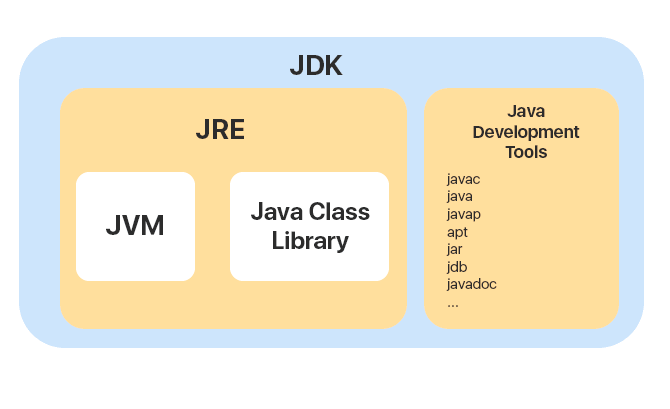
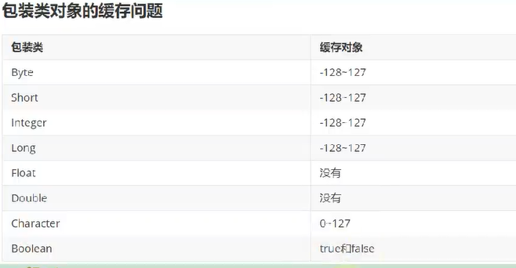

## Java整体概念

### java的特点

1. 完全面向对象的语言
2. 丰富的生态
3. JRE允许跨平台

### javaEE和javaSE的区别

javaSE是标准版，本身包含构建java程序最基本的组件：JRE,JVM,JDK

javaEE是企业版，在javaSE的基础上有更多的库，例如servlet

javaME是微型版，主要用于嵌入式，它也有自己特定的jar库

### JDK-JRE-JVM

(注意jdk9之后发生了变化)

* jdk: 整套java开发工具
* jre：Java运行时环境，负责运行字节码的
* jvm：负责解释字节码，根据不同平台有不同实现，它的存在才使得java能够跨平台

### java到机器码流程

JVM内部还是很复杂的，例如有JIT来优化解释过程：

JVM 类加载器首先加载字节码文件，然后通过解释器逐行解释执行，这种方式的执行速度会相对比较慢。而且，有些方法和代码块是经常需要被调用的(也就是所谓的热点代码)，所以后面引进了 JIT（Just in Time Compilation） 编译器，而 JIT 属于运行时编译。当 JIT 编译器完成第一次编译后，其会将字节码对应的机器码保存下来，下次可以直接使用

### java和c++的区别

1. java类型统一，只有引用类型；而c++有类，有指针，有引用
2. java用垃圾回收内存，c++可以手动释放内存
3. java没有指针
4. java对数据类型的封装更好，c++里字符串就是char数组，java里char就是char，string就是string。
5. java对面向对象的概念贯穿地更深，C++还是有很多函数式编程的特征，而且更加面向底层。

## java基本知识
### 注释

注释可以按功能分为两类：

* 文档注释：被javadoc发现并处理为开发文档
* 普通注释：解释代码的功能

注释不是越详细越好，好的代码本身就是注释

### 位操作

-1：对应11111111...1
 
1：对应0000...1

**位移**对于乘除操作更为高效

* `<<`：左移，高位丢失，低位补零
* `>>`：右移，高位补符号位，低位丢失
* `>>>`：无符号右移，高位补零，低位丢失

*注意：如果位移数N超过32，实际位移数为N%32*

（Integer.toBinaryString并不会显示正数前边的0，所以测试>>>时莫要以为是负数）

**位运算：**

* &：按位与，11为1，其余为0
* |：按位或，00为0，其余为1
* ^：按位异或，相同为0，不同为1
* ~：按位非

**包装类的缓存问题**

**java基本类型**

按照类型分：

* 基本数据类型：
  * boolean
  * 整数：int long short char byte
  * 浮点数：float 
* 引用数据类型：class, interface, array

按照类中位置分：

* `局部变量`：在方法被调用时，随着栈帧的创建而得到局部变量表。没有默认赋值阶段，所以使用前必须显式赋值。
* `成员变量`
  * `类变量`（static修饰）：在jvm链接的prepare阶段分配内存并且赋默认零值；在initial阶段赋值。
  * `实例变量`：